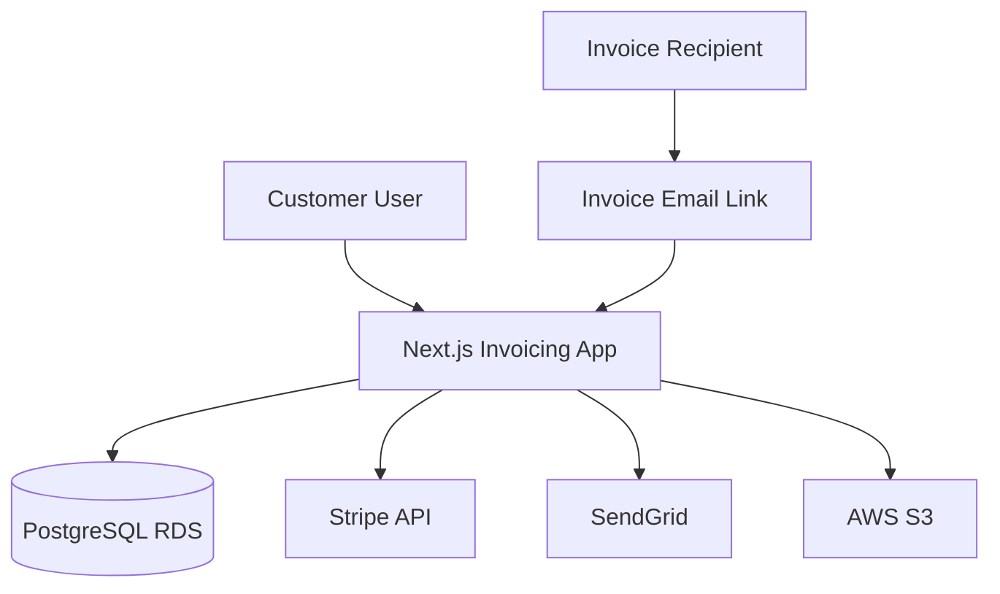
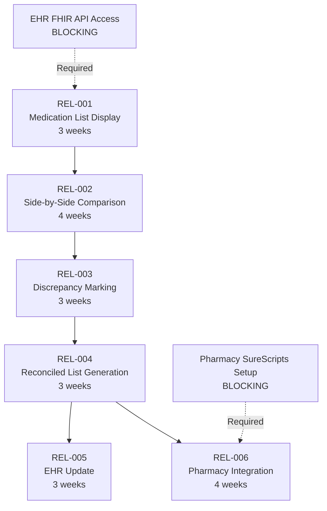

# Example Conversations

This document contains real example conversations showing each Claude Desktop project in action. Use these to understand what to expect and how to interact with each agent.

---

## Table of Contents

1. [Architecture Designer](#architecture-designer)
2. [Product Requirements Validator](#product-requirements-validator)
3. [Product Releases Creator](#product-releases-creator)
4. [Technical Requirements Creator](#technical-requirements-creator)
5. [Technical Solution Estimator](#technical-solution-estimator)
6. [Technical Project Planner](#technical-project-planner)

---

## Architecture Designer

### Example 1: SaaS MVP Architecture

**User Input:**
```
I need to design an architecture for a SaaS invoicing application:

Team:
- 3 developers (2 backend, 1 frontend)
- All know JavaScript/TypeScript
- No DevOps experience

Requirements:
- Launch in 8 weeks
- 500 customers at launch (estimate 50-100 invoices/month each)
- Budget: $200/month initially
- Features: Create invoices, email to customers, track payments, basic reporting

Constraints:
- No time for complex setup
- Must be able to scale to 5K customers within 12 months
- Need to maintain HIPAA compliance (optional invoicing for healthcare providers)
```

**Agent Response (Phase 1: Requirements Analysis):**
```
Thanks for the detailed requirements. Let me clarify a few gaps before we explore architectures:

**Missing Information:**
1. **Payment Processing**: Do you need to accept payments within the app, or just track
   external payments? (Stripe integration vs manual tracking)

2. **Performance Targets**: Any specific requirements for:
   - Invoice generation time?
   - Report generation speed?
   - Concurrent user limit?

3. **Data Residency**: HIPAA compliance requires specific controls. Do you need:
   - Data residency in US?
   - Encrypted storage?
   - Audit logging?

4. **Multi-tenancy**: Will each customer have:
   - Their own isolated data?
   - Ability to white-label?
   - Custom fields per customer?

**Initial Assessment:**
- Realistic scope for 8-week timeline with 3 developers
- Budget is appropriate for initial scale (500 customers)
- HIPAA compliance adds complexity - may need to adjust timeline or scope
- JavaScript/TypeScript across stack will accelerate development

Once you clarify the above, I'll propose 2-3 architectural approaches tailored to
your constraints.
```

**User Follow-up:**
```
1. Stripe integration for payments
2. Invoice generation < 2 seconds, reports < 5 seconds
3. Yes - US data residency, encryption at rest and in transit, audit logs required
4. Yes - isolated data per customer, no white-labeling needed initially
```

**Agent Response (Phase 2: Architecture Exploration):**
```
Perfect. Given your constraints (3 developers, 8 weeks, HIPAA compliance, JavaScript stack),
here are 2 realistic approaches:

═══════════════════════════════════════════════════════════════════════════════
APPROACH A: Next.js Full-Stack Monolith (RECOMMENDED)
═══════════════════════════════════════════════════════════════════════════════

Architecture:
┌─────────────────────────────────────────────────────────────────────────┐
│ Next.js Application (App Router)                                        │
│ ├─ API Routes (Backend)                                                 │
│ ├─ React Components (Frontend)                                          │
│ └─ PDF Generation (node-html-pdf)                                       │
└─────────────────────────────────────────────────────────────────────────┘
         ↓                    ↓                      ↓
   ┌─────────┐         ┌──────────┐          ┌─────────┐
   │PostgreSQL│         │  Stripe  │          │ SendGrid│
   │(RDS)     │         │   API    │          │ (Email) │
   └─────────┘         └──────────┘          └─────────┘

**Technology Stack:**
- Framework: Next.js 14 (App Router)
- Database: PostgreSQL 15 (RDS db.t3.small - ~$35/month)
- Auth: NextAuth.js with AWS Cognito
- Hosting: Vercel Pro ($20/month)
- Storage: AWS S3 for invoice PDFs (~$5/month)
- Email: SendGrid ($15/month for 40K emails)
- Payments: Stripe (2.9% + 30¢ per transaction)
- Monitoring: Vercel Analytics (included)

**Total Monthly Cost:** ~$75 + transaction fees

**Pros:**
Single codebase (faster development)
Team knows JavaScript/TypeScript
Vercel handles deployment, scaling, SSL automatically
Built-in HIPAA compliance options (BAA with Vercel Enterprise when needed)
Can scale to 5K customers on this architecture
Next.js API routes handle backend logic
Fast time to market (6-8 weeks achievable)

**Cons:**
Vercel Enterprise ($500/month) required for HIPAA BAA - exceeds initial budget
All components tightly coupled
Harder to extract services later if needed
Less flexibility than microservices

**HIPAA Consideration:**
For initial launch without HIPAA, this works perfectly. When HIPAA is required:
- Upgrade to Vercel Enterprise (~$500/month)
- Sign BAA with Vercel, AWS RDS, SendGrid
- Enable audit logging (CloudWatch + custom middleware)
- Add encryption at rest (RDS encryption enabled)
- Estimated additional cost: $450/month

═══════════════════════════════════════════════════════════════════════════════
APPROACH B: Express.js Backend + React Frontend (Separate Deployment)
═══════════════════════════════════════════════════════════════════════════════

Architecture:
┌──────────────┐         ┌─────────────────────────────────────┐
│ React SPA    │────────>│ Express.js API                       │
│ (Vercel)     │         │ (AWS Elastic Beanstalk)             │
└──────────────┘         └─────────────────────────────────────┘
                                   ↓           ↓          ↓
                            ┌─────────┐  ┌────────┐  ┌─────────┐
                            │PostgreSQL│  │ Stripe │  │SendGrid │
                            │   RDS    │  │  API   │  │         │
                            └─────────┘  └────────┘  └─────────┘

**Technology Stack:**
- Frontend: React 18 + Vite (Vercel - $20/month)
- Backend: Express.js + TypeScript (Elastic Beanstalk t3.small - $15/month)
- Database: PostgreSQL 15 (RDS db.t3.small - $35/month)
- Auth: AWS Cognito ($0-50/month depending on MAU)
- Storage: S3 for PDFs (~$5/month)
- Email: SendGrid ($15/month)

**Total Monthly Cost:** ~$90-140 + transaction fees

**Pros:**
Frontend and backend can be deployed independently
More control over backend infrastructure
Easier to add background jobs later (SQS + Lambda)
AWS ecosystem better for HIPAA compliance (mature BAAs)
Can scale backend and frontend independently

**Cons:**
Two separate deployments to manage
More complex CI/CD setup
CORS and API configuration overhead
~2 weeks longer development time (10 weeks total)
Requires more DevOps knowledge
Higher monthly costs

═══════════════════════════════════════════════════════════════════════════════
RECOMMENDATION: Approach A (Next.js Monolith)
═══════════════════════════════════════════════════════════════════════════════

**Reasoning:**
1. **Timeline Match**: 8 weeks is aggressive. Single codebase = faster development.
2. **Team Size**: 3 developers benefit from reduced coordination overhead.
3. **JavaScript Expertise**: Team can work across full stack without context switching.
4. **Budget Fit**: $75/month fits $200 budget, leaving room for growth.
5. **HIPAA Path**: Launch without HIPAA first, upgrade to Enterprise when needed.

**HIPAA Strategy:**
- Launch MVP without HIPAA certification (~6-8 weeks)
- Target non-healthcare customers initially
- When ready for healthcare customers (~3-6 months):
  - Upgrade to Vercel Enterprise
  - Sign BAAs with all vendors
  - Implement audit logging
  - Complete risk assessment

**Alternative if HIPAA required immediately:**
- Choose Approach B with AWS infrastructure
- Budget increases to ~$200/month minimum
- Timeline extends to 10-12 weeks
- More DevOps complexity upfront

Would you like me to proceed with detailed design for Approach A, or do you have
questions about these options?
```

**User Decision:**
```
Let's go with Approach A. Can you provide detailed component design?
```

**Agent Response (Phase 3: Detailed Design - Abbreviated):**
```
═══════════════════════════════════════════════════════════════════════════════
DETAILED DESIGN: Next.js Full-Stack Invoicing Application
═══════════════════════════════════════════════════════════════════════════════

## 1. System Context Diagram



## 2. Component Architecture

### Component Breakdown:

**Frontend Components (React):**
1. **Auth Module** (`/app/(auth)/*`)
   - Login/Register pages
   - Password reset flow
   - Session management with NextAuth

2. **Dashboard Module** (`/app/dashboard/*`)
   - Overview with key metrics
   - Recent invoices list
   - Quick actions

3. **Invoice Module** (`/app/invoices/*`)
   - Invoice creation wizard
   - Invoice list with filters
   - Invoice detail view
   - PDF preview

4. **Customer Module** (`/app/customers/*`)
   - Customer CRUD operations
   - Customer detail with invoice history

5. **Reports Module** (`/app/reports/*`)
   - Revenue reports
   - Outstanding invoices
   - Customer payment history

**Backend API Routes (`/app/api/*`):**

1. **Auth Routes** (`/api/auth/*`)
   - Handled by NextAuth.js
   - AWS Cognito integration

2. **Invoice Routes** (`/api/invoices/*`)
   ```
   POST   /api/invoices           - Create invoice
   GET    /api/invoices           - List invoices (paginated)
   GET    /api/invoices/[id]      - Get invoice details
   PUT    /api/invoices/[id]      - Update invoice
   DELETE /api/invoices/[id]      - Delete invoice
   POST   /api/invoices/[id]/send - Send invoice email
   GET    /api/invoices/[id]/pdf  - Generate PDF
   ```

[... continued with full component specs, database schema, deployment architecture,
monitoring strategy, and 3 ADRs ...]

## 8. Implementation Roadmap

**Week 1-2: Foundation**
- Set up Next.js project with TypeScript
- Configure PostgreSQL RDS
- Implement auth with NextAuth + Cognito
- Basic dashboard layout

**Week 3-4: Core Features**
- Invoice CRUD operations
- Customer management
- PDF generation
- Email sending

**Week 5-6: Polish**
- Reports module
- Stripe integration
- Payment tracking
- Error handling

**Week 7-8: Testing & Launch**
- Integration testing
- Performance optimization
- Security audit
- Deployment to Vercel

═══════════════════════════════════════════════════════════════════════════════

Would you like me to:
1. Generate Architecture Decision Records for major decisions?
2. Expand any specific component?
3. Add security implementation details?
4. Provide database migration strategy?
```

---

## Product Requirements Validator

### Example 2: Validating Healthcare Feature Requirements

**User Input:**
```
Analyze this BRD:

Project: Prior Authorization Status Tracking

Problem: Providers need real-time visibility into PA status without calling payers.

Solution: Build portal where providers can check PA status for submitted requests.

Users:
- Physicians
- Medical assistants
- Front desk staff

Features:
- Search by patient name, PA number, or date range
- View current status (Pending, Approved, Denied)
- See denial reasons
- Download approval letters
- Get alerts when status changes

Technical Notes:
- Must integrate with Epic EHR
- HIPAA compliant
- Mobile responsive
```

**Agent Response (Stage 1 of 10: Document Intake):**
```
━━━━━━━━━━━━━━━━━━━━━━━━━━━━━━━━━━━━━━
📍 WORKFLOW STATUS
━━━━━━━━━━━━━━━━━━━━━━━━━━━━━━━━━━━━━━
Initiative: Prior Authorization Status Tracking
Current Stage: 1 of 10 - Problem & Solution
Progress: ▓░░░░░░░░░ 10%
━━━━━━━━━━━━━━━━━━━━━━━━━━━━━━━━━━━━━━━

## Stage 1: Problem & Solution Summary

**Problem Statement:**
Providers lack real-time visibility into prior authorization (PA) status, requiring
phone calls to payers for status updates. This creates administrative burden and delays
patient care.

**Solution Overview:**
Build a web portal enabling providers to check PA status electronically for submitted
requests, eliminating phone calls and providing real-time status visibility.

**User Value:**
- Reduced administrative time (no phone calls)
- Faster patient care decisions (real-time status)
- Improved workflow efficiency
- Better patient experience (faster approvals)

**Critical Gaps Identified:**
**Missing Information:**
1. What is expected PA volume? (requests per day/month)
2. How many provider organizations will use this?
3. What is response time requirement? (real-time vs near-real-time?)
4. How do providers authenticate? (existing SSO? New accounts?)
5. What payers are in scope? (all payers? specific networks?)

Is this accurate? Any changes needed before proceeding to Stage 2 (User Roles)?
```

**User Follow-up:**
```
Good catches:
1. 10K PA requests per month across all providers
2. 200 provider organizations initially
3. Status updates within 5 minutes of payer update
4. Will use existing SSO (Azure AD)
5. In scope: Top 5 payers (UnitedHealth, Anthem, Aetna, Cigna, Humana)
```

**Agent Response (Stage 2 of 10: User Roles):**
```
━━━━━━━━━━━━━━━━━━━━━━━━━━━━━━━━━━━━━━
📍 WORKFLOW STATUS
━━━━━━━━━━━━━━━━━━━━━━━━━━━━━━━━━━━━━━
Initiative: Prior Authorization Status Tracking
Current Stage: 2 of 10 - User Roles & Access
Progress: ▓▓░░░░░░░░ 20%
━━━━━━━━━━━━━━━━━━━━━━━━━━━━━━━━━━━━━━

## Stage 2: User Roles & Access Mapping

| User Type | Network Category | What They Need To Do | Anticipated Volume | Usage Frequency |
|-----------|------------------|---------------------|-------------------|----------------|
| Physician | Provider | View PA status for their patients; Download approval letters; Check denial reasons | 1,000 active users | Daily (2-5 times per day) |
| Medical Assistant | Provider | Search PA requests by multiple criteria; View status for all patients in practice; Set up status alerts; Download documentation | 3,000 active users | Throughout day (10-20 checks) |
| Front Desk Staff | Provider | Basic status lookup by patient name; Verify approval before scheduling; Print approval letters | 2,000 active users | As needed (5-10 times per day) |

### User Access Matrix

| User Type | Can Do | Cannot Do |
|-----------|--------|-----------|
| Physician | View PA status for patients in their panel; Download approval letters; View denial reasons and clinical documentation; Receive alerts for status changes | Not specified: Can they view other physicians' PAs? Can they delegate access? |
| Medical Assistant | Search all PA requests for their practice; View detailed status and history; Configure alerts for practice; Download and print documentation | Not specified: Practice-wide or physician-specific access? Can they submit new PAs? |
| Front Desk Staff | Basic PA status lookup; Print approval letters; View approval/denial status | Not specified: Can they see clinical details? Can they see denial reasons? |

**Questions for Clarification:**
1. **Access Scope**: Can users see PAs across entire organization or only their assigned patients/physicians?
2. **Delegation**: Can physicians delegate PA management to specific staff?
3. **Clinical Details**: Can front desk staff see clinical denial reasons (may contain PHI)?

Is this user role breakdown accurate? Any changes before Stage 3 (UI Screens)?
```

[... conversation continues through all 10 stages ...]

---

## Product Releases Creator

### Example 3: Breaking Down a New Feature

**User Input:**
```
Please decompose these requirements:

Feature: Medication Reconciliation Workflow

Users need to reconcile medications when patients transfer between care settings
(hospital to home, hospital to SNF, etc.). Currently manual and error-prone.

Requirements:
- Pull medications from multiple sources (EHR, pharmacy, patient-reported)
- Display side-by-side for comparison
- Allow clinician to mark discrepancies
- Generate reconciled medication list
- Send to pharmacy and update EHR
- Track reconciliation completion rates

Compliance: HIPAA, meaningful use requirements
Timeline: 4 months to launch
Team: 6 developers (4 backend, 2 frontend)
```

**Agent Response (Stage 1: Requirements Analysis):**
```
Let me analyze these requirements for decomposition into smallest testable releases.

**Initiative Scope:**
Medication reconciliation workflow spanning multiple care settings with EHR/pharmacy
integration.

**Key Architectural Decisions Needed:**
1. **Data Integration**: Pull from EHR (FHIR?), pharmacy (SureScripts?), patient-reported
2. **Reconciliation UI**: Side-by-side comparison, discrepancy marking
3. **Output Distribution**: Send to pharmacy, update EHR
4. **Analytics**: Track completion rates

**Initial Release Breakdown (4-6 releases estimated):**

**REL-001: Simple Medication List Display (MVP)**
User Capability: Clinicians can view current EHR medications in structured format

**REL-002: Side-by-Side Comparison View**
User Capability: Clinicians can view medications from 2 sources side-by-side

**REL-003: Manual Discrepancy Marking**
User Capability: Clinicians can mark and document medication discrepancies

**REL-004: Reconciled List Generation**
User Capability: Clinicians can generate final reconciled medication list

**REL-005: EHR Update Integration**
User Capability: Reconciled list automatically updates patient's EHR medications

**REL-006: Pharmacy Integration**
User Capability: Reconciled list sent to patient's pharmacy electronically

**Critical Dependencies:**
- EHR FHIR API access (blocking REL-001)
- Pharmacy integration testing (blocking REL-006)
- Meaningful use criteria mapping (impacts REL-004, REL-005)

**Risk Flags:**
4-month timeline for 6 releases is aggressive (typical 3-4 weeks per release)
Multiple external integrations (EHR, pharmacy) - higher complexity
Meaningful use compliance may require specific workflow steps

Would you like me to generate the detailed release breakdown with dependencies, or would
you prefer to see alternative decomposition options first?
```

**User Response:**
```
Generate detailed breakdown
```

**Agent Response (Full Release Document - Abbreviated):**
```
═══════════════════════════════════════════════════════════════════════════════
INITIATIVE RELEASES: Medication Reconciliation Workflow
═══════════════════════════════════════════════════════════════════════════════

**Summary:**
- Total Releases: 6 (MVP + 5 iterations)
- Timeline: 18-24 weeks (4.5-6 months) - EXCEEDS 4-month target
- User Types: 1 (Clinician)
- Key Workflows: 3 (View, Compare, Reconcile)
- External Integrations: 2 (EHR FHIR API, Pharmacy SureScripts)

═══════════════════════════════════════════════════════════════════════════════
RELEASE DEPENDENCY DIAGRAM
═══════════════════════════════════════════════════════════════════════════════



[... continues with detailed release specifications, success criteria, and risk analysis ...]

═══════════════════════════════════════════════════════════════════════════════
TIMELINE CONCERN: 4-Month Target vs 20-Week Reality
═══════════════════════════════════════════════════════════════════════════════

**Issue:** Requirements suggest 4-month (16 week) timeline, but 6 releases with external
integrations realistically require 20-24 weeks.

**Options:**
1. **Reduce Scope**: Cut REL-006 (pharmacy integration) for later release - achieves
   16-week timeline
2. **Increase Team**: Add 2 integration specialists to parallelize EHR and pharmacy work
3. **Accept Delay**: Launch in 5-6 months with full feature set

Which option would you prefer to explore?
```

---

## Technical Requirements Creator

### Example 4: Converting PRD to Technical Specs

**User Input:**
```
Create technical requirements from this PRD:

Feature: Real-time Lab Result Notifications

Users: Physicians, Patients
Scope: When lab results are finalized, automatically notify physician and patient
Volume: 50K lab results per day
Performance: Notifications within 5 minutes of result finalization
Compliance: HIPAA, patient consent required for notifications
```

**Agent Response (Phase 1: Document Review):**
```
Analyzing requirements for technical specification...

**Extracted Entities:**
- Lab Result (FHIR: DiagnosticReport + Observation)
- Physician (FHIR: Practitioner)
- Patient (FHIR: Patient)
- Notification (custom)
- Consent (FHIR: Consent)

**Extracted Workflows:**
1. Lab result finalization triggers notification workflow
2. Consent verification before patient notification
3. Physician notification (always)
4. Patient notification (if consented)

**FHIR Resource Mappings:**
- Lab Result → DiagnosticReport (status: final)
- Lab Values → Observation (linked to DiagnosticReport)
- Physician → Practitioner
- Patient → Patient
- Consent → Consent (category: patient-notification)

**Integration Points:**
- LIS (Lab Information System) → Publishes result finalization events
- EHR → Receives notifications, updates result status
- Notification Service → Sends emails, SMS, push notifications

**Scale Considerations:**
- 50K results/day = ~35 results/minute = ~0.6 results/second
- Straightforward scale for event-driven architecture
- 5-minute SLA allows for message queue buffering

Proceeding to technical specification generation...
```

**Agent Response (Technical Specification - Abbreviated):**
```
═══════════════════════════════════════════════════════════════════════════════
TECHNICAL REQUIREMENTS SPECIFICATION
Feature: Real-time Lab Result Notifications
═══════════════════════════════════════════════════════════════════════════════

## 1. Workflow Specifications

### Workflow 1: Lab Result Finalization Notification

**Trigger:** Lab result status changes to "final" in LIS

**BPM Orchestration:**
```
START
  ↓
[Receive Lab Result Finalized Event]
  ↓
[Retrieve DiagnosticReport FHIR Resource]
  ↓
[Identify Ordering Physician]
  ↓
[Retrieve Patient Consent Status]
  ↓
<Has Patient Consent for Notifications?>
  ├─ YES → [Queue Physician AND Patient Notifications]
  └─ NO  → [Queue Physician Notification Only]
  ↓
[Publish Notifications to Message Queue]
  ↓
[Track Notification Delivery Status]
  ↓
END
```

**Acceptance Criteria:**
```gherkin
Given a lab result is finalized in the LIS
When the result status changes to "final"
Then a notification event is published within 30 seconds

Given a patient has consented to lab notifications
When their lab result is finalized
Then both physician AND patient receive notifications

Given a patient has NOT consented
When their lab result is finalized
Then ONLY the physician receives notification

Given a notification is sent
When delivery fails
Then retry 3 times with exponential backoff
And log failure for manual review
```

## 2. FHIR Resource Mappings

### DiagnosticReport (Lab Result)
```json
{
  "resourceType": "DiagnosticReport",
  "id": "[system-generated]",
  "status": "final",
  "category": [{
    "coding": [{
      "system": "http://terminology.hl7.org/CodeSystem/v2-0074",
      "code": "LAB",
      "display": "Laboratory"
    }]
  }],
  "code": {
    "coding": [{
      "system": "http://loinc.org",
      "code": "[LOINC-code]",
      "display": "[test-name]"
    }]
  },
  "subject": {
    "reference": "Patient/[patient-id]"
  },
  "performer": [{
    "reference": "Practitioner/[ordering-physician-id]"
  }],
  "result": [{
    "reference": "Observation/[observation-id]"
  }]
}
```

[... continues with detailed API specifications, event schemas, database models,
security requirements, and test scenarios ...]

## 7. Technical Decisions

[Recommended] **Event-Driven Architecture**
- Use Azure Service Bus for event pub/sub
- Decouple LIS integration from notification delivery
- Enables retry logic and dead-letter queues

[Recommended] **FHIR R4 for Lab Results**
- DiagnosticReport + Observation resources
- Industry standard for lab data exchange
- Compatible with existing EHR integrations

[Inferred] **Consent Verification Required**
- Check Consent resource before patient notification
- Consent category: "notification" + "lab-results"
- Default to NO consent if not explicitly documented

[Derived] **Notification Retry Strategy**
- 3 retries with exponential backoff (1min, 5min, 15min)
- Dead-letter queue for manual review after failures
- Alerts after 10 consecutive failures

═══════════════════════════════════════════════════════════════════════════════
```

---

## Technical Solution Estimator

### Example 5: Estimating Development Effort

**User Input:**
```
Estimate effort for the Lab Result Notifications feature:

Components:
- Event listener for LIS result finalization
- FHIR resource retrieval (DiagnosticReport, Patient, Practitioner, Consent)
- Notification orchestration service
- Email/SMS/push notification delivery
- Retry logic and dead-letter queue
- Audit logging for all notifications
- Admin UI for monitoring notification status

Team: 4 backend developers (TypeScript/Node.js experience), 1 QA
Platform: Azure (Service Bus, Functions, PostgreSQL, SendGrid)
```

**Agent Response:**
```
═══════════════════════════════════════════════════════════════════════════════
TECHNICAL SOLUTION ESTIMATE
Feature: Lab Result Notifications
═══════════════════════════════════════════════════════════════════════════════

## Component-Level Effort Breakdown

### 1. Event Integration (LIS Result Finalization)
**Description:** Azure Service Bus listener for lab result finalized events

**Tasks:**
- Service Bus topic/subscription setup
- Event schema validation
- Event handler implementation
- Error handling and logging
- Integration testing with LIS team

**Effort:** 24-32 hours
**Confidence:** HIGH (standard Service Bus pattern)
**Risk Factors:**
- Dependency on LIS team for test events (medium risk)
- Event schema may change during integration (low risk)

**Platform Leverage:**
Uses existing Azure Service Bus infrastructure
Standard event handler pattern from platform

---

### 2. FHIR Resource Retrieval Service
**Description:** Query EHR FHIR API for DiagnosticReport, Patient, Practitioner, Consent

**Tasks:**
- FHIR client configuration
- Resource query implementation (4 resource types)
- Caching strategy for Practitioner/Patient lookups
- Handle missing resources gracefully
- Unit and integration tests

**Effort:** 32-40 hours
**Confidence:** HIGH (existing FHIR client library)
**Risk Factors:**
- Consent resource may not exist in all EHRs (medium risk - requires fallback)
- FHIR API performance under load (low risk - caching mitigates)

**Platform Leverage:**
Uses existing FHIR client library
Practitioner/Patient caching already implemented

---

### 3. Consent Verification Service
**Description:** Check patient consent status before notification

**Tasks:**
- Query Consent FHIR resources
- Consent decision logic (default deny if not found)
- Consent caching (5-minute TTL)
- Audit logging for consent checks
- Unit tests for all consent scenarios

**Effort:** 16-24 hours
**Confidence:** MEDIUM (consent logic can be complex)
**Risk Factors:**
- Consent resource format varies by EHR (high risk - may need EHR-specific adapters)
- Legal requirements may change consent rules (medium risk)

**Platform Leverage:**
No existing consent service - building from scratch

---

### 4. Notification Orchestration Service
**Description:** Core business logic for routing notifications

**Tasks:**
- Orchestration workflow implementation
- Physician notification (always)
- Patient notification (conditional on consent)
- Notification content templates
- Event publishing to notification queue
- Comprehensive unit tests

**Effort:** 24-32 hours
**Confidence:** HIGH (straightforward business logic)
**Risk Factors:**
- Requirements may change for notification content (low risk)

---

### 5. Notification Delivery Service
**Description:** Send notifications via email, SMS, push

**Tasks:**
- SendGrid email integration
- Twilio SMS integration
- Push notification integration (Firebase/APNS)
- Template rendering
- Delivery status tracking
- Integration tests

**Effort:** 40-48 hours
**Confidence:** MEDIUM (3 delivery channels)
**Risk Factors:**
- Push notification certificates (medium risk - coordination with mobile team)
- SMS costs may exceed budget (low risk - can monitor)

**Platform Leverage:**
Uses existing SendGrid integration
SMS and push are new integrations

---

### 6. Retry Logic & Dead-Letter Queue
**Description:** Handle delivery failures gracefully

**Tasks:**
- Exponential backoff retry logic (1min, 5min, 15min)
- Dead-letter queue setup
- Alerting for repeated failures
- Admin tools to replay dead-lettered messages
- End-to-end failure testing

**Effort:** 24-32 hours
**Confidence:** HIGH (standard Azure Service Bus pattern)
**Risk Factors:**
- Determining when to stop retrying (low risk)

**Platform Leverage:**
Azure Service Bus dead-letter queues built-in

---

### 7. Audit Logging
**Description:** Log all notification attempts and outcomes

**Tasks:**
- Structured logging implementation
- Log aggregation setup (Azure Application Insights)
- Queryable audit trail
- Retention policy configuration
- HIPAA-compliant log redaction

**Effort:** 16-24 hours
**Confidence:** HIGH (existing logging infrastructure)

**Platform Leverage:**
Uses existing Application Insights setup
Log redaction patterns already defined

---

### 8. Admin Monitoring UI
**Description:** Dashboard for monitoring notification delivery

**Tasks:**
- React dashboard scaffolding
- Notification status visualization
- Failure investigation tools
- Retry/replay controls
- Authentication/authorization

**Effort:** 40-56 hours
**Confidence:** MEDIUM (UI complexity depends on requirements)
**Risk Factors:**
- Real-time updates may require WebSocket implementation (medium risk)

---

## Summary

| Component | Min Hours | Max Hours | Confidence | Risk |
|-----------|-----------|-----------|------------|------|
| Event Integration | 24 | 32 | HIGH | LOW |
| FHIR Retrieval | 32 | 40 | HIGH | LOW |
| Consent Verification | 16 | 24 | MEDIUM | MEDIUM |
| Orchestration | 24 | 32 | HIGH | LOW |
| Delivery Service | 40 | 48 | MEDIUM | MEDIUM |
| Retry & DLQ | 24 | 32 | HIGH | LOW |
| Audit Logging | 16 | 24 | HIGH | LOW |
| Admin UI | 40 | 56 | MEDIUM | MEDIUM |
| **Total Development** | **216** | **288** | | |

**Additional Effort:**
- Integration Testing: 32-40 hours
- QA Testing: 40-56 hours
- Documentation: 16-24 hours
- DevOps/Deployment: 16-24 hours

**Grand Total: 320-432 hours (8-11 weeks for team of 4)**

## Risk Analysis

**HIGH RISK:**
- Consent resource format varies by EHR - may need significant customization

**MEDIUM RISK:**
- LIS team dependency for test events
- Push notification mobile team coordination
- Admin UI real-time requirements

**LOW RISK:**
- All other components leverage existing platform patterns

**Mitigation Strategies:**
- Start with consent integration early (highest risk)
- Schedule LIS integration sessions in advance
- Define admin UI requirements precisely before starting

═══════════════════════════════════════════════════════════════════════════════
```

---

## Technical Project Planner

### Example 6: Breaking Down an Epic

**User Input:**
```
Plan epic delivery for Lab Result Notifications:

Total Effort: 320-432 hours
Team: 4 backend developers, 1 QA
Timeline: 8 weeks
Platform: Azure
```

**Agent Response:**
```
═══════════════════════════════════════════════════════════════════════════════
EPIC DELIVERY PLAN
Epic: Lab Result Notifications
═══════════════════════════════════════════════════════════════════════════════

## Sprint Breakdown (2-week sprints × 4)

### Sprint 1: Foundation & High-Risk Items (Weeks 1-2)
**Goal:** De-risk consent integration, establish event processing foundation

**Developer 1: Event Integration & Orchestration**
- Task 1.1: Set up Azure Service Bus topic/subscription (4h)
- Task 1.2: Implement event listener for LIS finalization (8h)
- Task 1.3: Event schema validation (4h)
- Task 1.4: Core orchestration workflow (12h)
- Task 1.5: Unit tests (8h)
**Total: 36 hours**

**Developer 2: FHIR Integration**
- Task 1.6: FHIR client configuration (4h)
- Task 1.7: DiagnosticReport retrieval (6h)
- Task 1.8: Patient retrieval with caching (6h)
- Task 1.9: Practitioner retrieval with caching (6h)
- Task 1.10: Integration tests (10h)
**Total: 32 hours**

**Developer 3: Consent Service (HIGH RISK)**
- Task 1.11: Research Consent FHIR format across EHRs (8h)
- Task 1.12: Consent retrieval implementation (8h)
- Task 1.13: Consent decision logic (6h)
- Task 1.14: Fallback for missing consent (4h)
- Task 1.15: Consent caching (4h)
- Task 1.16: Unit tests (8h)
**Total: 38 hours**

**Developer 4: Notification Delivery Foundation**
- Task 1.17: SendGrid email integration (8h)
- Task 1.18: Email template design (6h)
- Task 1.19: Twilio SMS integration (10h)
- Task 1.20: SMS template design (4h)
- Task 1.21: Delivery status tracking (8h)
**Total: 36 hours**

**QA: Test Planning**
- Task 1.22: Test plan creation (8h)
- Task 1.23: Test data setup (6h)
- Task 1.24: Integration test scenarios (6h)
**Total: 20 hours**

**Sprint 1 Capacity: 162 hours (32.5h per developer × 4 + 20h QA)**

---

### Sprint 2: Core Delivery & Retry Logic (Weeks 3-4)
**Goal:** Complete notification delivery, implement retry logic

[... continues with Sprint 2, 3, 4 breakdown ...]

---

## Dependencies & Risks

**External Dependencies:**
- LIS team test environment access (Sprint 1, Week 1) - CRITICAL PATH
- Mobile team push notification certificates (Sprint 2, Week 3)
- EHR FHIR API performance testing (Sprint 3, Week 5)

**Technical Risks:**
- Consent format inconsistency across EHRs (mitigated in Sprint 1)
- Service Bus throughput at 50K messages/day (performance test Sprint 3)
- SMS costs exceeding budget (monitoring in Sprint 2)

**Mitigation Plan:**
- Schedule LIS integration kick-off meeting before Sprint 1 starts
- Begin mobile team coordination in Sprint 1 for Sprint 2 readiness
- Add buffer week if consent integration exceeds estimate

═══════════════════════════════════════════════════════════════════════════════
```

---

## Key Takeaways

### What These Examples Demonstrate

1. **Architecture Designer** - Provides 2-3 distinct approaches with honest tradeoffs, not just "best" solution
2. **Requirements Validator** - Catches gaps early, validates incrementally with approval gates
3. **Releases Creator** - Breaks large initiatives into testable releases, identifies timeline risks
4. **Technical Requirements** - Maps to FHIR resources, generates BPM workflows, tags all recommendations
5. **Solution Estimator** - Provides component-level estimates with confidence and risk analysis
6. **Project Planner** - Creates sprint-ready tasks with dependencies and acceptance criteria

### Common Patterns

- **Progressive Disclosure**: Start high-level, drill down on request
- **Gap Identification**: Proactively identify missing information
- **Honest Tradeoffs**: No silver bullets, clear pros/cons
- **Context-Driven**: Recommendations based on YOUR constraints
- **Iterative Refinement**: Build on previous outputs
- **Validation Gates**: Confirm before proceeding

---

*For more examples, test the projects yourself with your own requirements!*
