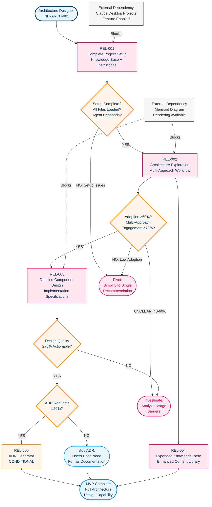

|                     |        |
|---------------------|--------|
| **Initiative Name** | Architecture Designer Claude Desktop Project |
| **Initiative ID** | INIT-ARCH-001 |
| **Total Releases** | 4 MVP + 1 Conditional |
| **Target Release** | MVP Phase 1 |
| **Created** | 2025-10-27 |
| **Last Updated** | 2025-10-27 |

---

## Release Overview

### Summary Table

| ID | Name | Sequence | Priority | User Capability | Category | Dependencies |
|---|---|---|---|---|---|---|
| REL-001 | Complete Project Setup | 1 | 10.0 | Software Architects and Senior Engineers can access fully configured Claude Desktop project with 230K token knowledge base and senior principal architect persona | MVP | None - Foundation |
| REL-002 | Architecture Exploration Workflow | 2 | 9.5 | Users can submit requirements and receive 2-3 distinct architectural approaches with Mermaid diagrams, tradeoff analysis, and contextual recommendations | MVP | REL-001 |
| REL-003 | Detailed Component Design Generation | 3 | 8.5 | Users can request detailed specifications for selected architecture including component responsibilities, interfaces, data architecture, deployment design, and monitoring strategy | MVP | REL-002 |
| REL-004 | Expanded Knowledge Base Content | 4 | 7.0 | Users can access enhanced architectural guidance with additional real-world case studies, scaling strategies, and technology selection frameworks beyond initial minimal set | MVP | REL-002 |
| REL-005 | ADR Documentation Generator | 5 | 6.5 | Users can generate Architecture Decision Records documenting 3-5 major decisions with context, rationale, consequences, alternatives, and implementation notes | CONDITIONAL | REL-003 |

### Delivery Timeline

```mermaid
gantt
    title Architecture Designer Release Delivery Sequence
    dateFormat X
    axisFormat %s

    section Foundation
    REL-001 Complete Project Setup    :done, rel1, 0, 1.5w

    section Core Value
    REL-002 Architecture Exploration Workflow    :active, rel2, after rel1, 2w

    section Detailed Design
    REL-003 Component Design Generation    :rel3, after rel2, 2w

    section Knowledge Enhancement
    REL-004 Expanded Knowledge Base    :rel4, after rel2, 1w

    section Conditional Documentation
    REL-005 ADR Generator (CONDITIONAL)    :crit, rel5, after rel3, 1w

    section Decision Gates
    Gate 1 Project Setup Validation    :milestone, gate1, after rel1, 0d
    Gate 2 Exploration Adoption Check    :milestone, gate2, after rel2, 0d
    Gate 3 Design Quality Validation    :milestone, gate3, after rel3, 0d
    Gate 4 ADR Usage Decision    :milestone, gate4, after rel3, 0d
```

### Release Dependencies

### Key Insights

**Fastest Path to Value**:
REL-001 (1.5 weeks) → REL-002 (2 weeks) → REL-003 (2 weeks) = 5.5 weeks to complete architecture design capability. REL-004 can run parallel to REL-003 for knowledge base expansion.

**Optional Enhancements**:
- **REL-005 (ADR Generator)**: Adds formal decision documentation capability if ≥50% of users who complete detailed design request Architecture Decision Records for their projects

**Critical Blockers**:
- **Claude Desktop Projects Feature** - Blocks REL-001 - Owner: Anthropic Platform Team - Impact: Cannot upload knowledge base files or configure custom instructions without Projects feature enabled
- **Mermaid Diagram Rendering** - Blocks REL-002, REL-003 - Owner: Claude Desktop Interface Team - Impact: Visual architecture diagrams are core to multi-approach comparison; text-only descriptions reduce comprehension and user engagement

**Decision Gates**:
- **After REL-001**: Verify all knowledge base files load correctly and agent responds with senior principal architect persona
- **After REL-002**: Measure adoption (≥60% session completion) and multi-approach engagement (≥70% users view 2+ approaches). If <40% adoption OR ≥60% request single recommendation, pivot to simplified single-approach workflow
- **After REL-003**: Measure design quality (≥70% report designs are actionable). If <50%, investigate root causes (unclear requirements, wrong detail level, missing context)
- **After REL-003**: Decide on REL-005 ADR generation based on user requests (≥50% request ADRs = proceed, <30% = skip)

---

## Detailed Releases

---

### REL-001: Complete Project Setup

**Category**: MVP
**Priority**: 10.0 / 10.0

#### Value Summary
Software Architects and Senior Engineers can access fully configured Claude Desktop project with comprehensive architectural knowledge and senior principal architect agent persona ready for interactive design sessions.

#### User Capabilities
**What users can now do**:
1. Access 230K tokens of architectural guidance including 12+ patterns (Monolithic, Microservices, Event-Driven, Serverless, etc.) with real-world examples
2. Reference technology selection frameworks weighted by team expertise, timeline, and constraints across backend languages, databases, message queues, frontend frameworks, and cloud providers
3. Learn from 15+ anti-pattern case studies covering common architecture mistakes with financial impact and key lessons
4. Interact with agent configured as senior principal architect with 25+ years experience providing honest tradeoffs and pragmatic recommendations
5. Follow structured design workflow (requirements intake → architecture exploration → detailed design) guided by 2,800-word custom instructions

#### Key Exclusions
- **Company-specific knowledge base files** → Deferred to Future (explicit requirement: "Future Capabilities" section) - organization-specific standards, internal patterns, compliance requirements added after validating core agent adoption
- **Quarterly knowledge base updates** → Deferred to Future (explicit requirement: "Future Capabilities") - regular updates to framework versions and cost estimates come after initial content proves valuable
- **Iterative content expansion based on user requests** → Deferred to REL-004 - full 230K token library deployed in REL-001 via Claude Code (low effort), additional content added in REL-004 based on validated needs

#### Hypothesis & Validation

**Hypothesis**: Comprehensive 230K token knowledge base combined with structured custom instructions will enable agent to provide architecture recommendations that users find more relevant and actionable than generic LLM responses without specialized context.

**Success Criteria**: Users successfully complete project setup and agent responds with senior principal architect persona when prompted with architecture questions.

**Key Metrics**:
- **Project Configuration Success**: 100% of knowledge base files load without errors (measured at deployment)
- **Agent Persona Validation**: Agent responds with architect persona in ≥95% of test interactions (measured end of release via 20 test prompts)
- **Knowledge Base Accessibility**: Users can reference all 5 knowledge base files through agent responses (measured via spot-check queries about patterns, anti-patterns, technology selection)

#### Technical Overview

**Platform**: Claude Desktop application with Projects feature

**Knowledge Base Files**:
1. architecture-patterns-library.md (~50K tokens)
2. technology-selection-guide.md (~50K tokens)
3. adr-library.md (~40K tokens)
4. anti-patterns-case-studies.md (~30K tokens)
5. scaling-strategies.md (~30K tokens)

**Custom Instructions**: 2,800-word configuration defining agent persona, workflow, communication guidelines, and quality standards

**Biggest Risk**: Claude Desktop Projects feature limitations on file size or token limits could prevent uploading full 230K token knowledge base → Mitigation: Test with smaller file first, split into multiple files if needed, verify token limits with Anthropic documentation

#### Scoring Breakdown
- **User Value**: 10/10 - Foundational enabler for all subsequent capabilities
- **Dependency Minimal**: 10/10 - No prerequisites, only external platform dependency
- **Technical Risk Reduction**: 10/10 - Validates platform capabilities and content loading
- **Learning Potential**: 10/10 - Tests whether knowledge base + custom instructions model works

#### Dependencies

**Prerequisite Releases**: None - Foundation

**Blocking Items**:
- **Claude Desktop Projects Feature** - Impact: Cannot upload knowledge base files or configure custom instructions without this feature - Owner: Anthropic Platform Team
- **Initial Knowledge Base Content Creation** - Impact: 230K tokens across 5 files must be generated before project launch - Owner: Internal (will use Claude Code to generate)

**Parallel Releases**: None - all subsequent releases depend on this foundation

**Sequencing Rationale**: Foundation release must come first to enable all agent capabilities; combined knowledge base + custom instructions in single release accelerates timeline by 1 week versus splitting configuration.

#### Deployment

**Approach**: full_release (complete project configuration)

**Rollback Criteria**:
- Knowledge base files fail to load or exceed platform token limits
- Agent does not respond with expected persona in test interactions
- Custom instructions configuration causes unexpected agent behavior

---

### REL-002: Architecture Exploration Workflow

**Category**: MVP
**Priority**: 9.5 / 10.0

#### Value Summary
Users can submit product requirements and receive 2-3 genuinely different architectural approaches with visual Mermaid diagrams, honest tradeoff analysis, and recommendations contextualized to their team constraints.

#### User Capabilities
**What users can now do**:
1. Submit product requirements and receive architecture exploration with requirement gap analysis (missing performance targets, unclear scale expectations, undefined constraints)
2. Compare 2-3 distinct architectural approaches presented with equal visual weight including system context diagrams and component structure diagrams
3. Evaluate honest tradeoffs for each approach with no silver bullets - clear pros/cons based on team size, expertise, timeline, and budget
4. Receive contextual recommendations explaining when simpler approaches are more appropriate than complex patterns
5. Request clarification on architectural approaches or explore additional patterns from knowledge base

#### Key Exclusions
- **Detailed component specifications** → Deferred to REL-003 - exploration provides system-level architecture, detailed design comes after approach selection
- **Architecture Decision Records** → Deferred to REL-005 - formal ADR generation is conditional based on user demand
- **Cost estimation for recommended architectures** → Deferred to Future (explicit requirement: "Future Capabilities") - infrastructure cost estimates enhance decision-making but aren't required for architecture exploration
- **Evolution path planning** → Deferred to Future (explicit requirement: "Future Capabilities") - roadmaps showing architecture evolution from MVP to 1M+ users add value after core design workflow validated

#### Hypothesis & Validation

**Hypothesis**: Software Architects and Senior Engineers will find value in receiving multiple architectural approaches with explicit tradeoffs rather than single recommended approach, and will use this multi-approach exploration to make better-informed architecture decisions aligned with their actual constraints.

**Success Criteria**: ≥60% of users complete full exploration sessions (view ≥2 approaches) AND ≥70% of users select from provided approaches without requesting agent to "just tell me what to build"

**Key Metrics**:
- **Session Completion Rate**: ≥60% of users who start exploration view at least 2 architectural approaches (measured weekly)
- **Multi-Approach Engagement**: ≥70% of users compare approaches before selecting versus immediately asking for single recommendation (measured weekly)
- **Requirements Completeness**: ≥80% of sessions include complete constraint inputs (team size, expertise, timeline, budget) after agent prompts (measured weekly)
- **User Satisfaction**: ≥75% of users report exploration helped them understand architectural tradeoffs better than independent research (measured via post-session survey)

**Failure Action**: If <40% session completion OR ≥60% of users skip multi-approach comparison and request single recommendation, pivot to simplified workflow: agent provides single best-fit architecture with brief mention of alternatives rather than full multi-approach exploration.

#### Technical Overview

**Integrations**: Claude Desktop Application (conversational API), Mermaid Diagram Rendering (visual diagrams)

**Agent Workflow**: Requirements intake → Gap identification → Pattern selection from knowledge base → Multi-approach generation → Tradeoff analysis → Contextual recommendation

**Diagram Types**: System context diagrams (external system interactions), Component diagrams (internal structure), Basic sequence diagrams (critical workflows)

**Biggest Risk**: Users may find 2-3 architectural approaches overwhelming or confusing instead of helpful, preferring direct single recommendation → Mitigation: Present approaches with clear summary table comparing dimensions (complexity, scalability, team size fit, cost), emphasize tradeoffs over features, provide contextual guidance on which approach fits their constraints

#### Scoring Breakdown
- **User Value**: 10/10 - Core value proposition of entire initiative
- **Dependency Minimal**: 9/10 - Only depends on REL-001 platform setup
- **Technical Risk Reduction**: 9/10 - Validates agent's ability to generate quality architecture recommendations
- **Learning Potential**: 10/10 - Tests riskiest assumption: will users adopt multi-approach exploration workflow

#### Dependencies

**Prerequisite Releases**: REL-001

**Blocking Items**:
- **Mermaid Diagram Rendering** - Impact: Visual diagrams are essential for comparing architectural approaches; text-only descriptions significantly reduce comprehension - Owner: Claude Desktop Interface Team
- **Knowledge Base Content Quality** - Impact: Agent recommendations depend on comprehensive patterns, anti-patterns, and case studies from REL-001 - Owner: Internal (mitigated by Claude Code generation)

**Parallel Releases**: REL-004 (expanded knowledge base) can be developed in parallel since REL-002 uses initial 230K token baseline

**Sequencing Rationale**: Tests riskiest assumption (user adoption of multi-approach workflow) immediately after foundation setup to enable fast pivot if exploration format doesn't resonate with users.

#### Deployment

**Approach**: beta_practices (5-10 internal Software Architects and Senior Engineers for initial validation)

**Rollback Criteria**:
- Session completion rate <40% for 2 consecutive weeks
- ≥60% of users request single recommendation instead of exploring multiple approaches
- Agent generates low-quality or repetitive architectural approaches (fails to use knowledge base effectively)

---

### REL-003: Detailed Component Design Generation

**Category**: MVP
**Priority**: 8.5 / 10.0

#### Value Summary
Users can request comprehensive component-level specifications for their selected architecture including responsibilities, interfaces, dependencies, technology choices with rationale, data schemas, deployment architecture, and monitoring strategy.

#### User Capabilities
**What users can now do**:
1. Generate system context diagrams showing all external system interactions and boundaries
2. Receive detailed component architecture specifications including clear responsibilities, exposed interfaces (APIs/events), dependency relationships, and technology choices with rationale
3. View sequence diagrams for critical user workflows showing component interactions and data flows
4. Access data architecture designs with database schemas, access patterns, consistency requirements, and scaling considerations
5. Review deployment architecture including infrastructure recommendations, CI/CD pipeline design, and estimated infrastructure costs
6. Receive monitoring strategy with specific metrics to track, logging requirements, alerting thresholds, and observability approach

#### Key Exclusions
- **Architecture Decision Records** → Deferred to REL-005 - ADR generation is conditional capability based on user demand validation
- **Implementation code generation** → Not in requirements - agent provides specifications and guidance, not actual code implementation
- **Automated architecture review scoring** → Not in requirements - agent provides qualitative review with risks/gaps/recommendations, not quantitative scoring
- **Multi-team architecture coordination** → Not in requirements - designed for single team/project architecture decisions, not enterprise-wide coordination

#### Hypothesis & Validation

**Hypothesis**: Generated component specifications and system diagrams will provide sufficient detail and clarity that Senior Engineers can implement architectures without significant additional research or clarification, reducing time from architecture decision to implementation start.

**Success Criteria**: ≥70% of users report generated designs are actionable for implementation without requiring significant additional architecture research

**Key Metrics**:
- **Design Actionability**: ≥70% of users report designs contain sufficient detail to start implementation (measured via post-session survey)
- **Follow-up Question Rate**: <3 follow-up clarification questions per design session on average (measured weekly)
- **Component Specification Completeness**: ≥90% of generated component specs include all 7 required elements (responsibility, interfaces, dependencies, technology, scaling, error handling, monitoring) - measured via spot-check review
- **Diagram Quality**: ≥80% of generated diagrams render correctly and accurately represent architecture (measured via user feedback)

#### Technical Overview

**Diagram Types**: System context (external interactions), Component architecture (internal structure), Sequence diagrams (workflows), Data flow diagrams (information movement)

**Specification Sections**: Component responsibilities, Interface definitions (REST APIs, GraphQL, gRPC, events), Dependency mapping, Technology selection with version recommendations, Scalability strategy, Error handling approach, Monitoring metrics

**Agent Capabilities**: Extract requirements → Select appropriate detail level → Generate diagrams → Write component specs → Design data architecture → Design deployment → Define monitoring

**Biggest Risk**: Generated designs may be too generic (not specific enough for implementation) or too opinionated (doesn't match team preferences/constraints) → Mitigation: Agent asks for preferred detail level upfront, references user's stated constraints throughout, provides technology alternatives with rationale instead of single choice

#### Scoring Breakdown
- **User Value**: 9/10 - Transforms selected architecture into actionable implementation plan
- **Dependency Minimal**: 8/10 - Depends on REL-002 for architecture selection
- **Technical Risk Reduction**: 8/10 - Validates agent's ability to generate implementation-ready specifications
- **Learning Potential**: 8/10 - Tests whether generated designs meet quality standards for engineering teams

#### Dependencies

**Prerequisite Releases**: REL-002

**Blocking Items**:
- **Mermaid Diagram Rendering** - Impact: Component diagrams, sequence diagrams, and data flow diagrams essential for visualizing detailed design - Owner: Claude Desktop Interface Team
- **Architecture Approach Selection** - Impact: Cannot generate detailed design without user selecting preferred approach from REL-002 exploration - Owner: User decision

**Parallel Releases**: REL-004 (expanded knowledge base)

**Sequencing Rationale**: Follows architecture exploration to provide implementation guidance for selected approach; validates whether agent-generated specifications meet engineering team needs before adding optional ADR documentation.

#### Deployment

**Approach**: gradual_rollout (expand from 5-10 beta users to 20-30 users if design quality metrics met)

**Rollback Criteria**:
- Design actionability rating <50% for 2 consecutive weeks
- Average >5 follow-up clarification questions per session (indicates specs unclear)
- ≥30% of generated diagrams fail to render or contain errors

---

### REL-004: Expanded Knowledge Base Content

**Category**: MVP
**Priority**: 7.0 / 10.0

#### Value Summary
Users can access enhanced architectural guidance with additional real-world case studies, deeper scaling strategies, expanded technology options, and more comprehensive pattern coverage beyond initial 230K token baseline.

#### User Capabilities
**What users can now do**:
1. Reference expanded real-world case studies from companies like Shopify, Netflix, Instagram, Stack Overflow showing scaling decisions and outcomes
2. Access detailed scaling curve guidance for different growth phases (0-1K users, 1K-10K users, 10K-100K users, 100K-1M users) with specific recommendations
3. Evaluate additional technology options and frameworks added based on user requests from REL-002 usage patterns
4. Learn from expanded anti-pattern coverage including newer mistakes (e.g., AI/ML architecture anti-patterns, modern cloud-native pitfalls)
5. Access deeper pattern variations and hybrid approaches combining multiple architectural styles

#### Key Exclusions
- **Company-specific knowledge base customization** → Deferred to Future (explicit requirement: "Future Capabilities") - internal architecture patterns, compliance requirements, approved tech stacks added after validating general knowledge base value
- **Real-time knowledge base updates** → Deferred to Future (explicit requirement: "Future Capabilities - Quarterly updates") - regular content updates based on evolving technology landscape
- **User-contributed case studies** → Not in requirements - knowledge base is curated content, not community-contributed
- **Interactive pattern selection wizard** → Not in requirements - agent provides pattern recommendations conversationally, not through structured wizard interface

#### Hypothesis & Validation

**Hypothesis**: Users who successfully adopt architecture exploration workflow (REL-002) will request deeper guidance in specific areas (scaling strategies, specific technology comparisons, niche patterns), indicating value in expanding knowledge base beyond initial 230K tokens.

**Success Criteria**: ≥50% of users reference expanded knowledge base content in their architecture sessions AND ≥60% report expanded content improved recommendation quality

**Key Metrics**:
- **Expanded Content Usage**: ≥50% of architecture sessions reference content added in REL-004 beyond original 230K tokens (measured weekly)
- **Content Value Rating**: ≥60% of users report expanded knowledge base improved architecture recommendation quality (measured via survey)
- **Specific Topic Requests**: Track top 5 most requested additional topics from REL-002 usage to prioritize REL-004 content expansion (measured weekly)

#### Technical Overview

**Content Additions**:
- Expanded scaling case studies (+20K tokens)
- Additional pattern variations (+15K tokens)
- Modern anti-patterns (+10K tokens)
- Enhanced technology comparisons (+15K tokens)

**Total Knowledge Base**: ~290K tokens (original 230K + 60K expansion)

**Integration**: Update existing knowledge base files in Claude Desktop project

**Biggest Risk**: Content expansion may not align with actual user needs if based on assumptions rather than REL-002 usage data → Mitigation: Analyze REL-002 conversation patterns to identify top requested topics, prioritize content that users explicitly ask about, defer other expansions

#### Scoring Breakdown
- **User Value**: 7/10 - Enhances existing capability rather than enabling new workflow
- **Dependency Minimal**: 7/10 - Depends on REL-002 but can develop in parallel
- **Technical Risk Reduction**: 6/10 - Low technical risk, primarily content creation
- **Learning Potential**: 7/10 - Validates whether deeper content improves recommendation quality

#### Dependencies

**Prerequisite Releases**: REL-002 (for usage pattern analysis)

**Blocking Items**:
- **REL-002 Usage Data** - Impact: Need 2-4 weeks of REL-002 adoption data to identify which content areas users request most frequently - Owner: Product Analytics

**Parallel Releases**: REL-003 (detailed design generation) - content expansion can happen while design capability is being built

**Sequencing Rationale**: Positioned after REL-002 to enable data-driven content prioritization based on actual user requests rather than assumed needs; can develop in parallel with REL-003.

#### Deployment

**Approach**: gradual_rollout (update knowledge base files for beta users, expand to full user base after validation)

**Rollback Criteria**:
- Expanded content usage <30% after 3 weeks (indicates low relevance)
- Users report content expansion adds confusion rather than clarity
- File size expansion causes performance degradation in Claude Desktop

---

### REL-005: ADR Documentation Generator

**Category**: CONDITIONAL
**Priority**: 6.5 / 10.0

#### Value Summary
Users can generate professionally formatted Architecture Decision Records documenting 3-5 major architectural decisions with comprehensive context, rationale, consequences, alternatives considered, and implementation guidance.

#### User Capabilities
**What users can now do**:
1. Request ADR generation for major architectural decisions made during design session (database selection, API design approach, authentication strategy, deployment platform)
2. Receive ADRs with complete context and problem statement sections explaining why decision was needed
3. Access documented decision rationale with supporting evidence from knowledge base (patterns, case studies, technology comparisons)
4. Review consequences section covering both positive outcomes and negative tradeoffs of selected approach
5. Reference alternatives considered with explicit reasons why each was rejected
6. Use implementation notes providing practical guidance for executing the architecture decision

#### Key Exclusions
- **ADR version control integration** → Not in requirements - ADRs are generated as markdown documents, not automatically committed to version control or integrated with architecture review workflow
- **ADR template customization** → Not in requirements - uses standard ADR template from knowledge base, no organization-specific template variations
- **Integration with formal architecture review process** → Deferred to Future (explicit requirement: "Future Capabilities") - connecting to approval workflows and review templates
- **Collaborative ADR editing** → Not in requirements - generated as single-author documents, not collaborative editing with review/approval workflow

#### Hypothesis & Validation

**Hypothesis**: Users who complete detailed architecture design sessions (REL-003) will find value in formal ADR documentation to capture critical architectural context and prevent knowledge loss, requesting ADR generation for ≥50% of major decisions.

**Success Criteria**: ≥50% of users who complete detailed design sessions request ADR generation for their architecture decisions

**Key Metrics**:
- **ADR Request Rate**: ≥50% of REL-003 users request ADR generation for their projects (measured weekly)
- **ADR Completeness**: ≥90% of generated ADRs include all required sections (context, decision, rationale, consequences, alternatives, implementation) - measured via spot-check review
- **ADR Usage**: ≥60% of users report they reference generated ADRs during implementation or architecture reviews (measured via 30-day follow-up survey)

**Failure Action**: If <30% of users request ADR generation after 4 weeks, skip REL-005 and mark ADR capability as future enhancement only if explicitly requested by teams with formal architecture review processes.

#### Technical Overview

**ADR Template Sections**:
1. Context and Problem Statement
2. Decision
3. Rationale with Supporting Evidence
4. Consequences (Positive and Negative)
5. Alternatives Considered
6. Implementation Notes

**Knowledge Base Support**: Uses adr-library.md (40K tokens) with 10-15 real-world ADR examples as reference templates

**Generation Approach**: Agent extracts major decisions from design session, applies ADR template, references knowledge base examples for formatting consistency

**Biggest Risk**: Generated ADRs may be too generic or lack sufficient context to be useful months later when teams revisit decisions → Mitigation: Agent explicitly prompts for decision context during design session, references specific requirements and constraints in ADR rationale, includes concrete alternatives with quantitative comparison

#### Scoring Breakdown
- **User Value**: 7/10 - Valuable for knowledge capture but not required for architecture design completion
- **Dependency Minimal**: 6/10 - Depends on REL-003 design session completion
- **Technical Risk Reduction**: 6/10 - Low technical risk, primarily documentation generation
- **Learning Potential**: 6/10 - Tests whether formal decision documentation adds value versus informal notes

#### Dependencies

**Prerequisite Releases**: REL-003

**Blocking Items**:
- **REL-003 Adoption Validation** - Impact: Need ≥60% users completing detailed design sessions before testing ADR generation demand - Owner: Product team waits for REL-003 metrics
- **ADR Template in Knowledge Base** - Impact: Requires adr-library.md from REL-001 with examples and template structure - Owner: Already included in REL-001

**Parallel Releases**: None - REL-005 is terminal conditional release

**Sequencing Rationale**: Conditional release positioned after detailed design capability (REL-003) to test whether users value formal ADR documentation; proceed/skip decision based on measured user requests for ADRs versus completion without documentation.

#### Deployment

**Approach**: feature_flag (enable ADR generation for users who request it, measure adoption before full rollout)

**Rollback Criteria**:
- ADR request rate <30% after 4 weeks indicates low demand
- Generated ADRs fail to meet completeness standards (missing sections, insufficient context)
- Users report ADRs add overhead without value

---

## Validation Summary

**Maturity Score**: 72/100 - Good

**Key Strengths**:
- Excellent requirements traceability (all releases quote explicit requirements)
- Proper user type identification (Internal - maximum flexibility appropriate)
- Claude Code mitigates knowledge base creation risk significantly
- Clear exclusions documented for future capabilities

**Recommended Updates Applied**:
✅ Combined REL-001 (knowledge base) + REL-002 (custom instructions) into single project setup release
✅ Added specific quantitative metrics with targets and measurement frequency to all releases
✅ Included explicit pivot strategy for multi-approach workflow if adoption is low
✅ Added failure action criteria for conditional REL-005

**Remaining Considerations**:
- Monitor REL-002 adoption closely - multi-approach exploration is core value hypothesis
- Use REL-004 expansion strategically based on actual user requests from REL-002 data
- REL-005 ADR generation is truly conditional - skip if <30% request rate after 4 weeks

**Fastest Path**: REL-001 → REL-002 → REL-003 = 5.5 weeks to complete architecture design capability

**Total Timeline**: 6.5-7.5 weeks for MVP (excludes conditional REL-005 which adds 1 week if validated)
