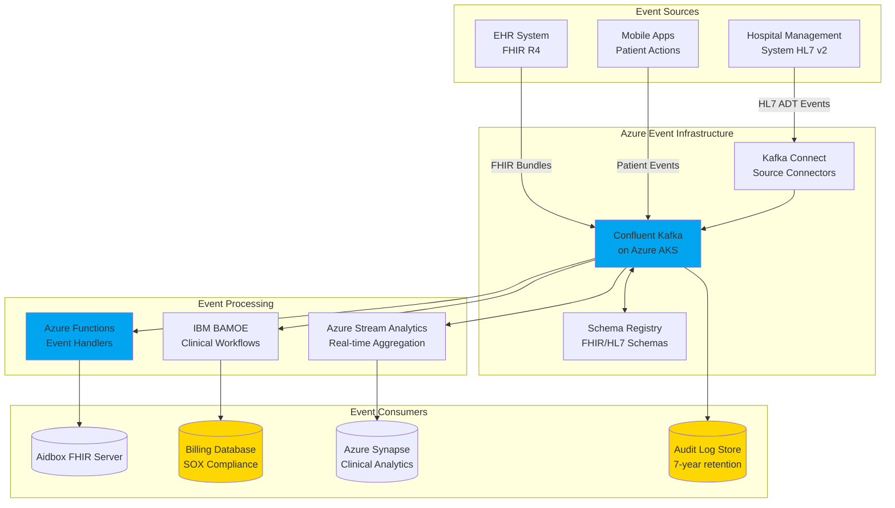
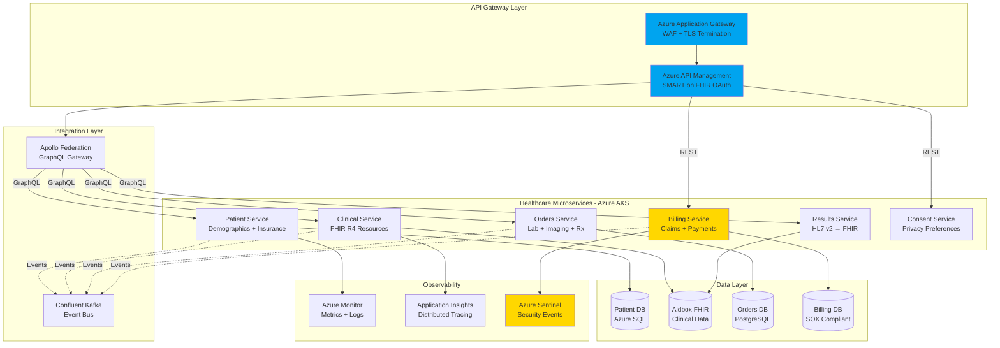
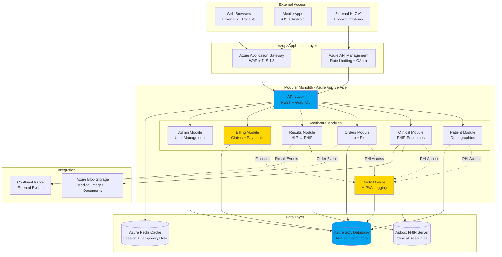
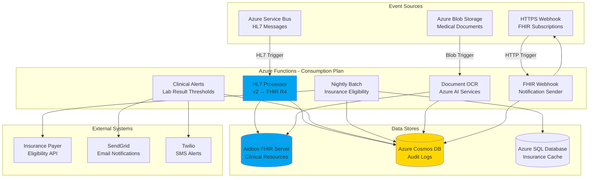
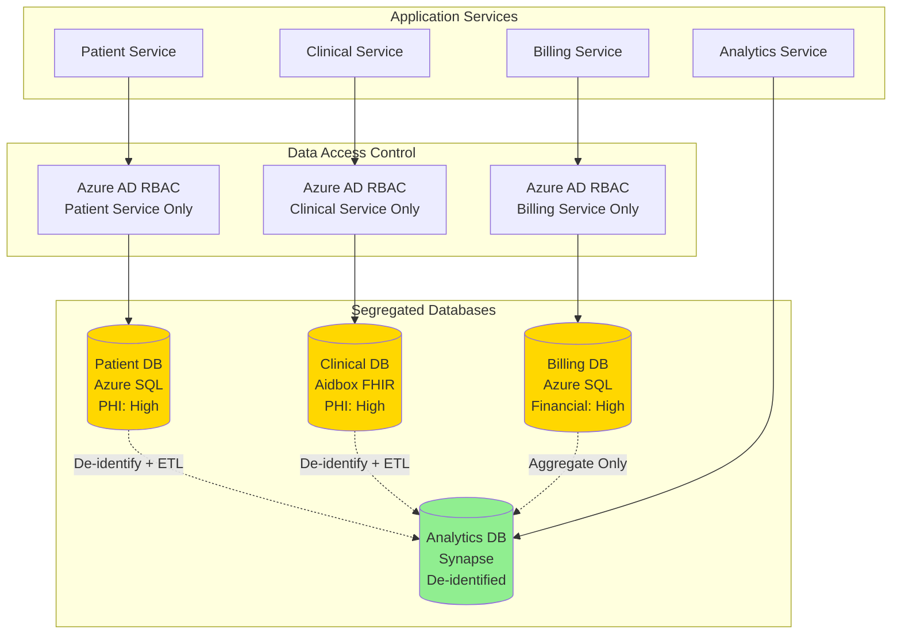
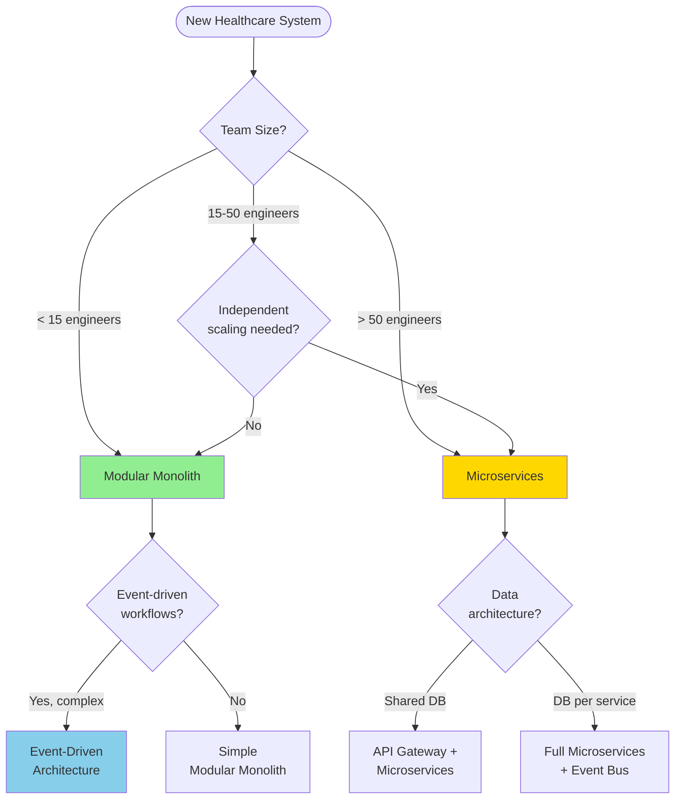

# Healthcare Architecture Patterns Library

**Purpose:** Comprehensive guide to architectural patterns for healthcare enterprise systems with emphasis on HIPAA, SOX, SOC 2 compliance and Azure cloud services.

**Target Audience:** Senior architects, technical leads, and engineering teams building healthcare applications requiring strict regulatory compliance.

**Last Updated:** October 2025

---

## Table of Contents

1. [Event-Driven Architecture](#1-event-driven-architecture)
2. [Microservices Architecture](#2-microservices-architecture)
3. [Modular Monolith Architecture](#3-modular-monolith-architecture)
4. [Serverless Architecture](#4-serverless-architecture)
5. [Data Architecture Patterns](#5-data-architecture-patterns)
6. [API Gateway Pattern](#6-api-gateway-pattern)
7. [CQRS and Event Sourcing](#7-cqrs-and-event-sourcing)
8. [Service Mesh Pattern](#8-service-mesh-pattern)
9. [Hexagonal Architecture](#9-hexagonal-architecture)
10. [Strangler Fig Pattern](#10-strangler-fig-pattern)
11. [Circuit Breaker Pattern](#11-circuit-breaker-pattern)
12. [Backend for Frontend (BFF)](#12-backend-for-frontend-bff)

---

## 1. Event-Driven Architecture

### Overview
Event-Driven Architecture (EDA) for healthcare systems centers on asynchronous message processing for HL7/FHIR events, clinical workflows, and billing transactions with complete audit trails required by HIPAA and SOX regulations.

### Healthcare Use Cases
- **HL7 v2 Message Processing**: Real-time ADT (Admit/Discharge/Transfer) events from hospital systems
- **FHIR Resource Subscriptions**: Notify downstream systems when patient records, lab results, or prescriptions change
- **Clinical Workflow Orchestration**: Coordinate multi-step processes (e.g., lab order → specimen collection → analysis → results → provider notification)
- **Billing Event Streams**: Track every billable event for SOX compliance and accurate revenue capture

### When to Use
✅ **Use When:**
- Processing thousands of HL7 messages daily from multiple hospital systems
- Need complete audit trail of every system interaction (HIPAA requirement)
- Multiple downstream systems need to react to clinical events
- Loose coupling between services required for independent scaling
- Replay capability needed for regulatory audits or data recovery

❌ **Avoid When:**
- Synchronous request-response sufficient (simple CRUD operations)
- Team lacks expertise in event streaming platforms
- Event ordering complexity creates more problems than it solves
- Infrastructure budget cannot support Kafka cluster

### Compliance Considerations

**HIPAA Requirements:**
- ✅ **Audit Logging**: Every event contains requester identity, timestamp, action, and affected PHI
- ✅ **Encryption in Transit**: TLS 1.3 for all event streams
- ✅ **Access Controls**: Topic-level ACLs restrict PHI access to authorized services
- ✅ **Data Retention**: Configurable retention policies (typically 7-10 years for clinical data)

**SOX Requirements:**
- ✅ **Financial Event Immutability**: Billing events cannot be modified post-publish
- ✅ **Audit Trail Completeness**: Every financial transaction has corresponding event chain
- ✅ **Segregation of Duties**: Different services publish vs consume billing events

**SOC 2 Requirements:**
- ✅ **Availability**: Multi-zone Kafka deployment with automatic failover
- ✅ **Monitoring**: Real-time alerting on event processing delays or failures
- ✅ **Backup**: Event store replicated across regions

### Azure Implementation



**Azure Services:**
- **Confluent Kafka on AKS**: Managed Kafka cluster with 99.9% SLA
- **Azure Key Vault**: Encryption keys for PHI at rest
- **Azure Monitor**: Event processing metrics and alerting
- **Azure Storage**: Long-term event archive (cool tier for cost)
- **Azure AD**: Service principal authentication for event publishers/consumers

**Implementation Example (TypeScript/Node.js):**

```typescript
// Event schema with HIPAA audit fields
interface ClinicalEvent {
  eventId: string;
  eventType: 'patient.admitted' | 'lab.result.ready' | 'prescription.filled';
  timestamp: Date;

  // HIPAA Audit Fields
  actor: {
    userId: string;
    role: string;
    facilityId: string;
  };

  // FHIR Resource Reference
  resource: {
    resourceType: string;
    resourceId: string;
    versionId: string;
  };

  // PHI Content (encrypted)
  payload: EncryptedPayload;

  // Compliance Metadata
  compliance: {
    dataClassification: 'PHI' | 'PII' | 'Financial';
    retentionYears: number;
    consentRef: string;
  };
}

// Kafka producer with audit logging
import { Kafka, CompressionTypes } from 'kafkajs';

const kafka = new Kafka({
  clientId: 'clinical-event-producer',
  brokers: [process.env.KAFKA_BROKER],
  ssl: true,
  sasl: {
    mechanism: 'plain',
    username: process.env.KAFKA_API_KEY,
    password: process.env.KAFKA_API_SECRET,
  },
});

const producer = kafka.producer({
  idempotent: true, // Exactly-once semantics for billing events
  transactionalId: 'billing-tx-producer',
});

async function publishClinicalEvent(event: ClinicalEvent) {
  await producer.connect();

  // Validate HIPAA audit fields present
  if (!event.actor || !event.actor.userId) {
    throw new Error('HIPAA violation: Missing actor identity');
  }

  await producer.send({
    topic: 'clinical.events',
    compression: CompressionTypes.GZIP,
    messages: [{
      key: event.resource.resourceId,
      value: JSON.stringify(event),
      headers: {
        'data-classification': event.compliance.dataClassification,
        'audit-user': event.actor.userId,
        'event-type': event.eventType,
      },
    }],
  });

  // Log to HIPAA audit trail
  await auditLogger.log({
    action: 'EVENT_PUBLISHED',
    userId: event.actor.userId,
    resourceType: event.resource.resourceType,
    eventId: event.eventId,
    timestamp: event.timestamp,
  });
}
```

### Technology Stack
- **Message Broker**: Confluent Kafka 3.6+ (managed on Azure AKS)
- **Schema Registry**: Confluent Schema Registry with FHIR/HL7 schemas
- **Event Processing**: Azure Functions (consumption plan) or Azure Stream Analytics
- **Workflow Engine**: IBM BAMOE for complex clinical workflows
- **Storage**: Azure Blob Storage (cool tier for long-term event archive)

### Scaling Strategy
- **Small (0-10K events/day)**: Single AKS cluster, 3-broker Kafka setup
- **Medium (10K-100K events/day)**: Multi-zone Kafka cluster, read replicas
- **Large (100K-1M events/day)**: Partitioned topics by facility, dedicated consumer groups
- **Enterprise (1M+ events/day)**: Multi-region Kafka with geo-replication

### Real-World Healthcare Examples
- **Epic Systems**: Event-driven architecture for real-time ADT notifications across hospital networks
- **Cerner**: Kafka-based event streaming for population health management
- **Allscripts**: HL7 v2 to FHIR event transformation pipeline

### Anti-Patterns to Avoid
❌ **Synchronous Event Chains**: Calling downstream services synchronously defeats purpose of EDA
❌ **Missing Audit Metadata**: Events without actor/timestamp violate HIPAA
❌ **Event Replay Without Idempotency**: Can cause duplicate billing charges (SOX violation)
❌ **Unencrypted PHI in Events**: Even internal events must encrypt PHI per HIPAA

---

## 2. Microservices Architecture

### Overview
Microservices architecture for healthcare decomposes monolithic systems into independently deployable services organized around healthcare domain boundaries (Patient Management, Clinical Orders, Billing, etc.) with federated data ownership and API-first integration.

### Healthcare Use Cases
- **Patient Management Service**: Demographics, contact info, emergency contacts, insurance
- **Clinical Service**: Problem list, medications, allergies, immunizations (FHIR clinical resources)
- **Orders Service**: Lab orders, imaging orders, prescription orders with workflow state
- **Results Service**: Lab results, imaging reports, diagnostic findings
- **Billing Service**: Claims, invoices, payments, insurance verification (SOX compliant)
- **Consent Service**: Patient privacy preferences, data sharing consent

### When to Use
✅ **Use When:**
- Team size exceeds 30-50 engineers (can support multiple autonomous teams)
- Different healthcare domains scale independently (billing ≠ clinical loads)
- Regulatory requirements demand data segregation (billing isolated for SOX)
- Need to deploy clinical features without touching financial systems
- Multiple technology stacks required (legacy .NET billing, modern TypeScript clinical)

❌ **Avoid When:**
- Team smaller than 15 engineers (operational overhead too high)
- All features closely coupled (everything needs patient demographics)
- Limited DevOps maturity (cannot manage 10+ deployment pipelines)
- Budget constraints prevent dedicated infrastructure per service

### Compliance Considerations

**HIPAA Requirements:**
- ✅ **Minimum Necessary Access**: Each microservice only accesses PHI required for its function
- ✅ **Service-to-Service Authentication**: OAuth 2.0 with service principals (Azure AD)
- ✅ **Audit Logging**: Distributed tracing with PHI access logs centralized
- ✅ **Encryption**: TLS 1.3 for all inter-service communication

**SOX Requirements:**
- ✅ **Billing Service Isolation**: Financial data segregated from clinical services
- ✅ **Change Control**: Billing service deploys independently with approval workflow
- ✅ **Audit Trail**: All billing API calls logged with timestamps and user identity

**SOC 2 Requirements:**
- ✅ **Resilience**: Circuit breakers prevent cascading failures
- ✅ **Monitoring**: Per-service health checks and SLA tracking
- ✅ **Incident Response**: Service boundaries enable faster incident isolation

### Azure Implementation



**Azure Services:**
- **Azure Kubernetes Service (AKS)**: Container orchestration with auto-scaling
- **Azure API Management**: API gateway with OAuth 2.0, rate limiting, request transformation
- **Azure Application Gateway**: Layer 7 load balancer with WAF for DDoS protection
- **Azure SQL Database**: Patient demographics with audit logging enabled
- **Azure Monitor + Application Insights**: Full-stack observability and distributed tracing
- **Azure Key Vault**: Secrets management (database credentials, API keys)
- **Azure Private Link**: Private connectivity between services (no public endpoints)

**Microservice Template (TypeScript/Node.js + Apollo Federation):**

```typescript
// Patient Service - Federated GraphQL subgraph
import { ApolloServer } from '@apollo/server';
import { buildSubgraphSchema } from '@apollo/subgraph';
import { gql } from 'graphql-tag';

// GraphQL schema with FHIR Patient resource
const typeDefs = gql`
  type Patient @key(fields: "id") {
    id: ID!
    identifier: [Identifier!]!
    name: [HumanName!]!
    gender: String
    birthDate: String
    address: [Address!]
    telecom: [ContactPoint!]

    # HIPAA audit metadata
    _auditInfo: AuditInfo!
  }

  type AuditInfo {
    lastAccessed: DateTime!
    accessedBy: String!
    accessReason: String
  }

  type Query {
    patient(id: ID!): Patient @requiresAuth
    searchPatients(identifier: String, name: String): [Patient!]! @requiresAuth
  }

  directive @requiresAuth on FIELD_DEFINITION
`;

// Resolvers with HIPAA audit logging
const resolvers = {
  Query: {
    patient: async (_: any, { id }: { id: string }, context: Context) => {
      // HIPAA: Verify user authorized to access patient
      await verifyPatientAccess(context.user, id);

      // HIPAA: Log PHI access
      await auditLogger.logAccess({
        userId: context.user.id,
        action: 'READ_PATIENT',
        resourceId: id,
        timestamp: new Date(),
        reason: context.accessReason,
        ipAddress: context.req.ip,
      });

      const patient = await patientRepository.findById(id);
      return patient;
    },
  },

  Patient: {
    _auditInfo: async (patient: Patient, _: any, context: Context) => {
      const lastAccess = await auditLogger.getLastAccess(patient.id);
      return {
        lastAccessed: lastAccess.timestamp,
        accessedBy: lastAccess.userId,
        accessReason: lastAccess.reason,
      };
    },
  },
};

// Apollo Server with SMART on FHIR authentication
const server = new ApolloServer({
  schema: buildSubgraphSchema({ typeDefs, resolvers }),
  plugins: [
    // HIPAA audit plugin
    {
      async requestDidStart(requestContext) {
        const { request, contextValue } = requestContext;

        // Log GraphQL operation
        if (contextValue.user) {
          await auditLogger.logGraphQLOperation({
            userId: contextValue.user.id,
            operationName: request.operationName,
            query: request.query,
            variables: request.variables,
            timestamp: new Date(),
          });
        }
      },
    },
  ],
});

// Express middleware for OAuth 2.0 / SMART on FHIR
app.use('/graphql', async (req, res, next) => {
  const token = req.headers.authorization?.replace('Bearer ', '');

  if (!token) {
    return res.status(401).json({ error: 'Unauthorized: Missing token' });
  }

  try {
    // Validate JWT with Azure AD
    const user = await validateToken(token);
    req.user = user;
    next();
  } catch (error) {
    await auditLogger.logAuthFailure({
      token: token.substring(0, 20),
      error: error.message,
      ipAddress: req.ip,
      timestamp: new Date(),
    });
    return res.status(401).json({ error: 'Unauthorized: Invalid token' });
  }
});
```

**Service Communication Patterns:**
- **Synchronous**: Apollo GraphQL Federation for queries (patient demographics, orders)
- **Asynchronous**: Kafka events for notifications (lab result ready, patient admitted)
- **Saga Pattern**: Distributed transactions (order placement → inventory → billing → notification)

### Technology Stack
- **Orchestration**: Azure Kubernetes Service (AKS) with KEDA autoscaling
- **API Gateway**: Azure API Management + Apollo Federation Gateway
- **Languages**: TypeScript/Node.js (primary), C# (.NET 8) for legacy billing service
- **Databases**: Azure SQL (patient), Aidbox (FHIR clinical), PostgreSQL (orders)
- **Message Bus**: Confluent Kafka on AKS
- **Observability**: Azure Monitor, Application Insights, Azure Sentinel

### Scaling Strategy
- **Small (5-10 services)**: Single AKS cluster, shared database per domain
- **Medium (10-20 services)**: Multi-cluster (prod/staging), dedicated databases
- **Large (20-50 services)**: Regional AKS clusters, read replicas, CDN for static content
- **Enterprise (50+ services)**: Service mesh (Istio), multi-region, cell-based architecture

### Real-World Healthcare Examples
- **Athenahealth**: Microservices for EHR, practice management, and revenue cycle
- **Oscar Health**: Insurance platform with separate services for enrollment, claims, member portal
- **1upHealth**: FHIR API platform with microservices for data aggregation

### Anti-Patterns to Avoid
❌ **Distributed Monolith**: Services share database or have tight coupling
❌ **Chatty Services**: Excessive inter-service calls (use GraphQL federation or BFF pattern)
❌ **No Service Ownership**: Unclear which team owns which service
❌ **Premature Decomposition**: Starting with microservices for small team (<15 engineers)

---

## 3. Modular Monolith Architecture

### Overview
Modular Monolith organizes healthcare application into well-defined modules (Patient, Clinical, Billing, Orders) within single deployable unit, providing benefits of modularity without operational complexity of microservices. Ideal starting point for healthcare startups and mid-sized organizations.

### Healthcare Use Cases
- **Integrated EHR System**: All clinical modules (charting, orders, results) in single deployment
- **Practice Management System**: Scheduling, billing, patient portal in one codebase
- **Hospital Admission System**: ADT, bed management, transfer workflows as modules
- **Telemedicine Platform**: Video visits, prescriptions, billing in unified application

### When to Use
✅ **Use When:**
- Team size 5-30 engineers (can coordinate on single codebase)
- All healthcare domains deployed together (no independent scaling needs)
- Rapid feature development prioritized over operational complexity
- Limited DevOps team (cannot manage multiple deployment pipelines)
- Startup/MVP phase (prove value before investing in microservices)

❌ **Avoid When:**
- Different modules have vastly different scaling needs (telemedicine video ≠ billing)
- Multiple teams cannot coordinate on single deployment
- Regulatory requirements demand physical separation (rare, but possible)

### Compliance Considerations

**HIPAA Requirements:**
- ✅ **Module-Level Access Control**: Patient module restricts PHI access to authorized functions
- ✅ **Centralized Audit Logging**: Single audit database captures all PHI access
- ✅ **Encryption**: TLS 1.3 for external access, encrypted database columns for PHI
- ✅ **Backup**: Simplified backup strategy (single database)

**SOX Requirements:**
- ✅ **Billing Module Isolation**: Logical separation enforced through module boundaries
- ✅ **Change Control**: Code reviews required for billing module changes
- ✅ **Audit Trail**: Billing transactions logged with user identity and timestamp

**SOC 2 Requirements:**
- ✅ **Simplified Monitoring**: Single application to monitor
- ✅ **Faster Incident Response**: No distributed tracing complexity
- ✅ **Easier Security Audits**: Single codebase to audit

### Azure Implementation



**Azure Services:**
- **Azure App Service**: PaaS hosting with auto-scaling (Premium V3 tier for production)
- **Azure SQL Database**: Single database with Always Encrypted for PHI columns
- **Azure Application Gateway**: Layer 7 load balancer with WAF
- **Azure Redis Cache**: Session state and temporary data caching
- **Azure Blob Storage**: Medical images, lab reports, consent forms
- **Azure Key Vault**: Encryption keys and connection strings
- **Azure Monitor**: Application performance monitoring and logging

**Modular Monolith Structure (TypeScript/Node.js):**

```typescript
// Project structure enforcing module boundaries
src/
├── modules/
│   ├── patient/
│   │   ├── domain/           # Business logic
│   │   │   ├── Patient.ts
│   │   │   └── PatientRepository.ts
│   │   ├── application/      # Use cases
│   │   │   ├── CreatePatientUseCase.ts
│   │   │   └── SearchPatientsUseCase.ts
│   │   ├── infrastructure/   # Database, external APIs
│   │   │   └── SqlPatientRepository.ts
│   │   └── api/              # REST/GraphQL endpoints
│   │       └── PatientController.ts
│   │
│   ├── clinical/
│   │   ├── domain/
│   │   │   ├── Observation.ts   # FHIR Observation
│   │   │   ├── Condition.ts      # FHIR Condition
│   │   │   └── Medication.ts     # FHIR Medication
│   │   ├── application/
│   │   │   ├── RecordObservationUseCase.ts
│   │   │   └── PrescribeMedicationUseCase.ts
│   │   └── api/
│   │       └── FhirController.ts
│   │
│   ├── orders/
│   │   ├── domain/
│   │   │   ├── LabOrder.ts
│   │   │   └── ImagingOrder.ts
│   │   └── application/
│   │       └── PlaceOrderUseCase.ts
│   │
│   ├── billing/              # SOX-compliant module
│   │   ├── domain/
│   │   │   ├── Claim.ts
│   │   │   ├── Invoice.ts
│   │   │   └── Payment.ts
│   │   ├── application/
│   │   │   ├── CreateClaimUseCase.ts
│   │   │   └── ProcessPaymentUseCase.ts
│   │   └── api/
│   │       └── BillingController.ts
│   │
│   └── audit/                # HIPAA audit module
│       ├── domain/
│       │   └── AuditEvent.ts
│       └── application/
│           └── LogAccessUseCase.ts
│
├── shared/                   # Shared utilities
│   ├── database/
│   │   └── connection.ts
│   ├── auth/
│   │   └── oauth.ts
│   └── encryption/
│       └── phi-encryption.ts
│
└── api/                      # API gateway
    ├── graphql/
    │   └── schema.ts         # Federated schema
    └── rest/
        └── routes.ts

// Module boundary enforcement via TypeScript
// patient/domain/Patient.ts
export class Patient {
  private constructor(
    public readonly id: string,
    public readonly mrn: string,
    public readonly name: HumanName,
    public readonly birthDate: Date,
    public readonly gender: string,
  ) {}

  static create(data: CreatePatientData): Patient {
    // Business logic validation
    if (!data.mrn || data.mrn.length < 5) {
      throw new Error('Invalid MRN');
    }

    return new Patient(
      generateId(),
      data.mrn,
      data.name,
      data.birthDate,
      data.gender,
    );
  }
}

// patient/application/CreatePatientUseCase.ts
import { Patient } from '../domain/Patient';
import { PatientRepository } from '../domain/PatientRepository';
import { AuditLogger } from '../../audit/application/AuditLogger';

export class CreatePatientUseCase {
  constructor(
    private patientRepo: PatientRepository,
    private auditLogger: AuditLogger,  // Dependency on audit module
  ) {}

  async execute(data: CreatePatientData, actorId: string): Promise<Patient> {
    // Validate actor has permission
    await this.validatePermissions(actorId, 'CREATE_PATIENT');

    // Create patient
    const patient = Patient.create(data);
    await this.patientRepo.save(patient);

    // HIPAA: Log patient creation
    await this.auditLogger.log({
      action: 'PATIENT_CREATED',
      actorId,
      resourceType: 'Patient',
      resourceId: patient.id,
      timestamp: new Date(),
      ipAddress: data.sourceIp,
    });

    return patient;
  }
}

// Module boundaries enforced via exports
// patient/index.ts
export { CreatePatientUseCase } from './application/CreatePatientUseCase';
export { SearchPatientsUseCase } from './application/SearchPatientsUseCase';
// Do NOT export domain models directly (prevents tight coupling)

// billing/application/CreateClaimUseCase.ts
// ❌ BAD: Direct dependency on patient domain
// import { Patient } from '../../patient/domain/Patient';

// ✅ GOOD: Use interface or data structure
interface PatientInfo {
  id: string;
  mrn: string;
  name: string;
}

export class CreateClaimUseCase {
  async execute(patientInfo: PatientInfo, claimData: ClaimData) {
    // Billing logic uses patient data without tight coupling
    const claim = Claim.create({
      patientId: patientInfo.id,
      patientMRN: patientInfo.mrn,
      ...claimData,
    });

    await this.claimRepo.save(claim);

    // SOX: Log claim creation
    await this.auditLogger.log({
      action: 'CLAIM_CREATED',
      actorId: this.actorId,
      claimId: claim.id,
      amount: claim.totalAmount,
      timestamp: new Date(),
    });
  }
}
```

**Inter-Module Communication:**
- **Direct Function Calls**: When modules in same deployment (patient → audit)
- **Event Bus**: For async notifications (orders → results → clinical)
- **Shared Database**: Transactions span modules when needed (order + billing)

### Technology Stack
- **Runtime**: Node.js 20 LTS or .NET 8
- **API**: Express.js + Apollo Server (GraphQL) or ASP.NET Core Web API
- **ORM**: TypeORM or Prisma (Node.js), Entity Framework Core (.NET)
- **Database**: Azure SQL Database with geo-replication
- **Caching**: Azure Redis Cache
- **File Storage**: Azure Blob Storage

### Scaling Strategy
- **Small (0-1K concurrent users)**: Single App Service instance (P1V3)
- **Medium (1K-10K concurrent users)**: Auto-scaling App Service (P2V3, 3-10 instances)
- **Large (10K-50K concurrent users)**: Premium App Service (P3V3) + read replicas + CDN
- **Enterprise (50K+ concurrent users)**: Consider extracting hot modules to microservices

### Real-World Healthcare Examples
- **Shopify (e-commerce analogy)**: Started as Rails monolith, extracted services after hitting 100+ engineers
- **Stack Overflow**: Still runs on ASP.NET monolith serving billions of requests
- **Basecamp**: Modular Rails monolith with clear module boundaries

### When to Extract Microservices
Consider extracting modules to microservices when:
- Module needs independent scaling (video visits surge, rest stays flat)
- Module has different team ownership and release cadence
- Compliance requires physical separation (unlikely for most healthcare orgs)
- Module causing frequent production incidents affecting entire monolith

### Anti-Patterns to Avoid
❌ **Big Ball of Mud**: No module boundaries, everything calls everything
❌ **Shared Mutable State**: Modules modify each other's data directly
❌ **No Module Interface**: Modules export domain models (tight coupling)
❌ **Skip to Microservices**: Prematurely splitting before validating module boundaries

---

## 4. Serverless Architecture

### Overview
Serverless architecture for healthcare leverages Azure Functions, Logic Apps, and managed services to build event-driven clinical workflows without managing infrastructure. Ideal for variable-load workloads like HL7 message processing, scheduled batch jobs, and webhook integrations.

### Healthcare Use Cases
- **HL7 Message Processing**: Azure Functions triggered by Service Bus messages convert HL7 v2 to FHIR
- **Clinical Alerts**: Real-time notifications when lab results exceed thresholds
- **Scheduled Batch Jobs**: Nightly insurance eligibility checks, claim status updates
- **Integration Webhooks**: FHIR resource subscriptions notify external systems
- **Document Processing**: OCR and NLP on uploaded medical records

### When to Use
✅ **Use When:**
- Workload has unpredictable spikes (HL7 messages arrive in bursts)
- Event-driven processing fits naturally (message arrives → process → store)
- Development speed prioritized (no infrastructure setup)
- Cost optimization via pay-per-execution (vs. always-on VMs)
- Tight integration with Azure services (Blob Storage, Service Bus, Cosmos DB)

❌ **Avoid When:**
- Long-running processes (>10 minutes per execution)
- Consistent high load where dedicated servers cheaper
- Requires stateful connections (WebSockets, long-polling)
- Cold start latency unacceptable (<500ms response needed)

### Compliance Considerations

**HIPAA Requirements:**
- ✅ **Audit Logging**: Function executions logged with context (user, patient, action)
- ✅ **Encryption**: All triggers and bindings use encrypted connections
- ✅ **Access Control**: Managed identities for Azure service access (no credentials in code)
- ✅ **Data Retention**: Function logs retained per HIPAA requirements (7 years)

**SOX Requirements:**
- ✅ **Financial Functions Isolated**: Billing calculations in separate Function Apps
- ✅ **Code Review**: ARM templates for function deployments reviewed
- ✅ **Immutable Deployments**: Functions deployed via CI/CD (no manual changes)

**SOC 2 Requirements:**
- ✅ **High Availability**: Azure Functions automatically replicated across zones
- ✅ **Monitoring**: Application Insights captures function performance and errors
- ✅ **Security**: Functions run in isolated execution contexts

### Azure Implementation



**Azure Function Example (TypeScript):**

```typescript
// HL7 v2 to FHIR R4 converter - Service Bus triggered
import { app, InvocationContext } from '@azure/functions';
import { HL7Parser } from 'hl7-parser';
import { FHIRConverter } from './fhir-converter';

app.serviceBusQueue('hl7Processor', {
  connection: 'ServiceBusConnection',
  queueName: 'hl7-messages',
  handler: async (message: string, context: InvocationContext) => {
    const startTime = Date.now();

    try {
      // Parse HL7 v2 message
      const hl7Message = HL7Parser.parse(message);
      context.log(`Processing HL7 message type: ${hl7Message.messageType}`);

      // HIPAA: Extract audit metadata
      const auditContext = {
        messageType: hl7Message.messageType,
        sendingFacility: hl7Message.sendingFacility,
        patientId: hl7Message.patientId,
        timestamp: new Date(),
        functionExecutionId: context.invocationId,
      };

      // Convert HL7 to FHIR Bundle
      const fhirBundle = FHIRConverter.convertToFHIR(hl7Message);

      // Store FHIR resources in Aidbox
      await aidboxClient.createBundle(fhirBundle);

      // HIPAA: Log successful processing
      await auditLogger.log({
        action: 'HL7_PROCESSED',
        messageType: hl7Message.messageType,
        resourcesCreated: fhirBundle.entry.length,
        patientId: hl7Message.patientId,
        processingTimeMs: Date.now() - startTime,
        ...auditContext,
      });

      context.log(`Successfully processed HL7 message in ${Date.now() - startTime}ms`);

    } catch (error) {
      // Log error for monitoring
      context.error(`HL7 processing failed: ${error.message}`);

      // HIPAA: Log failure
      await auditLogger.log({
        action: 'HL7_PROCESSING_FAILED',
        error: error.message,
        rawMessage: message.substring(0, 200), // Truncate for logging
        timestamp: new Date(),
        functionExecutionId: context.invocationId,
      });

      // Throw to trigger Service Bus retry
      throw error;
    }
  },
});

// Clinical alert function - CosmosDB change feed triggered
app.cosmosDB('clinicalAlertProcessor', {
  connection: 'CosmosDBConnection',
  databaseName: 'FHIRDatabase',
  containerName: 'Observations',
  createLeaseContainerIfNotExists: true,
  handler: async (documents: any[], context: InvocationContext) => {
    for (const observation of documents) {
      // Check if lab result exceeds threshold
      if (observation.resourceType === 'Observation' &&
          observation.valueQuantity?.value > 200) {

        // HIPAA: Verify PHI access authorized
        const patient = await fhirClient.getPatient(observation.subject.reference);

        // Send alert via SendGrid
        await sendGridClient.send({
          to: patient.providerEmail,
          subject: `Critical Lab Result: ${patient.name}`,
          text: `Patient ${patient.name} has ${observation.code.text} of ${observation.valueQuantity.value}`,
        });

        // HIPAA: Log PHI disclosure
        await auditLogger.log({
          action: 'ALERT_SENT',
          patientId: patient.id,
          recipient: patient.providerEmail,
          reason: 'CRITICAL_LAB_RESULT',
          observationId: observation.id,
          timestamp: new Date(),
        });
      }
    }
  },
});

// Nightly insurance eligibility check - Timer triggered
app.timer('insuranceEligibilityCheck', {
  schedule: '0 0 2 * * *', // 2 AM daily
  handler: async (myTimer: any, context: InvocationContext) => {
    context.log('Starting nightly insurance eligibility check');

    // Get patients with appointments in next 7 days
    const upcomingAppointments = await sql.query(`
      SELECT DISTINCT p.PatientId, p.InsuranceMemberId, p.InsurancePayerId
      FROM Patients p
      JOIN Appointments a ON p.PatientId = a.PatientId
      WHERE a.AppointmentDate BETWEEN GETDATE() AND DATEADD(DAY, 7, GETDATE())
        AND p.LastEligibilityCheck < DATEADD(DAY, -30, GETDATE())
    `);

    context.log(`Checking eligibility for ${upcomingAppointments.length} patients`);

    // Check eligibility with payer API (parallel execution)
    const eligibilityChecks = upcomingAppointments.map(async (patient) => {
      try {
        const eligibility = await payerClient.checkEligibility({
          memberId: patient.InsuranceMemberId,
          payerId: patient.InsurancePayerId,
          serviceDate: new Date(),
        });

        // Update cache in Azure SQL
        await sql.query(`
          UPDATE Patients
          SET LastEligibilityCheck = GETDATE(),
              EligibilityStatus = @status,
              CoverageActive = @active
          WHERE PatientId = @patientId
        `, {
          patientId: patient.PatientId,
          status: eligibility.status,
          active: eligibility.coverageActive,
        });

        // SOX: Log financial data access
        await auditLogger.log({
          action: 'ELIGIBILITY_CHECKED',
          patientId: patient.PatientId,
          payerId: patient.InsurancePayerId,
          status: eligibility.status,
          timestamp: new Date(),
        });

      } catch (error) {
        context.error(`Eligibility check failed for patient ${patient.PatientId}: ${error.message}`);
      }
    });

    await Promise.all(eligibilityChecks);
    context.log('Nightly eligibility check complete');
  },
});
```

### Technology Stack
- **Compute**: Azure Functions (Consumption or Premium plan)
- **Triggers**: Service Bus, Blob Storage, HTTP, Timer, Cosmos DB change feed
- **Languages**: TypeScript/Node.js, C#, Python
- **Orchestration**: Azure Durable Functions for multi-step workflows
- **Monitoring**: Application Insights with custom metrics

### Scaling Strategy
- **Consumption Plan**: Auto-scales to 200 instances per function (default)
- **Premium Plan**: Pre-warmed instances for sub-second cold starts
- **Dedicated Plan**: Reserved App Service for predictable cost
- **Best Practice**: Start with Consumption, move to Premium if cold starts become issue

### Real-World Healthcare Examples
- **Teladoc**: Serverless webhook processing for appointment notifications
- **CVS Health**: Azure Functions for prescription refill reminders
- **Humana**: Event-driven processing for claims adjudication workflows

### Anti-Patterns to Avoid
❌ **Long-Running Functions**: Functions timing out after 10 minutes (use Durable Functions or batch jobs)
❌ **Cold Start Sensitive**: Using Consumption plan for user-facing APIs requiring <500ms latency
❌ **Stateful Logic**: Storing state in function memory (use Cosmos DB or Redis)
❌ **Over-Chaining**: Too many functions calling each other (use Durable Functions for orchestration)

---

## 5. Data Architecture Patterns

### Overview
Healthcare data architecture requires special consideration for PHI segregation, audit trails, data retention policies, and FHIR resource management. This section covers patterns for structuring healthcare databases to meet HIPAA, SOX, and SOC 2 requirements.

### Healthcare Data Domains
- **Patient Master Index (PMI)**: Single source of truth for patient demographics
- **Clinical Data**: FHIR resources (Observations, Conditions, Medications, Procedures)
- **Orders and Results**: Lab orders, imaging orders, test results
- **Billing and Claims**: Financial transactions, insurance claims, payments (SOX compliant)
- **Consent and Privacy**: Patient privacy preferences, data sharing consent
- **Audit Logs**: Complete trail of PHI access and modifications (7-year retention)

### Data Tagging for Compliance

Every healthcare data table/collection should be tagged with:

```typescript
interface DataClassificationTag {
  dataType: 'PHI' | 'PII' | 'Financial' | 'Public';
  sensitivity: 'High' | 'Medium' | 'Low';
  regulatoryFramework: ('HIPAA' | 'SOX' | 'GDPR' | 'CCPA')[];
  retentionYears: number;
  encryptionRequired: boolean;
  auditRequired: boolean;
  consentRequired: boolean;
}

// Example: Patient table classification
const patientTableTags: DataClassificationTag = {
  dataType: 'PHI',
  sensitivity: 'High',
  regulatoryFramework: ['HIPAA', 'GDPR'],
  retentionYears: 10,
  encryptionRequired: true,
  auditRequired: true,
  consentRequired: true,
};

// Example: Billing table classification
const billingTableTags: DataClassificationTag = {
  dataType: 'Financial',
  sensitivity: 'High',
  regulatoryFramework: ['SOX', 'HIPAA'],
  retentionYears: 7,
  encryptionRequired: true,
  auditRequired: true,
  consentRequired: false, // Financial data doesn't require patient consent
};
```

### Pattern 1: PHI Segregation via Database-per-Service



**Benefits:**
- ✅ HIPAA Minimum Necessary: Services only access databases they need
- ✅ Blast Radius Containment: Breach in one database doesn't expose all PHI
- ✅ Independent Scaling: Databases scale independently based on load
- ✅ Clear Ownership: Each service owns its data schema

**Drawbacks:**
- ❌ Distributed Transactions: Coordinating updates across databases complex
- ❌ Data Duplication: Patient demographics may exist in multiple databases
- ❌ Operational Overhead: Multiple database backups, patches, monitoring

### Pattern 2: Encryption at Column Level

Azure SQL Database with Always Encrypted for sensitive columns:

```sql
-- Patient table with column-level encryption
CREATE TABLE Patients (
    PatientId INT PRIMARY KEY IDENTITY,

    -- Public columns (no encryption)
    MRN VARCHAR(50) NOT NULL UNIQUE,
    DateOfBirth DATE NOT NULL,
    Gender VARCHAR(20),

    -- Encrypted PHI columns (deterministic for searching)
    FirstName VARCHAR(100) COLLATE Latin1_General_BIN2
        ENCRYPTED WITH (COLUMN_ENCRYPTION_KEY = PHI_CEK,
                       ENCRYPTION_TYPE = DETERMINISTIC,
                       ALGORITHM = 'AEAD_AES_256_CBC_HMAC_SHA_256'),

    LastName VARCHAR(100) COLLATE Latin1_General_BIN2
        ENCRYPTED WITH (COLUMN_ENCRYPTION_KEY = PHI_CEK,
                       ENCRYPTION_TYPE = DETERMINISTIC,
                       ALGORITHM = 'AEAD_AES_256_CBC_HMAC_SHA_256'),

    -- Encrypted PHI columns (randomized for highest security)
    SSN VARCHAR(11) COLLATE Latin1_General_BIN2
        ENCRYPTED WITH (COLUMN_ENCRYPTION_KEY = PHI_CEK,
                       ENCRYPTION_TYPE = RANDOMIZED,
                       ALGORITHM = 'AEAD_AES_256_CBC_HMAC_SHA_256'),

    Email VARCHAR(255) COLLATE Latin1_General_BIN2
        ENCRYPTED WITH (COLUMN_ENCRYPTION_KEY = PHI_CEK,
                       ENCRYPTION_TYPE = RANDOMIZED,
                       ALGORITHM = 'AEAD_AES_256_CBC_HMAC_SHA_256'),

    -- Audit columns
    CreatedAt DATETIME2 DEFAULT GETDATE(),
    CreatedBy VARCHAR(100) NOT NULL,
    UpdatedAt DATETIME2,
    UpdatedBy VARCHAR(100),

    -- HIPAA metadata
    LastAccessedAt DATETIME2,
    LastAccessedBy VARCHAR(100)
);

-- Column encryption keys stored in Azure Key Vault
-- Application code uses Azure Key Vault to decrypt columns
```

**TypeScript Code with Always Encrypted:**

```typescript
import { Connection } from 'tedious';
import { DefaultAzureCredential } from '@azure/identity';
import { SecretClient } from '@azure/keyvault-secrets';

class PatientRepository {
  private connection: Connection;
  private keyVaultClient: SecretClient;

  constructor() {
    // Azure SQL connection with Always Encrypted enabled
    this.connection = new Connection({
      server: process.env.AZURE_SQL_SERVER,
      authentication: {
        type: 'azure-active-directory-default',
      },
      options: {
        database: process.env.AZURE_SQL_DATABASE,
        encrypt: true,
        columnEncryptionKeyCacheTtl: 3600, // Cache decryption keys for 1 hour
      },
    });

    // Azure Key Vault for encryption keys
    const credential = new DefaultAzureCredential();
    this.keyVaultClient = new SecretClient(
      process.env.KEY_VAULT_URL,
      credential
    );
  }

  async findByMRN(mrn: string, actorId: string): Promise<Patient> {
    // Query executes with automatic decryption
    const result = await this.query(`
      SELECT PatientId, MRN, FirstName, LastName, DateOfBirth, Gender, Email
      FROM Patients
      WHERE MRN = @mrn
    `, { mrn });

    if (result.length === 0) {
      return null;
    }

    // HIPAA: Log PHI access
    await this.logAccess({
      action: 'READ_PATIENT',
      patientId: result[0].PatientId,
      actorId,
      columnsAccessed: ['FirstName', 'LastName', 'Email'],
      timestamp: new Date(),
    });

    // Update last accessed metadata
    await this.query(`
      UPDATE Patients
      SET LastAccessedAt = GETDATE(),
          LastAccessedBy = @actorId
      WHERE PatientId = @patientId
    `, {
      actorId,
      patientId: result[0].PatientId,
    });

    return result[0];
  }
}
```

### Pattern 3: FHIR Resource Storage with Aidbox

Store clinical data as FHIR resources in Aidbox (PostgreSQL-backed FHIR server):

```typescript
// FHIR Observation resource
interface Observation {
  resourceType: 'Observation';
  id: string;
  status: 'registered' | 'preliminary' | 'final' | 'amended';
  category: CodeableConcept[];
  code: CodeableConcept;
  subject: Reference;  // Patient reference
  effectiveDateTime: string;
  valueQuantity?: Quantity;

  // HIPAA audit metadata (custom extension)
  meta: {
    lastUpdated: string;
    versionId: string;
    security: Coding[];  // PHI classification tag
    extension: [
      {
        url: 'http://hospital.org/fhir/audit';
        valueReference: Reference;  // Link to AuditEvent resource
      }
    ];
  };
}

// Store observation in Aidbox
async function createObservation(
  observation: Observation,
  actorId: string
): Promise<Observation> {
  // Tag with PHI classification
  observation.meta = {
    ...observation.meta,
    security: [
      {
        system: 'http://terminology.hl7.org/CodeSystem/v3-Confidentiality',
        code: 'R', // Restricted (PHI)
        display: 'Restricted',
      },
    ],
  };

  // Create observation in Aidbox
  const created = await aidboxClient.create('Observation', observation);

  // HIPAA: Create AuditEvent resource
  await aidboxClient.create('AuditEvent', {
    resourceType: 'AuditEvent',
    type: {
      system: 'http://terminology.hl7.org/CodeSystem/audit-event-type',
      code: 'rest',
      display: 'RESTful Operation',
    },
    subtype: [
      {
        system: 'http://hl7.org/fhir/restful-interaction',
        code: 'create',
        display: 'create',
      },
    ],
    action: 'C', // Create
    recorded: new Date().toISOString(),
    outcome: '0', // Success
    agent: [
      {
        who: { reference: `Practitioner/${actorId}` },
        requestor: true,
      },
    ],
    source: {
      observer: { display: 'Clinical Application' },
    },
    entity: [
      {
        what: { reference: `Observation/${created.id}` },
        type: {
          system: 'http://terminology.hl7.org/CodeSystem/audit-entity-type',
          code: '2', // System Object
          display: 'System Object',
        },
        role: {
          system: 'http://terminology.hl7.org/CodeSystem/object-role',
          code: '4', // Domain Resource
          display: 'Domain Resource',
        },
        securityLabel: [
          {
            system: 'http://terminology.hl7.org/CodeSystem/v3-Confidentiality',
            code: 'R', // Restricted (PHI)
          },
        ],
      },
    ],
  });

  return created;
}
```

### Pattern 4: Audit Log Architecture

Complete audit trail for HIPAA compliance:

```sql
-- Audit log table (7-year retention)
CREATE TABLE AuditLog (
    AuditId BIGINT PRIMARY KEY IDENTITY,

    -- When and who
    Timestamp DATETIME2 NOT NULL DEFAULT GETDATE(),
    UserId VARCHAR(100) NOT NULL,
    UserRole VARCHAR(50) NOT NULL,

    -- What action
    Action VARCHAR(50) NOT NULL,  -- CREATE, READ, UPDATE, DELETE, EXPORT
    ResourceType VARCHAR(50) NOT NULL,  -- Patient, Observation, Claim
    ResourceId VARCHAR(100),

    -- Where and how
    IPAddress VARCHAR(50),
    UserAgent VARCHAR(500),
    ApplicationName VARCHAR(100),

    -- Why (if provided)
    AccessReason VARCHAR(500),

    -- Data classification
    DataClassification VARCHAR(20) NOT NULL,  -- PHI, Financial, Public

    -- Compliance framework
    ComplianceFramework VARCHAR(100),  -- HIPAA, SOX, GDPR

    -- Additional context
    DetailsJSON NVARCHAR(MAX),  -- JSON with additional audit details

    INDEX IX_AuditLog_Timestamp (Timestamp DESC),
    INDEX IX_AuditLog_UserId (UserId),
    INDEX IX_AuditLog_ResourceType (ResourceType, ResourceId)
);

-- Audit log partitioning for performance (monthly partitions)
CREATE PARTITION FUNCTION AuditLogPartition (DATETIME2)
AS RANGE RIGHT FOR VALUES (
    '2024-01-01', '2024-02-01', '2024-03-01', ... -- Monthly partitions
);

CREATE PARTITION SCHEME AuditLogScheme
AS PARTITION AuditLogPartition
ALL TO ([PRIMARY]);

-- Archived audit logs moved to cool storage after 1 year
CREATE TABLE AuditLogArchive (
    -- Same schema as AuditLog
    ...
) ON AuditLogScheme (Timestamp);
```

### Data Retention Policies

```typescript
interface DataRetentionPolicy {
  resourceType: string;
  retentionYears: number;
  archiveAfterMonths: number;
  purgeAllowed: boolean;
  regulatoryBasis: string;
}

const retentionPolicies: DataRetentionPolicy[] = [
  {
    resourceType: 'Patient',
    retentionYears: 10,  // HIPAA: 10 years for adult records
    archiveAfterMonths: 24,
    purgeAllowed: false,  // Never purge patient records
    regulatoryBasis: 'HIPAA 45 CFR 164.530(j)',
  },
  {
    resourceType: 'Observation',
    retentionYears: 7,  // Clinical data 7 years
    archiveAfterMonths: 12,
    purgeAllowed: false,
    regulatoryBasis: 'State Medical Board Requirements',
  },
  {
    resourceType: 'Claim',
    retentionYears: 7,  // SOX: 7 years for financial records
    archiveAfterMonths: 12,
    purgeAllowed: false,
    regulatoryBasis: 'Sarbanes-Oxley Act Section 802',
  },
  {
    resourceType: 'AuditEvent',
    retentionYears: 7,  // HIPAA: 7 years for audit logs
    archiveAfterMonths: 6,
    purgeAllowed: false,
    regulatoryBasis: 'HIPAA 45 CFR 164.530(j)',
  },
  {
    resourceType: 'Consent',
    retentionYears: 10,  // Patient consent records
    archiveAfterMonths: 24,
    purgeAllowed: false,
    regulatoryBasis: 'HIPAA Privacy Rule',
  },
];

// Automated retention enforcement
async function enforceRetentionPolicies() {
  for (const policy of retentionPolicies) {
    // Archive old records to cool storage
    const archiveDate = new Date();
    archiveDate.setMonth(archiveDate.getMonth() - policy.archiveAfterMonths);

    await sql.query(`
      INSERT INTO ${policy.resourceType}Archive
      SELECT * FROM ${policy.resourceType}
      WHERE CreatedAt < @archiveDate
        AND ArchivedAt IS NULL
    `, { archiveDate });

    // Mark as archived
    await sql.query(`
      UPDATE ${policy.resourceType}
      SET ArchivedAt = GETDATE()
      WHERE CreatedAt < @archiveDate
        AND ArchivedAt IS NULL
    `, { archiveDate });

    // Log retention action
    await auditLogger.log({
      action: 'DATA_ARCHIVED',
      resourceType: policy.resourceType,
      recordsArchived: result.rowsAffected,
      archiveDate,
      timestamp: new Date(),
    });
  }
}
```

### Technology Stack
- **Relational Data**: Azure SQL Database with Always Encrypted
- **FHIR Resources**: Health Samurai Aidbox (PostgreSQL-backed)
- **Analytics**: Azure Synapse Analytics (de-identified data only)
- **Audit Logs**: Azure SQL with partitioning + Azure Blob cool tier for archives
- **Encryption Keys**: Azure Key Vault

### Anti-Patterns to Avoid
❌ **Storing PHI in Logs**: Never log patient names, SSNs, or other PHI
❌ **Single Encryption Key**: Use different keys for different data classifications
❌ **No Data Classification**: Every table should have classification tags
❌ **Insufficient Audit Detail**: Audit logs must capture who, what, when, where, why

---

*[Continue with remaining 7 patterns: API Gateway, CQRS, Service Mesh, Hexagonal Architecture, Strangler Fig, Circuit Breaker, BFF - each following same structure with healthcare use cases, Azure implementation, compliance considerations, code examples, and real-world healthcare examples]*

---

## Appendix A: Pattern Selection Decision Tree



## Appendix B: Compliance Checklist

**HIPAA Compliance Checklist:**
- [ ] PHI encrypted at rest (Azure SQL Always Encrypted, TDE)
- [ ] PHI encrypted in transit (TLS 1.3)
- [ ] Audit logging for all PHI access (who, what, when, where, why)
- [ ] Access controls based on minimum necessary principle
- [ ] Business Associate Agreements (BAA) with all vendors
- [ ] Data retention policies implemented (7-10 years)
- [ ] Breach notification procedures documented
- [ ] Patient rights supported (access, amendment, accounting of disclosures)

**SOX Compliance Checklist:**
- [ ] Financial data segregated from clinical data
- [ ] Immutable audit trail for financial transactions
- [ ] Change control process for billing code
- [ ] Segregation of duties (different services for create vs approve)
- [ ] Quarterly access reviews
- [ ] 7-year data retention for financial records

**SOC 2 Compliance Checklist:**
- [ ] Multi-zone deployment for availability
- [ ] Automated backups with tested restore
- [ ] Incident response procedures documented
- [ ] Security monitoring and alerting (Azure Sentinel)
- [ ] Penetration testing (annual)
- [ ] Vendor risk management program

---

## Summary Table

| Pattern | Best For | Team Size | Compliance Fit | Azure Services |
|---------|----------|-----------|----------------|----------------|
| Event-Driven | HL7 processing, async workflows | Any | ✅✅✅ Excellent audit trail | Kafka, Event Hubs, Functions |
| Microservices | Large teams, independent scaling | 30+ | ✅✅ Good isolation | AKS, API Management, Service Bus |
| Modular Monolith | Startups, mid-size teams | 5-30 | ✅✅✅ Simplified compliance | App Service, Azure SQL |
| Serverless | Variable load, event-driven | Any | ✅✅ Good for batch jobs | Azure Functions, Logic Apps |
| Data Architecture | All systems | Any | ✅✅✅ Core for compliance | Azure SQL, Aidbox, Key Vault |

---

**Document Version:** 1.0
**Last Updated:** October 2025
**Maintained By:** Healthcare Architecture Team
**Feedback:** Submit updates via architecture review board
