# Knowledge Base: Diagram Examples & Best Practices

**Purpose:** Reference guide for generating high-quality Mermaid diagrams in architecture design workflows (REL-002 & REL-003)

**Diagrams Covered:** System Context (C4), Component Architecture, Sequence Diagrams, Entity-Relationship, Deployment Topology

---

## 1. System Context Diagrams (C4)

**Purpose:** Show system boundaries, external actors, and data flows

### ❌ BAD Example - Cluttered, unclear boundaries

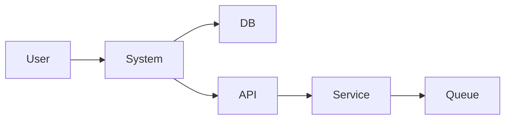

**Problems:**
- No clear system boundary
- Generic labels ("System", "API")
- Missing protocols/data flows
- Flat structure (no hierarchy)

### ✅ GOOD Example - Clear boundaries, labeled flows

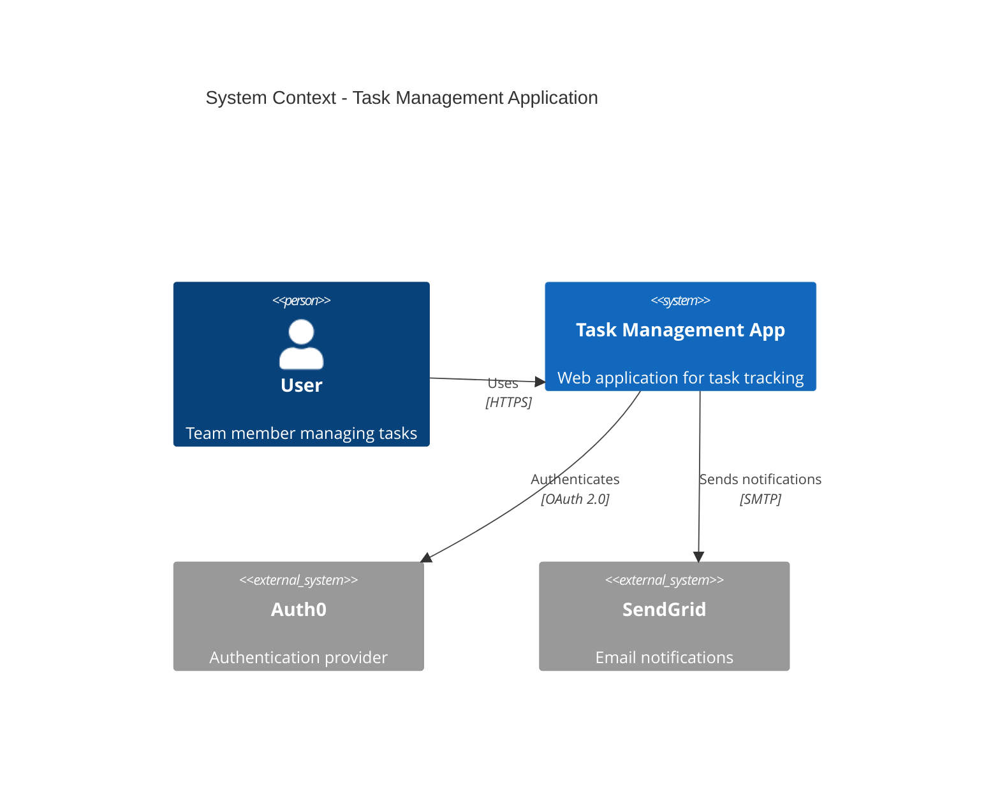

**Why Better:**
- C4Context syntax for proper boundaries
- Descriptive labels with roles
- Communication protocols specified
- External systems clearly marked (System_Ext)

### ⭐ GREAT Example - Comprehensive with data details

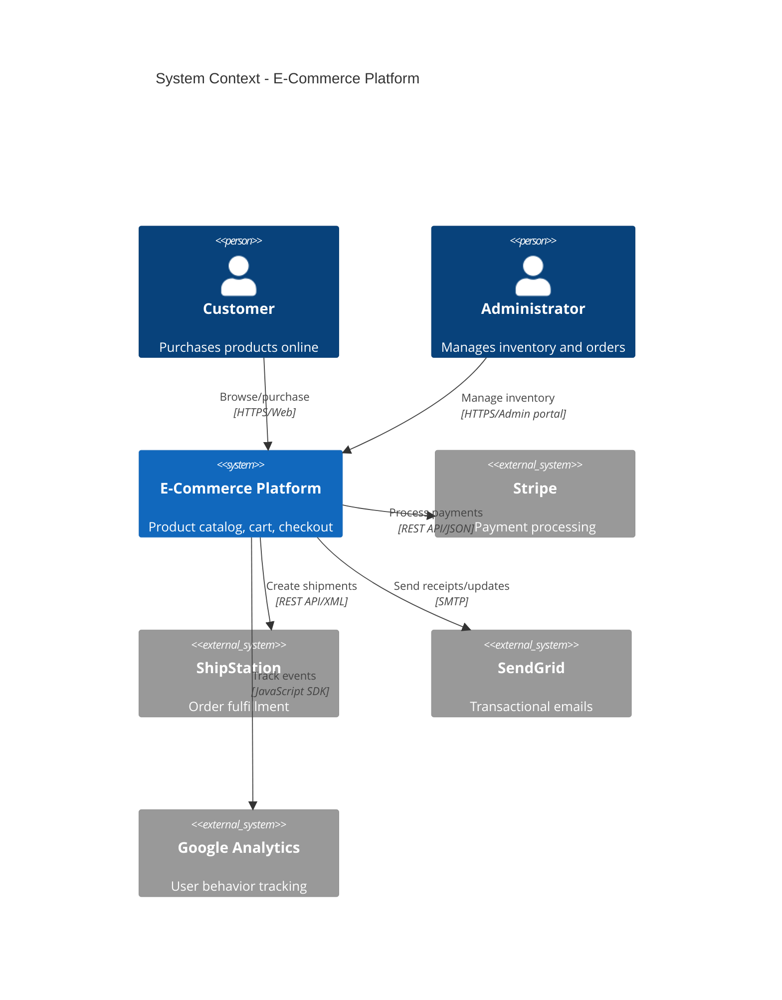

**What Makes It Great:**
- Multiple user types with clear roles
- Data format in protocols (JSON, XML)
- Communication method details (REST API, SDK)
- Layout hints for readability (UpdateRelStyle)
- Covers all integration points

**Best Practices:**
- Use C4Context for proper system boundary representation
- Include Person() for users, System() for your app, System_Ext() for external dependencies
- Specify protocols (HTTPS, REST API, SMTP, gRPC)
- Add data formats when relevant (JSON, XML, Protobuf)
- Limit to 5-10 external systems (avoid clutter)

---

## 2. Component Diagrams

**Purpose:** Show internal structure and component relationships

### ❌ BAD Example - Box soup, unclear relationships

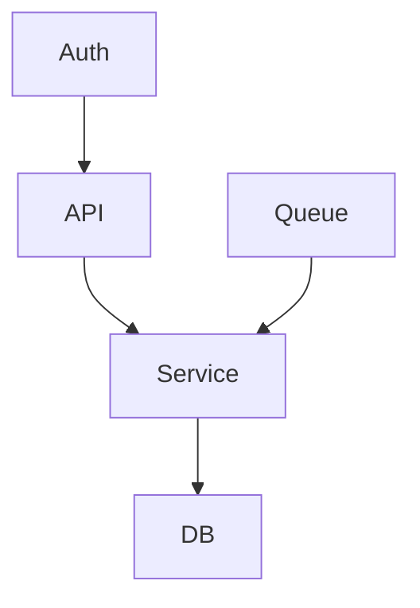

**Problems:**
- No component boundaries or layers
- Unclear what components do
- Missing dependency direction clarity
- No interface definitions

### ✅ GOOD Example - Layered with clear responsibilities

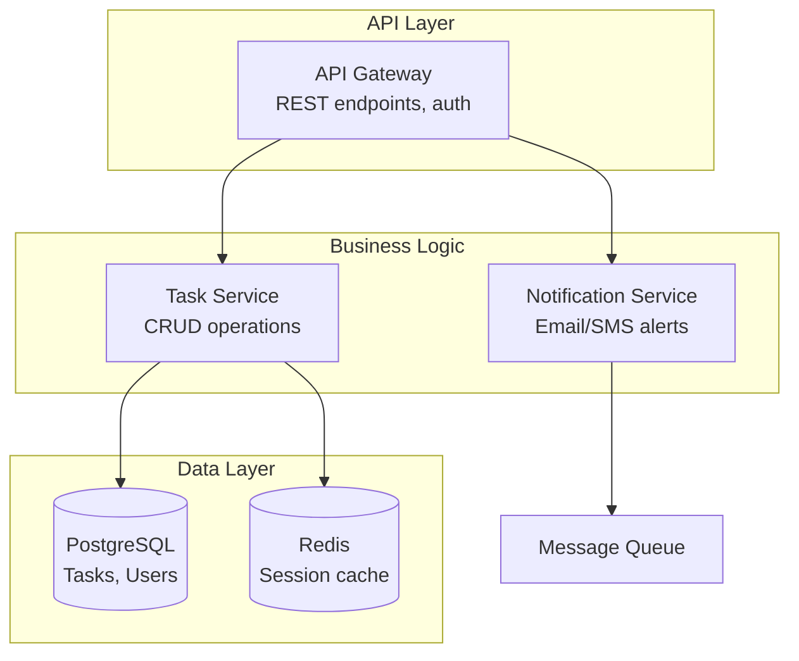

**Why Better:**
- Clear layering (API → Business → Data)
- Component responsibilities described
- Subgraphs show architectural boundaries
- Technology choices specified

### ⭐ GREAT Example - Detailed with interfaces and tech stack

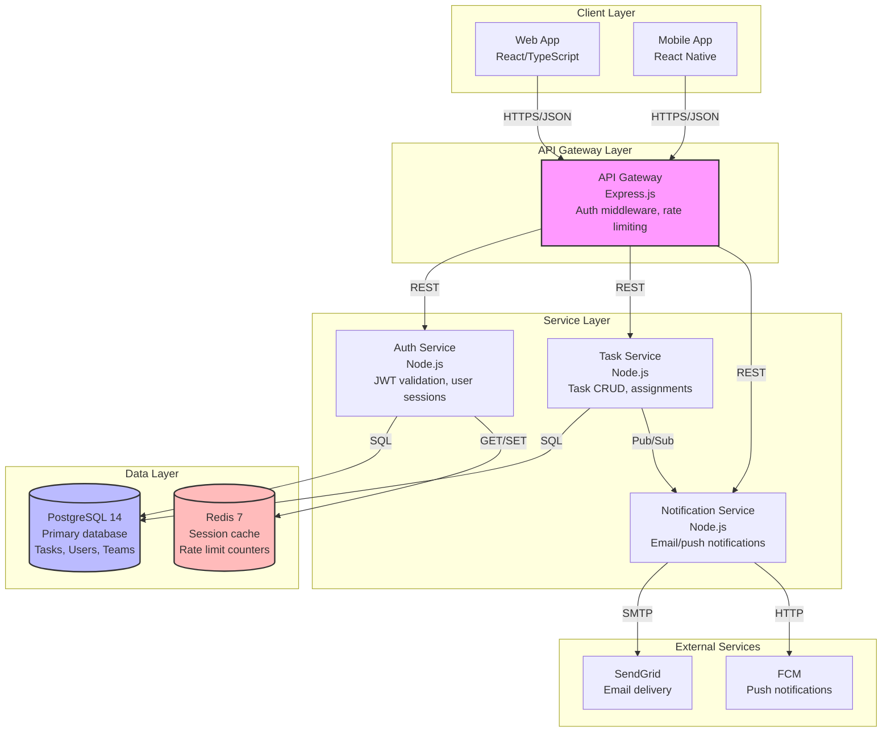

**What Makes It Great:**
- Complete tech stack specified (languages, versions)
- Interface protocols on every connection
- Component responsibilities clearly stated
- Color coding for emphasis (optional but helpful)
- Proper layering (Client → Gateway → Services → Data → External)

**Best Practices:**
- Use subgraphs to show architectural layers or modules
- Include technology stack (language, framework, version)
- Specify interfaces (REST, gRPC, SQL, Pub/Sub)
- Add component responsibilities (what each does)
- Show data flow direction clearly
- Limit to 8-12 components (split into multiple diagrams if needed)

---

## 3. Sequence Diagrams

**Purpose:** Show component interactions over time for specific workflows

### ❌ BAD Example - Missing details, no error handling

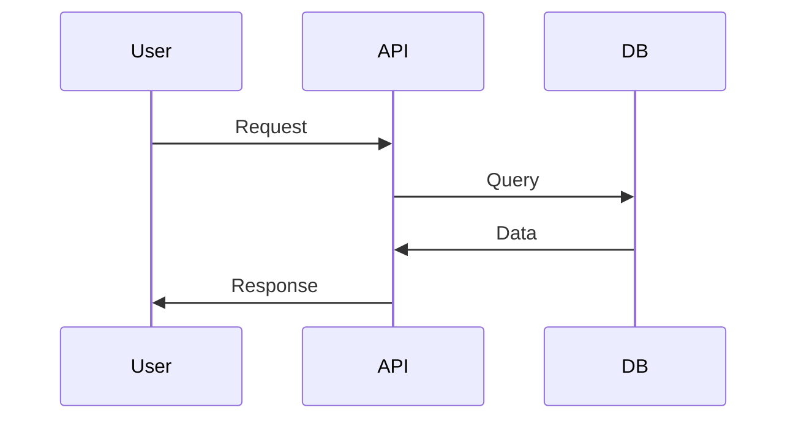

**Problems:**
- No specific operation details
- Missing error scenarios
- No timing information
- Generic labels

### ✅ GOOD Example - Specific operations with errors

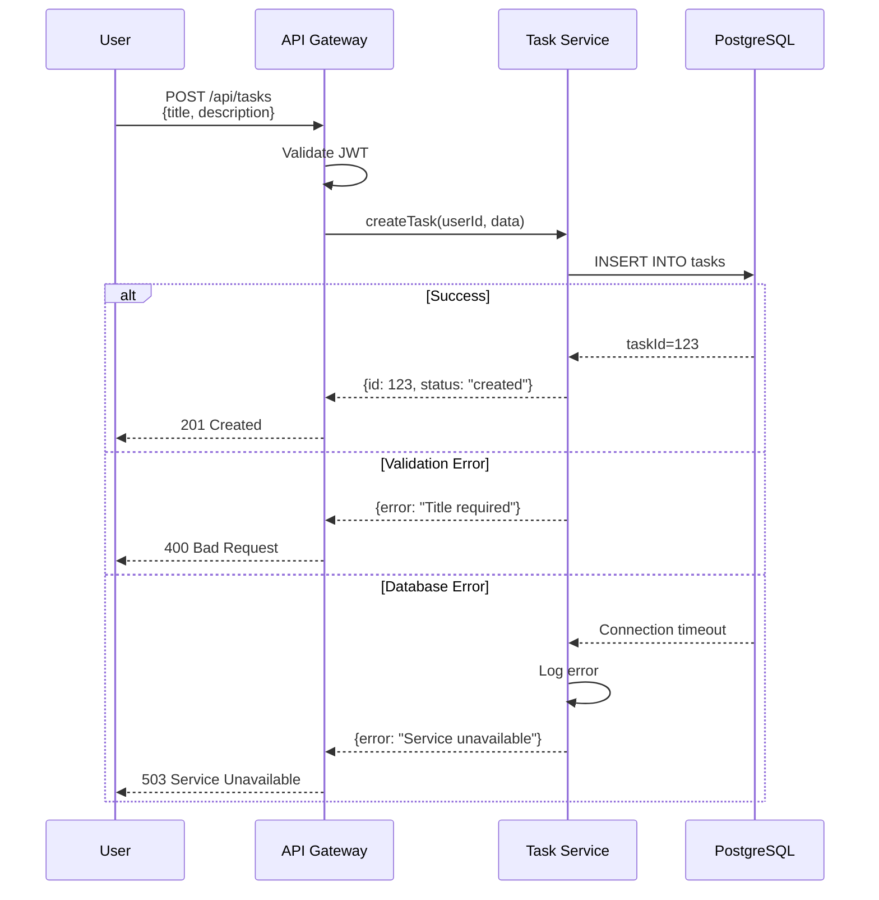

**Why Better:**
- Specific API endpoint and payload
- Error scenarios covered (validation, database)
- HTTP status codes included
- Clear participant labels

### ⭐ GREAT Example - Complete with timing and notes

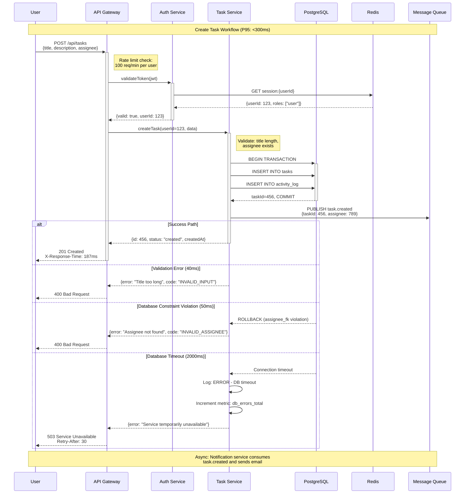

**What Makes It Great:**
- Performance target in title (P95: <300ms)
- Request/response payloads shown
- Multiple error scenarios with timing
- Notes explain business logic
- Async operations documented
- Metrics and logging mentioned
- HTTP headers included (X-Response-Time, Retry-After)
- Database transactions shown (BEGIN, COMMIT, ROLLBACK)

**Best Practices:**
- Use participant aliases (U, A, T) for brevity
- Show request/response payloads
- Include HTTP methods and status codes
- Add timing notes for performance targets
- Use alt/else for error scenarios (at least 2-3 error paths)
- Add notes for business logic or validation rules
- Show async operations (message queues, background jobs)
- Limit to 5-7 participants (split complex flows)

---

## 4. Entity-Relationship Diagrams

**Purpose:** Show data model, entities, and relationships

### ❌ BAD Example - Missing constraints and keys

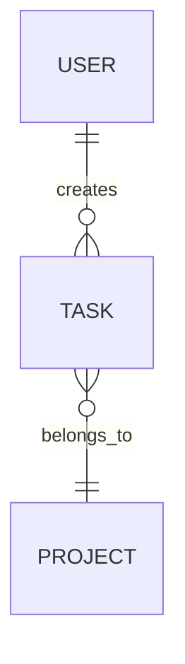

**Problems:**
- No attributes shown
- Missing data types
- No primary/foreign key indicators
- Unclear cardinality

### ✅ GOOD Example - Attributes and keys specified

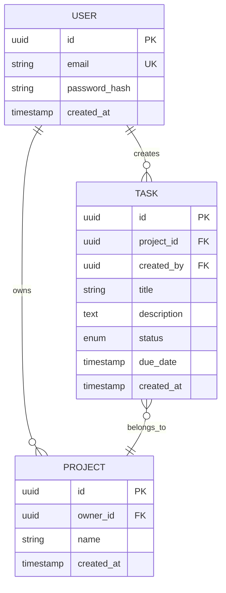

**Why Better:**
- Primary keys (PK) and foreign keys (FK) marked
- Data types specified
- Unique keys (UK) shown
- Timestamps included

### ⭐ GREAT Example - Complete with constraints and indexes

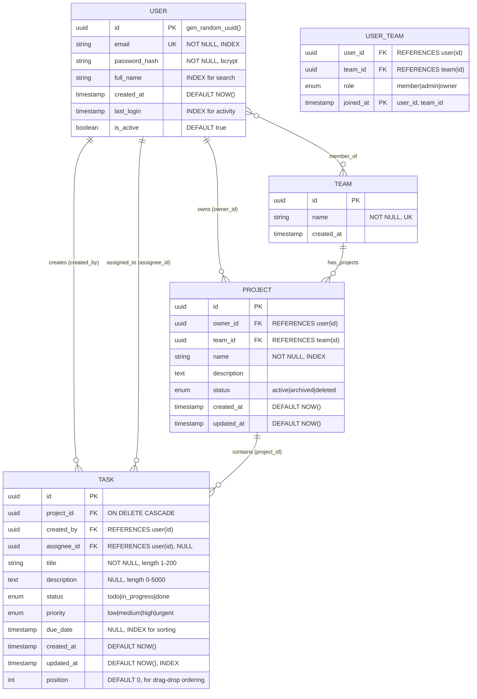

**What Makes It Great:**
- Default values specified (gen_random_uuid(), NOW())
- Constraints documented (NOT NULL, length limits)
- Indexes identified for performance
- ON DELETE behavior specified
- Join tables for many-to-many (USER_TEAM)
- Enum values listed (status, priority, role)
- Multiple FK relationships clarified in relationship labels
- Business logic hints (position for drag-drop)

**Best Practices:**
- Always mark PK (primary key) and FK (foreign key)
- Specify data types (uuid, string, text, enum, timestamp, int, boolean)
- Show unique constraints (UK)
- Add index hints for frequently queried fields
- Include default values and constraints (NOT NULL, length limits)
- Document enum values inline
- Show many-to-many via join tables
- Limit to 6-8 entities per diagram (split if needed)

---

## 5. Deployment Topology Diagrams

**Purpose:** Show infrastructure layout, tiers, and connections

### ❌ BAD Example - Flat, unclear tiers

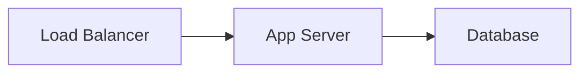

**Problems:**
- No environment context
- Missing instance counts
- No network boundaries
- Unclear what runs where

### ✅ GOOD Example - Tiered with instance counts

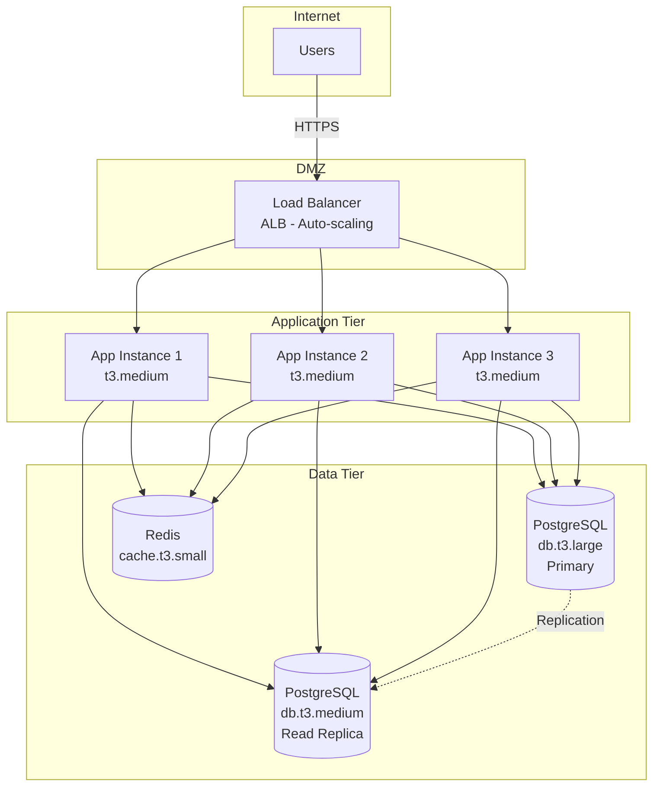

**Why Better:**
- Clear network tiers (DMZ, App, Data)
- Instance types specified (t3.medium, db.t3.large)
- Load balancing shown explicitly
- Replication relationships (dotted lines)

### ⭐ GREAT Example - Production-ready with monitoring

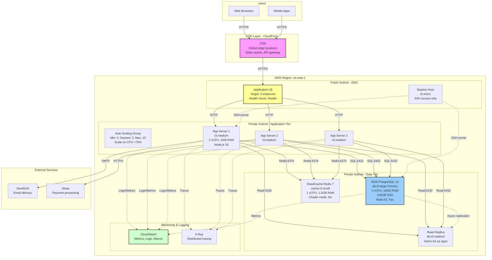

**What Makes It Great:**
- Complete AWS architecture with region specified
- Auto-scaling configuration shown (min/max, trigger)
- Network boundaries (Public/Private subnets)
- Instance specifications (vCPU, RAM, disk)
- Protocols and ports specified (SQL:5432, Redis:6379)
- Monitoring and logging integrated
- Health checks mentioned
- Multi-AZ configuration specified
- Bastion host for secure access
- External service integrations
- Color coding for visual emphasis

**Best Practices:**
- Use subgraphs for network boundaries (DMZ, private subnets)
- Specify cloud provider and region
- Include instance types and sizes
- Show auto-scaling configuration
- Add monitoring/logging systems
- Specify protocols and ports
- Mark replication (dotted lines)
- Include security components (bastion, NAT gateway)
- Limit to 15-20 nodes per diagram
- Use color coding sparingly for emphasis

---

## Quick Reference: When to Use Each Diagram

| Diagram Type | Use When | Key Info to Include |
|--------------|----------|---------------------|
| **System Context (C4)** | Showing external interactions | System boundary, external actors, protocols, data formats |
| **Component** | Showing internal architecture | Layers, tech stack, interfaces, responsibilities |
| **Sequence** | Showing workflow/interaction | Operations, payloads, errors, timing, async flows |
| **ER Diagram** | Showing data model | PKs, FKs, types, constraints, indexes, enums |
| **Deployment** | Showing infrastructure | Tiers, instance types, auto-scaling, monitoring, networks |

---

## Common Mermaid Pitfalls to Avoid

1. **Too Many Nodes** - Limit to 12-15 per diagram, split if needed
2. **Missing Labels** - Every connection should be labeled (protocol, relationship)
3. **Generic Names** - "Service", "API" → "Task Service", "REST API Gateway"
4. **No Error Paths** - Sequence diagrams need alt/else blocks
5. **Flat Hierarchies** - Use subgraphs to show layers/boundaries
6. **Missing Tech Stack** - Include language, framework, version
7. **Unclear Direction** - Arrows should show data/control flow clearly
8. **No Specifications** - Instance types, data types, ports should be specified

---

**Version:** 1.0 (REL-003)
**Last Updated:** 2025-10-27
**Usage:** Reference when generating diagrams in Phase 3 (REL-002) and Phase 6 (REL-003)
