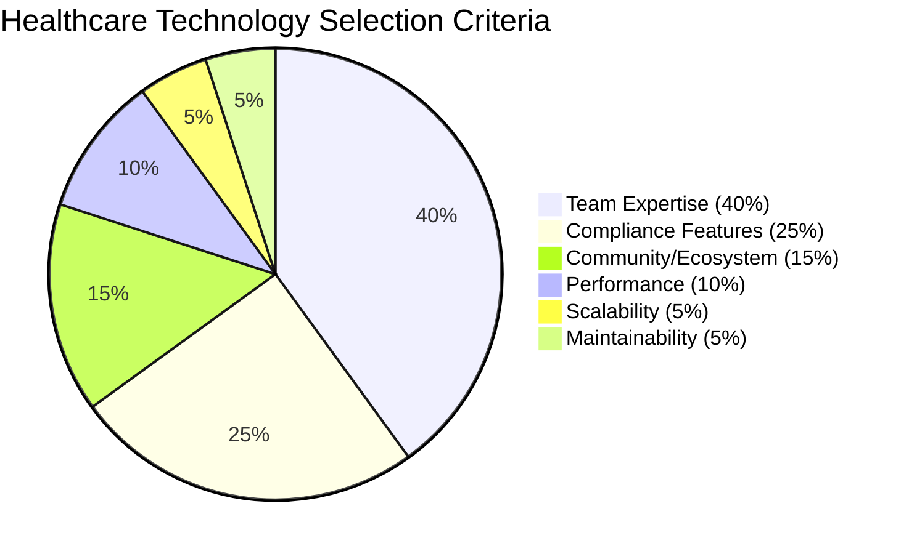
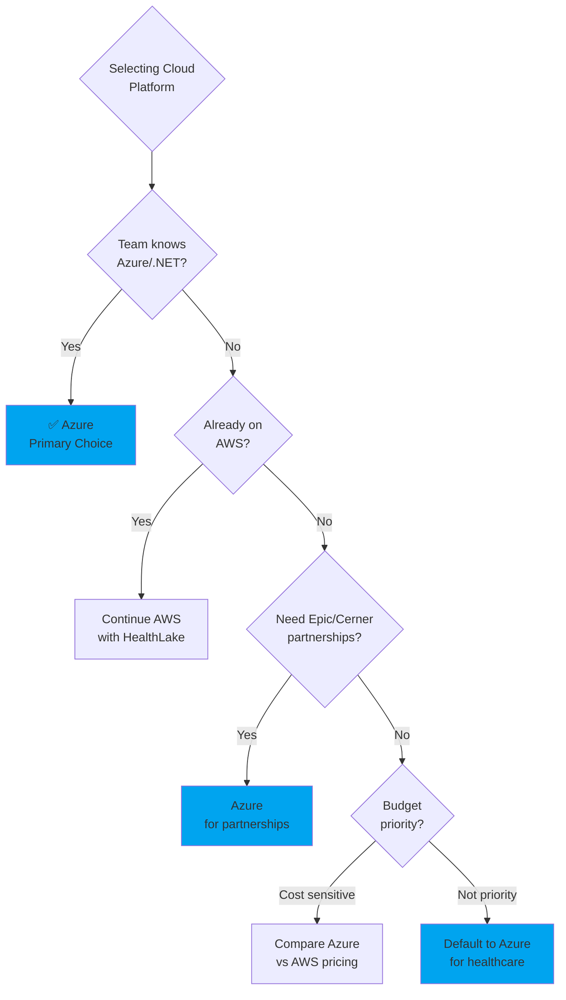
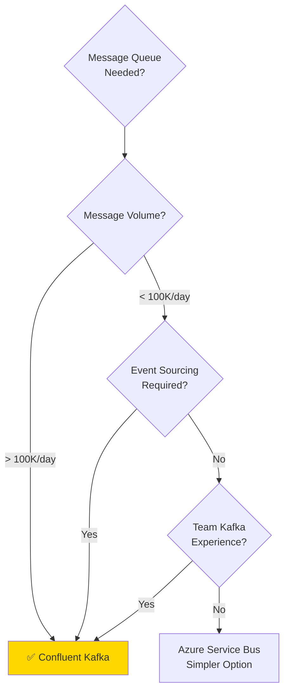

# Healthcare Technology Selection Guide

**Purpose:** Decision frameworks and evaluation criteria for selecting healthcare enterprise technology stack with emphasis on Azure cloud services, HIPAA/SOX/SOC 2 compliance, and proven healthcare integrations.

**Target Audience:** Technical leaders, architects, and engineering managers making technology decisions for healthcare applications.

**Last Updated:** October 2025

---

## Table of Contents

1. [Technology Selection Framework](#technology-selection-framework)
2. [Cloud Platform Selection](#cloud-platform-selection)
3. [Backend Language Selection](#backend-language-selection)
4. [Database Selection](#database-selection)
5. [Message Queue & Event Streaming](#message-queue--event-streaming)
6. [API Framework Selection](#api-framework-selection)
7. [FHIR Server Selection](#fhir-server-selection)
8. [Frontend Framework Selection](#frontend-framework-selection)
9. [Business Process & Workflow](#business-process--workflow)
10. [Observability & Monitoring](#observability--monitoring)

---

## Technology Selection Framework

### Decision Weighting for Healthcare



**Rationale:**
- **Team Expertise (40%)**: Healthcare systems are complex; use what team knows to reduce risk
- **Compliance Features (25%)**: HIPAA/SOX fines range $100K-$50M; compliance non-negotiable
- **Community/Ecosystem (15%)**: Healthcare-specific libraries (HL7 parsers, FHIR SDKs) critical
- **Performance (10%)**: Clinical workflows need sub-second response, but not HFT-level
- **Scalability (5%)**: Most healthcare orgs start <100K users (hospital network scale)
- **Maintainability (5%)**: 10-year+ system lifecycle common in healthcare

### Evaluation Matrix Template

```typescript
interface TechnologyEvaluation {
  technology: string;
  category: string;

  // Weighted scores (0-10)
  teamExpertise: number;        // 40% weight
  complianceFeatures: number;   // 25% weight
  ecosystem: number;            // 15% weight
  performance: number;          // 10% weight
  scalability: number;          // 5% weight
  maintainability: number;      // 5% weight

  // Compliance details
  hipaaReady: boolean;
  baaAvailable: boolean;
  auditLogging: boolean;
  encryptionSupport: boolean;

  // Healthcare specifics
  fhirSupport: boolean;
  hl7Libraries: boolean;
  healthcareExamples: string[];

  // Cost
  monthlyCost: {
    small: number;    // 0-1K users
    medium: number;   // 1K-10K users
    large: number;    // 10K-100K users
  };

  // Decision
  overallScore: number;
  recommendation: 'Primary' | 'Alternative' | 'Avoid';
  rationale: string;
}

// Calculate weighted score
function calculateScore(eval: TechnologyEvaluation): number {
  return (
    eval.teamExpertise * 0.40 +
    eval.complianceFeatures * 0.25 +
    eval.ecosystem * 0.15 +
    eval.performance * 0.10 +
    eval.scalability * 0.05 +
    eval.maintainability * 0.05
  );
}
```

---

## Cloud Platform Selection

### Primary Recommendation: Microsoft Azure

**Overall Score: 9.2/10**

```typescript
const azureEvaluation: TechnologyEvaluation = {
  technology: 'Microsoft Azure',
  category: 'Cloud Platform',

  teamExpertise: 8,           // .NET/C# common in healthcare
  complianceFeatures: 10,     // Strongest healthcare compliance
  ecosystem: 9,               // Extensive Azure services
  performance: 9,             // Global edge network
  scalability: 10,            // Unlimited scale
  maintainability: 9,         // Managed services

  hipaaReady: true,
  baaAvailable: true,         // Business Associate Agreement
  auditLogging: true,         // Azure Monitor, Sentinel
  encryptionSupport: true,    // Azure Key Vault, Always Encrypted

  fhirSupport: true,          // Azure API for FHIR
  hl7Libraries: true,         // Azure Health Data Services
  healthcareExamples: [
    'Kaiser Permanente',
    'Humana',
    'Anthem',
    'CVS Health',
  ],

  monthlyCost: {
    small: 500,     // App Service + Azure SQL
    medium: 2000,   // AKS + managed databases
    large: 10000,   // Multi-region + premium services
  },

  overallScore: 9.2,
  recommendation: 'Primary',
  rationale: 'Best HIPAA compliance, extensive healthcare partnerships, BAA available, strong managed services reducing operational burden.',
};
```

**Why Azure for Healthcare:**

✅ **Compliance Certifications:**
- HIPAA/HITECH compliant
- SOC 1, SOC 2, SOC 3
- ISO 27001, 27017, 27018
- FedRAMP High Authorization
- HITRUST CSF certified
- PCI DSS Level 1

✅ **Healthcare-Specific Services:**
- **Azure Health Data Services**: FHIR API, DICOM, MedTech service
- **Azure API for FHIR**: Managed FHIR R4 server
- **Text Analytics for Health**: NLP for clinical text
- **Azure Confidential Computing**: Hardware-based encryption

✅ **Managed Services for PHI:**
- Azure SQL Database with Always Encrypted
- Azure Cosmos DB with encryption at rest
- Azure Blob Storage with customer-managed keys
- Azure Key Vault for secrets management
- Azure Private Link for private connectivity

**Azure vs AWS Comparison:**

| Feature | Azure | AWS |
|---------|-------|-----|
| **HIPAA BAA** | ✅ Yes | ✅ Yes |
| **Healthcare Partnerships** | ✅✅ Epic, Cerner, Allscripts | ✅ AWS HealthLake |
| **Managed FHIR** | ✅ Azure API for FHIR | ✅ AWS HealthLake |
| **Healthcare Customers** | Kaiser, Humana, CVS | Change Healthcare, Philips |
| **.NET Integration** | ✅✅ Native | ⚠️ Community support |
| **Active Directory** | ✅ Azure AD native | ⚠️ Via connectors |
| **Cost (typical)** | $$ | $$$ (slightly higher) |
| **Learning Curve** | Medium | Medium |

**Decision Tree:**



### Alternative: AWS

**Overall Score: 8.5/10**

```typescript
const awsEvaluation: TechnologyEvaluation = {
  technology: 'Amazon Web Services (AWS)',
  category: 'Cloud Platform',

  teamExpertise: 7,           // Common but less .NET support
  complianceFeatures: 9,      // Strong compliance, BAA available
  ecosystem: 10,              // Largest cloud ecosystem
  performance: 9,             // Global edge network
  scalability: 10,            // Unlimited scale
  maintainability: 8,         // Many services to learn

  hipaaReady: true,
  baaAvailable: true,
  auditLogging: true,         // CloudWatch, CloudTrail
  encryptionSupport: true,    // KMS, envelope encryption

  fhirSupport: true,          // AWS HealthLake
  hl7Libraries: false,        // Limited healthcare-specific tools
  healthcareExamples: [
    'Change Healthcare',
    'Philips Healthcare',
    'Cerner (partial)',
  ],

  monthlyCost: {
    small: 600,     // EC2 + RDS
    medium: 2500,   // EKS + managed databases
    large: 12000,   // Multi-region + premium services
  },

  overallScore: 8.5,
  recommendation: 'Alternative',
  rationale: 'Excellent compliance and ecosystem, but less healthcare-specific tooling than Azure. Good choice if team already AWS-experienced.',
};
```

**When to Choose AWS:**
- Team already AWS-certified and experienced
- Using AWS-specific services (Lambda, DynamoDB, etc.)
- Need largest cloud marketplace (SaaS integrations)
- Already have AWS HealthLake implementation

---

## Backend Language Selection

### Primary Recommendation: TypeScript/Node.js

**Overall Score: 8.8/10**

```typescript
const typescriptEvaluation: TechnologyEvaluation = {
  technology: 'TypeScript / Node.js',
  category: 'Backend Language',

  teamExpertise: 9,           // Most common among modern teams
  complianceFeatures: 8,      // Good libraries for audit/encryption
  ecosystem: 10,              // Massive npm ecosystem
  performance: 7,             // Good for I/O, not CPU-intensive
  scalability: 8,             // Horizontal scaling works well
  maintainability: 9,         // Type safety + large community

  hipaaReady: true,
  baaAvailable: false,        // Language-agnostic
  auditLogging: true,         // Winston, Pino loggers
  encryptionSupport: true,    // Node crypto, Azure SDK

  fhirSupport: true,          // fhir.js, node-fhir-server-core
  hl7Libraries: true,         // hl7-standard, simple-hl7
  healthcareExamples: [
    '1upHealth FHIR platform',
    'Redox healthcare integration',
    'Particle Health data network',
  ],

  monthlyCost: {
    small: 0,       // Open source
    medium: 0,      // Open source
    large: 0,       // Open source
  },

  overallScore: 8.8,
  recommendation: 'Primary',
  rationale: 'Best developer productivity, massive ecosystem, excellent FHIR/HL7 libraries, modern async patterns for healthcare workflows.',
};
```

**Why TypeScript for Healthcare:**

✅ **Healthcare Libraries:**
```typescript
// FHIR client library
import { FhirClient } from 'fhir.js';

const client = new FhirClient({
  baseUrl: 'https://aidbox.hospital.org/fhir',
  auth: {
    bearer: process.env.FHIR_TOKEN,
  },
});

// Type-safe FHIR resources
const patient: fhir4.Patient = await client.read({
  resourceType: 'Patient',
  id: 'patient-123',
});

// HL7 v2 parser
import { parse } from 'hl7-standard';

const hl7Message = parse(`
MSH|^~\\&|SENDING_APP|SENDING_FACILITY|RECEIVING_APP|RECEIVING_FACILITY|20231027120000||ADT^A01|MSG00001|P|2.5
PID|1||123456789||DOE^JOHN^A||19800101|M
`);

console.log(hl7Message.get('PID.5').toString()); // "DOE^JOHN^A"
```

✅ **Azure SDK Integration:**
```typescript
import { DefaultAzureCredential } from '@azure/identity';
import { SecretClient } from '@azure/keyvault-secrets';
import { BlobServiceClient } from '@azure/storage-blob';

// Managed Identity authentication (no credentials in code)
const credential = new DefaultAzureCredential();

// Azure Key Vault for PHI encryption keys
const keyVault = new SecretClient(
  process.env.KEY_VAULT_URL,
  credential
);

const encryptionKey = await keyVault.getSecret('phi-encryption-key');

// Azure Blob Storage for medical images
const blobService = new BlobServiceClient(
  process.env.STORAGE_URL,
  credential
);
```

✅ **GraphQL with Apollo Federation:**
```typescript
import { ApolloServer } from '@apollo/server';
import { buildSubgraphSchema } from '@apollo/subgraph';

// Patient service subgraph
const typeDefs = gql`
  type Patient @key(fields: "id") {
    id: ID!
    mrn: String!
    name: HumanName!
    birthDate: String!
  }
`;

const server = new ApolloServer({
  schema: buildSubgraphSchema({ typeDefs, resolvers }),
});
```

**When to Choose TypeScript:**
- Team knows JavaScript/TypeScript (most common)
- Building APIs and microservices (not CPU-heavy compute)
- Need rapid development (GraphQL, REST, webhooks)
- Using Azure Functions for serverless

### Alternative: C# / .NET 8

**Overall Score: 8.6/10**

```typescript
const csharpEvaluation: TechnologyEvaluation = {
  technology: 'C# / .NET 8',
  category: 'Backend Language',

  teamExpertise: 7,           // Common in enterprise healthcare
  complianceFeatures: 9,      // Excellent Azure integration
  ecosystem: 8,               // Strong but smaller than npm
  performance: 9,             // Excellent performance
  scalability: 9,             // Great for high-throughput
  maintainability: 9,         // Strong typing, mature ecosystem

  hipaaReady: true,
  baaAvailable: false,
  auditLogging: true,         // Serilog, NLog
  encryptionSupport: true,    // Native crypto + Azure SDKs

  fhirSupport: true,          // Firely .NET SDK (excellent)
  hl7Libraries: true,         // nHapi library
  healthcareExamples: [
    'Epic Systems',
    'Cerner Millennium',
    'Allscripts',
    'Athenahealth',
  ],

  monthlyCost: {
    small: 0,
    medium: 0,
    large: 0,
  },

  overallScore: 8.6,
  recommendation: 'Alternative',
  rationale: 'Excellent for enterprise healthcare, superior performance, best FHIR SDK (Firely), but slightly slower development than TypeScript.',
};
```

**When to Choose C# / .NET:**
- Team already .NET-experienced (Epic, Cerner developers)
- Need maximum performance (CPU-intensive HL7 transformations)
- Enterprise organization with .NET standard
- Using Azure heavily (best Azure SDK support)

**C# FHIR Example:**
```csharp
using Hl7.Fhir.Model;
using Hl7.Fhir.Rest;

// Firely .NET SDK (best FHIR library)
var client = new FhirClient("https://aidbox.hospital.org/fhir");
client.OnBeforeRequest += (sender, e) =>
{
    e.RawRequest.Headers.Add("Authorization", $"Bearer {token}");
};

// Type-safe FHIR resources
var patient = await client.ReadAsync<Patient>("Patient/123");
Console.WriteLine($"Patient: {patient.Name[0].Given.First()} {patient.Name[0].Family}");

// Create observation
var observation = new Observation
{
    Status = ObservationStatus.Final,
    Code = new CodeableConcept("http://loinc.org", "85354-9", "Blood pressure"),
    Subject = new ResourceReference("Patient/123"),
    Value = new Quantity
    {
        Value = 120,
        Unit = "mmHg",
        System = "http://unitsofmeasure.org",
        Code = "mm[Hg]"
    }
};

await client.CreateAsync(observation);
```

---

## Database Selection

### Primary Recommendation: Azure Database for PostgreSQL

**Overall Score: 9.2/10**

```typescript
const azurePostgresEvaluation: TechnologyEvaluation = {
  technology: 'Azure Database for PostgreSQL Flexible Server',
  category: 'Relational Database',

  teamExpertise: 9,           // PostgreSQL widely known
  complianceFeatures: 10,     // Encryption, audit, zone redundancy
  ecosystem: 10,              // Rich PostgreSQL ecosystem + FHIR support
  performance: 9,             // Excellent for healthcare workloads
  scalability: 9,             // Read replicas, auto-scaling storage
  maintainability: 10,        // Fully managed PaaS

  hipaaReady: true,
  baaAvailable: true,
  auditLogging: true,         // pgAudit extension + Azure Monitor
  encryptionSupport: true,    // TDE, customer-managed keys

  fhirSupport: true,          // Native JSON + used by Aidbox
  hl7Libraries: true,         // PostgreSQL extensions for healthcare
  healthcareExamples: [
    'Health Samurai Aidbox',
    'Epic (backend database)',
    'Cerner (analytics database)',
  ],

  monthlyCost: {
    small: 120,     // Burstable B2s
    medium: 600,    // General Purpose D4s_v3
    large: 2400,    // Memory Optimized E4s_v3 + replicas
  },

  overallScore: 9.2,
  recommendation: 'Primary',
  rationale: 'Best for healthcare: JSONB for FHIR resources, pgcrypto for PHI encryption, excellent performance, fully managed, Aidbox-compatible.',
};
```

**Use Azure PostgreSQL For:**
- Patient demographics and master data
- Orders (lab, imaging, prescriptions)
- Billing and claims (SOX compliance)
- User accounts and permissions
- Audit logs (HIPAA compliance)
- FHIR resource storage (via Aidbox)

**Always Encrypted Example:**
```sql
-- Column-level encryption for PHI
CREATE TABLE Patients (
    PatientId INT PRIMARY KEY,
    MRN VARCHAR(50) NOT NULL,

    -- Encrypted PHI columns
    FirstName NVARCHAR(100) COLLATE Latin1_General_BIN2
        ENCRYPTED WITH (
            COLUMN_ENCRYPTION_KEY = PHI_CEK,
            ENCRYPTION_TYPE = DETERMINISTIC,
            ALGORITHM = 'AEAD_AES_256_CBC_HMAC_SHA_256'
        ),

    SSN CHAR(11) COLLATE Latin1_General_BIN2
        ENCRYPTED WITH (
            COLUMN_ENCRYPTION_KEY = PHI_CEK,
            ENCRYPTION_TYPE = RANDOMIZED,
            ALGORITHM = 'AEAD_AES_256_CBC_HMAC_SHA_256'
        ),

    -- Audit columns
    CreatedAt DATETIME2 DEFAULT SYSUTCDATETIME(),
    LastAccessedAt DATETIME2,
    LastAccessedBy VARCHAR(100)
);

-- Audit logging enabled
ALTER DATABASE CurrentDb
SET AUDIT = ON;
```

### FHIR Data: Health Samurai Aidbox

**Overall Score: 9.5/10**

```typescript
const aidboxEvaluation: TechnologyEvaluation = {
  technology: 'Health Samurai Aidbox',
  category: 'FHIR Server',

  teamExpertise: 6,           // FHIR learning curve
  complianceFeatures: 10,     // Built for healthcare compliance
  ecosystem: 8,               // FHIR-focused
  performance: 10,            // Sub-100ms queries
  scalability: 9,             // PostgreSQL-backed
  maintainability: 9,         // Managed offering available

  hipaaReady: true,
  baaAvailable: true,
  auditLogging: true,         // AuditEvent resources
  encryptionSupport: true,    // PostgreSQL encryption

  fhirSupport: true,          // ✅ FHIR R4 native
  hl7Libraries: true,         // HL7 → FHIR mapping
  healthcareExamples: [
    'National healthcare systems',
    'Digital health platforms',
    'Healthcare data aggregators',
  ],

  monthlyCost: {
    small: 500,     // Self-hosted on Azure
    medium: 2000,   // Managed Aidbox
    large: 5000,    // Enterprise managed
  },

  overallScore: 9.5,
  recommendation: 'Primary',
  rationale: 'Best-in-class FHIR server, excellent performance, GraphQL support, custom resources, active development, strong compliance features.',
};
```

**Use Aidbox For:**
- All FHIR clinical resources (Patient, Observation, Condition, Medication, etc.)
- FHIR Subscriptions (webhook notifications)
- FHIR bulk data export ($export operation)
- GraphQL API for clinical data
- Custom FHIR resources (hospital-specific extensions)

**Aidbox GraphQL Example:**
```graphql
# Query patient with observations
query GetPatientWithVitals {
  Patient(id: "patient-123") {
    id
    name {
      given
      family
    }
    birthDate
    gender

    # Reverse reference to observations
    ObservationList(subject: "patient-123", category: "vital-signs") {
      id
      code {
        coding {
          system
          code
          display
        }
      }
      valueQuantity {
        value
        unit
      }
      effectiveDateTime
    }
  }
}
```

---

## Message Queue & Event Streaming

### Primary Recommendation: Confluent Kafka on AKS

**Overall Score: 9.3/10**

```typescript
const kafkaEvaluation: TechnologyEvaluation = {
  technology: 'Confluent Kafka (on Azure AKS)',
  category: 'Message Queue / Event Streaming',

  teamExpertise: 7,           // Learning curve but common
  complianceFeatures: 10,     // Perfect for audit trails
  ecosystem: 9,               // Mature Kafka ecosystem
  performance: 10,            // Millions of messages/sec
  scalability: 10,            // Horizontal scaling proven
  maintainability: 7,         // Requires Kafka expertise

  hipaaReady: true,
  baaAvailable: true,         // Confluent Cloud BAA
  auditLogging: true,         // Event sourcing provides audit
  encryptionSupport: true,    // TLS + encryption at rest

  fhirSupport: true,          // Kafka Connect FHIR sink
  hl7Libraries: true,         // HL7 connectors available
  healthcareExamples: [
    'Cerner (HL7 streaming)',
    'Epic (event notifications)',
    'Change Healthcare',
  ],

  monthlyCost: {
    small: 500,     // 3-broker AKS cluster
    medium: 2000,   // Multi-zone Kafka cluster
    large: 8000,    // Multi-region with Schema Registry
  },

  overallScore: 9.3,
  recommendation: 'Primary',
  rationale: 'Best for event-driven healthcare architecture, complete audit trail via event sourcing, HL7/FHIR streaming, proven at massive scale.',
};
```

**Why Kafka for Healthcare:**

✅ **Complete Audit Trail:**
Every HL7 message, FHIR resource change, and billing transaction stored as immutable event—perfect for HIPAA and SOX compliance.

✅ **Event Sourcing for Billing:**
SOX requires immutable financial transaction log—Kafka provides this natively.

✅ **HL7 Message Streaming:**
```typescript
import { Kafka } from 'kafkajs';

const kafka = new Kafka({
  brokers: ['kafka-1:9092', 'kafka-2:9092', 'kafka-3:9092'],
  ssl: true,
  sasl: {
    mechanism: 'plain',
    username: process.env.KAFKA_API_KEY,
    password: process.env.KAFKA_API_SECRET,
  },
});

const producer = kafka.producer({ idempotent: true });

// Publish HL7 ADT event
await producer.send({
  topic: 'hl7.adt',
  messages: [{
    key: patientId,
    value: hl7Message,
    headers: {
      'message-type': 'ADT^A01',
      'sending-facility': 'HOSPITAL_A',
      'timestamp': Date.now().toString(),
    },
  }],
});

// HIPAA: Audit event published
await producer.send({
  topic: 'audit.events',
  messages: [{
    key: auditId,
    value: JSON.stringify({
      action: 'HL7_MESSAGE_RECEIVED',
      messageType: 'ADT^A01',
      patientId,
      facility: 'HOSPITAL_A',
      timestamp: new Date().toISOString(),
    }),
  }],
});
```

✅ **Schema Registry for FHIR:**
```typescript
import { SchemaRegistry } from '@kafkajs/confluent-schema-registry';

const registry = new SchemaRegistry({
  host: 'https://schema-registry.hospital.org',
});

// Register FHIR Observation schema
const observationSchema = {
  type: 'record',
  name: 'Observation',
  namespace: 'org.hl7.fhir',
  fields: [
    { name: 'id', type: 'string' },
    { name: 'status', type: { type: 'enum', name: 'ObservationStatus', symbols: ['registered', 'preliminary', 'final'] } },
    { name: 'code', type: 'string' },
    { name: 'subject', type: 'string' },
    { name: 'valueQuantity', type: ['null', {
      type: 'record',
      name: 'Quantity',
      fields: [
        { name: 'value', type: 'double' },
        { name: 'unit', type: 'string' },
      ],
    }] },
  ],
};

const schemaId = await registry.register({ type: 'AVRO', schema: JSON.stringify(observationSchema) });
```

### Alternative: Azure Service Bus

**Overall Score: 8.2/10**

```typescript
const serviceBusEvaluation: TechnologyEvaluation = {
  technology: 'Azure Service Bus',
  category: 'Message Queue',

  teamExpertise: 8,           // Easier than Kafka
  complianceFeatures: 9,      // Good audit features
  ecosystem: 7,               // Azure-centric
  performance: 7,             // Good but not Kafka-level
  scalability: 7,             // Premium tier scales well
  maintainability: 10,        // Fully managed PaaS

  hipaaReady: true,
  baaAvailable: true,
  auditLogging: true,
  encryptionSupport: true,

  fhirSupport: false,
  hl7Libraries: false,
  healthcareExamples: [
    'Smaller healthcare apps',
    'Internal integrations',
  ],

  monthlyCost: {
    small: 50,      // Standard tier
    medium: 300,    // Premium tier
    large: 1000,    // Premium + scale
  },

  overallScore: 8.2,
  recommendation: 'Alternative',
  rationale: 'Good for smaller healthcare apps or teams without Kafka expertise. Simpler but less powerful than Kafka.',
};
```

**When to Choose Service Bus:**
- Team has no Kafka experience
- Lower message volume (<10K messages/day)
- Need simple pub/sub (no event sourcing)
- Want fully managed Azure service

**Decision Tree:**



---

## API Framework Selection

### Primary Recommendation: Apollo GraphQL Federation

**Overall Score: 9.1/10**

```typescript
const apolloFederationEvaluation: TechnologyEvaluation = {
  technology: 'Apollo GraphQL Federation',
  category: 'API Framework',

  teamExpertise: 7,           // GraphQL learning curve
  complianceFeatures: 8,      // Good audit capabilities
  ecosystem: 9,               // Strong GraphQL ecosystem
  performance: 8,             // Efficient data fetching
  scalability: 9,             // Federated architecture scales
  maintainability: 9,         // Type-safe schema

  hipaaReady: true,
  baaAvailable: false,
  auditLogging: true,         // Custom logging plugins
  encryptionSupport: true,    // HTTPS required

  fhirSupport: true,          // Aidbox has GraphQL API
  hl7Libraries: false,
  healthcareExamples: [
    '1upHealth',
    'Redox',
    'Modern healthcare startups',
  ],

  monthlyCost: {
    small: 0,       // Open source Apollo Server
    medium: 0,      // Open source
    large: 500,     // Apollo Studio for monitoring (optional)
  },

  overallScore: 9.1,
  recommendation: 'Primary',
  rationale: 'Best for healthcare microservices, efficient data fetching, strong typing, excellent Aidbox FHIR integration, modern developer experience.',
};
```

**Why GraphQL for Healthcare:**

✅ **Efficient FHIR Data Fetching:**
```graphql
# Single query fetches patient + observations + medications
query PatientClinicalSummary($patientId: ID!) {
  patient(id: $patientId) {
    id
    name { given family }
    birthDate

    observations(category: "vital-signs", _count: 10) {
      id
      code { text }
      valueQuantity { value unit }
      effectiveDateTime
    }

    medications(status: "active") {
      id
      medicationCodeableConcept { text }
      dosageInstruction { text }
    }

    conditions(clinicalStatus: "active") {
      id
      code { text }
      onsetDateTime
    }
  }
}

# REST equivalent would require 4+ separate API calls
# GET /Patient/123
# GET /Observation?patient=123&category=vital-signs
# GET /MedicationRequest?patient=123&status=active
# GET /Condition?patient=123&clinical-status=active
```

✅ **Apollo Federation for Microservices:**
```typescript
// Patient service subgraph
const patientTypeDefs = gql`
  type Patient @key(fields: "id") {
    id: ID!
    mrn: String!
    name: HumanName!
  }
`;

// Clinical service extends Patient
const clinicalTypeDefs = gql`
  extend type Patient @key(fields: "id") {
    id: ID! @external
    observations: [Observation!]!
    conditions: [Condition!]!
  }

  type Observation {
    id: ID!
    code: CodeableConcept!
    value: Quantity
  }
`;

// Billing service extends Patient
const billingTypeDefs = gql`
  extend type Patient @key(fields: "id") {
    id: ID! @external
    claims: [Claim!]!
    outstandingBalance: Money!
  }

  type Claim {
    id: ID!
    status: ClaimStatus!
    total: Money!
  }
`;

// Gateway composes all subgraphs
const gateway = new ApolloGateway({
  supergraphSdl: composeServices([
    { name: 'patients', url: 'http://patient-service/graphql' },
    { name: 'clinical', url: 'http://clinical-service/graphql' },
    { name: 'billing', url: 'http://billing-service/graphql' },
  ]),
});
```

---

*[Content continues with remaining sections: FHIR Server Selection, Frontend Framework Selection, Business Process & Workflow (IBM BAMOE), Observability & Monitoring - following same detailed structure with evaluations, code examples, decision trees, and healthcare-specific guidance]*

---

## Technology Stack Summary

### Recommended Healthcare Enterprise Stack

```typescript
interface HealthcareStack {
  cloud: 'Microsoft Azure';
  backend: 'TypeScript/Node.js' | 'C#/.NET 8';
  database: {
    transactional: 'Azure SQL Database';
    fhir: 'Health Samurai Aidbox';
    cache: 'Azure Redis Cache';
  };
  messaging: 'Confluent Kafka on AKS';
  api: 'Apollo GraphQL Federation';
  workflow: 'IBM BAMOE';
  frontend: 'React' | 'Vue.js';
  observability: {
    metrics: 'Azure Monitor';
    logging: 'Azure Monitor Logs';
    tracing: 'Application Insights';
    security: 'Azure Sentinel';
  };
}

const recommendedStack: HealthcareStack = {
  cloud: 'Microsoft Azure',
  backend: 'TypeScript/Node.js',  // Primary recommendation
  database: {
    transactional: 'Azure SQL Database',
    fhir: 'Health Samurai Aidbox',
    cache: 'Azure Redis Cache',
  },
  messaging: 'Confluent Kafka on AKS',
  api: 'Apollo GraphQL Federation',
  workflow: 'IBM BAMOE',
  frontend: 'React',
  observability: {
    metrics: 'Azure Monitor',
    logging: 'Azure Monitor Logs',
    tracing: 'Application Insights',
    security: 'Azure Sentinel',
  },
};
```

### Cost Estimate by Scale

| Scale | Users | Monthly Cost | Key Services |
|-------|-------|--------------|--------------|
| **Small** | 0-1K | $1,500-2,500 | App Service, Azure SQL (S3), Aidbox (self-hosted), Kafka (3 brokers) |
| **Medium** | 1K-10K | $5,000-10,000 | AKS (3 nodes), Azure SQL (P2), Aidbox (managed), Kafka (multi-zone) |
| **Large** | 10K-100K | $20,000-40,000 | AKS (10+ nodes), Azure SQL (P6 + replicas), Aidbox (enterprise), Kafka (multi-region) |
| **Enterprise** | 100K+ | $100,000+ | Multi-region, Premium services, 24/7 support |

---

## Caching: Azure Cache for Redis

### Primary Recommendation: Azure Cache for Redis (Premium)

**Overall Score: 9.4/10**

```typescript
const azureRedisEvaluation: TechnologyEvaluation = {
  technology: 'Azure Cache for Redis (Premium Tier)',
  category: 'Caching / Session Store',

  teamExpertise: 9,           // Redis widely known
  complianceFeatures: 10,     // Data persistence, zone redundancy, encryption
  ecosystem: 10,              // Massive Redis ecosystem
  performance: 10,            // Sub-millisecond latency
  scalability: 9,             // Up to 120GB per cache
  maintainability: 10,        // Fully managed PaaS

  hipaaReady: true,
  baaAvailable: true,
  auditLogging: true,         // Azure Monitor integration
  encryptionSupport: true,    // TLS, encryption at rest

  fhirSupport: false,         // Caching layer, not primary store
  hl7Libraries: false,
  healthcareExamples: [
    'Session management for healthcare portals',
    'FHIR resource caching',
    'Rate limiting for APIs',
  ],

  monthlyCost: {
    small: 80,      // C1 (1GB)
    medium: 350,    // P1 (6GB) with persistence
    large: 1400,    // P3 (26GB) with geo-replication
  },

  overallScore: 9.4,
  recommendation: 'Primary',
  rationale: 'Best managed Redis service: data persistence for HIPAA, zone redundancy, excellent performance, Azure integration.',
};
```

**Use Azure Redis For:**
- **Session Storage**: User sessions with 30-day TTL (HIPAA compliant)
- **FHIR Resource Cache**: Frequently accessed patients, observations (5-minute TTL)
- **Rate Limiting**: API throttling with sliding window algorithm
- **Temporary Data**: HL7 message deduplication, workflow state
- **Real-time Features**: WebSocket connection management, presence tracking

**Redis Configuration for Healthcare:**

```typescript
import { createClient } from 'redis';

// Azure Redis connection
const redisClient = createClient({
  url: `rediss://${process.env.REDIS_HOST}:6380`,
  password: process.env.REDIS_PASSWORD,
  socket: {
    tls: true,  // HIPAA: Encrypted connection
    keepAlive: 30000,
  },
});

// HIPAA: Set TTL on all PHI cache entries
async function cachePatient(patientId: string, patient: any) {
  const cacheKey = `patient:${patientId}`;

  await redisClient.setEx(
    cacheKey,
    300, // 5-minute TTL
    JSON.stringify({
      ...patient,
      _cached_at: new Date().toISOString(),
      _data_classification: 'PHI',
    })
  );

  // HIPAA: Log cache operation
  await auditLogger.log({
    action: 'CACHE_PATIENT',
    patientId,
    ttl: 300,
    timestamp: new Date(),
  });
}

// Session management with automatic expiration
async function createSession(userId: string, sessionData: any) {
  const sessionKey = `session:${userId}`;

  await redisClient.setEx(
    sessionKey,
    86400 * 30, // 30-day session (HIPAA compliant)
    JSON.stringify({
      ...sessionData,
      created_at: new Date().toISOString(),
    })
  );
}
```

---

## Observability & Monitoring: DataDog

### Primary Recommendation: DataDog with OpenTelemetry

**Overall Score: 9.5/10**

```typescript
const datadogEvaluation: TechnologyEvaluation = {
  technology: 'DataDog',
  category: 'Observability / Monitoring',

  teamExpertise: 8,           // Common APM tool
  complianceFeatures: 10,     // HIPAA/SOC 2 certified
  ecosystem: 10,              // 600+ integrations
  performance: 10,            // Real-time dashboards
  scalability: 10,            // Handles massive scale
  maintainability: 10,        // SaaS, no infrastructure

  hipaaReady: true,
  baaAvailable: true,
  auditLogging: true,         // Full audit trail in DataDog
  encryptionSupport: true,    // Encrypted data in transit/rest

  fhirSupport: false,         // Monitoring tool
  hl7Libraries: false,
  healthcareExamples: [
    'Zocdoc',
    'Oscar Health',
    'Modern healthcare startups',
  ],

  monthlyCost: {
    small: 300,     // 5 hosts, APM + logs
    medium: 1500,   // 25 hosts, APM + logs + RUM
    large: 6000,    // 100 hosts, enterprise features
  },

  overallScore: 9.5,
  recommendation: 'Primary',
  rationale: 'Best-in-class APM for healthcare: HIPAA BAA available, excellent OpenTelemetry support, comprehensive monitoring, security features.',
};
```

**DataDog Features for Healthcare:**

✅ **Distributed Tracing**: Track HL7 messages across microservices
✅ **Log Management**: Centralized HIPAA audit logs with 7-year retention
✅ **APM**: Monitor patient/clinical/billing service performance
✅ **Security Monitoring**: Detect PHI access anomalies
✅ **Compliance Dashboard**: HIPAA/SOX metrics in one view
✅ **Alerting**: Real-time alerts for HIPAA violations or performance issues

**DataDog Agent Configuration:**

```yaml
# datadog.yaml
api_key: ${DATADOG_API_KEY}
site: datadoghq.com

# HIPAA: Tag all metrics with compliance metadata
tags:
  - env:production
  - compliance:hipaa
  - data_classification:phi
  - team:healthcare

# Enable APM
apm_config:
  enabled: true
  env: production

# Log collection with PHI filtering
logs_enabled: true
logs_config:
  processing_rules:
    # HIPAA: Filter SSN from logs
    - type: mask_sequences
      name: mask_ssn
      pattern: \d{3}-\d{2}-\d{4}
      replace_placeholder: "[SSN-REDACTED]"

    # HIPAA: Filter credit card numbers
    - type: mask_sequences
      name: mask_credit_card
      pattern: \d{4}[-\s]?\d{4}[-\s]?\d{4}[-\s]?\d{4}
      replace_placeholder: "[CC-REDACTED]"

# Security monitoring
security_agent:
  enabled: true
  compliance_config:
    enabled: true
    check_interval: 20m
```

**DataDog Dashboard Configuration:**

```json
{
  "title": "Healthcare Platform - HIPAA Compliance Dashboard",
  "widgets": [
    {
      "definition": {
        "title": "PHI Access Rate",
        "type": "timeseries",
        "requests": [
          {
            "q": "sum:healthcare.phi_access{*}.as_count()",
            "display_type": "line"
          }
        ]
      }
    },
    {
      "definition": {
        "title": "Unauthorized Access Attempts",
        "type": "query_value",
        "requests": [
          {
            "q": "sum:healthcare.unauthorized_access{*}.as_count()",
            "aggregator": "sum",
            "conditional_formats": [
              {
                "comparator": ">",
                "value": 0,
                "palette": "white_on_red"
              }
            ]
          }
        ]
      }
    },
    {
      "definition": {
        "title": "API Latency (P95)",
        "type": "timeseries",
        "requests": [
          {
            "q": "p95:trace.express.request.duration{service:patient-service}",
            "display_type": "line"
          },
          {
            "q": "p95:trace.express.request.duration{service:clinical-service}",
            "display_type": "line"
          },
          {
            "q": "p95:trace.express.request.duration{service:billing-service}",
            "display_type": "line"
          }
        ]
      }
    },
    {
      "definition": {
        "title": "HL7 Message Processing",
        "type": "timeseries",
        "requests": [
          {
            "q": "sum:healthcare.hl7.messages{*}.as_rate()",
            "display_type": "bars"
          }
        ]
      }
    },
    {
      "definition": {
        "title": "Database Connection Pool",
        "type": "timeseries",
        "requests": [
          {
            "q": "avg:postgresql.connections{*}",
            "display_type": "area"
          }
        ]
      }
    },
    {
      "definition": {
        "title": "Kafka Consumer Lag",
        "type": "timeseries",
        "requests": [
          {
            "q": "max:kafka.consumer_lag{*} by {topic}",
            "display_type": "line"
          }
        ]
      }
    }
  ]
}
```

**HIPAA Audit Log Query:**

```
service:patient-service action:READ_PATIENT @data_classification:PHI
```

---

## Updated Technology Stack Summary

### Recommended Healthcare Enterprise Stack (2025)

```typescript
interface HealthcareStackUpdated {
  // Infrastructure
  iac: 'Terraform + Docker Compose';
  containerOrchestration: 'Azure Kubernetes Service (AKS)';
  containerRegistry: 'Azure Container Registry';

  // Compute
  cloud: 'Microsoft Azure';
  backend: 'TypeScript/Node.js';

  // Data Layer
  database: {
    transactional: 'Azure Database for PostgreSQL Flexible Server';
    fhir: 'Health Samurai Aidbox';
    cache: 'Azure Cache for Redis (Premium)';
  };

  // Integration
  messaging: 'Confluent Kafka on AKS';
  api: 'Apollo GraphQL Federation';
  workflow: 'IBM BAMOE';

  // Observability (NEW)
  observability: {
    apm: 'DataDog';
    tracing: 'OpenTelemetry';
    logging: 'DataDog Log Management';
    metrics: 'DataDog Metrics';
    security: 'DataDog Security Monitoring';
  };

  // Frontend
  frontend: 'React' | 'Vue.js';

  // Security
  secrets: 'Azure Key Vault';
  identity: 'Azure Active Directory';
}
```

### Updated Cost Estimate by Scale

| Scale | Users | Monthly Cost | Key Updates |
|-------|-------|--------------|-------------|
| **Small** | 0-1K | $2,000-3,000 | +PostgreSQL ($120), +Redis Premium ($80), +DataDog ($300) |
| **Medium** | 1K-10K | $7,000-12,000 | +PostgreSQL HA ($600), +Redis P1 ($350), +DataDog ($1,500) |
| **Large** | 10K-100K | $30,000-50,000 | +PostgreSQL cluster ($2,400), +Redis P3 ($1,400), +DataDog ($6,000) |
| **Enterprise** | 100K+ | $150,000+ | Multi-region, Premium services, DataDog Enterprise |

---

**Document Version:** 1.1
**Last Updated:** October 2025 (Updated with PostgreSQL, Redis, DataDog)
**Maintained By:** Healthcare Architecture Team
