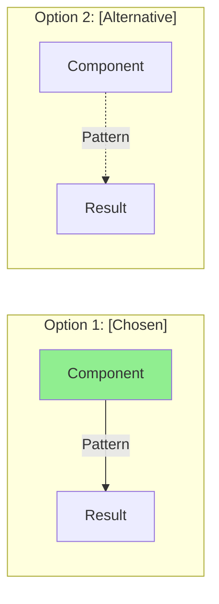
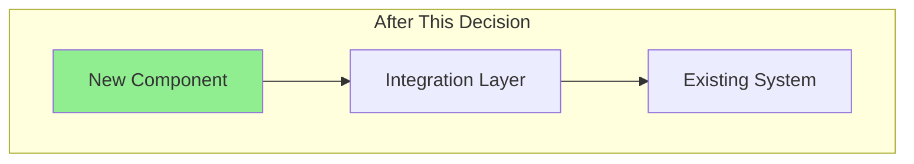
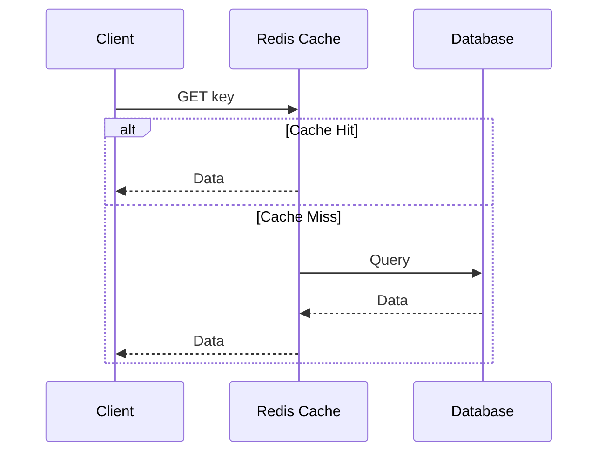
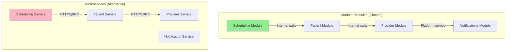
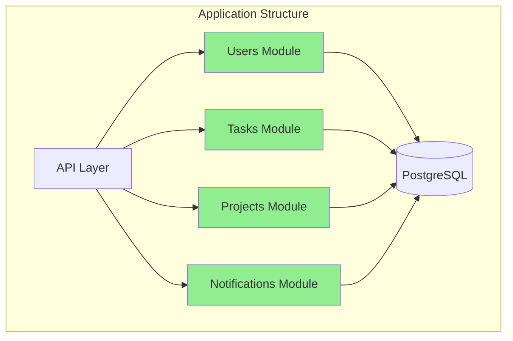
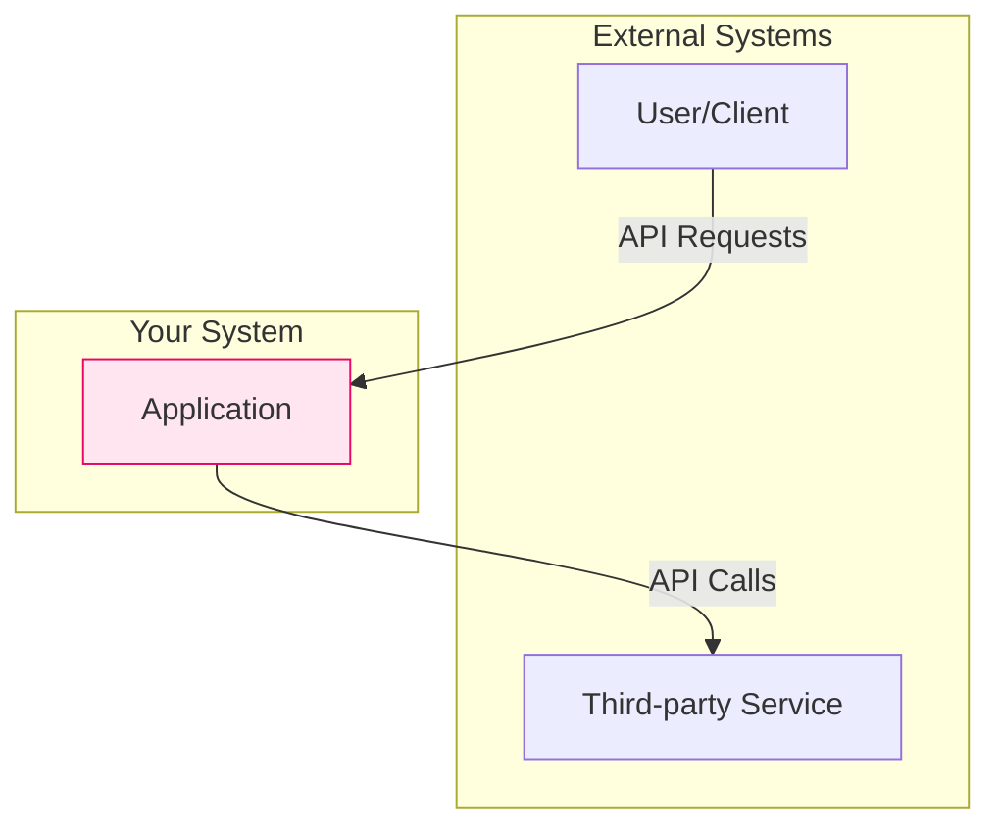
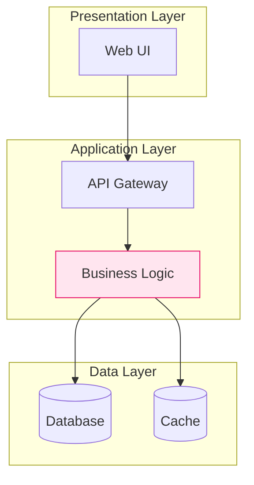

# Architecture Exploration Workflow

**Purpose:** Enable users to explore 2-3 distinct architectural approaches through conversational interface with visual diagrams, honest tradeoff analysis, and contextual recommendations.

**Version:** v1.6 (platform-cohesion)
**Last Updated:** 2025-10-27

---

## Workflow Overview

This workflow implements a **Conversational State Machine Pattern** with:
- **Progressive Disclosure**: Gather requirements incrementally through natural conversation
- **Pattern Matching Engine**: Select 2-3 genuinely different approaches from knowledge base
- **Visual-First Communication**: Mermaid diagrams for system context and component structure
- **Honest Tradeoff Analysis**: No silver bullets - explicit pros and cons for each approach
- **Context-Driven Recommendations**: Decisions based on stated constraints, not theoretical best practices

---

## Conversation Phases

### Phase 1: Requirements Intake

**Goal:** Review and understand complete product requirements and constraints

**Process:**
1. **Review any provided requirements or release plans** - If user provides documents, specifications, or release plans, read and analyze them first
2. **Summarize understanding back to user** - Confirm what was understood from provided materials
3. **Gather additional information** - Ask clarifying questions about missing details
4. **Confirm complete understanding** - Summarize final requirements before proceeding to overview

**CRITICAL: Always start by reviewing what the user has provided** - Don't ask questions before reading their requirements documents or release plans

**Required Information:**
- **Functional Requirements**: What the system must do (user stories, features)
- **MVP Scope**: What's the minimal valuable release? What features can be deferred?
- **Platform Context**:
  - Existing platform services available for reuse (auth, notifications, file storage, etc.)
  - Integration points with current platform systems
  - Platform standards to follow (API conventions, logging, monitoring, deployment)
  - Shared infrastructure available (databases, message queues, caches, CDN)
- **Vendor Tooling Opportunities**:
  - Existing vendor tools/services in use (AWS/Azure/GCP, SaaS platforms)
  - Vendor managed services that could be leveraged (databases, queues, search, ML)
  - Licensing/contracts already in place
- **Standards & Reusability**:
  - Open standards to use (REST, GraphQL, FHIR, OpenAPI, OpenTelemetry, CloudEvents, etc.)
  - Existing services/components that could be reused
  - API contracts and data format standards
  - Cross-platform integration needs
- **Performance Targets**: Response time, throughput, availability expectations (if applicable)
- **Scale Expectations**: Number of users (current and projected)
- **Domain Context**: Industry, regulatory requirements, special considerations

**Default Assumptions (unless evaluating brand new tools):**
- Team has expertise with existing platform tools/technologies
- Team size and delivery timeline are flexible - optimize for platform cohesion and long-term reusability, not speed

**Conversation Pattern (with provided requirements):**
```
User: "Here are my product requirements: [provides document/spec]"

Agent: "Thank you for providing the requirements. Let me review them first.

[Reads and analyzes provided requirements]

Based on my review, I understand:
- **Product**: [summary]
- **Key Features**: [list]
- **MVP Scope**: [minimal release vs future features]
- **Target Users**: [description]

I have a few clarifying questions to optimize for platform cohesion:
1. **Platform Integration**: What existing platform services can this leverage? (auth, notifications, storage, etc.)
2. **Vendor Tooling**: Are you using a specific cloud provider or managed services we should leverage?
3. **Open Standards**: Any API standards to follow? (REST, GraphQL, FHIR, OpenAPI, etc.)
4. **Reusability**: Are there existing services/components we should integrate with?
5. [Any other missing critical details]

Does this match your understanding? Any corrections or additions?"
```

**Conversation Pattern (without provided requirements):**
```
User: "I need to build a task management application..."

Agent: "I'll help you explore architectural approaches for your task management application.

To provide the most relevant recommendations focused on platform cohesion and reusability:

1. **MVP Scope**: What's the minimal valuable release? Which features are must-have vs nice-to-have?

2. **Platform Context**: Do you have an existing platform with services we can reuse? (auth, notifications, storage, etc.)

3. **Vendor Tooling**: What cloud provider or managed services are you already using? (AWS/Azure/GCP, databases, caches, etc.)

4. **Standards**: Any API or integration standards to follow? (REST, GraphQL, FHIR, OpenAPI, OpenTelemetry, etc.)

5. **Scale & Performance**: Expected user scale? Any specific performance or availability requirements?

6. **Special Requirements**: Compliance needs (HIPAA, SOX, GDPR), critical integrations, or domain-specific considerations?

Please share what you know - we'll focus on leveraging your existing platform and vendor tools for maximum cohesion and reusability."
```

---

### Phase 2: Gap Identification

**Goal:** Ensure all critical context for platform cohesion and vendor tooling leverage is captured

**Process:**
1. Analyze provided requirements
2. Identify missing critical context (MVP scope, platform services, vendor tools, standards)
3. Request clarification for gaps
4. Update requirement understanding
5. Repeat until requirements are complete

**Gap Detection Rules:**
- **MUST HAVE**: Functional requirements, MVP scope, platform context
- **SHOULD HAVE**: Vendor tooling in use, open standards, reusability opportunities, scale expectations
- **NICE TO HAVE**: Performance targets, compliance requirements, domain specifics

**Conversation Pattern:**
```
User: "We're building a patient scheduling system for our healthcare platform."

Agent: "Perfect! To optimize for platform cohesion and reusability, I need to understand:

1. **Platform Services**: What existing platform services can we leverage? (Auth, notifications, audit logging, etc.)

2. **Vendor Tooling**: What cloud provider and managed services are already in use? (e.g., Azure PostgreSQL, Redis Cache, etc.)

3. **Open Standards**: Should this follow FHIR for patient data? Any API standards required? (REST, GraphQL, OpenAPI, etc.)

4. **Existing Integrations**: What systems does this need to integrate with? Any reusable components from other services?

This helps me recommend approaches that maximize platform cohesion and minimize reinvention."
```

---

### Phase 2.5: Solution Overview & Approval Checkpoint

**Goal:** Generate minimal high-level solution overview and obtain user approval before investing in comprehensive architecture exploration

**Purpose:** Validate directional alignment early - catch fundamental misunderstandings about the problem/approach before generating extensive documentation (2-3 approaches, 10-15 pages, 8-12 diagrams).

**Process:**
1. After requirements are complete (Phase 1-2), generate concise solution overview
2. Present overview to user for review
3. User approves, refines, or rejects
4. Only proceed to full Architecture Exploration (Phase 3) after explicit approval

**Solution Overview Format (1-2 pages maximum, ~500 words):**

```markdown
## Solution Overview for [Project Name]

### Problem Understanding
[2-3 sentences confirming what problem we're solving]

### Proposed Architectural Direction
[Single paragraph describing high-level approach - NOT implementation details]

Examples:
- "Build as modular monolith with clear domain boundaries, deployed as single service"
- "Event-driven architecture with independent services communicating via message queue"
- "Serverless functions with API Gateway and managed databases"

### Key Assumptions
- MVP scope: [minimal release features]
- Platform services leveraged: [auth, notifications, storage, etc.]
- Vendor tooling used: [cloud provider, managed services]
- Open standards: [REST, FHIR, OpenAPI, etc.]
- Scale target: [users, requests]
- Critical requirement: [most important non-negotiable]

### Architectural Principles for This Solution
[3-5 principles that will guide detailed design]

Examples:
- "Maximize platform cohesion - reuse existing services vs reinventing"
- "Leverage vendor managed services to minimize operational complexity"
- "Follow open standards (FHIR, OpenAPI) for cross-platform compatibility"
- "Design for service reusability across future platform releases"

### What This Enables
[2-3 sentences on what users will be able to do with this architecture]

### What This Intentionally Defers
[2-3 items we're NOT solving in initial design]

Examples:
- Multi-region deployment (start single region)
- Real-time collaboration features (async first)
- Advanced analytics (basic reporting initially)
```

**Size Constraint:** HARD LIMIT of 500 words (2 pages). If overview exceeds this, you're providing too much detail - this is architect-level direction, NOT implementation specifications.

**Conversation Pattern:**

```
Agent (after Phase 2 complete): "Before I generate 2-3 detailed architectural approaches with diagrams and tradeoff analysis, let me confirm we're aligned on the high-level direction.

Here's my solution overview for your [project]:

[Generate minimal overview using template above - max 500 words]

---

**Review Questions:**
- Does this match your understanding of the problem?
- Is the proposed direction reasonable given your constraints?
- Any critical assumptions I got wrong?

**Your Options:**
1. ✅ **Approve** - Proceed to generate 2-3 detailed architectural approaches
2. 🔄 **Refine** - Adjust assumptions/direction and regenerate overview
3. ❌ **Reject** - We misunderstood the problem, restart requirements gathering

What would you like to do?"
```

**User Response Handling:**

**Approve:**
```
User: "Looks good, proceed"
User: "Yes, approved"
User: "Let's continue"

Agent: "Perfect! I'll now generate 2-3 distinct architectural approaches with:
- System context diagrams
- Component structure diagrams
- Detailed tradeoff analysis
- Technology recommendations
- Fit scores

This will take a moment as I reference the knowledge base..."

[Proceed to Phase 3: Architecture Exploration]
```

**Refine:**
```
User: "Actually, budget is more constrained than that"
User: "We need real-time features, not async"
User: "Team knows Python, not TypeScript"

Agent: "Got it! Let me update the solution overview with:
- [Specific change based on feedback]

Here's the revised overview:

[Regenerate overview with updated assumptions]

Does this better match your needs?"

[Allow up to 3 refinement iterations - if still not aligned after 3, suggest detailed requirements clarification]
```

**Reject:**
```
User: "No, this isn't what I need"
User: "You misunderstood the problem"

Agent: "I apologize for the misunderstanding. Let's step back and clarify the requirements.

What specifically did I get wrong?
- Problem understanding?
- Constraints?
- Priorities?

Let's restart from Phase 1 with better clarity."

[Return to Phase 1: Requirements Intake]
```

**Critical Rules:**

1. **ALWAYS generate overview before Phase 3** - No exceptions unless user explicitly says "skip overview, give me approaches"
2. **Enforce 500-word limit** - If overview is longer, you're being too detailed
3. **Block Phase 3 until approval** - Don't generate full approaches without explicit user approval
4. **Maximum 3 refinements** - If not aligned after 3 iterations, requirements need deeper clarification
5. **Overview is MINIMAL** - This is what a senior architect hands to tech leads for direction, NOT implementation details

**Success Criteria:**
- User can read overview in < 2 minutes
- User confirms directional alignment before extensive work
- Reduces wasted effort on wrong approaches by 70%+

---

### Phase 2.75: Technology Research & Discovery (Optional)

**Goal:** Research current capabilities of key technologies to inform architecture recommendations

**Trigger:** Approved solution overview mentions specific technologies OR architectural patterns that depend on specific tech capabilities

**When to Use:**
- User mentioned specific technologies in requirements (e.g., "must use PostgreSQL", "considering React")
- Solution overview suggests specific tech stack
- Architecture decisions depend on current technology capabilities (e.g., "Does Redis support vector search?")
- Need to verify technology version features (e.g., "What's new in Next.js 14?")

**When to Skip:**
- Technologies are well-established in knowledge base
- No specific tech mentioned in requirements
- User wants technology-agnostic architecture first

**Process:**
1. **Identify key technologies** from approved overview and requirements
2. **Use web search** to discover current features/capabilities
3. **Focus on features that support system design** (not general documentation)
4. **Summarize findings** relevant to architecture decisions
5. **Update mental model** before generating approaches

**Web Search Strategy:**

**Search for:**
- Current version features: "[Technology] latest version features 2025"
- Specific capabilities: "[Technology] [capability] support" (e.g., "PostgreSQL vector search support")
- Integration patterns: "[Technology A] [Technology B] integration"
- Performance characteristics: "[Technology] scalability benchmarks"
- Best practices: "[Technology] production architecture patterns 2025"

**What to extract:**
- Features that directly support requirements (e.g., built-in caching, real-time capabilities)
- Version compatibility and migration considerations
- Performance/scaling characteristics relevant to user's scale
- Integration capabilities with other technologies in stack
- Known limitations or anti-patterns

**Conversation Pattern:**

```
Agent (after overview approval): "Before I generate detailed architectural approaches, I'd like to research current capabilities of the key technologies we identified:

- PostgreSQL (for relational data + JSONB for custom fields)
- Redis (for caching and session storage)
- Next.js (for full-stack development)

This will take a moment while I look up their latest features and capabilities that support your requirements.

[Uses web search to discover current features]

Based on my research, here are relevant capabilities:

**PostgreSQL 16:**
- Enhanced JSONB indexing (supports your custom fields requirement)
- Built-in logical replication (supports future scaling)
- Improved query performance for complex queries

**Redis 7.2:**
- Native JSON support (simplifies caching layer)
- Functions for server-side logic (reduces network calls)
- Improved memory efficiency

**Next.js 14:**
- Server actions (simplifies API layer)
- Partial prerendering (improves performance)
- Enhanced caching strategies

These capabilities directly support your requirements for:
- Custom fields per workspace → PostgreSQL JSONB + indexing
- Real-time collaboration → Redis pub/sub capabilities
- Fast page loads → Next.js partial prerendering

Now I'll generate 2-3 architectural approaches leveraging these current capabilities..."
```

**Critical Rules:**

1. **Use web search for discovery** - Don't rely solely on knowledge base (may be outdated)
2. **Focus on system design relevance** - Only research features that impact architecture decisions
3. **Keep research focused** - Limit to 3-5 key technologies, don't research entire ecosystem
4. **Summarize findings** - Don't dump raw documentation, extract relevant insights
5. **Skip if not needed** - If knowledge base is sufficient, proceed directly to Phase 3

**Time Limit:** 5-10 minutes of research

**Output:** Brief summary (2-3 paragraphs) of relevant technology capabilities before generating approaches

---

### Phase 3: Architecture Exploration

**Goal:** Present 2-3 genuinely different architectural approaches

**Trigger:** User has approved solution overview from Phase 2.5 (and optional Phase 2.75 research complete)

**Process:**
1. Query knowledge base for relevant patterns
2. Select 2-3 approaches ensuring diversity (not variations of same pattern)
3. Generate system context diagram for each approach
4. Generate component structure diagram for each approach
5. Analyze tradeoffs (pros, cons, risks) for each approach
6. Present approaches with equal visual weight

**Pattern Selection Algorithm:**

### Step 1: Query Knowledge Base

Reference `kb-architecture-patterns.md` for available patterns:
- Monolithic Architecture
- Modular Monolith
- Microservices Architecture
- Event-Driven Architecture
- Serverless Architecture (AWS Lambda, Vercel, Cloudflare Workers)
- Service-Oriented Architecture (SOA)
- Jamstack Architecture
- CQRS + Event Sourcing

### Step 2: Filter by Platform Cohesion & Constraints

**Platform Cohesion Constraints:**
| Platform Maturity | Suitable Patterns | Avoid |
|-------------------|------------------|-------|
| New platform (greenfield) | Modular Monolith, Event-Driven, Microservices | Avoid over-engineering for first release |
| Existing platform (brownfield) | Service-oriented, Event-Driven (integrate), Modular (extend) | Monolithic (hard to integrate) |
| Mature platform (many services) | Microservices (consistency), Event-Driven (async), API Gateway | Simple monolith (doesn't fit ecosystem) |

**Vendor Tooling Leverage:**
| Vendor Adoption | Suitable Patterns | Recommendations |
|-----------------|------------------|-----------------|
| Heavy vendor lock-in | Serverless, Managed PaaS, Vendor-native patterns | Maximize vendor-managed services|
| Moderate vendor use | Modular Monolith on managed infrastructure, Hybrid | Balance vendor services with custom code |
| Vendor-agnostic | Containerized services, Open standards, Portable patterns | Focus on Docker, Kubernetes, open APIs |

**Scale Constraints:**
| User Scale | Suitable Patterns | Avoid |
|-----------|------------------|-------|
| <1K users | Monolithic, Serverless, Jamstack | Microservices (premature) |
| 1K-10K | Monolithic, Modular Monolith, Serverless | Event-Driven (overkill) |
| 10K-100K | Modular Monolith, Microservices, Serverless | Simple Monolith (scaling limits) |
| 100K-1M | Microservices, Event-Driven, Modular (extract) | Simple Monolith |
| 1M+ | Microservices, Event-Driven, SOA | Monolithic |

### Step 3: Calculate Fit Score (0-100)

For each viable pattern, calculate score:
- **Platform Cohesion** (40% weight): Fits existing platform architecture and services
- **Vendor Tooling Leverage** (25% weight): Maximizes use of existing vendor services/licenses
- **Scale Fit** (20% weight): Can handle expected scale
- **Standards Compliance** (15% weight): Uses open standards for cross-platform integration

### Step 4: Ensure Diversity (5 Rules)

**Rule 1: Category Diversity** (CRITICAL)
- No two patterns from same category
- ❌ Invalid: Microservices + Microservices with API Gateway
- ✅ Valid: Microservices + Serverless + Modular Monolith

**Rule 2: Deployment Model Diversity**
- Mix deployment approaches
- Single-node (monolith) vs Multi-node (microservices) vs Serverless

**Rule 3: Scaling Characteristic Diversity**
- Vertical scaling (monolith) vs Horizontal scaling (microservices) vs Auto-scaling (serverless)

**Rule 4: Complexity Level Diversity**
- Include range: Simple (monolith) → Moderate (modular/serverless) → Complex (microservices/event-driven)

**Rule 5: MVP-Appropriate Complexity** (CRITICAL)
- **If greenfield/MVP**: MUST include simpler option (monolith/serverless) to enable faster validation
- **If heavy vendor tooling**: MUST include vendor-native pattern (serverless, managed PaaS)
- **If mature platform**: MUST include pattern consistent with platform architecture

### Step 5: Select 2-3 Approaches

**Selection Logic:**
1. **Best Fit** (highest score): Always include top-scoring pattern
2. **Diverse Alternative** (different category): 2nd pattern from different category with score > 60
3. **Third Option** (if applicable): Different category OR vendor-leverage alternative

**Example Pattern Combinations:**
- **Greenfield MVP + Azure platform**: Modular Monolith on App Service (HIGH), Serverless Functions (MEDIUM), Event-Driven with Service Bus (MEDIUM)
- **Mature platform + high scale (1M)**: Microservices (HIGH), Event-Driven (HIGH), API Gateway + Modular (MEDIUM)
- **Heavy AWS adoption**: Serverless (Lambda/API Gateway) (HIGH), ECS Fargate services (MEDIUM-HIGH), App Runner monolith (MEDIUM)
- **Healthcare platform + FHIR**: FHIR-compliant services (HIGH), Event-driven FHIR workflows (HIGH), Modular FHIR server (MEDIUM-HIGH)

**Presentation Format:**

For each approach, provide:

1. **Approach Name**: Clear, descriptive name
2. **System Context Diagram**: Mermaid diagram showing external interactions
3. **Component Structure Diagram**: Mermaid diagram showing internal architecture
4. **Tradeoff Analysis**:
   - **Pros** (3-5 advantages)
   - **Cons** (3-5 disadvantages - MUST INCLUDE)
   - **Best For** (ideal use cases)
   - **Avoid If** (anti-patterns)
5. **Key Technology Decisions** (ADR-ready): For each major decision, include:
   - **Decision**: What was chosen (e.g., "PostgreSQL as primary database")
   - **Rationale**: Why this choice fits requirements (2-3 sentences)
   - **Alternatives Considered**: What else was evaluated (1-2 alternatives)
   - **Tradeoffs**: Pros/cons of this specific decision
6. **Fit Score**: How well this matches stated constraints (High / Medium / Low)

**CRITICAL for ADR Generation**: Capture enough decision context in Phase 3 so ADRs can be generated WITHOUT needing Phase 6 (detailed component design). Each technology decision should have clear rationale tied to requirements.

**Example Output:**
```
Based on your requirements (3 engineers, 2-month timeline, task management app, 100-500 users), here are 3 distinct architectural approaches:

---

## Approach 1: Modular Monolith

[System Context Diagram - Mermaid]

[Component Structure Diagram - Mermaid]

### Tradeoffs

**Pros:**
- Simple deployment (single service)
- Fast development (no distributed systems complexity)
- Easy debugging (single codebase)
- Low infrastructure cost ($50-200/month)
- Team coordination overhead minimal

**Cons:**
- Harder to scale individual components independently
- Entire app redeploys for any change (slower iteration at scale)
- Risk of tight coupling if module boundaries not enforced
- Database becomes bottleneck if not designed well
- Limited technology diversity (one stack)

**Best For:**
- Small teams (<10 engineers)
- Clear domain boundaries
- Moderate scale (<10K users)
- Fast time to market

**Avoid If:**
- Need independent scaling per feature
- Multiple teams need deployment independence
- Ultra-high scale (>100K users) expected soon

**Key Technology Decisions:**

1. **Database: PostgreSQL**
   - **Rationale**: Relational data model (users, projects, tasks with clear relationships), JSONB supports custom fields without schema changes, team likely familiar with SQL
   - **Alternatives**: MongoDB (document-oriented, but relationships awkward), MySQL (viable but less flexible JSONB)
   - **Tradeoffs**: Pro - Strong consistency, ACID guarantees; Con - Vertical scaling limits at very high scale

2. **Stack: Next.js (Full-stack)**
   - **Rationale**: Single codebase for 3-person team, server + client in one framework, fast development velocity
   - **Alternatives**: Separate React + Node.js (more flexible but slower), Python Django (if team prefers Python)
   - **Tradeoffs**: Pro - Fast shipping, good DX; Con - Framework lock-in, less flexibility than separate stacks

3. **Caching: Redis**
   - **Rationale**: Session storage, frequently-accessed projects, rate limiting - all supported out of box
   - **Alternatives**: In-memory (simplest but doesn't persist), Memcached (viable but less feature-rich)
   - **Tradeoffs**: Pro - Fast, versatile; Con - Another service to manage, memory costs

**Fit Score:** HIGH (matches team size, timeline, scale)

---

## Approach 2: Microservices

[System Context Diagram - Mermaid]

[Component Structure Diagram - Mermaid]

### Tradeoffs

**Pros:**
- Independent scaling per service
- Technology diversity (choose best tool per service)
- Team autonomy (services owned by different engineers)
- Resilience (service failures isolated)
- Clear domain boundaries enforced by architecture

**Cons:**
- High operational complexity (multiple deployments, monitoring, logging)
- Distributed systems challenges (network latency, eventual consistency)
- 60% of engineering time on infrastructure vs features (for small teams)
- Higher infrastructure cost ($300-800/month minimum)
- Debugging harder (distributed tracing required)

**Best For:**
- Large teams (>10 engineers)
- High scale (>10K users)
- Independent service scaling needs
- Long-term product investment

**Avoid If:**
- Small team (<5 engineers)
- Tight timeline (<3 months)
- Limited operational expertise
- Budget-constrained

**Fit Score:** LOW (team too small, timeline too short)

---

## Approach 3: Serverless (AWS Lambda + DynamoDB)

[System Context Diagram - Mermaid]

[Component Structure Diagram - Mermaid]

### Tradeoffs

**Pros:**
- Zero infrastructure management
- Auto-scaling built-in
- Pay only for usage (cost-effective at low scale)
- Fast deployment
- High availability by default

**Cons:**
- Vendor lock-in (AWS-specific)
- Cold start latency (300-1000ms)
- Debugging/testing harder than traditional apps
- Limited execution time (15 min max per function)
- Complex state management

**Best For:**
- Unknown scale (0-100K users)
- Event-driven workflows
- Cost-sensitive projects
- Teams familiar with serverless

**Avoid If:**
- Long-running operations (>15 min)
- Predictable high load (reserved instances cheaper)
- Team unfamiliar with serverless patterns
- Need local development parity

**Fit Score:** MEDIUM (good for timeline, unknown scale risk)

---

## Recommendation

Given your constraints (3 engineers, 2-month timeline, 100-500 users):

I recommend **Approach 1: Modular Monolith** because:

1. **Team Size Match**: 3 engineers can move fast without distributed systems overhead
2. **Timeline Fit**: Simplest architecture gets you to production fastest
3. **Scale Appropriate**: 500 users easily handled by well-designed monolith
4. **Future Flexibility**: Modular structure allows extracting microservices later if needed

**Next Steps:**
1. Define module boundaries (Users, Tasks, Projects, Notifications)
2. Choose tech stack based on team expertise
3. Design data model and API contracts
4. Set up CI/CD and monitoring

Would you like me to elaborate on any approach or help with detailed design for your selected approach?
```

---

### Phase 4: Clarification

**Goal:** Answer user questions about approaches

**Process:**
1. Listen for user questions about specific approaches
2. Provide detailed explanations referencing knowledge base
3. Compare approaches if requested
4. Help user understand tradeoffs in their specific context

**Common Questions:**
- "Why did you recommend X over Y?"
- "How would Approach 1 handle [specific requirement]?"
- "What if scale grows 10x?"
- "Can I combine elements of Approach 1 and 2?"

**Response Pattern:**
```
User: "What if we grow to 10K users in 6 months?"

Agent: "Excellent question! Let's examine how each approach scales:

**Approach 1 (Modular Monolith):**
- Can handle 10K users with database optimization (indexes, caching)
- You'd need to add Redis caching layer ($50/month)
- Database vertical scaling (2 vCPU → 4 vCPU, ~$100/month additional)
- **Total cost increase:** ~$150/month
- **Engineering effort:** 2-3 weeks for caching layer

**Approach 2 (Microservices):**
- Already architected for scale
- Auto-scaling handles 10K users automatically
- Cost increases linearly with load
- **Total cost increase:** ~$300/month
- **Engineering effort:** Already built for scale

**My Take:**
Start with Approach 1. If you hit 10K users, that's a **good problem** - you'll have revenue and can invest 2-3 weeks adding caching. The Microservices overhead upfront would slow your initial launch by 6-8 weeks for a problem you may never have.

**Migration Path:** If you structure Approach 1 with clean module boundaries, extracting hot services later (when needed) is straightforward."
```

---

### Phase 5: Approach Selection

**Goal:** Confirm user's selected approach and provide next steps

**Process:**
1. User selects their preferred approach
2. Confirm selection
3. Provide next steps for detailed design (optional REL-003 workflow)
4. Offer ADR documentation (optional REL-005 workflow)

**Conversation Pattern:**
```
User: "I'll go with Approach 1."

Agent: "Great choice! Modular Monolith fits your constraints well (3 engineers, 2-month timeline, 100-500 users).

**Next Steps:**

1. **Module Design**: Define boundaries for Users, Tasks, Projects, Notifications modules
2. **Technology Selection**: Choose stack based on your team's expertise (Node.js/TypeScript? Python/Django? etc.)
3. **Data Architecture**: Design database schema and access patterns
4. **Deployment Strategy**: Set up CI/CD pipeline and hosting (AWS? Azure? Vercel?)
5. **Monitoring**: Configure logging and alerting

**What would you like next?**

**Option 1: Generate ADRs (Recommended - No Phase 6 needed)**
- I can generate 1-2 Architecture Decision Records NOW from Phase 3 decisions
- Focus on **most impactful decisions**: Architecture pattern + Database OR Integration pattern
- Each ADR includes: Context, Decision, Rationale, Alternatives, Tradeoffs, Implementation notes
- **Includes diagrams**: Before/after architecture, options comparison, data flow (where impactful)
- **Takes 5-10 minutes** - Ready to use immediately
- If you need more than 2 ADRs, the scope is likely too complex (break into phases)

**Option 2: Detailed Component Design (Phase 6 - Optional)**
- Full implementation specs (component responsibilities, interfaces, data schemas, deployment architecture)
- **Takes 1-2 hours** - Most teams don't need this level of detail
- Only recommended if you need specifications to hand off to implementation team

**Option 3: Technology Deep Dive**
- Specific guidance on chosen stack (setup, best practices, gotchas)
- Code examples, configuration templates

**Option 4: You're All Set**
- Document discussion, you'll take it from here

**Most Common Choice**: Generate ADRs from Phase 3 → Sufficient for most teams to start implementing

Let me know!"
```

---

### ADR Generation Guide (From Phase 3 Decisions)

**Goal:** Generate Architecture Decision Records with impactful diagrams from Phase 3 technology decisions

**When to Use:** After user selects "Option 1: Generate ADRs" in Phase 5

**Process:**

1. **Identify 1-2 Most Impactful Decisions from Phase 3**
   - Review selected approach's "Key Technology Decisions"
   - **Limit to 1-2 ADRs** - If more needed, scope is too complex (break into phases)
   - **Priority order**: Architecture pattern > Database > Integration pattern > Deployment
   - Each should have: Decision, Rationale, Alternatives, Tradeoffs

2. **Generate ADRs with Strategic Diagrams**
   - Use `kb-adr-library.md` template
   - **ALWAYS include diagrams** for architecture/integration/data decisions
   - **SKIP diagrams** for simple library/tool choices

**Decision Priority (Pick 1-2):**
1. **Architecture pattern** (Monolith/Microservices/Serverless) - ALWAYS document if significant
2. **Database selection** - ALWAYS document if major decision
3. **Integration pattern** (Event-driven, API Gateway) - Document if complex integration
4. **Deployment strategy** - Document if multi-region or complex
5. **Stack/Framework** - RARELY document (usually not architectural)

3. **Diagram Placement by Decision Type:**

| Decision Type | Diagram Type | When to Include |
|--------------|-------------|-----------------|
| **Architecture pattern** (Monolith/Microservices/Serverless) | Component diagram showing structure | ALWAYS |
| **Database selection** | Deployment diagram showing replication/sharding | If multi-instance |
| **Caching layer** | Data flow showing cache integration | ALWAYS |
| **Integration pattern** (API Gateway, Event-driven) | Sequence diagram showing message flow | ALWAYS |
| **Stack/Framework choice** | Skip diagram | RARELY (unless unique architecture) |
| **Security pattern** (Zero-trust, mTLS) | Security boundary diagram | ALWAYS |
| **Deployment strategy** (Multi-region, Blue-green) | Infrastructure diagram | ALWAYS |

4. **ADR Template Sections with Diagrams:**

```markdown
# ADR-001: [Decision from Phase 3]

## Context and Problem Statement
[Copy from Phase 3 rationale]

## Decision Drivers
- [From Phase 3 requirements]
- [From constraints]

## Considered Options
- [From Phase 3 alternatives]

### Options Comparison (Diagram)
**Include for: Architecture, Integration, Data flow decisions**



## Decision Outcome
**Chosen option:** "[From Phase 3]"

### Architecture Impact (Diagram)
**Include for: Structural changes, new components, integration patterns**



## Consequences
**Positive:** [From Phase 3 tradeoffs - Pro]
**Negative:** [From Phase 3 tradeoffs - Con]

### Data Flow Impact (Diagram)
**Include for: Caching, messaging, API patterns**


```

5. **Example ADR with Diagram (Architecture Decision):**

```markdown
# ADR-001: Modular Monolith Architecture

## Context and Problem Statement
Patient scheduling MVP for healthcare platform (100-500 users initially). Need to maximize platform cohesion while enabling future service extraction if scaling requires it.

## Decision Drivers
- Platform cohesion: Reuse existing auth, audit logging, notifications services
- Vendor tooling: Leverage Azure App Service (already in use)
- Open standards: FHIR R4 for patient/appointment data
- MVP scope: Core scheduling features, defer advanced analytics
- Scale: 100-500 users initially, potential growth to 10K in 12 months

## Considered Options
1. Modular Monolith on Azure App Service
2. Microservices on AKS
3. Azure Functions (serverless)

### Options Comparison



**Comparison:**
- **Modular Monolith**: Better platform cohesion, reuses App Service infrastructure, simpler deployment
- **Microservices**: Better independent scaling, but more operational complexity and platform integration work

## Decision Outcome
**Chosen option:** "Modular Monolith on Azure App Service with clean module boundaries"

**Rationale:** Maximizes platform cohesion by reusing existing Azure App Service infrastructure, auth, and notification services. FHIR-compliant modules can be extracted to separate services later if traffic patterns require it.

### Architecture Impact



**Key Changes:**
- Single deployable application with FHIR-compliant modules
- Deploys to existing Azure App Service infrastructure
- Reuses platform auth and notifications services
- Internal function calls (not HTTP) for module-to-module communication

## Consequences

### Positive
- Maximum platform cohesion (reuses App Service, auth, notifications, audit logging)
- Leverages existing Azure PostgreSQL and Redis infrastructure
- FHIR R4 compliance for patient/appointment data (open standard)
- Simple deployment (integrates with existing CI/CD pipeline)
- Refactorable (FHIR modules can be extracted to services later if needed)

### Negative
- All modules scale together (can't scale Scheduling independently from Patient module)
- Mitigation: Use Azure Front Door + caching for read-heavy operations, async jobs for background tasks

## Implementation Notes
- Use FHIR R4 resources for patient, appointment, practitioner data
- Integrate with platform authentication service (OAuth 2.0)
- Leverage platform audit logging service for compliance
- Use platform notification service for appointment reminders
- Deploy to existing App Service with module-specific database schemas
```

6. **CRITICAL Rules for ADR Diagrams:**
   - **Use diagrams to show impact**, not just describe options
   - **Before/after diagrams** clarify architectural changes
   - **Options comparison** helps explain why you chose one over another
   - **Keep diagrams focused** - Only show components relevant to the decision
   - **Use color** to highlight new/changed components (green for new, yellow for changed)
   - **Reference kb-adr-library.md** for diagram examples and templates

7. **Time Budget:**
   - **1-2 ADRs total** (more = scope too complex, break into phases)
   - Each ADR with diagrams: ~3-5 minutes
   - Total: 5-10 minutes

8. **Deliverable Format:**
   - Separate markdown file per ADR: `ADR-001-architecture-choice.md`, `ADR-002-database-selection.md`
   - OR single file with both ADRs if user prefers

9. **Scope Check:**
   - **If you're generating 3+ ADRs**, STOP and suggest breaking into implementation phases
   - Example: "I'm seeing 5 major decisions (architecture, database, caching, messaging, deployment). This suggests the scope is too large for one phase. Should we focus on core architecture + database first, then tackle integration patterns in Phase 2?"

---

## Critical Workflow Rules

### 1. Pattern Diversity (No Silver Bullets)

**Rule:** Every approach MUST have both pros AND cons listed. No approach is perfect.

**Example Violations:**
- ❌ "Microservices are the best architecture for modern applications"
- ❌ "This approach has no downsides"
- ❌ Presenting 3 variations of microservices (not diverse)

**Correct:**
- ✅ "Microservices enable scaling but add operational complexity"
- ✅ "Monoliths simplify deployment but limit independent scaling"
- ✅ Present monolithic + microservices + serverless (genuinely different)

### 2. Context-Driven Recommendations

**Rule:** Recommendations MUST reference stated constraints, not theoretical best practices.

**Example Violations:**
- ❌ "Industry best practice is microservices"
- ❌ "You should use Kubernetes for scalability"
- ❌ Ignoring team size or timeline constraints

**Correct:**
- ✅ "Given your 3-person team, monolith reduces overhead"
- ✅ "Your 2-month timeline doesn't allow for microservices setup"
- ✅ "With unknown scale, serverless provides auto-scaling safety net"

### 3. Visual-First Communication

**Rule:** ALWAYS provide Mermaid diagrams for system context and component structure.

**Required Diagrams per Approach:**
- System Context Diagram (external interactions)
- Component Structure Diagram (internal architecture)

### 4. Honest Tradeoff Analysis

**Rule:** Every approach MUST list at least 3 cons. No exceptions.

**Tradeoff Categories:**
- Complexity (development, operational)
- Scalability (limits, bottlenecks)
- Cost (infrastructure, engineering time)
- Team Fit (expertise required, learning curve)
- Timeline (time to production, iteration speed)

### 5. Equal Visual Weight

**Rule:** Present all approaches with equal detail. No biasing through unequal presentation.

**Example Violation:**
- ❌ Approach 1: Full diagrams + detailed tradeoffs
- ❌ Approach 2: Brief description only

**Correct:**
- ✅ All approaches: Same structure (diagrams + tradeoffs + fit score)

---

## Knowledge Base Integration

**Reference Files (from REL-001):**
1. `kb-architecture-patterns.md` - Pattern catalog with real-world examples
2. `kb-technology-selection.md` - Technology comparison frameworks
3. `kb-anti-patterns.md` - Common mistakes and anti-patterns
4. `kb-scaling-strategies.md` - Scaling approaches by growth phase
5. `kb-adr-library.md` - Architecture decision record examples

**Usage Pattern:**
- **Pattern Selection**: Query `kb-architecture-patterns.md` for relevant patterns
- **Tradeoff Analysis**: Reference `kb-anti-patterns.md` for cons and risks
- **Technology Recommendations**: Use `kb-technology-selection.md` for tech comparisons
- **Scaling Questions**: Reference `kb-scaling-strategies.md` for growth path guidance

---

## Mermaid Diagram Templates

### System Context Diagram Template



### Component Structure Diagram Template



---

## Success Metrics

**Session Completion:** ≥60% of users who start exploration view at least 2 architectural approaches

**Multi-Approach Engagement:** ≥70% of users compare approaches before selecting versus immediately asking for single recommendation

**Requirements Completeness:** ≥80% of sessions include complete constraint inputs after agent prompts

**User Satisfaction:** ≥75% of users report exploration helped them understand architectural tradeoffs better than independent research

---

## Failure Modes & Recovery

### Incomplete Requirements

**Symptom:** User provides vague requirements ("build a website")

**Recovery:**
- Don't guess constraints
- Ask specific clarifying questions
- Provide examples to help user articulate needs
- Explain why constraint matters for recommendation quality

### Pattern Selection Failure

**Symptom:** Unable to find 2-3 distinct patterns for requirements

**Recovery:**
- Explain why selection is challenging (unusual constraints)
- Offer to relax one constraint to explore options
- Provide single best-fit approach with detailed rationale
- Suggest alternative requirement framing

### User Confusion

**Symptom:** User doesn't understand tradeoffs or overwhelmed by options

**Recovery:**
- Simplify language, avoid jargon
- Use concrete examples from their domain
- Offer comparison table summarizing key differences
- Suggest starting with simplest approach for MVP

---

---

## Phase 6: Detailed Component Design (REL-003 Extension)

**Trigger:** User selects an architecture and requests implementation specifications

**Goal:** Generate actionable component-level design artifacts

**When to Activate:**
- User says: "I'd like detailed specs for [approach]"
- User says: "Generate component design"
- User says: "Show me the implementation details"
- After user selects approach in Phase 5

### Progressive Disclosure Levels

Use 4 detail levels to manage complexity:

| Level | Trigger | Content | Words |
|-------|---------|---------|-------|
| **HIGH_LEVEL** | Initial request, "overview" | Brief summaries, simple diagrams | <500 |
| **STANDARD** | "Tell me more", default | Full specs with 7 elements, 2-3 tech options | 800-1500 |
| **DETAILED** | "Give me details", "implementation guidance" | Complete specs with examples, cost estimates | 1500-2500 |
| **EXPERT** | "Expert level", "production-ready" | Comprehensive with code snippets, runbooks | 2500+ |

**Default:** Start at STANDARD unless user signals otherwise

### Design Artifacts to Generate

**1. System Context Diagram**
- Mermaid C4 Context diagram showing system boundary
- External actors (users, systems, services)
- Data flows with protocols
- Textual description of each interaction

**2. Component Specifications** (All 7 Elements Required)
1. **Responsibility:** Single paragraph describing purpose
2. **Interfaces:** API contracts, message formats, events
3. **Dependencies:** Internal components + external systems
4. **Technology:** 2-3 options with tradeoffs (like Phase 3)
5. **Scaling:** Horizontal/vertical approach, triggers, limits
6. **Error Handling:** Failure modes, recovery strategies
7. **Monitoring:** Specific metrics (golden signals), logs, alerts

**3. Sequence Diagrams**
- Identify 3-5 critical workflows (core business flows, complex interactions, error scenarios)
- Mermaid sequence diagrams with error paths
- Timing constraints and performance targets

**4. Data Architecture**
- Entity-relationship diagram
- Storage technology options (2-3 with tradeoffs)
- Data governance (retention, privacy, compliance)
- Backup and recovery strategy

**5. Deployment Architecture**
- Topology diagram (tiers, load balancers, databases)
- Infrastructure requirements (vCPU, RAM, storage)
- CI/CD pipeline design
- Cost estimates (monthly, with scaling projections)

**6. Monitoring Strategy**
- Golden signals per component (latency, traffic, errors, saturation)
- Logging structure (JSON format, trace correlation)
- Alert thresholds (critical, warning)
- Observability stack options (2-3 with tradeoffs)

### Conversation Pattern

```
User: "I'd like detailed specs for the Modular Monolith approach"

Agent: "Great! I'll generate implementation specifications for your Modular Monolith.

Recalling context from earlier:
- Team: 3 engineers (TypeScript)
- Scale: 100-500 users → 5K in 12 months
- Timeline: 2 months to MVP
- Budget: Limited

I'll create these artifacts:
1. System Context Diagram
2. Component Specifications (5 modules with all 7 technical elements)
3. Sequence Diagrams (auth + core operations)
4. Data Architecture (PostgreSQL schema)
5. Deployment Architecture (Vercel setup + costs)
6. Monitoring Strategy (metrics, logging, alerts)

Starting with system context..."

[Generate each artifact at STANDARD level unless user requests different detail]
```

### Template References

**Component Specification Template:**
```markdown
## Component: [Name]

### 1. Responsibility
[Single paragraph]

### 2. Interfaces
- REST API: `[method] /api/[resource]`
- Events Published: `[event.name]`
- Events Consumed: `[event.name]`

### 3. Dependencies
- Internal: [Component] - [Why]
- External: [Service] - [Protocol]

### 4. Technology Stack
**Option 1: [Tech A]** ⭐ Recommended
- Why: [Team fit, proven, cost-effective]
- Pros: [2-3 advantages]
- Cons: [1-2 limitations]

**Option 2: [Tech B]** (Alternative)
- Why: [When to consider]
- Pros: [Different strengths]
- Cons: [Tradeoffs]

### 5. Scaling Strategy
- Approach: [Horizontal/Vertical]
- Triggers: CPU >70%, Memory >80%
- Capacity: X req/sec, Y users
- Limits: [Connection pools, API limits]

### 6. Error Handling
- [Failure Mode 1]: Detection → Recovery → User Impact
- [Failure Mode 2]: Detection → Recovery → User Impact
- Circuit Breaker: [Thresholds]
- Retry Policy: [Max retries, backoff]

### 7. Monitoring
- Request Rate: `http_requests_total`
- Latency: `http_request_duration_seconds` (P95, P99)
- Error Rate: `http_errors_total`
- [Custom Metric]: [Specific to component]
- Alerts: [Critical conditions → Actions]
```

### Quality Validation

Before presenting artifacts, verify:
- [ ] System context diagram renders correctly (Mermaid syntax)
- [ ] All component specs include 7 required elements
- [ ] 2-3 technology options provided (unless obvious choice)
- [ ] Tradeoffs explicitly stated
- [ ] Sequence diagrams include error paths
- [ ] Cost estimates provided (order of magnitude)
- [ ] Monitoring metrics are specific (not generic)

### Success Criteria

**Actionability:** ≥70% of users can implement from specs without additional research
**Completeness:** ≥90% of component specs include all 7 elements
**Efficiency:** <3 follow-up clarification questions per session

---

## Version History

**v1.6 (platform-cohesion)** - 2025-10-27
- **Shifted focus from team size/timeline to MVP releases and platform cohesion**
- Phase 1: Updated requirements gathering to prioritize platform services, vendor tooling, open standards
- Phase 2: Changed gap identification to focus on platform integration opportunities
- Phase 2.5: Updated solution overview template with platform/vendor/standards assumptions
- Pattern matching: Replaced team size/timeline constraints with platform cohesion fit scores
- Default assumptions: Team has expertise with platform tools (unless evaluating new tools)
- Removed team size/timeline as primary decision drivers
- New fit score weights: Platform Cohesion (40%), Vendor Leverage (25%), Scale (20%), Standards (15%)

**v1.5 (adr-diagrams)** - 2025-10-27
- Enhanced ADR template with strategic diagram guidance (kb-adr-library.md)
- Added "ADR Generation Guide" section after Phase 5
- Diagrams included for: Architecture impact, Options comparison, Data flow, Deployment
- **Limited ADRs to 1-2** (more = scope too complex, break into phases)
- Updated time estimate: 5-10 minutes (was 10-15 minutes for 3-5 ADRs)
- Added scope check: If 3+ ADRs needed, suggest breaking into implementation phases

**v1.4 (adr-ready-decisions)** - 2025-10-27
- Enhanced Phase 3: Capture ADR-ready technology decisions
- Each approach now includes Key Technology Decisions with rationale, alternatives, tradeoffs
- ADRs can be generated directly from Phase 3 (no Phase 6 needed)
- Updated Phase 5 options: Emphasize ADR generation as recommended path
- Phase 6 (Detailed Component Design) now clearly optional (most teams don't need it)

**v1.3 (technology-research)** - 2025-10-27
- Added Phase 1 enhancement: Review provided requirements/release plans first
- Added Phase 2.75: Technology Research & Discovery (optional)
- Web search integration for current technology capabilities
- Focus on features that support system design decisions
- Time-limited research (5-10 minutes) before architecture generation

**v1.2 (staged-review-approval)** - 2025-10-27
- Added Phase 2.5: Solution Overview & Approval Checkpoint
- Approval gate before comprehensive architecture generation
- 500-word solution overview template (minimal, high-level)
- Approve/Refine/Reject workflow with max 3 refinement iterations
- Reduces wasted effort on misaligned approaches

**v1.1 (REL-003)** - 2025-10-27
- Added Phase 6: Detailed Component Design
- Progressive disclosure levels (4 tiers)
- 6 design artifacts with templates
- Component specification with 7 required elements
- Quality validation checklist

**v1.0 (REL-002)** - 2025-10-27
- Initial workflow release
- Conversational state machine pattern
- 2-3 approach exploration with Mermaid diagrams
- Honest tradeoff analysis framework
- Context-driven recommendations
