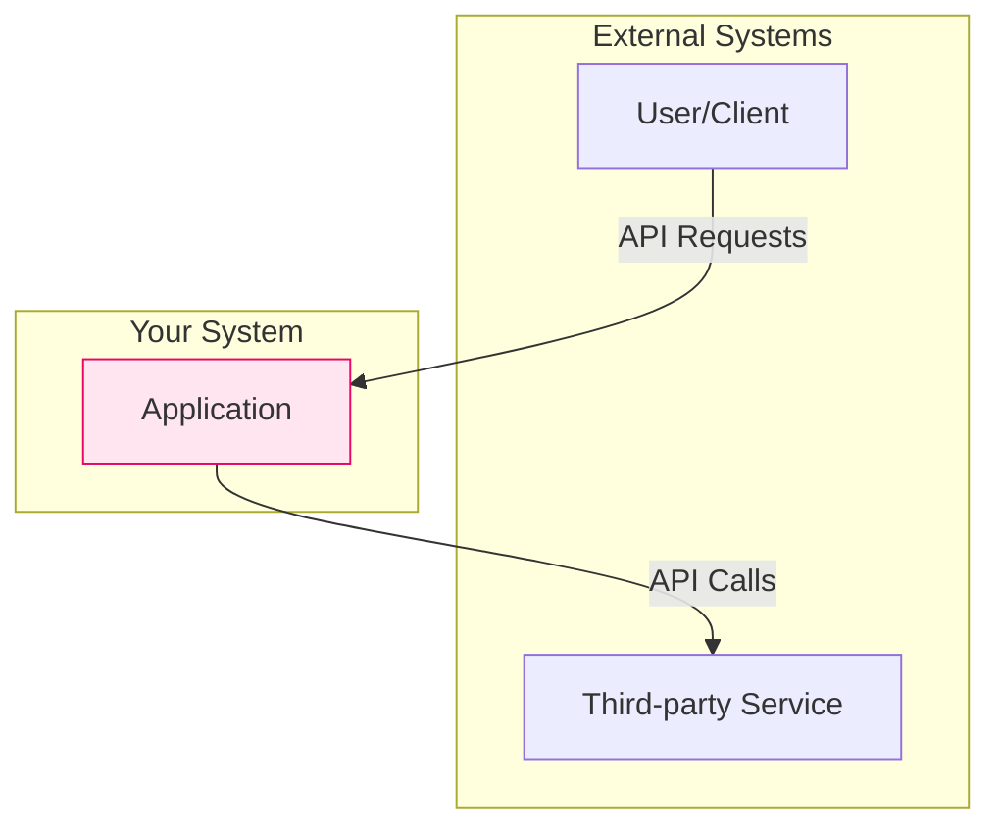
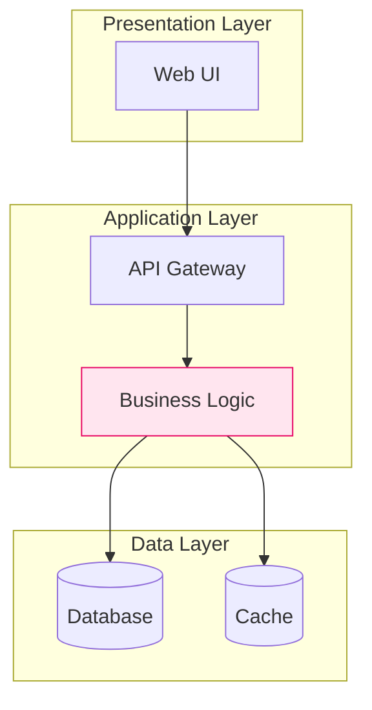

# Architecture Exploration Workflow

**Purpose:** Enable users to explore 2-3 distinct architectural approaches through conversational interface with visual diagrams, honest tradeoff analysis, and contextual recommendations.

**Version:** 1.0 (REL-002)
**Last Updated:** 2025-10-27

---

## Workflow Overview

This workflow implements a **Conversational State Machine Pattern** with:
- **Progressive Disclosure**: Gather requirements incrementally through natural conversation
- **Pattern Matching Engine**: Select 2-3 genuinely different approaches from knowledge base
- **Visual-First Communication**: Mermaid diagrams for system context and component structure
- **Honest Tradeoff Analysis**: No silver bullets - explicit pros and cons for each approach
- **Context-Driven Recommendations**: Decisions based on stated constraints, not theoretical best practices

---

## Conversation Phases

### Phase 1: Requirements Intake

**Goal:** Gather complete product requirements and constraints

**Process:**
1. User describes their product requirements in natural language
2. Identify missing critical information and ask clarifying questions
3. Confirm understanding by summarizing requirements before proceeding

**Required Information:**
- **Functional Requirements**: What the system must do (user stories, features)
- **Performance Targets**: Response time, throughput, availability expectations (if applicable)
- **Scale Expectations**: Number of users (current and projected)
- **Team Constraints**:
  - Team size (number of engineers)
  - Team expertise (technologies they know well)
  - Timeline (weeks or months to delivery)
  - Budget (limited, moderate, flexible)
- **Domain Context**: Industry, regulatory requirements, special considerations

**Conversation Pattern:**
```
User: "I need to build a task management application..."

Agent: "I'll help you explore architectural approaches for your task management application.

To provide the most relevant recommendations, I need to understand a few key constraints:

1. **Team Size & Expertise**: How many engineers will work on this? What technologies does your team know well?

2. **Scale Expectations**: How many users do you expect? (Now and in 12 months)

3. **Timeline**: What's your delivery timeline?

4. **Budget Constraints**: What's your infrastructure budget tolerance? (limited / moderate / flexible)

5. **Special Requirements**: Any compliance needs, integrations, or performance requirements?

Please share what you know - we can refine as we go."
```

---

### Phase 2: Gap Identification

**Goal:** Ensure all critical constraints are captured

**Process:**
1. Analyze provided requirements
2. Identify missing critical constraints (team size, timeline, budget, scale)
3. Request clarification for gaps
4. Update requirement understanding
5. Repeat until requirements are complete

**Gap Detection Rules:**
- **MUST HAVE**: Functional requirements, team size, timeline
- **SHOULD HAVE**: Team expertise, scale expectations, budget
- **NICE TO HAVE**: Performance targets, compliance requirements, domain specifics

**Conversation Pattern:**
```
User: "We have 3 engineers and need it in 2 months."

Agent: "Great! To complete the picture, I need two more pieces of information:

1. **Scale**: How many users do you expect? (This affects architecture complexity)

2. **Team Expertise**: What technologies does your team already know? (TypeScript? Python? React? etc.)

This helps me recommend approaches that fit your actual constraints rather than theoretical 'best practices'."
```

---

### Phase 2.5: Solution Overview & Approval Checkpoint

**Goal:** Generate minimal high-level solution overview and obtain user approval before investing in comprehensive architecture exploration

**Purpose:** Validate directional alignment early - catch fundamental misunderstandings about the problem/approach before generating extensive documentation (2-3 approaches, 10-15 pages, 8-12 diagrams).

**Process:**
1. After requirements are complete (Phase 1-2), generate concise solution overview
2. Present overview to user for review
3. User approves, refines, or rejects
4. Only proceed to full Architecture Exploration (Phase 3) after explicit approval

**Solution Overview Format (1-2 pages maximum, ~500 words):**

```markdown
## Solution Overview for [Project Name]

### Problem Understanding
[2-3 sentences confirming what problem we're solving]

### Proposed Architectural Direction
[Single paragraph describing high-level approach - NOT implementation details]

Examples:
- "Build as modular monolith with clear domain boundaries, deployed as single service"
- "Event-driven architecture with independent services communicating via message queue"
- "Serverless functions with API Gateway and managed databases"

### Key Assumptions
- Team constraint: [size, expertise]
- Scale target: [users, requests]
- Timeline: [delivery window]
- Budget: [infrastructure cost tolerance]
- Critical requirement: [most important non-negotiable]

### Architectural Principles for This Solution
[3-5 principles that will guide detailed design]

Examples:
- "Optimize for development velocity over premature scalability"
- "Minimize operational complexity (managed services preferred)"
- "Clear module boundaries to enable future extraction if needed"

### What This Enables
[2-3 sentences on what users will be able to do with this architecture]

### What This Intentionally Defers
[2-3 items we're NOT solving in initial design]

Examples:
- Multi-region deployment (start single region)
- Real-time collaboration features (async first)
- Advanced analytics (basic reporting initially)
```

**Size Constraint:** HARD LIMIT of 500 words (2 pages). If overview exceeds this, you're providing too much detail - this is architect-level direction, NOT implementation specifications.

**Conversation Pattern:**

```
Agent (after Phase 2 complete): "Before I generate 2-3 detailed architectural approaches with diagrams and tradeoff analysis, let me confirm we're aligned on the high-level direction.

Here's my solution overview for your [project]:

[Generate minimal overview using template above - max 500 words]

---

**Review Questions:**
- Does this match your understanding of the problem?
- Is the proposed direction reasonable given your constraints?
- Any critical assumptions I got wrong?

**Your Options:**
1. ✅ **Approve** - Proceed to generate 2-3 detailed architectural approaches
2. 🔄 **Refine** - Adjust assumptions/direction and regenerate overview
3. ❌ **Reject** - We misunderstood the problem, restart requirements gathering

What would you like to do?"
```

**User Response Handling:**

**Approve:**
```
User: "Looks good, proceed"
User: "Yes, approved"
User: "Let's continue"

Agent: "Perfect! I'll now generate 2-3 distinct architectural approaches with:
- System context diagrams
- Component structure diagrams
- Detailed tradeoff analysis
- Technology recommendations
- Fit scores

This will take a moment as I reference the knowledge base..."

[Proceed to Phase 3: Architecture Exploration]
```

**Refine:**
```
User: "Actually, budget is more constrained than that"
User: "We need real-time features, not async"
User: "Team knows Python, not TypeScript"

Agent: "Got it! Let me update the solution overview with:
- [Specific change based on feedback]

Here's the revised overview:

[Regenerate overview with updated assumptions]

Does this better match your needs?"

[Allow up to 3 refinement iterations - if still not aligned after 3, suggest detailed requirements clarification]
```

**Reject:**
```
User: "No, this isn't what I need"
User: "You misunderstood the problem"

Agent: "I apologize for the misunderstanding. Let's step back and clarify the requirements.

What specifically did I get wrong?
- Problem understanding?
- Constraints?
- Priorities?

Let's restart from Phase 1 with better clarity."

[Return to Phase 1: Requirements Intake]
```

**Critical Rules:**

1. **ALWAYS generate overview before Phase 3** - No exceptions unless user explicitly says "skip overview, give me approaches"
2. **Enforce 500-word limit** - If overview is longer, you're being too detailed
3. **Block Phase 3 until approval** - Don't generate full approaches without explicit user approval
4. **Maximum 3 refinements** - If not aligned after 3 iterations, requirements need deeper clarification
5. **Overview is MINIMAL** - This is what a senior architect hands to tech leads for direction, NOT implementation details

**Success Criteria:**
- User can read overview in < 2 minutes
- User confirms directional alignment before extensive work
- Reduces wasted effort on wrong approaches by 70%+

---

### Phase 3: Architecture Exploration

**Goal:** Present 2-3 genuinely different architectural approaches

**Trigger:** User has approved solution overview from Phase 2.5

**Process:**
1. Query knowledge base for relevant patterns
2. Select 2-3 approaches ensuring diversity (not variations of same pattern)
3. Generate system context diagram for each approach
4. Generate component structure diagram for each approach
5. Analyze tradeoffs (pros, cons, risks) for each approach
6. Present approaches with equal visual weight

**Pattern Selection Algorithm:**

### Step 1: Query Knowledge Base

Reference `kb-architecture-patterns.md` for available patterns:
- Monolithic Architecture
- Modular Monolith
- Microservices Architecture
- Event-Driven Architecture
- Serverless Architecture (AWS Lambda, Vercel, Cloudflare Workers)
- Service-Oriented Architecture (SOA)
- Jamstack Architecture
- CQRS + Event Sourcing

### Step 2: Filter by Constraint Viability

**Team Size Constraints:**
| Team Size | Suitable Patterns | Avoid |
|-----------|------------------|-------|
| 1-2 engineers | Monolithic, Serverless, Jamstack | Microservices, Event-Driven |
| 3-5 engineers | Monolithic, Modular Monolith, Serverless | Microservices (too much overhead) |
| 6-10 engineers | Modular Monolith, Microservices, Serverless | Simple Monolith (underutilizes team) |
| 10+ engineers | Microservices, Event-Driven, SOA | Simple Monolith |

**Scale Constraints:**
| User Scale | Suitable Patterns | Avoid |
|-----------|------------------|-------|
| <1K users | Monolithic, Serverless, Jamstack | Microservices (premature) |
| 1K-10K | Monolithic, Modular Monolith, Serverless | Event-Driven (overkill) |
| 10K-100K | Modular Monolith, Microservices, Serverless | Simple Monolith (scaling limits) |
| 100K-1M | Microservices, Event-Driven, Modular (extract) | Simple Monolith |
| 1M+ | Microservices, Event-Driven, SOA | Monolithic |

**Timeline Constraints:**
| Timeline | Suitable Patterns | Avoid |
|---------|------------------|-------|
| <1 month | Serverless, Jamstack, Simple Monolith | Microservices, Event-Driven |
| 1-3 months | Monolithic, Modular Monolith, Serverless | Microservices (2-3 month setup) |
| 3-6 months | Modular Monolith, Microservices, Serverless | Event-Driven (2-3 month setup) |
| 6+ months | All patterns viable | N/A |

**Budget Constraints:**
| Budget | Suitable Patterns | Avoid |
|--------|------------------|-------|
| Limited ($0-$100/mo) | Serverless (pay-per-use), Jamstack, PaaS Monolith | Microservices (high infra cost) |
| Moderate ($100-$500/mo) | Monolithic, Modular Monolith, Serverless | Large-scale microservices |
| Flexible ($500+/mo) | All patterns viable | N/A |

### Step 3: Calculate Fit Score (0-100)

For each viable pattern, calculate score:
- **Team Size Fit** (40% weight): Ideal team size match
- **Scale Fit** (30% weight): Can handle expected scale
- **Timeline Fit** (20% weight): Setup time < timeline
- **Budget Fit** (10% weight): Cost <= budget

### Step 4: Ensure Diversity (5 Rules)

**Rule 1: Category Diversity** (CRITICAL)
- No two patterns from same category
- ❌ Invalid: Microservices + Microservices with API Gateway
- ✅ Valid: Microservices + Serverless + Modular Monolith

**Rule 2: Deployment Model Diversity**
- Mix deployment approaches
- Single-node (monolith) vs Multi-node (microservices) vs Serverless

**Rule 3: Scaling Characteristic Diversity**
- Vertical scaling (monolith) vs Horizontal scaling (microservices) vs Auto-scaling (serverless)

**Rule 4: Complexity Level Diversity**
- Include range: Simple (monolith) → Moderate (modular/serverless) → Complex (microservices/event-driven)

**Rule 5: Simplicity Option When Required** (CRITICAL)
- **If team < 5 engineers**: MUST include monolithic or serverless option
- **If timeline < 3 months**: MUST include fastest-to-deploy option (monolith/serverless)
- **If budget = limited**: MUST include low-cost option (serverless/PaaS monolith)

### Step 5: Select 2-3 Approaches

**Selection Logic:**
1. **Best Fit** (highest score): Always include top-scoring pattern
2. **Diverse Alternative** (different category): 2nd pattern from different category with score > 60
3. **Third Option** (if applicable): Different category OR simpler fallback (if constraints tight)

**Example Pattern Combinations:**
- **Small team (2) + short timeline (3mo)**: Monolithic (HIGH), Serverless (MEDIUM), Modular (MEDIUM)
- **Large team (10) + high scale (1M)**: Microservices (HIGH), Event-Driven (HIGH), Modular (MEDIUM)
- **Unknown scale + solo developer**: Serverless (HIGH), Jamstack (MEDIUM-HIGH), Monolith (MEDIUM)
- **Enterprise + compliance**: SOA (HIGH), Event-Driven (HIGH), Modular (MEDIUM-HIGH)

**Presentation Format:**

For each approach, provide:

1. **Approach Name**: Clear, descriptive name
2. **System Context Diagram**: Mermaid diagram showing external interactions
3. **Component Structure Diagram**: Mermaid diagram showing internal architecture
4. **Tradeoff Analysis**:
   - **Pros** (3-5 advantages)
   - **Cons** (3-5 disadvantages - MUST INCLUDE)
   - **Best For** (ideal use cases)
   - **Avoid If** (anti-patterns)
5. **Fit Score**: How well this matches stated constraints (High / Medium / Low)

**Example Output:**
```
Based on your requirements (3 engineers, 2-month timeline, task management app, 100-500 users), here are 3 distinct architectural approaches:

---

## Approach 1: Modular Monolith

[System Context Diagram - Mermaid]

[Component Structure Diagram - Mermaid]

### Tradeoffs

**Pros:**
- Simple deployment (single service)
- Fast development (no distributed systems complexity)
- Easy debugging (single codebase)
- Low infrastructure cost ($50-200/month)
- Team coordination overhead minimal

**Cons:**
- Harder to scale individual components independently
- Entire app redeploys for any change (slower iteration at scale)
- Risk of tight coupling if module boundaries not enforced
- Database becomes bottleneck if not designed well
- Limited technology diversity (one stack)

**Best For:**
- Small teams (<10 engineers)
- Clear domain boundaries
- Moderate scale (<10K users)
- Fast time to market

**Avoid If:**
- Need independent scaling per feature
- Multiple teams need deployment independence
- Ultra-high scale (>100K users) expected soon

**Fit Score:** HIGH (matches team size, timeline, scale)

---

## Approach 2: Microservices

[System Context Diagram - Mermaid]

[Component Structure Diagram - Mermaid]

### Tradeoffs

**Pros:**
- Independent scaling per service
- Technology diversity (choose best tool per service)
- Team autonomy (services owned by different engineers)
- Resilience (service failures isolated)
- Clear domain boundaries enforced by architecture

**Cons:**
- High operational complexity (multiple deployments, monitoring, logging)
- Distributed systems challenges (network latency, eventual consistency)
- 60% of engineering time on infrastructure vs features (for small teams)
- Higher infrastructure cost ($300-800/month minimum)
- Debugging harder (distributed tracing required)

**Best For:**
- Large teams (>10 engineers)
- High scale (>10K users)
- Independent service scaling needs
- Long-term product investment

**Avoid If:**
- Small team (<5 engineers)
- Tight timeline (<3 months)
- Limited operational expertise
- Budget-constrained

**Fit Score:** LOW (team too small, timeline too short)

---

## Approach 3: Serverless (AWS Lambda + DynamoDB)

[System Context Diagram - Mermaid]

[Component Structure Diagram - Mermaid]

### Tradeoffs

**Pros:**
- Zero infrastructure management
- Auto-scaling built-in
- Pay only for usage (cost-effective at low scale)
- Fast deployment
- High availability by default

**Cons:**
- Vendor lock-in (AWS-specific)
- Cold start latency (300-1000ms)
- Debugging/testing harder than traditional apps
- Limited execution time (15 min max per function)
- Complex state management

**Best For:**
- Unknown scale (0-100K users)
- Event-driven workflows
- Cost-sensitive projects
- Teams familiar with serverless

**Avoid If:**
- Long-running operations (>15 min)
- Predictable high load (reserved instances cheaper)
- Team unfamiliar with serverless patterns
- Need local development parity

**Fit Score:** MEDIUM (good for timeline, unknown scale risk)

---

## Recommendation

Given your constraints (3 engineers, 2-month timeline, 100-500 users):

I recommend **Approach 1: Modular Monolith** because:

1. **Team Size Match**: 3 engineers can move fast without distributed systems overhead
2. **Timeline Fit**: Simplest architecture gets you to production fastest
3. **Scale Appropriate**: 500 users easily handled by well-designed monolith
4. **Future Flexibility**: Modular structure allows extracting microservices later if needed

**Next Steps:**
1. Define module boundaries (Users, Tasks, Projects, Notifications)
2. Choose tech stack based on team expertise
3. Design data model and API contracts
4. Set up CI/CD and monitoring

Would you like me to elaborate on any approach or help with detailed design for your selected approach?
```

---

### Phase 4: Clarification

**Goal:** Answer user questions about approaches

**Process:**
1. Listen for user questions about specific approaches
2. Provide detailed explanations referencing knowledge base
3. Compare approaches if requested
4. Help user understand tradeoffs in their specific context

**Common Questions:**
- "Why did you recommend X over Y?"
- "How would Approach 1 handle [specific requirement]?"
- "What if scale grows 10x?"
- "Can I combine elements of Approach 1 and 2?"

**Response Pattern:**
```
User: "What if we grow to 10K users in 6 months?"

Agent: "Excellent question! Let's examine how each approach scales:

**Approach 1 (Modular Monolith):**
- Can handle 10K users with database optimization (indexes, caching)
- You'd need to add Redis caching layer ($50/month)
- Database vertical scaling (2 vCPU → 4 vCPU, ~$100/month additional)
- **Total cost increase:** ~$150/month
- **Engineering effort:** 2-3 weeks for caching layer

**Approach 2 (Microservices):**
- Already architected for scale
- Auto-scaling handles 10K users automatically
- Cost increases linearly with load
- **Total cost increase:** ~$300/month
- **Engineering effort:** Already built for scale

**My Take:**
Start with Approach 1. If you hit 10K users, that's a **good problem** - you'll have revenue and can invest 2-3 weeks adding caching. The Microservices overhead upfront would slow your initial launch by 6-8 weeks for a problem you may never have.

**Migration Path:** If you structure Approach 1 with clean module boundaries, extracting hot services later (when needed) is straightforward."
```

---

### Phase 5: Approach Selection

**Goal:** Confirm user's selected approach and provide next steps

**Process:**
1. User selects their preferred approach
2. Confirm selection
3. Provide next steps for detailed design (optional REL-003 workflow)
4. Offer ADR documentation (optional REL-005 workflow)

**Conversation Pattern:**
```
User: "I'll go with Approach 1."

Agent: "Great choice! Modular Monolith fits your constraints well (3 engineers, 2-month timeline, 100-500 users).

**Next Steps:**

1. **Module Design**: Define boundaries for Users, Tasks, Projects, Notifications modules
2. **Technology Selection**: Choose stack based on your team's expertise (Node.js/TypeScript? Python/Django? etc.)
3. **Data Architecture**: Design database schema and access patterns
4. **Deployment Strategy**: Set up CI/CD pipeline and hosting (AWS? Azure? Vercel?)
5. **Monitoring**: Configure logging and alerting

Would you like me to:
- [ ] Help with detailed component design (module responsibilities, interfaces, data schemas)
- [ ] Generate Architecture Decision Record documenting this choice
- [ ] Provide technology recommendations for your stack
- [ ] Just document our discussion and you'll take it from here

Let me know what would be most helpful!"
```

---

## Critical Workflow Rules

### 1. Pattern Diversity (No Silver Bullets)

**Rule:** Every approach MUST have both pros AND cons listed. No approach is perfect.

**Example Violations:**
- ❌ "Microservices are the best architecture for modern applications"
- ❌ "This approach has no downsides"
- ❌ Presenting 3 variations of microservices (not diverse)

**Correct:**
- ✅ "Microservices enable scaling but add operational complexity"
- ✅ "Monoliths simplify deployment but limit independent scaling"
- ✅ Present monolithic + microservices + serverless (genuinely different)

### 2. Context-Driven Recommendations

**Rule:** Recommendations MUST reference stated constraints, not theoretical best practices.

**Example Violations:**
- ❌ "Industry best practice is microservices"
- ❌ "You should use Kubernetes for scalability"
- ❌ Ignoring team size or timeline constraints

**Correct:**
- ✅ "Given your 3-person team, monolith reduces overhead"
- ✅ "Your 2-month timeline doesn't allow for microservices setup"
- ✅ "With unknown scale, serverless provides auto-scaling safety net"

### 3. Visual-First Communication

**Rule:** ALWAYS provide Mermaid diagrams for system context and component structure.

**Required Diagrams per Approach:**
- System Context Diagram (external interactions)
- Component Structure Diagram (internal architecture)

### 4. Honest Tradeoff Analysis

**Rule:** Every approach MUST list at least 3 cons. No exceptions.

**Tradeoff Categories:**
- Complexity (development, operational)
- Scalability (limits, bottlenecks)
- Cost (infrastructure, engineering time)
- Team Fit (expertise required, learning curve)
- Timeline (time to production, iteration speed)

### 5. Equal Visual Weight

**Rule:** Present all approaches with equal detail. No biasing through unequal presentation.

**Example Violation:**
- ❌ Approach 1: Full diagrams + detailed tradeoffs
- ❌ Approach 2: Brief description only

**Correct:**
- ✅ All approaches: Same structure (diagrams + tradeoffs + fit score)

---

## Knowledge Base Integration

**Reference Files (from REL-001):**
1. `kb-architecture-patterns.md` - Pattern catalog with real-world examples
2. `kb-technology-selection.md` - Technology comparison frameworks
3. `kb-anti-patterns.md` - Common mistakes and anti-patterns
4. `kb-scaling-strategies.md` - Scaling approaches by growth phase
5. `kb-adr-library.md` - Architecture decision record examples

**Usage Pattern:**
- **Pattern Selection**: Query `kb-architecture-patterns.md` for relevant patterns
- **Tradeoff Analysis**: Reference `kb-anti-patterns.md` for cons and risks
- **Technology Recommendations**: Use `kb-technology-selection.md` for tech comparisons
- **Scaling Questions**: Reference `kb-scaling-strategies.md` for growth path guidance

---

## Mermaid Diagram Templates

### System Context Diagram Template



### Component Structure Diagram Template



---

## Success Metrics

**Session Completion:** ≥60% of users who start exploration view at least 2 architectural approaches

**Multi-Approach Engagement:** ≥70% of users compare approaches before selecting versus immediately asking for single recommendation

**Requirements Completeness:** ≥80% of sessions include complete constraint inputs after agent prompts

**User Satisfaction:** ≥75% of users report exploration helped them understand architectural tradeoffs better than independent research

---

## Failure Modes & Recovery

### Incomplete Requirements

**Symptom:** User provides vague requirements ("build a website")

**Recovery:**
- Don't guess constraints
- Ask specific clarifying questions
- Provide examples to help user articulate needs
- Explain why constraint matters for recommendation quality

### Pattern Selection Failure

**Symptom:** Unable to find 2-3 distinct patterns for requirements

**Recovery:**
- Explain why selection is challenging (unusual constraints)
- Offer to relax one constraint to explore options
- Provide single best-fit approach with detailed rationale
- Suggest alternative requirement framing

### User Confusion

**Symptom:** User doesn't understand tradeoffs or overwhelmed by options

**Recovery:**
- Simplify language, avoid jargon
- Use concrete examples from their domain
- Offer comparison table summarizing key differences
- Suggest starting with simplest approach for MVP

---

---

## Phase 6: Detailed Component Design (REL-003 Extension)

**Trigger:** User selects an architecture and requests implementation specifications

**Goal:** Generate actionable component-level design artifacts

**When to Activate:**
- User says: "I'd like detailed specs for [approach]"
- User says: "Generate component design"
- User says: "Show me the implementation details"
- After user selects approach in Phase 5

### Progressive Disclosure Levels

Use 4 detail levels to manage complexity:

| Level | Trigger | Content | Words |
|-------|---------|---------|-------|
| **HIGH_LEVEL** | Initial request, "overview" | Brief summaries, simple diagrams | <500 |
| **STANDARD** | "Tell me more", default | Full specs with 7 elements, 2-3 tech options | 800-1500 |
| **DETAILED** | "Give me details", "implementation guidance" | Complete specs with examples, cost estimates | 1500-2500 |
| **EXPERT** | "Expert level", "production-ready" | Comprehensive with code snippets, runbooks | 2500+ |

**Default:** Start at STANDARD unless user signals otherwise

### Design Artifacts to Generate

**1. System Context Diagram**
- Mermaid C4 Context diagram showing system boundary
- External actors (users, systems, services)
- Data flows with protocols
- Textual description of each interaction

**2. Component Specifications** (All 7 Elements Required)
1. **Responsibility:** Single paragraph describing purpose
2. **Interfaces:** API contracts, message formats, events
3. **Dependencies:** Internal components + external systems
4. **Technology:** 2-3 options with tradeoffs (like Phase 3)
5. **Scaling:** Horizontal/vertical approach, triggers, limits
6. **Error Handling:** Failure modes, recovery strategies
7. **Monitoring:** Specific metrics (golden signals), logs, alerts

**3. Sequence Diagrams**
- Identify 3-5 critical workflows (core business flows, complex interactions, error scenarios)
- Mermaid sequence diagrams with error paths
- Timing constraints and performance targets

**4. Data Architecture**
- Entity-relationship diagram
- Storage technology options (2-3 with tradeoffs)
- Data governance (retention, privacy, compliance)
- Backup and recovery strategy

**5. Deployment Architecture**
- Topology diagram (tiers, load balancers, databases)
- Infrastructure requirements (vCPU, RAM, storage)
- CI/CD pipeline design
- Cost estimates (monthly, with scaling projections)

**6. Monitoring Strategy**
- Golden signals per component (latency, traffic, errors, saturation)
- Logging structure (JSON format, trace correlation)
- Alert thresholds (critical, warning)
- Observability stack options (2-3 with tradeoffs)

### Conversation Pattern

```
User: "I'd like detailed specs for the Modular Monolith approach"

Agent: "Great! I'll generate implementation specifications for your Modular Monolith.

Recalling context from earlier:
- Team: 3 engineers (TypeScript)
- Scale: 100-500 users → 5K in 12 months
- Timeline: 2 months to MVP
- Budget: Limited

I'll create these artifacts:
1. System Context Diagram
2. Component Specifications (5 modules with all 7 technical elements)
3. Sequence Diagrams (auth + core operations)
4. Data Architecture (PostgreSQL schema)
5. Deployment Architecture (Vercel setup + costs)
6. Monitoring Strategy (metrics, logging, alerts)

Starting with system context..."

[Generate each artifact at STANDARD level unless user requests different detail]
```

### Template References

**Component Specification Template:**
```markdown
## Component: [Name]

### 1. Responsibility
[Single paragraph]

### 2. Interfaces
- REST API: `[method] /api/[resource]`
- Events Published: `[event.name]`
- Events Consumed: `[event.name]`

### 3. Dependencies
- Internal: [Component] - [Why]
- External: [Service] - [Protocol]

### 4. Technology Stack
**Option 1: [Tech A]** ⭐ Recommended
- Why: [Team fit, proven, cost-effective]
- Pros: [2-3 advantages]
- Cons: [1-2 limitations]

**Option 2: [Tech B]** (Alternative)
- Why: [When to consider]
- Pros: [Different strengths]
- Cons: [Tradeoffs]

### 5. Scaling Strategy
- Approach: [Horizontal/Vertical]
- Triggers: CPU >70%, Memory >80%
- Capacity: X req/sec, Y users
- Limits: [Connection pools, API limits]

### 6. Error Handling
- [Failure Mode 1]: Detection → Recovery → User Impact
- [Failure Mode 2]: Detection → Recovery → User Impact
- Circuit Breaker: [Thresholds]
- Retry Policy: [Max retries, backoff]

### 7. Monitoring
- Request Rate: `http_requests_total`
- Latency: `http_request_duration_seconds` (P95, P99)
- Error Rate: `http_errors_total`
- [Custom Metric]: [Specific to component]
- Alerts: [Critical conditions → Actions]
```

### Quality Validation

Before presenting artifacts, verify:
- [ ] System context diagram renders correctly (Mermaid syntax)
- [ ] All component specs include 7 required elements
- [ ] 2-3 technology options provided (unless obvious choice)
- [ ] Tradeoffs explicitly stated
- [ ] Sequence diagrams include error paths
- [ ] Cost estimates provided (order of magnitude)
- [ ] Monitoring metrics are specific (not generic)

### Success Criteria

**Actionability:** ≥70% of users can implement from specs without additional research
**Completeness:** ≥90% of component specs include all 7 elements
**Efficiency:** <3 follow-up clarification questions per session

---

## Version History

**v1.2 (staged-review-approval)** - 2025-10-27
- Added Phase 2.5: Solution Overview & Approval Checkpoint
- Approval gate before comprehensive architecture generation
- 500-word solution overview template (minimal, high-level)
- Approve/Refine/Reject workflow with max 3 refinement iterations
- Reduces wasted effort on misaligned approaches

**v1.1 (REL-003)** - 2025-10-27
- Added Phase 6: Detailed Component Design
- Progressive disclosure levels (4 tiers)
- 6 design artifacts with templates
- Component specification with 7 required elements
- Quality validation checklist

**v1.0 (REL-002)** - 2025-10-27
- Initial workflow release
- Conversational state machine pattern
- 2-3 approach exploration with Mermaid diagrams
- Honest tradeoff analysis framework
- Context-driven recommendations
