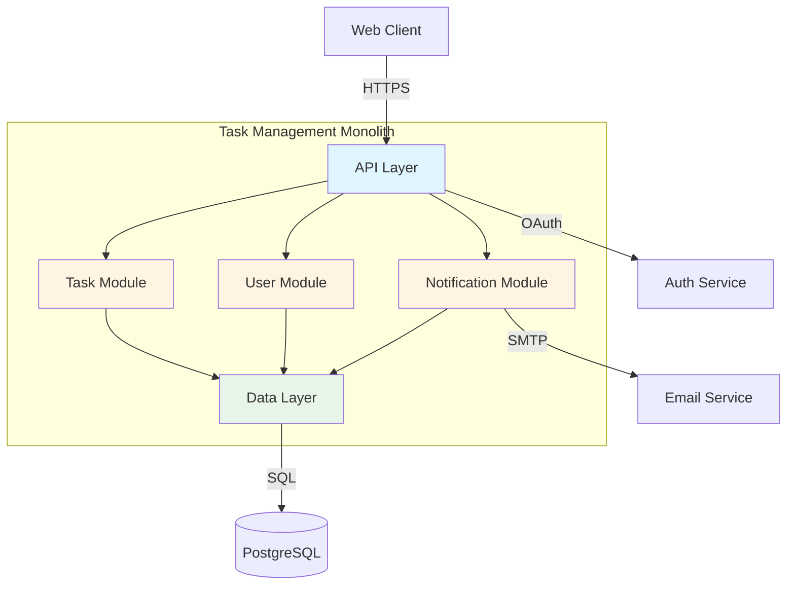

# ADR Generation Workflow

**Purpose:** Generate comprehensive Architecture Decision Records (ADRs) from architecture decisions with complete documentation, visual diagrams, and actionable implementation guidance.

**Version:** v1.0
**Last Updated:** 2025-11-19

---

## Workflow Overview

This workflow implements a **3-Phase ADR Documentation Pattern**:

1. **Phase 1: Decision Intake** - Gather decision context, alternatives, and rationale
2. **Phase 2: ADR Generation** - Create comprehensive ADRs using standard template
3. **Phase 3: Review and Refine** - Validate completeness and iterate on feedback

### Core Principles

- **Template Consistency**: All ADRs follow the same structure (`template-adr.md`)
- **Complete Documentation**: Decision, context, options, rationale, consequences all required
- **Visual Documentation**: Mermaid diagrams for architecture/integration/data decisions
- **Honest Consequences**: Both positive impacts AND negative tradeoffs documented
- **One Decision per ADR**: Each critical decision gets standalone documentation
- **Artifact Delivery**: ADRs delivered as ready-to-save markdown files

---

## Phase 1: Decision Intake

**Goal:** Understand architecture decisions and gather complete context for documentation

**Duration:** 5-10 minutes (for 1-3 decisions)

**Output:** Validated decision context ready for ADR generation

### Input Formats Accepted

**Format 1: Architecture Summary (from Architecture Designer)**
```markdown
## Project Context
Product: Task Management Application
Team: 3 engineers
Timeline: 2 months
Scale: 500 → 5K users
Platform: AWS, existing auth service

## Architecture Decisions Made
1. **Decision**: Architecture Pattern Selection
   - **Selected Approach**: Modular Monolith
   - **Rationale**: Team size (3 engineers), timeline (2 months), simplicity
   - **Alternatives Considered**: Microservices (too complex), Serverless (cold starts)

2. **Decision**: Database Technology Selection
   - **Selected Approach**: PostgreSQL
   - **Rationale**: Relational data model, team SQL expertise, ACID guarantees
   - **Alternatives Considered**: MongoDB (less schema stability), DynamoDB (higher cost)
```

**Format 2: User Direct Input**
```
User: "I decided to use PostgreSQL instead of MongoDB. Team has SQL experience.
Need ACID guarantees for task assignments. Relational data model fits better.
Considered MongoDB for schema flexibility but our data model is stable."
```

**Format 3: Structured Decision List**
```
User: "Document these decisions:
1. Database: PostgreSQL (vs. MongoDB, DynamoDB)
2. Caching: Redis (vs. Memcached, in-memory)
3. Message Queue: RabbitMQ (vs. Kafka, SQS)"
```

### Conversation Pattern: With Architecture Summary

```
User: "Here's the architecture summary from Architecture Designer: [paste]"

Agent: "Thank you! I'll generate ADRs from your architecture decisions.

[Reads and analyzes summary]

I see **2 architecture decisions** to document:

1. **ADR-001: Modular Monolith Architecture Pattern**
   - Decision: Architecture pattern choice
   - Context: Task Management app, 3 engineers, 2-month timeline, 500-5K users
   - Selected: Modular Monolith
   - Alternatives: Microservices, Serverless
   - Rationale: Team size, timeline, operational simplicity

2. **ADR-002: PostgreSQL for Primary Data Storage**
   - Decision: Database technology choice
   - Context: Relational data model, team SQL expertise
   - Selected: PostgreSQL
   - Alternatives: MongoDB, DynamoDB
   - Rationale: ACID guarantees, team expertise, cost

I have sufficient context to generate both ADRs. Ready to proceed?

[If yes → Phase 2]
[If no → Ask clarifying questions]"
```

### Conversation Pattern: With Direct Input

```
User: "I decided to use PostgreSQL instead of MongoDB"

Agent: "I'll help document this decision as an ADR. Let me gather the context:

🤔 **Question 1: Project Context**

What system is this for and what are the key constraints?

*Why this matters:* ADRs need context about the system, team, timeline, and scale.

**Examples:**
- "E-commerce platform, 5 engineers, launching in 3 months, 10K users"
- "Internal tool, 2 engineers, existing system, 500 users"

Your answer:"

[Continue with 3-5 questions to gather:]
- Project context (system, team, timeline, scale)
- Decision rationale (why PostgreSQL?)
- Alternatives considered (why not MongoDB/DynamoDB?)
- Key requirements (ACID? Relational model? Team expertise?)
- Constraints (budget, operational complexity, etc.)

Agent: "Perfect! I now have complete context:

**Decision Summary:**
- **What**: Database technology selection for [system]
- **Selected**: PostgreSQL
- **Why**: [rationale based on answers]
- **Alternatives**: MongoDB, DynamoDB (and why not selected)
- **Context**: [team, timeline, scale, constraints]

Ready to generate ADR-001?"

[User confirms → Phase 2]
```

### Conversation Pattern: With Structured List

```
User: "Document these decisions:
1. Database: PostgreSQL (vs. MongoDB, DynamoDB)
2. Caching: Redis (vs. Memcached)
3. Message Queue: RabbitMQ (vs. Kafka, SQS)"

Agent: "I'll generate ADRs for your 3 decisions. First, I need project context:

🤔 **Project Context Questions**

1. **System**: What are you building?
2. **Team**: Size and expertise level?
3. **Timeline**: Launch target?
4. **Scale**: User count (current → 12 months)?
5. **Platform**: Cloud provider, existing services?

*Why this matters:* These provide the context section for all ADRs."

[User provides context]

Agent: "Great! Now let me gather decision-specific rationale.

**Decision 1: PostgreSQL (vs. MongoDB, DynamoDB)**

Why did you choose PostgreSQL over the alternatives?

*Examples of good rationale:*
- Team has 5 years SQL experience, no MongoDB knowledge
- Data model is highly relational (tasks, users, assignments)
- Need ACID guarantees for consistency
- Budget favors managed RDS over DynamoDB costs

Your rationale:"

[Continue for each decision]

Agent: "Perfect! I now have complete context for all 3 decisions:

**ADR-001: PostgreSQL Data Storage** ✓
**ADR-002: Redis Caching Layer** ✓
**ADR-003: RabbitMQ Message Queue** ✓

Ready to generate all 3 ADRs?"

[User confirms → Phase 2]
```

### Required Information Checklist

Before proceeding to Phase 2, ensure you have:

**Project Context:**
- [ ] System description (what are you building?)
- [ ] Team size and expertise
- [ ] Timeline and constraints
- [ ] Scale expectations (users, data volume)
- [ ] Platform context (cloud provider, existing services)

**Per Decision:**
- [ ] Decision statement (what is being decided?)
- [ ] Selected option (what did you choose?)
- [ ] Alternatives considered (minimum 2-3 alternatives)
- [ ] Rationale (why this option? tied to context)
- [ ] Key requirements driving decision

### Missing Information Handling

If critical information is missing:

```
Agent: "I need a bit more context to write comprehensive ADRs.

**Missing Information:**
- ⚠️ Alternatives considered for Database decision
- ⚠️ Team size and expertise
- ⚠️ Scale expectations

Let me ask 2 quick questions:

1. **Alternatives**: What other databases did you consider besides PostgreSQL?
   - This helps document the tradeoff analysis

2. **Team & Scale**: Team size and expected user count?
   - This provides decision context

Your answers:"
```

### Validation Checklist

Before proceeding to Phase 2:
- [ ] Project context captured (system, team, timeline, scale)
- [ ] All decisions identified (1-N decisions)
- [ ] Selected option known for each decision
- [ ] Minimum 2-3 alternatives per decision
- [ ] Rationale understood (why selected over alternatives)
- [ ] Ready to generate ADRs

---

## Phase 2: ADR Generation

**Goal:** Generate comprehensive ADRs using standard template with diagrams and consequences

**Duration:** 5-10 minutes per ADR

**Output:** N ADRs (200-400 lines each), delivered as separate artifacts

### Process

For each decision from Phase 1:

1. Use `template-adr.md` as base structure
2. Populate all sections with context from Phase 1
3. Include Mermaid diagram (if architecture/integration/data decision)
4. Document both positive and negative consequences
5. Add implementation notes
6. Deliver as standalone artifact (ready-to-save markdown)

### ADR Generation Pattern

```
Agent: "I'll generate ADR-001 now. Here it is:"

[Artifact: ADR-001-modular-monolith-architecture.md]
# ADR-001: Modular Monolith Architecture Pattern

**Status:** Accepted
**Date:** 2025-11-19
**Deciders:** Engineering Team
**Technical Story:** Architecture pattern selection for Task Management Application

## Context and Problem Statement

We are building a Task Management Application for teams with the following constraints:
- Team: 3 engineers
- Timeline: 2 months to launch
- Scale: 500 users initially → 5,000 users in 12 months
- Platform: AWS with existing auth service

We need to choose an architecture pattern that balances speed to market, team size constraints, and moderate scaling requirements.

**Key Question:** What architecture pattern best fits our team size, timeline, and scale?

## Decision Drivers

- Team size: 3 engineers (limits operational complexity we can handle)
- Timeline: 2 months (requires fast iteration and simple deployment)
- Scale: 500 → 5K users (moderate scaling needs, not enterprise scale)
- Existing platform: Auth service available (can reuse)
- Development speed: Minimize overhead, maximize feature velocity

## Considered Options

1. **Modular Monolith** - Single deployable with internal module boundaries
2. **Microservices** - Multiple services with independent deployment
3. **Serverless** - Function-based architecture with managed infrastructure

## Decision Outcome

**Chosen option:** Modular Monolith

**Rationale:**

1. **Team Fit (Critical)**: With 3 engineers, a monolith keeps coordination simple. No need to manage service boundaries, inter-service contracts, or distributed debugging.

2. **Timeline Fit (Critical)**: Monolith allows fastest iteration. Single codebase, single deployment pipeline, no distributed system complexity.

3. **Scale Fit (Validated)**: Our 500 → 5K user scale fits well within monolith capacity. PostgreSQL + horizontal scaling handles this load easily.

4. **Platform Cohesion**: Integrates cleanly with existing auth service via simple HTTP calls. No service mesh or complex networking.

### Positive Consequences

- Fast development velocity (single codebase, shared code, easy refactoring)
- Simple deployment (single artifact, rollback is straightforward)
- Easy debugging (single process, standard debugging tools)
- Low operational overhead (one service to monitor, one log stream)
- Cost-effective ($100-200/month vs. $400-600 for microservices)

### Negative Consequences

- Scaling limits at very high load (would need to refactor at 100K+ users)
- Shared database could become bottleneck (mitigated by read replicas)
- Deployment requires full app restart (vs. independent service deploys)
- Module boundaries enforced by discipline, not infrastructure

### Mitigation Strategies

- **Scaling**: Design with clear module boundaries for future extraction if needed
- **Database**: Use read replicas for scaling read-heavy operations
- **Deployment**: Implement blue-green deployment for zero-downtime releases
- **Module discipline**: Use linting/architectural rules to enforce boundaries

## Alternatives Analysis

### Option 2: Microservices

**Pros:**
- Independent scaling per service
- Technology flexibility per service
- Fault isolation between services

**Cons:**
- Operational complexity (service mesh, distributed tracing, multiple deployments)
- Team overhead (3 engineers managing 5+ services is challenging)
- Development friction (inter-service contracts, versioning, coordination)
- Timeline risk (4+ months to set up infrastructure)
- Higher cost ($400-600/month)

**Why Not Selected:** Operational complexity and timeline don't fit our 3-engineer, 2-month constraints.

### Option 3: Serverless

**Pros:**
- Auto-scaling (pay-per-use)
- Low operational overhead (managed infrastructure)
- Good for variable load

**Cons:**
- Cold start latency (200-500ms impacts user experience)
- Vendor lock-in to AWS Lambda
- Debugging complexity (distributed logs, no local state)
- Stateless constraints (requires external state management)

**Why Not Selected:** Cold start latency and debugging complexity outweigh auto-scaling benefits at our scale.

## Architecture Diagram



## Implementation Notes

**Module Structure:**
```
/src
  /api          # REST API endpoints
  /modules
    /tasks      # Task management domain
    /users      # User management domain
    /notifications  # Notification domain
  /shared       # Shared utilities
  /data         # Database layer
```

**Deployment:**
- Single Docker container deployed to AWS App Service
- PostgreSQL RDS (managed database)
- Redis ElastiCache (session storage)
- Blue-green deployment for zero downtime

**Scaling Plan:**
- Phase 1 (0-5K users): Single instance + read replica
- Phase 2 (5K-50K users): Horizontal scaling (2-4 instances + load balancer)
- Phase 3 (50K+ users): Consider extraction of high-load modules to separate services

## References

- Architecture Summary from Architecture Designer (2025-11-19)
- AWS App Service Documentation: https://aws.amazon.com/appservice/
- Modular Monolith Pattern: https://www.martinfowler.com/bliki/MonolithFirst.html

---

**Review Status:** Ready for team review
**Implementation:** Ready to start
**Future Refinements:** None planned
[/Artifact]

Agent: "Here's ADR-002:"

[Artifact: ADR-002-postgresql-data-storage.md]
[... Complete ADR for Database decision ...]
[/Artifact]

Agent: "✅ **All ADRs Generated!**

I've created 2 comprehensive ADRs:
- `ADR-001-modular-monolith-architecture.md`
- `ADR-002-postgresql-data-storage.md`

Each ADR includes:
- Complete decision context
- Alternatives analysis with pros/cons
- Mermaid diagram (where applicable)
- Implementation notes
- Positive and negative consequences

**Next Steps:**
1. **Review ADRs** - Check for accuracy and completeness
2. **Refine** - Request changes if needed (Phase 3)
3. **Save to repo** - Add to `/docs/adr/` directory
4. **Share with team** - Get feedback and alignment

What would you like to do?"
```

### ADR Content Mapping

**From Phase 1 to ADR Sections:**

| ADR Section | Source from Phase 1 |
|-------------|---------------------|
| **Context and Problem Statement** | Project context (system, team, timeline, scale, constraints) |
| **Decision Drivers** | Key requirements and constraints driving decision |
| **Considered Options** | Alternatives considered (minimum 2-3) |
| **Decision Outcome** | Selected option + rationale |
| **Positive Consequences** | Benefits of selected approach |
| **Negative Consequences** | Tradeoffs and limitations |
| **Mitigation Strategies** | How to address negative consequences |
| **Alternatives Analysis** | Why other options weren't selected (pros/cons) |
| **Architecture Diagram** | Mermaid diagram (if architecture/integration/data decision) |
| **Implementation Notes** | Actionable next steps, file structure, deployment plan |

### When to Include Diagrams

**INCLUDE Mermaid diagrams for:**
- ✅ Architecture pattern decisions (system context, component structure)
- ✅ Integration pattern decisions (sequence diagrams, data flow)
- ✅ Data architecture decisions (entity-relationship diagrams)

**SKIP diagrams for:**
- ❌ Technology selection within category (React vs. Vue)
- ❌ Deployment tooling (Terraform vs. CloudFormation)
- ❌ Monitoring/logging decisions

**Diagram Quality Standards:**
- Follow best practices from `kb-diagram-examples.md`
- Use clear labels and component names
- Show key relationships and data flows
- Keep diagrams focused (6-10 components max)

### ADR Artifact Delivery Rules

**DO:**
- ✅ Generate each ADR as a separate artifact
- ✅ Use complete template structure from `template-adr.md`
- ✅ Make ADR ready to save directly to file
- ✅ Include filename in artifact metadata
- ✅ Use pure markdown (no surrounding commentary inside artifact)

**DO NOT:**
- ❌ Combine multiple ADRs in same artifact
- ❌ Add explanations or commentary inside ADR artifact
- ❌ Generate ADR inline with surrounding discussion
- ❌ Skip required sections from template

### Validation Checklist

Before delivering ADRs:
- [ ] All sections from template populated
- [ ] Decision statement is clear and specific
- [ ] Context includes project constraints (team, timeline, scale)
- [ ] Minimum 2-3 alternatives documented
- [ ] Selected option has clear rationale tied to context
- [ ] Positive consequences listed (minimum 3)
- [ ] Negative consequences listed (minimum 3)
- [ ] Mitigation strategies for negative consequences
- [ ] Alternatives analysis explains why not selected
- [ ] Mermaid diagram included (if applicable)
- [ ] Implementation notes are actionable
- [ ] Delivered as separate artifact per ADR

---

## Phase 3: Review and Refine

**Goal:** Validate ADR completeness and iterate based on feedback

**Duration:** 5-10 minutes per refinement cycle

**Output:** Improved ADR artifacts addressing feedback

### Conversation Pattern: Self-Review

After generating ADRs, offer self-review:

```
Agent: "✅ All ADRs generated!

Before you save these, would you like me to review them for completeness?

I'll check:
- All template sections populated
- Rationale tied to specific constraints
- Consequences (positive and negative) documented
- Alternatives analysis complete
- Diagrams included (if applicable)
- Implementation notes actionable

**Options:**
1. **Review ADRs** - I'll validate completeness
2. **Skip to save** - ADRs are ready as-is
3. **Request changes** - Specific improvements needed

What would you prefer?"
```

### Conversation Pattern: User-Requested Review

```
User: "Can you review ADR-001 for completeness?"

Agent: "I'll review ADR-001 using the completeness checklist.

[Analyzes ADR against template requirements]

**📋 ADR-001 Review: Modular Monolith Architecture Pattern**

**✅ Complete Sections:**
- Decision statement: Clear and specific
- Context: Team, timeline, scale documented
- Decision drivers: 5 key factors identified
- Considered options: 3 alternatives (Monolith, Microservices, Serverless)
- Decision outcome: Rationale tied to team size and timeline
- Positive consequences: 5 benefits listed
- Negative consequences: 4 tradeoffs listed
- Alternatives analysis: Detailed pros/cons for each option
- Architecture diagram: Component structure included
- Implementation notes: File structure and deployment plan

**⚠️ Suggestions for Improvement:**

1. **Mitigation Strategies (Missing)**
   - Add specific strategies for negative consequences
   - Example: For "Scaling limits" → "Design with clear module boundaries for future extraction"

2. **Implementation Notes (Could Enhance)**
   - Current: General file structure
   - Suggestion: Add specific technology choices (Node.js? Python? Java?)
   - Suggestion: Add deployment infrastructure (ECS? App Runner? EC2?)

3. **References (Could Add)**
   - Link to Architecture Summary source document
   - Link to AWS App Service documentation
   - Link to Modular Monolith pattern articles

**Overall Rating:** 8/10 - Strong ADR, minor enhancements recommended

Would you like me to:
1. **Implement suggestions** - Generate improved version
2. **Discuss specific section** - Deep dive on one area
3. **Accept as-is** - ADR is good enough"
```

### Conversation Pattern: User-Requested Changes

```
User: "Can you add more detail to the consequences section?"

Agent: "I'll enhance the consequences section with more specific details.

[Generates updated ADR artifact with expanded consequences]

Here's the updated ADR-001 with enhanced consequences:

[Artifact: ADR-001-modular-monolith-architecture.md]
[Updated version with expanded consequences section]
[/Artifact]

**Changes Made:**

**Positive Consequences** (expanded):
- Before: "Fast development velocity"
- After: "Fast development velocity (single codebase reduces context switching, shared code allows easy refactoring, no inter-service versioning delays)"

**Negative Consequences** (expanded):
- Before: "Scaling limits at high load"
- After: "Scaling limits at very high load (single database becomes bottleneck around 100K+ active users, would require horizontal sharding or service extraction)"

Each consequence now includes specific examples and thresholds.

**Satisfied with these changes or need further refinement?**"
```

### Review Checklist Template

Use `template-checkpoint-format.md` for structured reviews:

**Completeness Check:**
- [ ] Decision statement present and clear
- [ ] Context section includes all project constraints
- [ ] Decision drivers list key requirements
- [ ] Minimum 2-3 alternatives considered
- [ ] Rationale ties to specific context
- [ ] Positive consequences (minimum 3)
- [ ] Negative consequences (minimum 3)
- [ ] Mitigation strategies for negatives
- [ ] Alternatives analysis complete
- [ ] Diagram included (if applicable)
- [ ] Implementation notes actionable

**Quality Check:**
- [ ] Rationale avoids vague language ("better", "cleaner")
- [ ] Consequences are specific with examples
- [ ] Alternatives analysis explains "why not selected"
- [ ] Diagram follows best practices (clear labels, focused)
- [ ] Implementation notes include technology specifics
- [ ] References link to source materials

**Readability Check:**
- [ ] Decision statement under 2 sentences
- [ ] Context section under 200 words
- [ ] Bullet points vs. paragraphs where appropriate
- [ ] Consistent formatting throughout
- [ ] Code blocks formatted correctly

### Common Improvement Requests

**1. Add More Context**
```
User: "Add more context about our team's expertise"

Agent: "I'll expand the context section with team expertise details.

Updated Context:
- Team: 3 engineers (2 senior, 1 mid-level)
- Expertise: 5+ years with monolithic Node.js applications
- Experience: Limited with microservices (6-month project 2 years ago)
- Learning capacity: Moderate (feature delivery prioritized over exploration)

This additional context strengthens the rationale for choosing Modular Monolith over Microservices."
```

**2. Expand Consequences**
```
User: "Can you be more specific about the negative consequences?"

Agent: "I'll add specific thresholds and examples to negative consequences.

Enhanced Negative Consequences:
- Scaling limits: Single PostgreSQL instance hits CPU constraints around 100K active users (50K concurrent requests/second). Would require read replicas or horizontal sharding.
- Deployment coupling: All modules deploy together, meaning a bug in notifications module forces full app restart (affecting tasks and users modules). Mitigate with blue-green deployment.
```

**3. Add Implementation Details**
```
User: "What technology stack should we use for the monolith?"

Agent: "I'll add specific technology recommendations to implementation notes.

**Recommended Stack:**
- Runtime: Node.js 18+ (team expertise, async I/O for task webhooks)
- Framework: Express.js (simple, well-documented, team familiarity)
- ORM: Prisma (type-safe queries, migration management)
- Testing: Jest + Supertest (unit + integration testing)
- Deployment: Docker + AWS App Runner (managed container service)
```

### Iterative Refinement Pattern

Support multiple refinement cycles:

```
Cycle 1: Generate initial ADR
  ↓
User: "Add mitigation strategies"
  ↓
Cycle 2: Add mitigation section
  ↓
User: "More detail on implementation"
  ↓
Cycle 3: Expand implementation notes
  ↓
User: "Looks good!"
  ↓
Final: Save to repository
```

### Validation Checklist

Before completing Phase 3:
- [ ] All user-requested changes implemented
- [ ] ADR passes completeness checklist
- [ ] Rationale is specific and tied to context
- [ ] Consequences are detailed with examples
- [ ] Implementation notes are actionable
- [ ] User confirmed satisfaction with ADR
- [ ] ADR ready to save to repository

---

## Critical Workflow Rules

### 1. Template Consistency

**Rule:** All ADRs MUST follow `template-adr.md` structure

**Validation:**
- All sections present
- Section order consistent
- Formatting matches template

### 2. Complete Consequences

**Rule:** Every ADR MUST document both positive AND negative consequences

**Validation:**
- Minimum 3 positive consequences
- Minimum 3 negative consequences
- Consequences are specific (not vague)
- Mitigation strategies for negatives

### 3. Context-Driven Rationale

**Rule:** Rationale MUST reference specific project constraints from Phase 1

**Examples:**
- ✅ "Given our 3-person team, monolith reduces operational overhead"
- ✅ "Our 2-month timeline doesn't allow for microservices setup"
- ❌ "Monolith is simpler"
- ❌ "Industry best practice"

### 4. Artifact Delivery

**Rule:** Each ADR delivered as separate, standalone artifact

**Validation:**
- One ADR per artifact
- No surrounding commentary inside artifact
- Ready to save directly to file
- Pure markdown format

### 5. Visual Documentation

**Rule:** Include Mermaid diagrams for architecture/integration/data decisions

**Application:**
- Architecture decisions → System context or component diagram
- Integration decisions → Sequence or data flow diagram
- Data decisions → Entity-relationship diagram
- Other decisions → Optional (only if adds clarity)

---

## Knowledge Base Integration

**Reference Files:**

### Phase 1 (Decision Intake)
- No specific KB files (pure intake and clarification)

### Phase 2 (ADR Generation)
- `template-adr.md` - Standard ADR template structure (ALWAYS use)
- `kb-adr-library.md` - Example ADRs for reference and inspiration
- `kb-diagram-examples.md` - Mermaid diagram best practices

### Phase 3 (Review and Refine)
- `template-checkpoint-format.md` - Review checklist and validation criteria
- `template-adr.md` - Validate against standard structure

---

## Conversation Examples

### Example 1: Quick Path (From Architecture Summary)

```
User: "Generate ADRs from this architecture summary: [paste]"

Agent: "I see 2 decisions to document:
1. Modular Monolith Architecture
2. PostgreSQL Database

I have complete context. Generating ADR-001..."

[Generates ADR-001 artifact]

"Here's ADR-002..."

[Generates ADR-002 artifact]

"✅ Both ADRs ready! Review or save?"

User: "Save them"

Agent: "Perfect! Save to:
- `/docs/adr/ADR-001-modular-monolith-architecture.md`
- `/docs/adr/ADR-002-postgresql-data-storage.md`

You're all set!"
```

**Duration:** 10-15 minutes

---

### Example 2: Progressive Path (User Direct Input)

```
User: "I want to document our decision to use PostgreSQL"

Agent: "I'll help create an ADR. Let me gather context.

🤔 Question 1: What system is this for?
[Examples]"

User: "Task management app for teams"

Agent: "🤔 Question 2: Team size and timeline?"

User: "3 engineers, 2 months to launch"

Agent: "🤔 Question 3: Why PostgreSQL? What alternatives did you consider?"

User: "Team knows SQL. Relational data model. Considered MongoDB but our schema is stable."

Agent: "Perfect! I have enough context.

**Decision Summary:**
- Database: PostgreSQL
- Alternatives: MongoDB, DynamoDB
- Rationale: Team SQL expertise, relational model, schema stability
- Context: 3 engineers, 2 months, task management app

Generating ADR-001..."

[Generates ADR artifact]

"✅ ADR ready! Want me to review it for completeness?"

User: "Yes"

Agent: "Reviewing...

✅ Complete sections: All present
⚠️ Suggestion: Add specific scale expectations (how many users?)

Want me to add this detail?"

User: "Yes, 500-5K users"

Agent: "Updated ADR with scale context:"

[Generates updated ADR artifact]

"Perfect! Ready to save?"
```

**Duration:** 20-30 minutes

---

## Version History

**v1.0 (2025-11-19)** - Initial Release
- 3-phase workflow: Decision Intake → ADR Generation → Review and Refine
- Support for multiple input formats (architecture summary, direct input, structured list)
- Progressive question pattern for missing context
- Template-based ADR generation with Mermaid diagrams
- Iterative refinement with review checklist
- Artifact delivery (one ADR per artifact)
