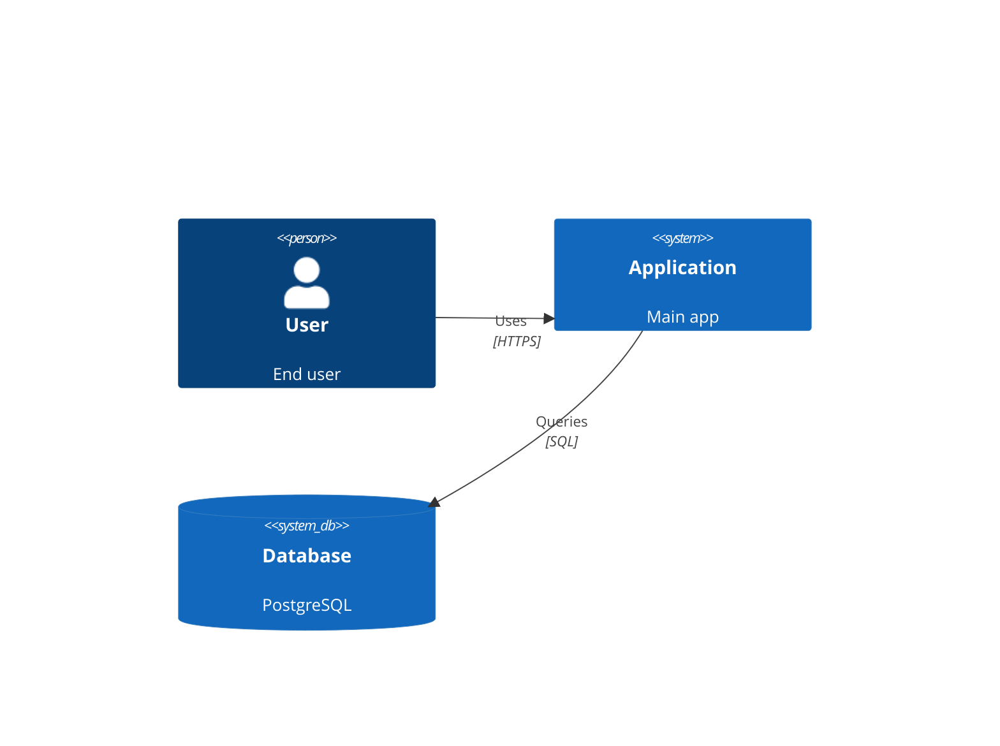

# Guide: ASCII Diagram Patterns

**Purpose:** Quick reference for creating ASCII diagrams during architecture exploration (Phases 1-2)

**When to Use:**
- Phase 2: Approach exploration (quick, scannable diagrams)
- NOT for Phase 3: ADRs use Mermaid diagrams for proper documentation

---

## 1. System Context Diagrams

**Purpose:** Show system boundaries, external actors, and data flows

### Template

```
┌─────────────────────────────────────────────────────────┐
│                  System Context                          │
├─────────────────────────────────────────────────────────┤
│                                                           │
│   [Actor] ────Protocol───> [Your System]                │
│                                  │                        │
│                                  ├──Protocol──> [Ext1]   │
│                                  ├──Protocol──> [Ext2]   │
│                                  └──Protocol──> [Ext3]   │
│                                                           │
└─────────────────────────────────────────────────────────┘
```

### Example: Task Management App

```
┌─────────────────────────────────────────────────────────┐
│              Task Management System                      │
├─────────────────────────────────────────────────────────┤
│                                                           │
│   [User] ─────HTTPS────> [Task Management App]          │
│                                 │                         │
│                                 ├──OAuth 2.0──> [Auth0]  │
│                                 │                         │
│                                 ├──SQL──> [PostgreSQL]   │
│                                 │                         │
│                                 ├──SMTP──> [SendGrid]    │
│                                 │                         │
│                                 └──REST──> [Slack API]   │
│                                                           │
└─────────────────────────────────────────────────────────┘
```

### Example: E-Commerce Platform

```
┌────────────────────────────────────────────────────────────┐
│                E-Commerce Platform                          │
├────────────────────────────────────────────────────────────┤
│                                                             │
│  [Customer] ───HTTPS──> [E-Commerce App] <──HTTPS─ [Admin]│
│                              │                              │
│                              ├─REST/JSON──> [Stripe]       │
│                              │                              │
│                              ├─REST/XML──> [ShipStation]   │
│                              │                              │
│                              ├─SQL──> [PostgreSQL]         │
│                              │                              │
│                              └─SMTP──> [SendGrid]          │
│                                                             │
└────────────────────────────────────────────────────────────┘
```

### Best Practices

- **Keep it simple**: 3-7 external systems maximum
- **Label protocols**: HTTPS, REST, SQL, SMTP, OAuth, gRPC
- **Show data flow direction**: Use arrows (───>, <───, <──>)
- **Group related actors**: Place users on left, external systems on right
- **Use consistent spacing**: Align boxes and connections

---

## 2. Component Architecture Diagrams

**Purpose:** Show internal structure and component relationships

### Template: Layered Architecture

```
┌──────────────────────────────────────────────────────┐
│              System Name                             │
├──────────────────────────────────────────────────────┤
│                                                       │
│  ┌────────────────────────────────────────────────┐ │
│  │          Presentation Layer                     │ │
│  │  [API Gateway] [Web UI] [Mobile API]           │ │
│  └──────────────────┬───────────────────────────── │ │
│                     │                                │
│  ┌─────────────────v──────────────────────────────┐ │
│  │          Business Logic Layer                   │ │
│  │  [Order Service] [User Service] [Inventory]    │ │
│  └──────────────────┬──────────────────────────────┘ │
│                     │                                │
│  ┌─────────────────v──────────────────────────────┐ │
│  │          Data Layer                             │ │
│  │  [PostgreSQL] [Redis Cache] [S3 Storage]       │ │
│  └─────────────────────────────────────────────────┘ │
│                                                       │
└──────────────────────────────────────────────────────┘
```

### Template: Modular Monolith

```
┌──────────────────────────────────────────────────────┐
│         Modular Monolith Application                 │
├──────────────────────────────────────────────────────┤
│                                                       │
│  ┌──────────┐    ┌──────────┐    ┌──────────┐      │
│  │  Users   │───>│  Tasks   │───>│ Projects │      │
│  │  Module  │    │  Module  │    │  Module  │      │
│  └────┬─────┘    └────┬─────┘    └────┬─────┘      │
│       │               │                │             │
│       v               v                v             │
│  ┌────────────────────────────────────────────┐     │
│  │        Shared Infrastructure               │     │
│  │  [Auth] [Logging] [Events] [Database]     │     │
│  └────────────────────────────────────────────┘     │
│                                                       │
└──────────────────────────────────────────────────────┘
```

### Template: Microservices

```
┌─────────────────────────────────────────────────────────┐
│                Microservices Architecture                │
├─────────────────────────────────────────────────────────┤
│                                                          │
│  [API Gateway]                                          │
│       │                                                  │
│       ├──────> [User Service] ────> [User DB]          │
│       │                                                  │
│       ├──────> [Order Service] ───> [Order DB]         │
│       │              │                                   │
│       │              └──Events──> [Kafka]              │
│       │                               │                  │
│       ├──────> [Inventory Service] <──┘                │
│       │              │                                   │
│       │              └───────────> [Inventory DB]       │
│       │                                                  │
│       └──────> [Notification Service] ─> [SendGrid]    │
│                                                          │
└─────────────────────────────────────────────────────────┘
```

### Template: Serverless

```
┌─────────────────────────────────────────────────────────┐
│            Serverless Architecture (AWS)                 │
├─────────────────────────────────────────────────────────┤
│                                                          │
│  [CloudFront] ───> [S3 Static Web]                     │
│       │                                                  │
│       └──────> [API Gateway]                           │
│                     │                                    │
│                     ├──> [Lambda: Auth] ──> [Cognito]  │
│                     │                                    │
│                     ├──> [Lambda: API] ──> [DynamoDB]  │
│                     │          │                         │
│                     │          └──> [SQS Queue]        │
│                     │                   │                │
│                     └──> [Lambda: Worker] <─┘          │
│                                                          │
└─────────────────────────────────────────────────────────┘
```

### Best Practices

- **Show clear layers**: Presentation → Business → Data
- **Indicate dependencies**: Use arrows to show data flow
- **Group related components**: Box modules or services together
- **Keep it high-level**: Don't show every class or function
- **Limit to 5-10 components**: More means you need to simplify

---

## 3. Data Flow Diagrams

**Purpose:** Show how data moves through the system

### Template

```
[Step 1] ───data──> [Step 2] ───data──> [Step 3]
   │                   │                   │
   │                   v                   v
[Storage]          [Process]           [Output]
```

### Example: User Authentication Flow

```
[User Login Form]
      │
      │ credentials (HTTPS)
      v
[API Gateway]
      │
      │ validate request
      v
[Auth Service]
      │
      ├──query──> [User DB]
      │              │
      │              │ user record
      │              v
      │         [Verify Password]
      │              │
      │              │ success
      v              v
[Generate JWT] ──token──> [Return to Client]
```

### Example: Order Processing

```
[Customer] ──place order──> [Order API]
                                │
                                ├──validate──> [Inventory Service]
                                │                    │
                                │                    │ check stock
                                │                    v
                                │              [Reserve Items]
                                │
                                ├──charge──> [Payment Service]
                                │                 │
                                │                 │ success
                                v                 v
                          [Create Order] ──event──> [Kafka]
                                │                      │
                                │                      ├──> [Shipping Service]
                                v                      │
                          [Order DB]                   └──> [Notification Service]
```

### Best Practices

- **Show data labels**: What's being passed between steps
- **Indicate protocols**: REST, Events, SQL, etc.
- **Show error paths**: Where failures go
- **Keep it focused**: One scenario per diagram
- **Use consistent direction**: Left-to-right or top-to-bottom

---

## 4. Deployment Architecture Diagrams

**Purpose:** Show infrastructure and deployment topology

### Template: Single Server

```
┌────────────────────────────────────┐
│       Production Server            │
├────────────────────────────────────┤
│                                     │
│  [Web Server: Nginx]               │
│         │                           │
│         v                           │
│  [App Server: Node.js]             │
│         │                           │
│         v                           │
│  [Database: PostgreSQL]            │
│                                     │
└────────────────────────────────────┘
```

### Template: Load Balanced

```
                [Load Balancer]
                       │
        ┌──────────────┼──────────────┐
        │              │               │
        v              v               v
   [App Server]  [App Server]   [App Server]
        │              │               │
        └──────────────┼───────────────┘
                       │
                       v
              [Database Primary]
                       │
                       │ replication
                       v
              [Database Replica]
```

### Template: Multi-Tier Cloud

```
┌──────────────────────────────────────────────────────┐
│                  AWS Cloud                            │
├──────────────────────────────────────────────────────┤
│                                                       │
│  [CloudFront CDN]                                    │
│         │                                             │
│         v                                             │
│  [Application Load Balancer]                         │
│         │                                             │
│         ├──> [ECS Container 1]                       │
│         ├──> [ECS Container 2]                       │
│         └──> [ECS Container 3]                       │
│                      │                                │
│                      v                                │
│              [RDS PostgreSQL]                         │
│                   primary                             │
│                      │                                │
│                      │ replication                    │
│                      v                                │
│              [RDS PostgreSQL]                         │
│                   standby                             │
│                                                       │
│  [ElastiCache Redis] <── caching layer              │
│                                                       │
└──────────────────────────────────────────────────────┘
```

### Best Practices

- **Show infrastructure components**: Load balancers, servers, databases
- **Indicate connections**: Network paths and protocols
- **Group by environment**: Production, staging, etc.
- **Show redundancy**: Multiple servers, replicas
- **Include cloud services**: RDS, Lambda, S3, etc.

---

## 5. Comparison Diagrams

**Purpose:** Show differences between architectural approaches side-by-side

### Template

```
Approach A (Monolith)          Approach B (Microservices)

┌──────────────────┐           ┌────────┐  ┌─────────┐
│                  │           │Service │  │Service  │
│   Single App     │           │   A    │  │   B     │
│                  │           └───┬────┘  └───┬─────┘
│  ┌────┐ ┌────┐  │               │           │
│  │ A  │ │ B  │  │               └──────┬────┘
│  └────┘ └────┘  │                      │
│                  │               ┌──────v──────┐
│  ┌─────────┐    │               │   Shared    │
│  │   DB    │    │               │     DB      │
│  └─────────┘    │               └─────────────┘
└──────────────────┘

Pros: Simple deploy      Pros: Independent scaling
Cons: Scaling limits     Cons: Operational complexity
```

### Best Practices

- **Align diagrams vertically**: Easy to compare
- **Same scale/detail level**: Fair comparison
- **List key pros/cons**: Under each diagram
- **Highlight differences**: What's unique about each

---

## ASCII Box Drawing Characters

### Common Characters

```
┌─┐  Top border
│ │  Sides
└─┘  Bottom border

├─┤  Middle connectors
┬ ┴  T-connectors
┼    Cross connector

───> Arrow right
<─── Arrow left
<──> Bidirectional

│    Vertical line
─    Horizontal line
```

### Creating Boxes

```
Simple box:
┌────────┐
│  Text  │
└────────┘

Nested boxes:
┌──────────────┐
│  Outer       │
│  ┌────────┐  │
│  │ Inner  │  │
│  └────────┘  │
└──────────────┘

Connected boxes:
┌──────┐     ┌──────┐
│  A   │────>│  B   │
└──────┘     └──────┘
```

---

## Quick Reference: When to Use Each Type

| Diagram Type | Use When | Phase |
|--------------|----------|-------|
| **System Context** | Showing external dependencies | Phase 2b |
| **Component Architecture** | Showing internal structure | Phase 2b |
| **Data Flow** | Explaining sequences or processes | Phase 2b (optional) |
| **Deployment** | Showing infrastructure | Phase 2b (optional) |
| **Comparison** | Contrasting approaches | Phase 2a (table) |

---

## Conversion to Mermaid (Phase 3)

When documenting in ADRs (Phase 3), convert ASCII diagrams to Mermaid:

**ASCII (Phase 2 - Exploration):**
```
[User] ──HTTPS──> [App] ──SQL──> [DB]
```

**Mermaid (Phase 3 - Documentation):**


**Why the conversion?**
- ASCII: Fast to create, easy to scan during exploration
- Mermaid: Professional documentation quality, renders nicely in tools

---

## Anti-Patterns to Avoid

❌ **Too much detail**
```
[User] -> [Controller] -> [Service] -> [Repository] -> [DB]
           [Validator]    [Mapper]     [QueryBuilder]
```
✅ **Right level of abstraction**
```
[User] ──> [Application] ──> [Database]
```

❌ **Inconsistent spacing**
```
[A]─>[B]
[C]  ───>  [D]
```
✅ **Consistent spacing**
```
[A] ──> [B]
[C] ──> [D]
```

❌ **Unclear flow direction**
```
[A] [B]
[C] [D]
```
✅ **Clear flow direction**
```
[A] ──> [B]
 │       │
 v       v
[C] ──> [D]
```

---

## Tips for Speed

1. **Start with a template**: Copy/paste and modify
2. **Use consistent width**: 50-60 characters wide
3. **Don't over-engineer**: ASCII is for speed, not perfection
4. **Focus on clarity**: If it's confusing, simplify
5. **Test readability**: View in monospace font

---

## Tools (Optional)

- **asciiflow.com**: Web-based ASCII diagram tool
- **MonoDraw** (Mac): Native ASCII diagram app
- **Plain text editor**: Works perfectly fine!

Most architects just use a text editor - it's faster than loading tools.
