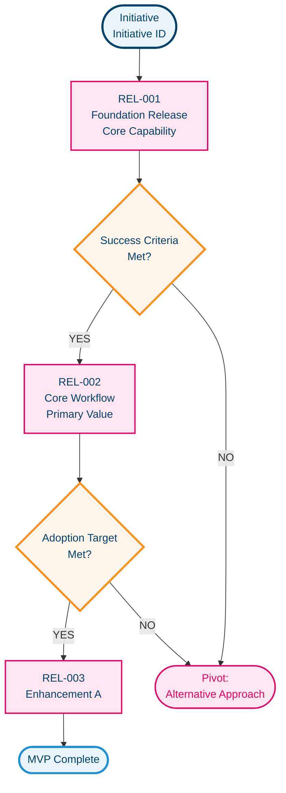
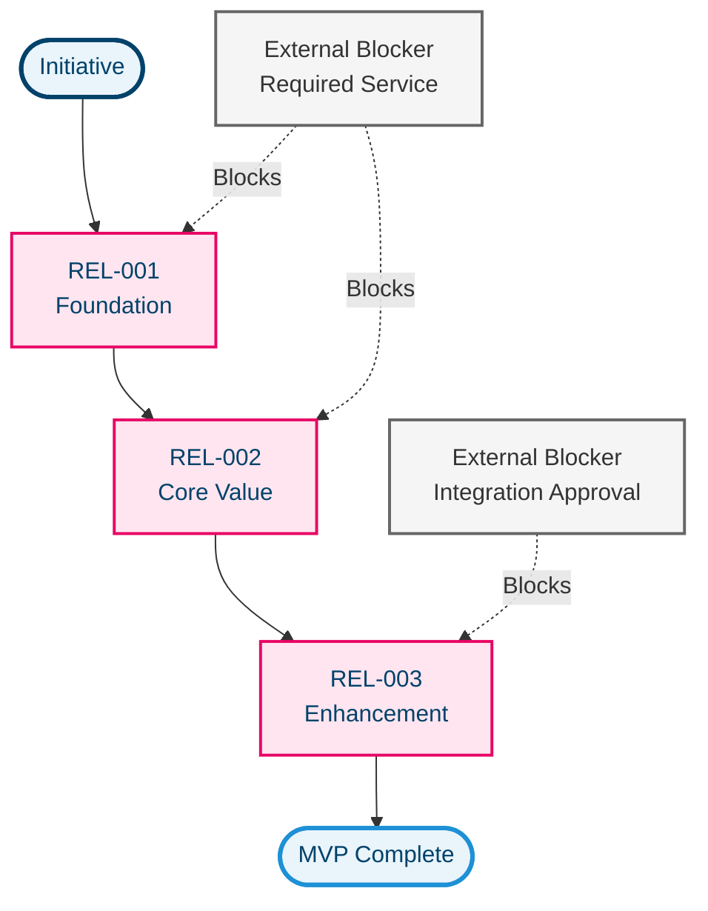
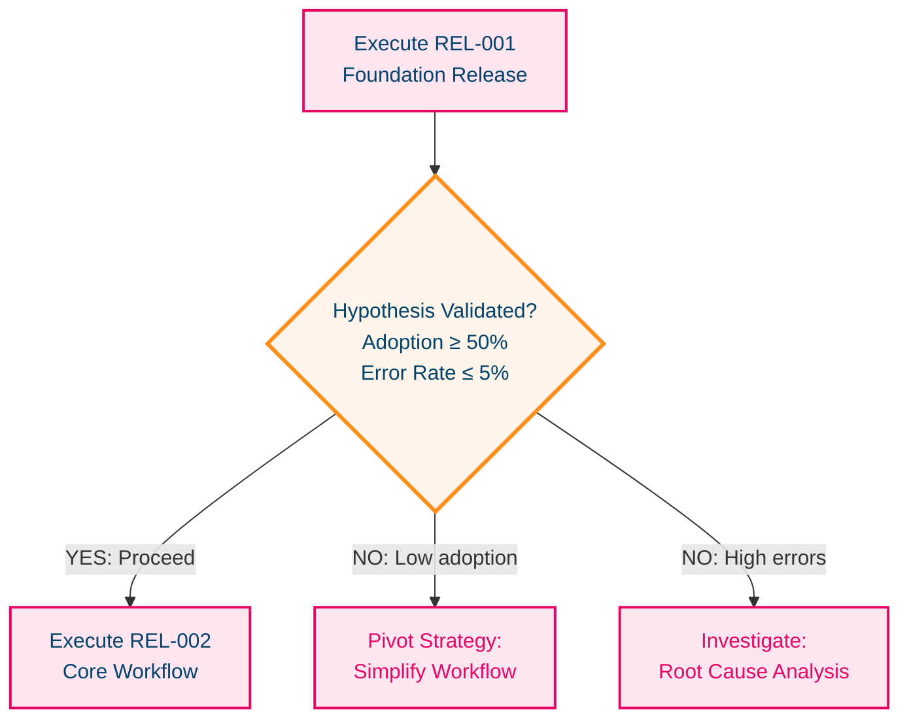
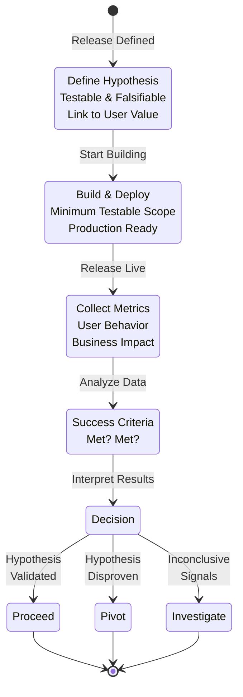

# Diagram & Visualization Guidelines v1.0

**Purpose**: Guidelines for creating effective Mermaid diagrams and visualizations for Initiative Releases.

**When to use**: After release decomposition JSON is finalized and validated. Use these guidelines for executive presentations, team alignment, architecture reviews, and release planning communications.

---

## Quick Decision: Which Diagram Type?

```
What do you need to communicate?

├─ "When do releases ship? What's the timeline?"
│  └─ Use: GANTT CHART (Timeline visualization)
│
├─ "How do releases depend on each other? What's blocked?"
│  └─ Use: FLOWCHART/GRAPH (Dependency visualization)
│
├─ "What are the decision points? When do we pivot?"
│  └─ Use: FLOWCHART (Decision logic)
│
├─ "What's the release lifecycle from hypothesis to learning?"
│  └─ Use: STATE DIAGRAM (Continuous discovery emphasis)
│
└─ "What happens if we fail? What are our pivot paths?"
   └─ Use: FLOWCHART (Risk and contingency)
```

---

## Diagram Type 1: Gantt Chart (Timeline Visualization)

### **Purpose**
Show release sequence, typical duration, and decision gates in a timeline format.

### **Best For**
- Executive summaries (when will value arrive?)
- Release planning (what's the delivery schedule?)
- Stakeholder communication (progress tracking)
- Portfolio management (release calendar)

### **Key Elements**

**What to Include**:
- ✅ Release IDs (REL-001, REL-002, etc.)
- ✅ Release names (short, user-outcome focused)
- ✅ Sequence order (visual left-to-right flow)
- ✅ Typical duration (2w, 1.5w, 1w ranges)
- ✅ Decision gates (milestones between releases)
- ✅ Dependency lines (sequential or parallel)

**What to Exclude**:
- ❌ Precise calendar dates (too specific, changes constantly)
- ❌ Developer-level details (sprint numbers, story counts)
- ❌ Implementation tasks (part of engineering planning, not product)
- ❌ Engineering team assignments (separate from product releases)

### **CoverMyMeds Color Palette**

```
MVP Releases:
  Background: #FFE5EF (light pink)
  Border: #E70665 (pink)
  Text: #00426A (navy)

Conditional Releases:
  Background: #FFF4E9 (light cream)
  Border: #FF8F1D (orange)
  Text: #00426A (navy)

Decision Gates/Milestones:
  Background: #FFF4E9 (light cream)
  Border: #FF8F1D (orange)
  Text: #00426A (navy)

Success Outcomes:
  Background: #E9F4FB (light blue)
  Border: #1E91D6 (blue)
  Text: #00426A (navy)

Pivot/Risk Paths:
  Background: #FEE6F0 (lighter pink)
  Border: #E70665 (pink)
  Text: #E70665 (pink accent)

Blockers/Dependencies:
  Background: #F5F5F5 (light gray)
  Border: #666 (medium gray)
  Text: #333 (dark gray)
```

### **Template: Basic Gantt Chart**

```mermaid
gantt
    title Initiative Release Timeline
    dateFormat X
    axisFormat %s

    section MVP Foundation
    REL-001 Foundation Release    :done, rel1, 0, 2w

    section Core Workflow
    REL-002 Core Capability       :active, rel2, after rel1, 2w

    section Enhancements
    REL-003 Enhancement A         :rel3, after rel2, 1.5w
    REL-004 Enhancement B         :rel4, after rel3, 1w

    section Decision Points
    Gate 1 Foundation Validation  :milestone, gate1, after rel1, 0d
    Gate 2 Core Workflow Check    :milestone, gate2, after rel2, 0d
    Gate 3 Enhancement Validation :milestone, gate3, after rel4, 0d
```



### **Template: Gantt with Conditional Releases**

```mermaid
gantt
    title Initiative Release Timeline with Conditional Path
    dateFormat X
    axisFormat %s

    section MVP
    REL-001 Foundation             :done, rel1, 0, 2w
    REL-002 Core Workflow          :active, rel2, after rel1, 2w

    section Standard Path
    REL-003 Enhancement A          :rel3, after rel2, 1.5w
    REL-004 Enhancement B          :rel4, after rel3, 1w

    section Conditional (If Validated)
    REL-005 Optional Feature       :crit, rel5, after rel4, 1.5w

    section Gates
    Gate 1 Proceed?                :milestone, gate1, after rel2, 0d
    Gate 2 Build Optional?         :milestone, gate2, after rel4, 0d
```



### **Best Practices**

- **Duration Ranges**: Use typical estimates (2w, 1.5w, 1w) not precise dates
- **Section Organization**: Group by category (MVP, Enhancements, Conditional)
- **Gate Placement**: Position milestones at decision points (not every release)
- **Readability**: Max 6-8 releases per Gantt (break into multiple if larger)
- **Labels**: Include release ID + short name (REL-001 Foundation Release)

### **Common Mistakes to Avoid**

❌ **Too Many Details**: Including sprint dates, team assignments, blockers
❌ **Vague Release Names**: "Feature 1", "Phase 2" (use user outcomes)
❌ **No Gates**: No indication of where decisions happen
❌ **Overlapping Releases**: Shows sequential when should be parallel
❌ **Precision Dating**: "Oct 15 - Nov 2" (changes too often)

---

## Diagram Type 2: Flowchart/Graph (Dependency Visualization)

### **Purpose**
Show how releases depend on each other, which can run parallel, what's blocked, and decision logic.

### **Best For**
- Technical architecture reviews (integration dependencies)
- Team alignment (who's building what, in what order)
- Stakeholder communication (how everything connects)
- Risk assessment (what blocks progress?)

### **Key Elements**

**What to Include**:
- ✅ Release IDs and names
- ✅ Decision gates (diamond shapes)
- ✅ Dependencies (arrows showing blocking relationships)
- ✅ Parallel paths (multiple paths from same node)
- ✅ External blockers (separate visual style)
- ✅ Success/pivot outcomes (different colored endpoints)

**What to Exclude**:
- ❌ Individual tasks (engineering detail)
- ❌ Developer assignments
- ❌ Sprint breakdown
- ❌ Story points or sizing

### **Template: Basic Dependency Graph**



### **Template: Graph with External Blockers**



### **Best Practices**

- **Node Shapes**: Rectangles = releases, Diamonds = decisions, Circles = start/end, Rounded = outcomes
- **Arrow Labels**: Use clear labels on decision branches (YES/NO, Proceed/Pivot)
- **Color Consistency**: Use palette consistently across diagrams
- **Blocker Styling**: Different color (gray) for external blockers
- **Layout**: Top-to-bottom or left-to-right (not circular)

### **Common Mistakes to Avoid**

❌ **Too Many Nodes**: More than 10-12 becomes unreadable
❌ **Spaghetti Dependencies**: Crossing lines everywhere (rearrange)
❌ **No Decision Logic**: Doesn't show why we go one path vs another
❌ **Missing Blockers**: External dependencies hidden
❌ **Unclear Labels**: Ambiguous or no labels on arrows

---

## Diagram Type 3: Flowchart (Decision Logic)

### **Purpose**
Show decision gates, go/no-go criteria, and pivot paths based on validated learning.

### **Best For**
- Continuous discovery emphasis (hypothesis → learning → decision)
- Product leadership communication (how we learn and adapt)
- Risk management (what could go wrong, what's plan B)
- Process documentation (standard decision framework)

### **Key Elements**

**What to Include**:
- ✅ Release execution (rectangles)
- ✅ Validation gates (diamonds with clear criteria)
- ✅ Success paths (proceed to next release)
- ✅ Failure paths (pivot, investigate, simplify)
- ✅ Go/no-go thresholds (% targets, metrics)
- ✅ Decision outcomes (clear endpoints)

**What to Exclude**:
- ❌ Implementation details
- ❌ Testing procedures (unit tests, QA processes)
- ❌ Engineering workflow
- ❌ Team coordination

### **Template: Decision Gate Logic**



### **Best Practices**

- **Explicit Criteria**: Show exact go/no-go thresholds (not vague)
- **Clear Outcomes**: Every path leads to clear action (not ambiguous)
- **Visual Distinction**: Success paths vs pivot paths clearly different
- **Readable Labels**: Use short phrases on decision nodes
- **One Decision Per Gate**: Not multiple unrelated decisions

### **Common Mistakes to Avoid**

❌ **Vague Criteria**: "Check if working" (not measurable)
❌ **Dead Ends**: Paths that don't lead anywhere
❌ **Too Many Options**: More than 2-3 outcomes per gate
❌ **No Metrics**: Decisions based on gut feel, not data

---

## Diagram Type 4: State Diagram (Continuous Discovery Lifecycle)

### **Purpose**
Show a release's lifecycle from hypothesis → execution → validation → learning → decision.

### **Best For**
- Emphasizing continuous discovery methodology
- Product team training (how we work)
- Process documentation (release lifecycle)
- Stakeholder education (outcome focus)

### **Key Elements**

**What to Include**:
- ✅ Hypothesis state (what we're testing)
- ✅ Execution state (building/deploying)
- ✅ Validation state (measuring metrics)
- ✅ Learning state (analyzing results)
- ✅ Decision state (proceed/pivot/stop)

**What to Exclude**:
- ❌ Engineering states (development, testing, review)
- ❌ Operational states (deployment, monitoring)
- ❌ Team workflow (sprints, standups)

### **Template: Release Lifecycle**



### **Best Practices**

- **Clear Transitions**: Show what triggers movement between states
- **Outcome Focus**: State names reflect outcomes (Hypothesis, Learning, Decision)
- **Simplicity**: Max 6-8 states (more becomes complex)
- **Labeling**: Explain what happens in each state

---

## CoverMyMeds Color Palette Reference

### **Component Colors** (Light Backgrounds with Colored Borders)

| Component | Background | Border | Text |
|-----------|-----------|--------|------|
| MVP Releases | #FFE5EF | #E70665 | #00426A |
| Conditional Releases | #FFF4E9 | #FF8F1D | #00426A |
| Decision Gates | #FFF4E9 | #FF8F1D | #00426A |
| Success Outcomes | #E9F4FB | #1E91D6 | #00426A |
| Pivot Paths | #FEE6F0 | #E70665 | #E70665 |
| External Blockers | #F5F5F5 | #666 | #333 |
| Generic Components | #FFFFFF | #00426A | #00426A |

### **Brand Colors**

- **Primary Pink**: #E70665 (CoverMyMeds brand)
- **Secondary Orange**: #FF8F1D (emphasis, alerts)
- **Accent Navy**: #00426A (primary text, professional)
- **Accent Blue**: #1E91D6 (success, positive outcomes)
- **Neutral Gray**: #F5F5F5, #999, #666, #333 (backgrounds, borders, text)

### **Usage Guidelines**

- **MVP Releases**: Always light pink (#FFE5EF) with pink border
- **Conditional/Gates**: Always cream (#FFF4E9) with orange border
- **Success Paths**: Light blue (#E9F4FB) with blue border
- **Pivot Paths**: Lighter pink (#FEE6F0) with pink border
- **Blockers**: Light gray (#F5F5F5) with gray border
- **Text**: Navy (#00426A) primary, #333 secondary

---

## When to Generate Diagrams

### **✅ Generate Diagrams AFTER**

1. Release decomposition JSON is finalized
2. All releases have clear names and user capabilities
3. Dependencies are well-defined
4. Validation Agent confirms no hallucinations
5. Sequencing rationale is documented

### **✅ Generate Diagrams FOR**

- Executive presentations (what's the timeline?)
- Architecture reviews (what's blocked?)
- Team alignment (who builds what, in what order?)
- Stakeholder communication (progress and decisions)
- Release planning (gates and contingencies)
- Risk assessment (what could derail us?)

### **❌ DO NOT Generate Diagrams FOR**

- Engineering task breakdown (use sprint boards)
- Developer assignments (use project management tools)
- Detailed testing plans (use QA documentation)
- Calendar scheduling (use planning tools)
- Budget/resource allocation (use financial tools)

---

## Diagram Best Practices

### **Do's** ✅

- **Clear Titles**: Diagram title states what's shown (e.g., "REL-001-005 Release Sequencing")
- **One Purpose**: Each diagram communicates ONE thing (not timeline + dependencies)
- **Consistent Colors**: Use palette consistently across all diagrams
- **Release IDs**: Always include release ID labels (REL-001, etc.)
- **Decision Gates**: Show explicitly as decision nodes
- **Readability**: Max complexity that fits on one page
- **Legend Only If Needed**: If colors/labels explain themselves, skip legend
- **Clean Layout**: Straight lines, minimal crossing, logical grouping

### **Don'ts** ❌

- **Mixed Concerns**: Timeline + dependencies in single Gantt
- **Redundant Legends**: Explain in titles/labels instead
- **Developer Details**: Story points, task names, sprint dates
- **Overlapping Boxes**: Rearrange to show dependencies clearly
- **Vague Labels**: Use specific release names, not "Feature 1"
- **Too Much Detail**: 10+ releases in one diagram becomes unreadable
- **Future Releases as "Coming"**: Confuses with decision gates
- **Multi-colored Text**: Stick to 2-3 text colors maximum

---

## Common Visualization Mistakes

### **Mistake 1: Timeline vs Dependency Confusion**

❌ **WRONG**: Single Gantt trying to show both timeline AND dependency blocking

✅ **CORRECT**:
- Gantt for "when do things ship?"
- Flowchart for "what blocks what?"

### **Mistake 2: Over-Complexity**

❌ **WRONG**: 15+ releases in single diagram, spaghetti dependencies

✅ **CORRECT**:
- Break into multiple diagrams (MVP phase 1, MVP phase 2)
- Or show only critical path + key decision gates

### **Mistake 3: Engineering Leakage**

❌ **WRONG**: Diagram shows sprints, story points, team assignments

✅ **CORRECT**:
- Diagram shows releases and dependencies only
- Engineering details in separate planning tools

### **Mistake 4: Vague Decision Logic**

❌ **WRONG**: "Check if working" (not measurable)

✅ **CORRECT**:
- "Adoption ≥ 50% AND Error Rate ≤ 5%"
- "Daily active users ≥ 100"
- "NPS score ≥ 8/10"

### **Mistake 5: No Pivot Paths**

❌ **WRONG**: Diagram assumes everything succeeds (no contingency)

✅ **CORRECT**:
- Show success paths
- Show pivot/investigate/simplify paths
- Make decision logic explicit

---

## Example: Complete Initiative Visualization Suite

For a well-documented initiative, generate THREE diagrams:

### **Diagram 1: Timeline Gantt**
*Answers: When do releases ship?*
- Shows MVP releases in sequence
- Includes decision gate timing
- Shows typical duration ranges
- 6-8 releases max

### **Diagram 2: Dependency Flowchart**
*Answers: How do releases depend on each other? What's blocked?*
- Shows release sequencing
- Indicates parallel paths
- Highlights external blockers
- Clear dependency lines

### **Diagram 3: Decision Logic**
*Answers: When do we proceed? When do we pivot?*
- Release execution nodes
- Validation gates with criteria
- Success/pivot/investigate outcomes
- Clear go/no-go thresholds

**All three use consistent CoverMyMeds color palette.**

---

## Quick Reference: Diagram Template Selection

```
Stakeholder Asking:

┌─ "When will this be ready?"
│  └─ Template: Gantt Chart (Timeline Visualization)
│     Key Elements: Release sequence, duration, gates
│
├─ "What depends on what? What's blocking?"
│  └─ Template: Flowchart/Graph (Dependency Visualization)
│     Key Elements: Releases, dependencies, blockers
│
├─ "How do we know it's working? What if it fails?"
│  └─ Template: Flowchart (Decision Logic)
│     Key Elements: Validation gates, criteria, pivot paths
│
└─ "Walk me through our discovery process"
   └─ Template: State Diagram (Continuous Discovery Lifecycle)
      Key Elements: Hypothesis → Execution → Validation → Decision
```

---

## Implementation Checklist

Before creating diagrams:

- ☑ Release decomposition JSON finalized
- ☑ All releases have clear user-outcome names
- ☑ Dependencies clearly documented
- ☑ Validation metrics defined
- ☑ Decision gates and criteria explicit
- ☑ Pivot/contingency paths identified
- ☑ CoverMyMeds color palette available
- ☑ Target audience identified (executives, teams, stakeholders)
- ☑ Purpose of diagram clear (timeline? dependencies? decisions?)
- ☑ Complexity appropriate (readable, not overwhelming)

---

## Summary

**Key Principles**:
1. One diagram, one purpose
2. Use appropriate diagram type for the question
3. Consistent CoverMyMeds color palette
4. Product concepts only (no engineering details)
5. Clear labeling and readable layout
6. Generate AFTER validation, not before
7. Use for communication and alignment, not planning

**When in doubt**: Flowchart for decisions, Gantt for timeline, both are useful.

**Remember**: Diagrams should clarify, not confuse. If it's hard to understand, it's too complex.
