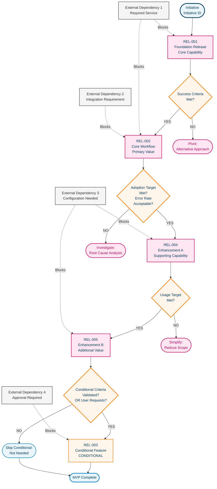

<!-- AI PROCESSING INSTRUCTIONS - DO NOT OUTPUT THIS SECTION
=================================================================

SECTION COMPLETION GUIDELINES:

Metadata Section:
- Initiative Name: Clear, outcome-focused name
- Initiative ID: Tracking identifier (INIT-XXX format)
- Total Releases: Count of all releases (MVP + CONDITIONAL + DEFER)
- Target Release: Overall initiative target (MVP Phase 1, MVP Phase 2, etc.)
- Dates: Use YYYY-MM-DD format

Release Overview - Summary Table:
- One row per release (REL-001, REL-002, etc.)
- Sequence: Delivery order (1 = first deployed)
- Priority: Composite score 0-10 (weighted by value, risk, dependency, learning)
- User Capability: One sentence - what users can NOW do
- Category: MVP (must have), CONDITIONAL (data-driven decision), DEFER (future)
- Dependencies: Brief summary (e.g., "REL-001", "None - Foundation")

Release Overview - Delivery Timeline:
- Create Mermaid Gantt chart showing release sequence
- Include decision gates after key releases
- Show critical path and parallel work
- Mark CONDITIONAL releases visually distinct
- Use realistic timeframes (not placeholder "1w")

Release Overview - Release Dependencies:
- Create Mermaid graph showing release relationships
- Use decision gates (diamonds) for proceed/skip decisions
- Show external blockers as separate nodes
- Color code: MVP (red), CONDITIONAL (orange), gates (orange), complete (blue)
- Include pivot/skip paths for conditional releases

Key Insights Section:
- Fastest Path: Describe quickest route to core value (specific REL IDs)
- Optional Enhancements: List CONDITIONAL/DEFER releases and what they add
- Critical Blockers: List external dependencies with owning teams
- Decision Gates: Describe proceed/skip criteria after key releases

Detailed Releases:
- One full section per release
- Category: Choose MVP, CONDITIONAL, or DEFER
- Priority Score: 0-10 with scoring breakdown
- Value Summary: One sentence max - specific user outcome
- User Capabilities: 3-5 bullet points of what users can DO (verbs, not features)
- Key Exclusions: What's NOT in this release and why
- Hypothesis: What assumption we're testing (testable, falsifiable)
- Success Criteria: Data that proves hypothesis valid
- Key Metrics: 2-4 metrics with targets and measurement frequency
- Technical Overview: Brief list of integrations, FHIR resources, workflows
- Biggest Risk: Primary technical/business risk with mitigation
- Dependencies: Prerequisites and blocking items
- Sequencing Rationale: One sentence why this release is sequenced here

Scoring Breakdown (calculate priority):
- User Value: 0-10 (business value and user impact)
- Dependency Minimal: 0-10 (fewer dependencies = higher score)
- Technical Risk Reduction: 0-10 (reduces uncertainty = higher score)
- Learning Potential: 0-10 (validates critical assumptions = higher score)
- Priority Score: Average of four dimensions

Category Assignment Rules:
- MVP: Must have for basic functionality; enables core user value
- CONDITIONAL: Build based on validation data; proceed/skip decision after prerequisite
- DEFER: Nice to have; explicitly postponed to future phase

Release Sequencing Logic:
- Foundation releases first (enable other work)
- High learning potential early (validate assumptions)
- Technical risk reduction prioritized (de-risk architecture)
- Dependency-light releases preferred (reduce coordination)
- User value balanced with technical necessity

Validation Metrics:
- Leading indicators: User behavior, feature adoption, engagement
- Lagging indicators: Business outcomes, satisfaction scores
- Frequency: daily (high urgency), weekly (normal), end_of_release (low urgency)
- Targets: Specific percentages or thresholds

Technical Surface:
- List major components for scope clarity (not detailed sizing)
- FHIR resources involved
- Key integrations required
- Workflows orchestrated
- Biggest risk with mitigation strategy

Deployment Approach:
- feature_flag: Gradual rollout with toggle control
- beta_practices: Limited user group testing
- gradual_rollout: Percentage-based deployment
- full_release: All users immediately

================================================================= -->
|                     |        |
|---------------------|--------|
| **Initiative Name** | [Name] |
| **Initiative ID** | [ID] |
| **Total Releases** | [Number] |
| **Target Release** | [MVP Phase] |
| **Created** | [YYYY-MM-DD] |
| **Last Updated** | [YYYY-MM-DD] |

---

## Release Overview

### Summary Table

| ID | Name | Sequence | Priority | User Capability | Category | Dependencies |
|---|---|---|---|---|---|---|
| REL-001 | [Name] | 1 | 10.0 | [What users can now do] | MVP | None - Foundation |
| REL-002 | [Name] | 2 | 9.0 | [What users can now do] | MVP | REL-001 |
| REL-003 | [Name] | 3 | 8.0 | [What users can now do] | CONDITIONAL | REL-002 |
| REL-004 | [Name] | 4 | 7.0 | [What users can now do] | MVP | REL-002 |
| REL-005 | [Name] | 5 | 6.0 | [What users can now do] | MVP | REL-004 |

### Delivery Timeline

```mermaid
gantt
    title Release Delivery Sequence
    dateFormat X
    axisFormat %s

    section Foundation
    REL-001 Foundation Release    :done, rel1, 0, 1w

    section Core Workflow
    REL-002 Core Capability          :active, rel2, after rel1, 3w

    section Conditional
    REL-003 Optional Enhancement (CONDITIONAL)   :crit, rel3, after rel2, 2w

    section Enhancements
    REL-004 Enhancement A                  :rel4, after rel2, 2w
    REL-005 Enhancement B              :rel5, after rel4, 1w

    section Decision Gates
    Gate 1 Foundation Validation               :milestone, gate1, after rel1, 0d
    Gate 2 Core Workflow Validation       :milestone, gate2, after rel2, 0d
    Gate 3 Enhancement A Validation               :milestone, gate3, after rel4, 0d
    Gate 4 Conditional Decision              :milestone, gate4, after rel5, 0d
```

### Release Dependencies

### Key Insights

**Fastest Path to Value**:
[Description of quickest route to core value - typically REL-001 → REL-002 → REL-004 → REL-005]

**Optional Enhancements**:
- **REL-003**: [What this adds and when to consider it]

**Critical Blockers**:
- **[Blocker name]**: [Description] - Blocks [REL-XXX] - Owner: [Team]

**Decision Gates**:
- **After REL-001**: [Decision criteria for proceeding]
- **After REL-002**: [Decision criteria for proceeding]

---

## Detailed Releases

---

### REL-001: [Release Name]

**Category**: MVP | CONDITIONAL | DEFER
**Priority**: 10.0 / 10.0

#### Value Summary
[One sentence: what user value is delivered]

#### User Capabilities
**What users can now do**:
1. [Capability]
2. [Capability]
3. [Capability]
4. [Capability]
5. [Capability]

#### Key Exclusions
- **[Excluded capability]** → Deferred to REL-XXX because [reason]
- **[Excluded capability]** → Not planned because [reason]

#### Hypothesis & Validation

**Hypothesis**: [What we're testing - specific, testable, falsifiable]

**Success Criteria**: [What proves this worked]

**Key Metrics**:
- [Metric]: Target [X%] measured [frequency]
- [Metric]: Target [X%] measured [frequency]
- [Metric]: Target [X%] measured [frequency]

#### Technical Overview

**Integrations**: [System 1], [System 2], [System 3]

**FHIR Resources**: [Resource 1], [Resource 2], [Resource 3]

**Workflows**: [Workflow 1], [Workflow 2]

**Biggest Risk**: [Primary risk] → Mitigation: [How we'll address it]

#### Scoring Breakdown
- **User Value**: [0-10]
- **Dependency Minimal**: [0-10]
- **Technical Risk Reduction**: [0-10]
- **Learning Potential**: [0-10]

#### Dependencies

**Prerequisite Releases**: [REL-XXX] or None - Foundation

**Blocking Items**:
- [External dependency] - Impact: [Description] - Owner: [Team]

**Parallel Releases**: [REL-XXX, REL-XXX] (can be developed concurrently)

**Sequencing Rationale**: [One sentence: why this release is sequenced here]

#### Deployment

**Approach**: feature_flag | beta_practices | gradual_rollout | full_release

**Rollback Criteria**:
- [Criterion for rollback decision]
- [Criterion for rollback decision]

---

### REL-002: [Release Name]

**Category**: MVP | CONDITIONAL | DEFER
**Priority**: 9.0 / 10.0

#### Value Summary
[One sentence: what user value is delivered]

#### User Capabilities
**What users can now do**:
1. [Capability]
2. [Capability]
3. [Capability]
4. [Capability]

#### Key Exclusions
- **[Excluded capability]** → Deferred to REL-XXX because [reason]
- **[Excluded capability]** → Not planned because [reason]

#### Hypothesis & Validation

**Hypothesis**: [What we're testing - specific, testable, falsifiable]

**Success Criteria**: [What proves this worked]

**Key Metrics**:
- [Metric]: Target [X%] measured [frequency]
- [Metric]: Target [X%] measured [frequency]

#### Technical Overview

**Integrations**: [System 1], [System 2]

**FHIR Resources**: [Resource 1], [Resource 2]

**Workflows**: [Workflow 1]

**Biggest Risk**: [Primary risk] → Mitigation: [How we'll address it]

#### Scoring Breakdown
- **User Value**: [0-10]
- **Dependency Minimal**: [0-10]
- **Technical Risk Reduction**: [0-10]
- **Learning Potential**: [0-10]

#### Dependencies

**Prerequisite Releases**: REL-XXX

**Blocking Items**:
- [External dependency] - Impact: [Description] - Owner: [Team]

**Parallel Releases**: [REL-XXX, REL-XXX] (can be developed concurrently)

**Sequencing Rationale**: [One sentence: why this release is sequenced here]

#### Deployment

**Approach**: feature_flag | beta_practices | gradual_rollout | full_release

**Rollback Criteria**:
- [Criterion for rollback decision]
- [Criterion for rollback decision]

---

### REL-003: [Release Name]

**Category**: MVP | CONDITIONAL | DEFER
**Priority**: 8.0 / 10.0

#### Value Summary
[One sentence: what user value is delivered]

#### User Capabilities
**What users can now do**:
1. [Capability]
2. [Capability]
3. [Capability]

#### Key Exclusions
- **[Excluded capability]** → Deferred to REL-XXX because [reason]
- **[Excluded capability]** → Not planned because [reason]

#### Hypothesis & Validation

**Hypothesis**: [What we're testing - specific, testable, falsifiable]

**Success Criteria**: [What proves this worked]

**Key Metrics**:
- [Metric]: Target [X%] measured [frequency]
- [Metric]: Target [X%] measured [frequency]

**Failure Action**: [What happens if hypothesis proves wrong]

#### Technical Overview

**Integrations**: [System 1], [System 2]

**FHIR Resources**: [Resource 1], [Resource 2]

**Workflows**: [Workflow 1]

**Biggest Risk**: [Primary risk] → Mitigation: [How we'll address it]

#### Scoring Breakdown
- **User Value**: [0-10]
- **Dependency Minimal**: [0-10]
- **Technical Risk Reduction**: [0-10]
- **Learning Potential**: [0-10]

#### Dependencies

**Prerequisite Releases**: REL-XXX

**Blocking Items**:
- [External dependency] - Impact: [Description] - Owner: [Team]

**Parallel Releases**: [REL-XXX, REL-XXX] (can be developed concurrently)

**Sequencing Rationale**: [One sentence: why this release is sequenced here]

#### Deployment

**Approach**: feature_flag | beta_practices | gradual_rollout | full_release

**Rollback Criteria**:
- [Criterion for rollback decision]
- [Criterion for rollback decision]

---

### REL-004: [Release Name]

**Category**: MVP | CONDITIONAL | DEFER
**Priority**: 7.0 / 10.0

#### Value Summary
[One sentence: what user value is delivered]

#### User Capabilities
**What users can now do**:
1. [Capability]
2. [Capability]
3. [Capability]

#### Key Exclusions
- **[Excluded capability]** → Deferred to REL-XXX because [reason]
- **[Excluded capability]** → Not planned because [reason]

#### Hypothesis & Validation

**Hypothesis**: [What we're testing - specific, testable, falsifiable]

**Success Criteria**: [What proves this worked]

**Key Metrics**:
- [Metric]: Target [X%] measured [frequency]
- [Metric]: Target [X%] measured [frequency]

#### Technical Overview

**Integrations**: [System 1], [System 2]

**FHIR Resources**: [Resource 1], [Resource 2]

**Workflows**: [Workflow 1]

**Biggest Risk**: [Primary risk] → Mitigation: [How we'll address it]

#### Scoring Breakdown
- **User Value**: [0-10]
- **Dependency Minimal**: [0-10]
- **Technical Risk Reduction**: [0-10]
- **Learning Potential**: [0-10]

#### Dependencies

**Prerequisite Releases**: REL-XXX

**Blocking Items**:
- [External dependency] - Impact: [Description] - Owner: [Team]

**Parallel Releases**: [REL-XXX, REL-XXX] (can be developed concurrently)

**Sequencing Rationale**: [One sentence: why this release is sequenced here]

#### Deployment

**Approach**: feature_flag | beta_practices | gradual_rollout | full_release

**Rollback Criteria**:
- [Criterion for rollback decision]
- [Criterion for rollback decision]

---

### REL-005: [Release Name]

**Category**: MVP | CONDITIONAL | DEFER
**Priority**: 6.0 / 10.0

#### Value Summary
[One sentence: what user value is delivered]

#### User Capabilities
**What users can now do**:
1. [Capability]
2. [Capability]
3. [Capability]

#### Key Exclusions
- **[Excluded capability]** → Deferred to REL-XXX because [reason]
- **[Excluded capability]** → Not planned because [reason]

#### Hypothesis & Validation

**Hypothesis**: [What we're testing - specific, testable, falsifiable]

**Success Criteria**: [What proves this worked]

**Key Metrics**:
- [Metric]: Target [X%] measured [frequency]
- [Metric]: Target [X%] measured [frequency]

#### Technical Overview

**Integrations**: [System 1], [System 2]

**FHIR Resources**: [Resource 1], [Resource 2]

**Workflows**: [Workflow 1]

**Biggest Risk**: [Primary risk] → Mitigation: [How we'll address it]

#### Scoring Breakdown
- **User Value**: [0-10]
- **Dependency Minimal**: [0-10]
- **Technical Risk Reduction**: [0-10]
- **Learning Potential**: [0-10]

#### Dependencies

**Prerequisite Releases**: REL-XXX

**Blocking Items**:
- [External dependency] - Impact: [Description] - Owner: [Team]

**Parallel Releases**: [REL-XXX, REL-XXX] (can be developed concurrently)

**Sequencing Rationale**: [One sentence: why this release is sequenced here]

#### Deployment

**Approach**: feature_flag | beta_practices | gradual_rollout | full_release

**Rollback Criteria**:
- [Criterion for rollback decision]
- [Criterion for rollback decision]
