# Guide: Diagram Simplification for Business Stakeholders

This guide helps you create simple, business-friendly architecture diagrams for technology epics.

---

## The Problem

Technical architects often create diagrams that are too detailed for business stakeholders:

**Bad Diagram** ❌ (11 components, technical jargon):
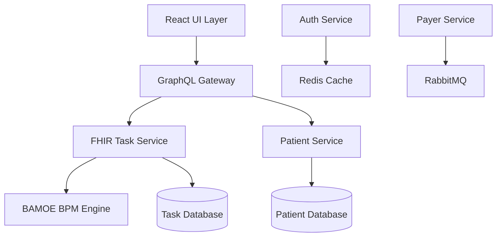

**Good Diagram** ✅ (4 components, business language):
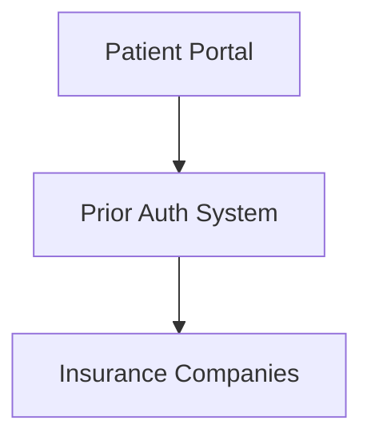

---

## The 3-6 Component Rule

**Goal**: Every epic diagram should have **3-6 components maximum**.

### Why This Matters

- **3-6 components** is the limit of what people can understand at a glance
- Business stakeholders care about **what** components do, not **how** they do it
- Detailed diagrams belong in technical documentation, not epic summaries

---

## Step-by-Step Simplification Process

### Step 1: Start with Technical Diagram

List all components in your technical architecture:

```
User Interface Layer:
- React UI
- GraphQL Gateway

Business Logic Layer:
- FHIR Task Service
- Patient Service
- Payer Service
- Auth Service

Orchestration Layer:
- BAMOE BPM Engine

Data Layer:
- Task Database
- Patient Database
- Redis Cache
- RabbitMQ Message Queue
```

**Total: 11 components** (too many!)

---

### Step 2: Group by Business Function

Ask: "From a business perspective, what are the major functional areas?"

```
Frontend:
- React UI + GraphQL Gateway
→ "Patient Portal"

Core Business Logic:
- FHIR Task Service + Patient Service + Payer Service + BAMOE BPM
→ "Prior Authorization System"

External:
- Auth Service + Insurance Companies
→ "Insurance Companies" (simplified - auth is internal detail)

Infrastructure:
- Task DB + Patient DB + Redis + RabbitMQ
→ [HIDDEN - not relevant to business stakeholders]
```

**Result: 3 components** ✅

---

### Step 3: Use Business-Friendly Names

Replace technical jargon with plain language:

| Technical Name | Business-Friendly Name | Why |
|----------------|------------------------|-----|
| React UI + GraphQL Gateway | Patient Portal | Stakeholders understand "portal" |
| FHIR Task Service + BPM | Prior Auth System | Describes what it does, not how |
| Payer Service + Auth Service | Insurance Companies | External perspective, not internal |
| Task DB + Patient DB | [Hidden] | Infrastructure details not relevant |

---

### Step 4: Draw Simplified Diagram


**Component Count: 3** ✅

**Business Value**: Stakeholders immediately understand:
- Users access a portal
- The portal connects to a prior authorization system
- The system communicates with insurance companies

---

## Common Simplification Patterns

### Pattern 1: Hide Infrastructure

**Technical View** (shows infrastructure):
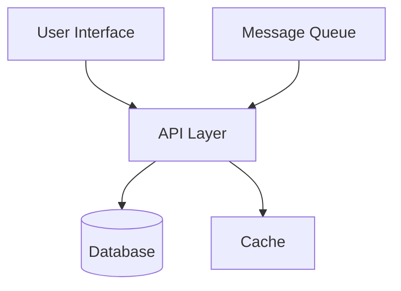

**Business View** (hides infrastructure):
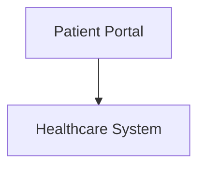

**What Changed**: Removed database, cache, message queue (infrastructure details)

---

### Pattern 2: Group Services by Function

**Technical View** (individual services):
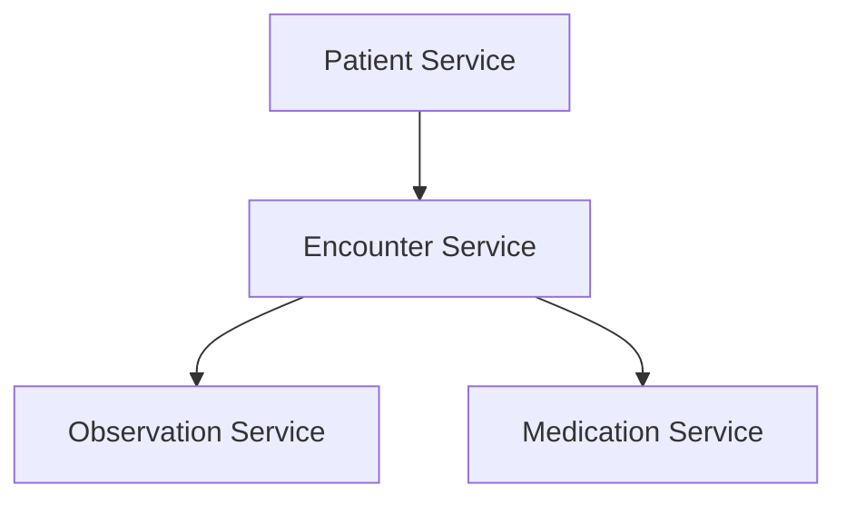

**Business View** (grouped by function):
```mermaid
graph TB
    EHR[Electronic Health Record]

    Note: Single component representing all clinical data services
```

**What Changed**: Grouped 4 services into single "EHR" component

---

### Pattern 3: External Perspective

**Technical View** (shows internal auth details):
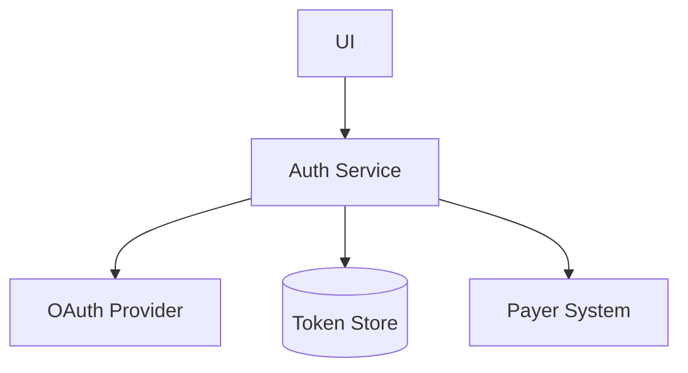

**Business View** (external perspective):
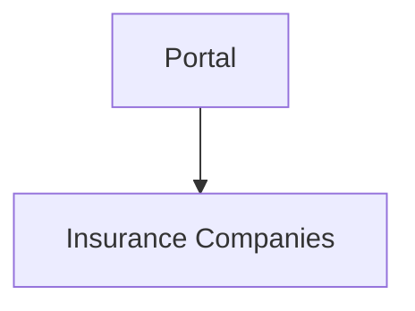

**What Changed**: Removed internal authentication components (implementation detail)

---

## Real-World Examples

### Example 1: Prior Authorization Epic

**Technical Diagram** (15 components):
- React UI, GraphQL Gateway, Auth Service, Task Service, Patient Service, Payer Adapter, BPM Engine, Notification Service, Audit Service, Task DB, Patient DB, Payer Cache, Redis, RabbitMQ, External Payer API

**Simplified Diagram** (4 components):
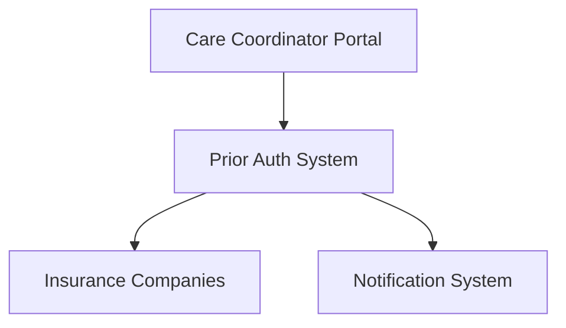

**Business Value**: Stakeholders see:
- Care coordinators use a portal
- System handles prior authorization logic
- System sends notifications
- System communicates with insurance companies

---

### Example 2: Document Management Epic

**Technical Diagram** (12 components):
- React UI, GraphQL Gateway, Document Service, Storage Adapter, Virus Scanner, OCR Service, Metadata Service, Search Service, S3 Storage, Document DB, Elasticsearch, Lambda Functions

**Simplified Diagram** (3 components):
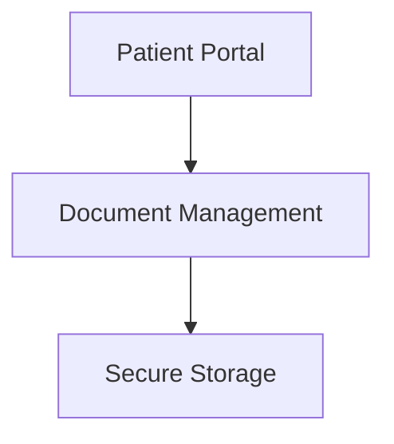

**Business Value**: Stakeholders see:
- Patients upload via portal
- System manages documents
- Documents stored securely

---

## Decision Framework: What to Keep vs Hide

### Keep in Diagram (Business-Relevant)
- ✅ User-facing applications (Portal, Mobile App)
- ✅ Major functional systems (Prior Auth System, EHR, Billing)
- ✅ External integrations (Insurance Companies, Labs, Pharmacies)
- ✅ Cross-cutting concerns (Notifications, Reporting)

### Hide in Diagram (Technical Implementation)
- ❌ Databases (Task DB, Patient DB, etc.)
- ❌ Caches (Redis, Memcached)
- ❌ Message queues (RabbitMQ, Kafka)
- ❌ Internal services (Auth Service, Audit Service)
- ❌ Middleware (GraphQL Gateway, API Gateway)
- ❌ Infrastructure (Load Balancers, CDNs)

---

## Validation Checklist

Before finalizing your simplified diagram, verify:

### Component Count
- [ ] Diagram has 3-6 components (no more, no less)
- [ ] Each component represents a major business function
- [ ] No infrastructure components visible (DBs, caches, queues)

### Business Language
- [ ] Component names use plain language (no technical jargon)
- [ ] Names describe **what** they do, not **how** they do it
- [ ] Non-technical stakeholders can understand names without explanation

### Connections
- [ ] Only major integrations shown (not every internal API call)
- [ ] Arrows show business flow (not technical dependencies)
- [ ] Diagram tells a story stakeholders can follow

### Stakeholder Test
- [ ] Can a non-technical stakeholder explain the diagram back to you?
- [ ] Does the diagram answer "What are we building?" without confusion?
- [ ] Are technical implementation details hidden?

---

## Common Mistakes

### Mistake 1: Including Too Many Components ❌

**Problem**: Trying to show every service and database

**Solution**: Group related components by business function

**Before** (10 components):
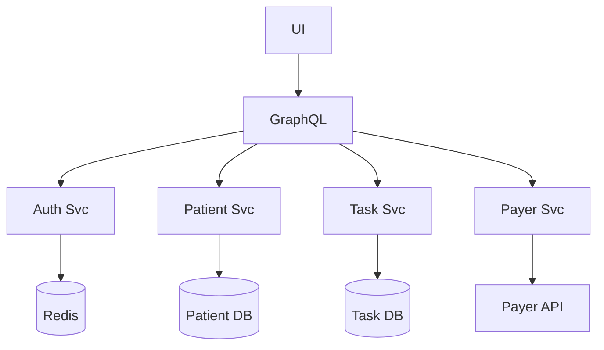

**After** (3 components):
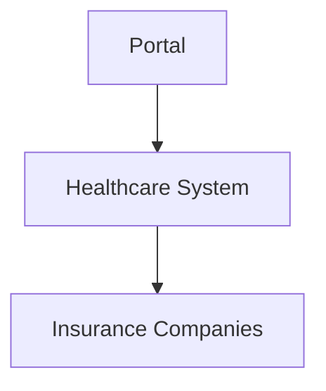

---

### Mistake 2: Using Technical Jargon ❌

**Problem**: Component names only developers understand

**Solution**: Use business-friendly terms

| ❌ Technical | ✅ Business-Friendly |
|-------------|---------------------|
| FHIR Task Service | Prior Authorization System |
| React UI + GraphQL Gateway | Patient Portal |
| Payer Integration Adapter | Insurance Companies |
| BAMOE BPM Engine | Workflow System |
| Aidbox FHIR Server | Electronic Health Record |

---

### Mistake 3: Showing Infrastructure ❌

**Problem**: Including databases, caches, queues

**Solution**: Hide infrastructure, focus on functionality

**Before**:
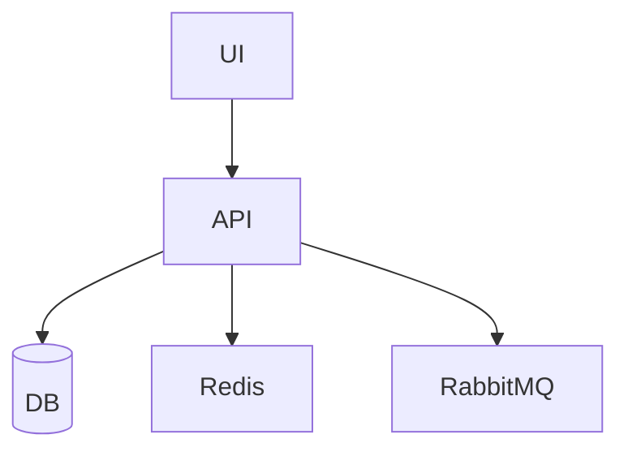

**After**:
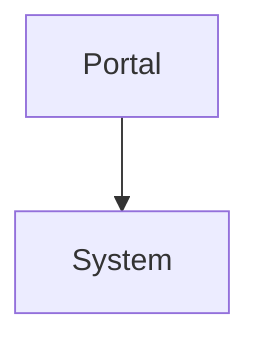

---

## Practice Exercise

### Exercise: Simplify This Technical Diagram

You have this technical diagram with 14 components:

```
Components:
- React Admin UI
- React Patient UI
- GraphQL Gateway
- Auth Service (OAuth 2.0)
- Patient FHIR Service
- Appointment FHIR Service
- Notification Service
- Email Adapter (SendGrid)
- SMS Adapter (Twilio)
- Patient Database (PostgreSQL)
- Appointment Database (PostgreSQL)
- Redis Cache
- RabbitMQ Message Queue
- External Calendar API (Google)
```

**Your Task**: Simplify to 3-6 components using business-friendly names.

<details>
<summary>Click to see solution</summary>

**Simplified Diagram** (4 components):

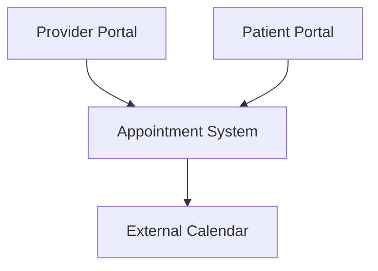

**What Changed**:
- Grouped React UIs → "Provider Portal" and "Patient Portal"
- Grouped Patient/Appointment services + Notification → "Appointment System"
- Grouped Email/SMS adapters → hidden (implementation detail)
- Hidden infrastructure (DBs, cache, queue, auth, GraphQL)
- Renamed "External Calendar API" → "External Calendar"

**Result**: 4 business-friendly components ✅

</details>

---

## Quick Reference

### Simplification Checklist
1. Start with full technical diagram
2. Group components by business function
3. Rename using plain language
4. Hide infrastructure (DB, cache, queue)
5. Verify 3-6 components
6. Test with non-technical stakeholder

### Component Count Targets
- **Too Few** (< 3): Oversimplified, missing key functions
- **Just Right** (3-6): Perfect for business stakeholders ✅
- **Too Many** (> 6): Overwhelming, too much detail

### Naming Patterns
- **Good** ✅: Portal, System, Companies, Platform
- **Bad** ❌: Service, Adapter, Engine, Gateway, Database

---

## Summary

**The Goal**: Create diagrams that business stakeholders understand at a glance.

**The Rule**: 3-6 components using plain language.

**The Test**: Can a non-technical stakeholder explain your diagram back to you?

If yes → you're done ✅

If no → simplify further 🔄
