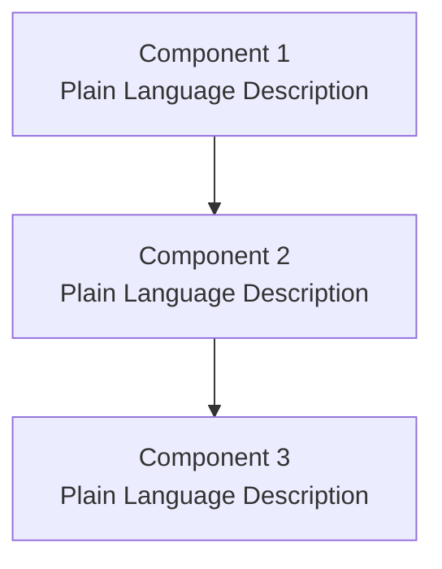
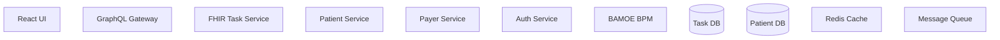
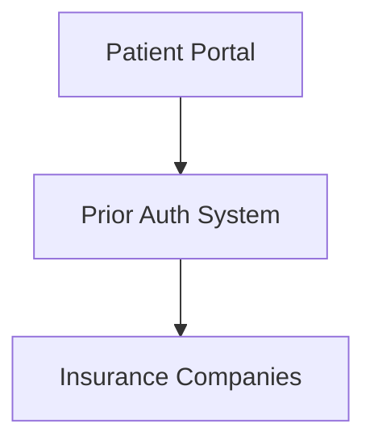

# Epic Summary Template

Use this template for each technology epic in the decomposition document.

---

## TECH-EPIC-XXX: [Epic Name]

**Iteration**: ITR-XXX
**Size**: S / M / L
**Team**: Backend / Frontend / Platform

---

### What We're Building

[2-3 sentences in plain business language describing WHAT is being built. Avoid technical jargon. Focus on business capabilities.]

**Example (Good)**:
"We're creating a system that lets care coordinators submit prior authorization requests directly from the patient record. The system will automatically check if authorization is required based on the patient's insurance, and track the status until approval or denial."

**Example (Bad - too technical)**:
"We're implementing a FHIR Task-based orchestration system with BPM workflow engine integration and REST API adapters for external payer endpoints using OAuth 2.0 authentication."

---

### Why It Matters

[1-2 sentences explaining business value and impact. Answer: "Why does this matter to the organization/users?"]

**Example (Good)**:
"This reduces administrative burden on care coordinators by eliminating manual phone calls and faxes to insurance companies. Patients get faster answers about coverage, reducing delays in treatment."

**Example (Bad - feature list)**:
"This epic delivers API integration, workflow automation, and notification services."

---

### Key Components (3-6 items)

**Component Naming Rules**:
- Use business-friendly names (not technical implementation details)
- ✅ "Prior Auth Checker", "Patient Portal", "Notification System"
- ❌ "FHIR Task Service", "GraphQL Subgraph", "OAuth Adapter"

**Diagram Simplicity**:
- 3-6 components maximum
- No internal service details
- Focus on what stakeholders need to understand

---

### Dependencies

**Depends On**:
- TECH-EPIC-XXX: [Epic Name] - [Why this must complete first]

**Blocks**:
- TECH-EPIC-XXX: [Epic Name] - [What can't start until this completes]

**Dependency Rules**:
- Only list critical blocking dependencies
- Explain WHY the dependency exists
- Don't list every possible connection

---

### Success Metrics

**How We'll Know It's Working**:
1. [Measurable metric 1] - [Target]
2. [Measurable metric 2] - [Target]
3. [Measurable metric 3] - [Target]

**Example (Good)**:
1. Prior authorization requests submitted electronically - 90%+ by end of ITR-001
2. Average approval time reduced from 5 days to 2 days
3. Care coordinator satisfaction score > 4.0/5.0

**Example (Bad - not measurable)**:
1. System works well
2. Users are happy
3. Integration is complete

---

## Common Mistakes to Avoid

### ❌ Too Much Technical Detail

**Bad**:
"This epic implements FHIR Task resources with BAMOE workflow engine orchestration, Aidbox CRUD operations, GraphQL federation subgraph, and OAuth 2.0 secured REST adapters."

**Good**:
"This epic creates a workflow system that guides care coordinators through submitting and tracking prior authorization requests with insurance companies."

---

### ❌ Feature Lists Instead of Business Value

**Bad - Why It Matters**:
"Delivers API integrations, workflow automation, notifications, and reporting."

**Good - Why It Matters**:
"Eliminates manual phone calls and faxes, reducing administrative work and getting patients faster answers about coverage."

---

### ❌ Complex Diagrams

**Bad** (11 components, internal details):

**Good** (4 components, business-focused):

---

### ❌ Non-Blocking Dependencies Listed

**Bad**:
- Depends on: TECH-EPIC-001 (Patient Service) - "Nice to have patient data"
- Depends on: TECH-EPIC-003 (Auth Service) - "Eventually needs authentication"

**Good**:
- Depends on: TECH-EPIC-001 (FHIR Foundation) - "Cannot store authorization requests without FHIR infrastructure"

---

## Template Usage Guide

### When to Use This Template

Use for **every technology epic** in the decomposition document.

### Filling Out the Template

1. **What We're Building**: Talk to a non-technical stakeholder. If they understand it, you're done.

2. **Why It Matters**: Answer: "So what?" Focus on business outcomes, not features.

3. **Key Components**: Draw the simplest diagram that explains the epic. Remove anything not essential to understanding.

4. **Dependencies**: Only list blockers. If work can start in parallel, it's not a dependency.

5. **Success Metrics**: Must be measurable. If you can't put a number to it, refine it.

---

## T-Shirt Sizing Reference

### Small (S)
- Single service or adapter
- Straightforward integration
- No complex business logic
- Example: Email notification service, simple CRUD API

### Medium (M)
- 2-3 related services/adapters
- Moderate complexity
- Standard patterns apply
- Example: Document upload/download workflow, basic reporting

### Large (L)
- 4+ related services/adapters
- Complex business rules
- Novel integration patterns
- Example: Prior authorization orchestration, multi-step approval workflow

---

## Validation Checklist

Before finalizing each epic summary, verify:

- [ ] "What We're Building" is understandable to non-technical stakeholders
- [ ] "Why It Matters" focuses on business value, not features
- [ ] Diagram has 3-6 components (no more, no less)
- [ ] Component names use plain language (no technical jargon)
- [ ] Dependencies list only critical blockers
- [ ] Success metrics are measurable (numbers/percentages/targets)
- [ ] T-shirt size matches component count and complexity
- [ ] No internal implementation details exposed
