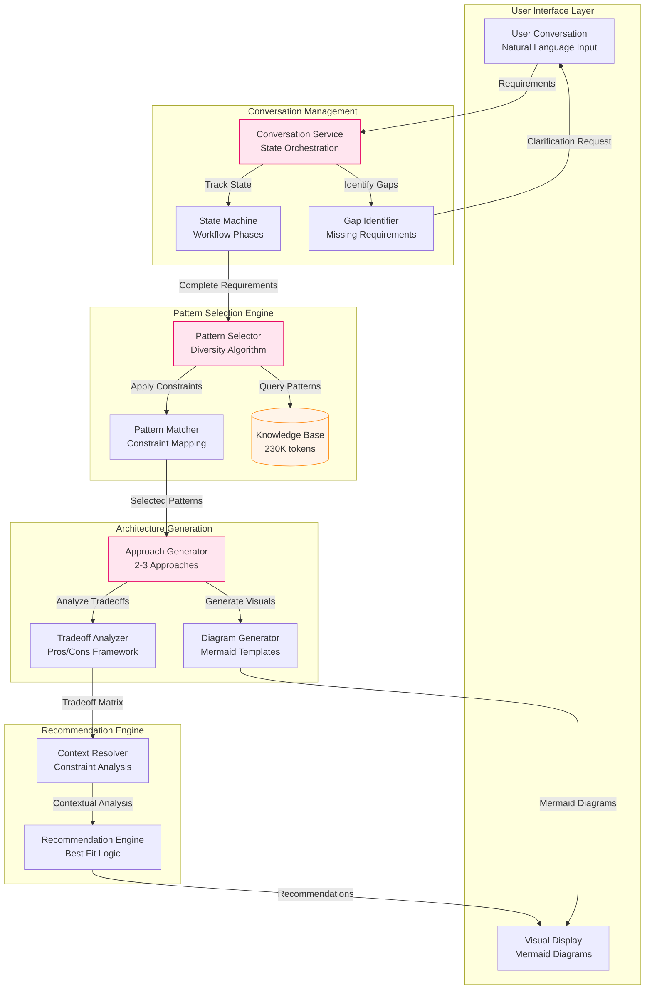
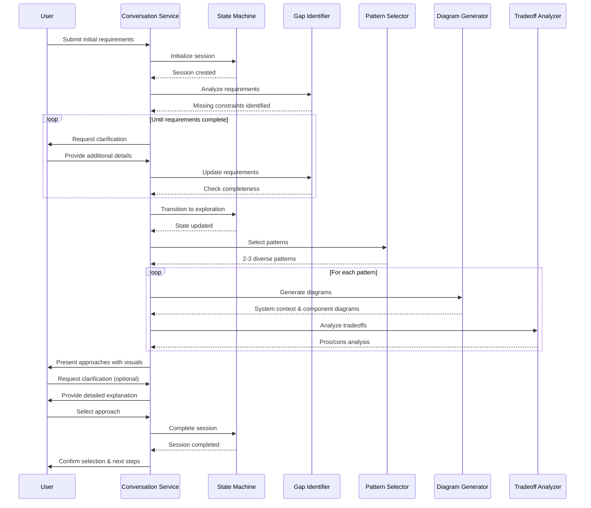

# Architecture Design Document

## Overview
**Feature:** Architecture Exploration Workflow (REL-002)
**Purpose:** Enable users to explore 2-3 distinct architectural approaches through conversational interface with visual diagrams, tradeoff analysis, and contextual recommendations

## Architecture Approach

### Design Strategy
The Architecture Exploration Workflow implements a **Conversational State Machine Pattern** with:
- **Progressive Disclosure**: Gather requirements incrementally through natural conversation
- **Pattern Matching Engine**: Select 2-3 genuinely different approaches from knowledge base
- **Visual-First Communication**: Mermaid diagrams for system context and component structure
- **Honest Tradeoff Analysis**: No silver bullets - explicit pros and cons for each approach
- **Context-Driven Recommendations**: Decisions based on stated constraints, not theoretical best practices

### Key Design Decisions

1. **Conversation State Management**: Explicit state machine tracking requirement completeness and conversation phase
2. **Pattern Selection Algorithm**: Rule-based selection ensuring diversity (e.g., monolithic vs microservices vs serverless)
3. **Diagram Generation**: Template-based Mermaid generation with dynamic component insertion
4. **Tradeoff Framework**: Structured evaluation across dimensions (complexity, scalability, team fit, cost)
5. **Knowledge Base Integration**: Direct reference to 5 core files from REL-001 during pattern selection

## Component Architecture



## Component Details

### 1. Conversation Service
**Purpose:** Orchestrate the conversational workflow and maintain state across interactions
**Location:** Core service module
**Dependencies:** State Machine, Gap Identifier, Pattern Selector

**Key Responsibilities:**
- Manage conversation context and history
- Route user input to appropriate handlers
- Coordinate between requirement gathering and architecture generation
- Ensure structured consistency despite conversational interface

**Interface:**
```typescript
interface ConversationService {
  startSession(): SessionId;
  processInput(sessionId: SessionId, input: string): Response;
  getSessionState(sessionId: SessionId): ConversationState;
  completeSession(sessionId: SessionId, selection: ArchitectureApproach): void;
}

interface ConversationState {
  phase: 'requirements' | 'exploration' | 'clarification' | 'selection';
  requirements: ProductRequirements;
  missingConstraints: string[];
  generatedApproaches?: ArchitectureApproach[];
  selectedApproach?: ArchitectureApproach;
}
```

### 2. State Machine
**Purpose:** Track conversation progress through defined workflow phases
**Location:** Workflow management module
**Dependencies:** None (pure state management)

**Key Responsibilities:**
- Define valid state transitions
- Enforce workflow progression rules
- Track completion criteria for each phase
- Enable backtracking for clarifications

**State Definitions:**
```typescript
enum WorkflowPhase {
  REQUIREMENTS_INTAKE = 'requirements',
  GAP_IDENTIFICATION = 'gap_identification',
  ARCHITECTURE_EXPLORATION = 'exploration',
  CLARIFICATION = 'clarification',
  APPROACH_SELECTION = 'selection',
  COMPLETED = 'completed'
}

interface StateTransition {
  from: WorkflowPhase;
  to: WorkflowPhase;
  condition: (state: ConversationState) => boolean;
}
```

### 3. Pattern Selector
**Purpose:** Select 2-3 genuinely different architectural patterns based on requirements
**Location:** Pattern matching module
**Dependencies:** Knowledge Base (REL-001 files)

**Key Responsibilities:**
- Query knowledge base for relevant patterns
- Ensure diversity in selected approaches (not variations of same pattern)
- Map requirements to pattern characteristics
- Filter patterns by constraint compatibility

**Selection Algorithm:**
```typescript
interface PatternSelector {
  selectPatterns(requirements: ProductRequirements): ArchitecturePattern[];
  ensureDiversity(patterns: ArchitecturePattern[]): boolean;
  rankByFitScore(pattern: ArchitecturePattern, constraints: Constraints): number;
}

interface ArchitecturePattern {
  name: string;
  category: 'monolithic' | 'microservices' | 'serverless' | 'event-driven' | 'modular';
  characteristics: PatternCharacteristics;
  constraints: SuitabilityConstraints;
}
```

### 4. Diagram Generator
**Purpose:** Generate Mermaid diagrams for system context and component structure
**Location:** Visualization module
**Dependencies:** Mermaid template library

**Key Responsibilities:**
- Create system context diagrams showing external interactions
- Generate component structure diagrams for internal architecture
- Apply consistent visual styling across all diagrams
- Dynamically insert components based on selected pattern

**Diagram Templates:**
```typescript
interface DiagramGenerator {
  generateSystemContext(approach: ArchitectureApproach): MermaidDiagram;
  generateComponentDiagram(approach: ArchitectureApproach): MermaidDiagram;
  generateSequenceDiagram(workflow: UserWorkflow): MermaidDiagram;
}

interface MermaidDiagram {
  type: 'graph' | 'sequence' | 'flowchart';
  direction: 'TB' | 'LR' | 'TD' | 'RL';
  content: string;
}
```

### 5. Tradeoff Analyzer
**Purpose:** Generate honest pros/cons analysis for each architectural approach
**Location:** Analysis module
**Dependencies:** Knowledge Base (anti-patterns, case studies)

**Key Responsibilities:**
- Evaluate approaches across standard dimensions
- Reference anti-patterns from knowledge base
- Provide quantitative comparisons where possible
- Ensure no approach presented without disadvantages

**Analysis Framework:**
```typescript
interface TradeoffAnalyzer {
  analyzeApproach(approach: ArchitectureApproach, constraints: Constraints): TradeoffAnalysis;
  compareApproaches(approaches: ArchitectureApproach[]): ComparisonMatrix;
}

interface TradeoffAnalysis {
  pros: TradeoffItem[];
  cons: TradeoffItem[];
  risks: Risk[];
  fitScore: FitScore;
}

interface TradeoffItem {
  category: 'complexity' | 'scalability' | 'cost' | 'team_fit' | 'timeline';
  description: string;
  impact: 'high' | 'medium' | 'low';
  evidence?: string; // Reference to knowledge base
}
```

## Data Models

### Core Entities

```typescript
interface ProductRequirements {
  functionalRequirements: string[];
  performanceTargets?: PerformanceRequirements;
  scaleExpectations?: ScaleRequirements;
  constraints: Constraints;
  domain?: string;
}

interface Constraints {
  teamSize: number;
  teamExpertise: string[];
  timeline: TimelineConstraint;
  budget: BudgetConstraint;
  compliance?: string[];
}

interface ArchitectureApproach {
  id: string;
  name: string;
  pattern: ArchitecturePattern;
  systemContextDiagram: MermaidDiagram;
  componentDiagram: MermaidDiagram;
  tradeoffAnalysis: TradeoffAnalysis;
  implementationNotes: string[];
}
```

### Validation Rules

- Team size: 1-100 (validate reasonable range)
- Timeline: 1-24 months (validate realistic timeline)
- Budget: 'limited' | 'moderate' | 'flexible' (enumerated values)
- At least 2 functional requirements required
- Maximum 3 approaches generated per session

## API Design

### Conversation Endpoints

```typescript
// Start new exploration session
POST /api/exploration/start
Response: {
  sessionId: string;
  message: string;
  phase: WorkflowPhase;
}

// Process user input
POST /api/exploration/message
Request: {
  sessionId: string;
  message: string;
}
Response: {
  reply: string;
  phase: WorkflowPhase;
  missingRequirements?: string[];
  approaches?: ArchitectureApproach[];
  diagrams?: MermaidDiagram[];
}

// Select approach
POST /api/exploration/select
Request: {
  sessionId: string;
  approachId: string;
}
Response: {
  confirmation: string;
  selectedApproach: ArchitectureApproach;
  nextSteps: string[];
}
```

### Error Responses

```typescript
interface ErrorResponse {
  error: {
    code: string;
    message: string;
    details?: any;
  };
}

// Common error codes
- INVALID_SESSION: Session not found or expired
- INCOMPLETE_REQUIREMENTS: Missing critical requirements
- PATTERN_SELECTION_FAILED: Unable to select suitable patterns
- DIAGRAM_GENERATION_FAILED: Mermaid diagram generation error
```

## Sequence Diagrams

### Primary User Flow: Architecture Exploration



## Technology Decisions

### Core Technologies
1. **Conversation Management**: State machine pattern (no new framework needed)
2. **Knowledge Base Access**: Direct file reference from REL-001 (230K tokens)
3. **Diagram Generation**: Mermaid.js (already available in Claude Desktop)
4. **Pattern Matching**: Rule-based selection (no ML required for MVP)

### Design Rationale
- **State Machine over AI Chat Memory**: Explicit state tracking ensures consistency
- **Rule-Based over ML Pattern Selection**: Predictable, debuggable pattern selection
- **Mermaid over Custom Diagrams**: Leverages existing rendering capability
- **Single Service over Microservices**: MVP simplicity for conversational workflow

## Test Strategy

### Test Scenarios

1. **Simple CRUD Application Test**
   - Input: User management, 2-person team, 3-month timeline
   - Expected: Monolithic approach as one option
   - Validation: Verify simplicity advantages highlighted

2. **High-Scale Platform Test**
   - Input: 1M+ users, 100 TPS, 10-person team
   - Expected: Microservices and event-driven approaches
   - Validation: Verify scalability tradeoffs presented

3. **Startup MVP Test**
   - Input: Unknown scale, 1 developer, 1-month timeline
   - Expected: Serverless or monolithic recommended
   - Validation: Verify cost/complexity tradeoffs clear

### Test Data Management
- Predefined requirement sets for consistent testing
- Constraint variation matrix for edge cases
- Pattern coverage checklist for knowledge base validation

## Non-Functional Considerations

### Performance
- Architecture generation: <60 seconds for all approaches
- Diagram rendering: <5 seconds per diagram
- Session state persistence for conversation continuity

### Reliability
- Consistent pattern selection for similar requirements
- Graceful handling of knowledge base access failures
- Session recovery after connection interruption

### Scalability
- Support multiple concurrent conversation sessions
- Knowledge base expandable to 290K tokens (REL-004)
- Pattern library extensible without code changes

## Implementation Notes

1. **MVP Constraints:**
   - Focus on 2-3 approaches (not configurable)
   - Fixed output format (no customization)
   - Single user sessions (no collaboration)

2. **Critical Success Factors:**
   - Pattern diversity algorithm must ensure genuinely different approaches
   - Tradeoff analysis must include disadvantages for every approach
   - Context-driven recommendations over generic best practices

3. **Integration Points:**
   - REL-001: Knowledge base files must be accessible
   - REL-003: Selected approach feeds into detailed design
   - REL-004: Expanded knowledge base enhances pattern selection