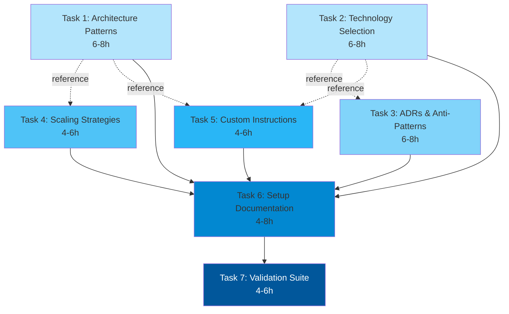

# Architecture Design Document

## Overview
**Feature:** Complete Project Setup (REL-001)
**Purpose:** Create a Claude Desktop project with comprehensive architectural knowledge base tailored for healthcare enterprise architecture with strict compliance requirements (HIPAA, SOX, SOC 2)

## Architecture Approach

### Design Strategy
The Complete Project Setup follows a **Knowledge-Driven Architecture Pattern** with healthcare-specific emphasis on:
- **Compliance-First Design**: Every architectural pattern includes audit trail and privacy considerations
- **Event-Driven Healthcare Integration**: Focus on Confluent Kafka for HL7/FHIR event processing
- **Federated GraphQL API Layer**: Apollo Federation for unified healthcare data access
- **Azure-Optimized Patterns**: Leverage managed services (AKS, Azure Functions, Azure Service Bus)

### Key Design Decisions

1. **Knowledge Base Structure**: 5 specialized files (~230K tokens) with healthcare enterprise focus in single folder with type prefixes
2. **File Naming Convention**: Prefix-based naming (kb-, custom-instructions-) for easy drag-and-drop into Claude Desktop
3. **Agent Persona**: Senior principal architect with healthcare compliance expertise
4. **Technology Prioritization**: Azure > AWS, Kafka > RabbitMQ, GraphQL > REST for healthcare integrations
5. **Compliance Integration**: HIPAA, SOX, SOC 2 requirements embedded in all patterns

## Component Architecture


## Component Details

### 1. Custom Instructions Component
**Purpose:** Define the senior principal architect persona with healthcare enterprise expertise
**Location:** Claude Desktop Project Settings
**Size:** 2,800 words

**Key Responsibilities:**
- Establish healthcare-focused architectural mindset
- Enforce compliance-first thinking (HIPAA, SOX, SOC 2)
- Prioritize Azure cloud services and managed solutions
- Emphasize event-driven patterns with Kafka
- Mandate audit trail considerations in all designs

**Structure:**
```typescript
interface CustomInstructions {
  persona: {
    role: "Senior Principal Architect";
    experience: "25+ years, healthcare enterprise focus";
    expertise: ["HIPAA", "SOX", "SOC2", "Azure", "Kafka", "FHIR"];
  };
  workflow: {
    analysis: "Requirements → Compliance Check → Pattern Selection";
    approach: "Multiple options with tradeoffs";
    priorities: ["Patient Privacy", "Audit Trails", "Financial Accuracy"];
  };
  constraints: {
    compliance: ["HIPAA", "SOX", "SOC 2"];
    technology: {
      cloud: "Azure preferred";
      messaging: "Confluent Kafka";
      api: "Apollo GraphQL Federation";
      healthcare: "FHIR via Aidbox";
    };
  };
}
```

### 2. Architecture Patterns Library (KB1)
**Purpose:** Comprehensive healthcare-focused architectural patterns
**Location:** `kb-architecture-patterns.md`
**Size:** ~50K tokens

**Content Structure:**
```typescript
interface PatternLibrary {
  patterns: {
    eventDriven: {
      focus: "HL7/FHIR event processing";
      implementation: "Confluent Kafka patterns";
      compliance: "Audit trail via event sourcing";
    };
    microservices: {
      focus: "Healthcare domain boundaries";
      examples: ["Patient Service", "Billing Service", "Clinical Service"];
      communication: "Apollo Federation, Kafka events";
    };
    dataArchitecture: {
      focus: "PHI segregation patterns";
      encryption: "At-rest and in-transit";
      auditing: "Every access logged";
    };
  };
  healthcareSpecific: {
    fhirIntegration: "Aidbox server patterns";
    hl7Processing: "Kafka streaming for HL7v2";
    consentManagement: "Patient privacy patterns";
  };
}
```

### 3. Technology Selection Guide (KB2)
**Purpose:** Healthcare enterprise technology decision framework
**Location:** `kb-technology-selection.md`
**Size:** ~50K tokens

**Decision Framework:**
```typescript
interface TechSelectionGuide {
  priorities: {
    teamExpertise: 0.40;       // Highest weight
    compliance: 0.25;           // Healthcare compliance
    ecosystem: 0.15;            // Azure ecosystem fit
    performance: 0.10;          // Clinical response times
    scalability: 0.05;          // Hospital network scale
    maintainability: 0.05;      // Long-term support
  };
  stack: {
    cloud: {
      primary: "Azure (AKS, Functions, Service Bus)";
      rationale: "Managed services, healthcare compliance";
    };
    messaging: {
      primary: "Confluent Kafka";
      rationale: "HL7/FHIR streaming, event sourcing";
    };
    api: {
      primary: "Apollo GraphQL Federation";
      rationale: "Unified healthcare data access";
    };
    healthcare: {
      fhir: "Health Samurai Aidbox";
      workflow: "IBM BAMOE";
    };
  };
}
```

### 4. ADR Library (KB3)
**Purpose:** Healthcare compliance and architecture decision records
**Location:** `kb-adr-library.md`
**Size:** ~40K tokens

**Healthcare ADR Examples:**
```typescript
interface ADRLibrary {
  template: "Standard ADR format";
  examples: [
    {
      id: "ADR-001";
      title: "FHIR Server Selection - Aidbox";
      context: "Need FHIR R4 compliance with custom resources";
      decision: "Health Samurai Aidbox";
      consequences: "Commercial license, excellent performance";
    },
    {
      id: "ADR-002";
      title: "Event Streaming for HL7";
      context: "Process 1M+ HL7 messages daily with audit trail";
      decision: "Confluent Kafka with Schema Registry";
      consequences: "Complete audit trail, replay capability";
    },
    {
      id: "ADR-003";
      title: "PHI Encryption Strategy";
      context: "HIPAA requires encryption at rest and transit";
      decision: "Azure Key Vault + TDE + TLS 1.3";
      consequences: "Compliance achieved, slight latency impact";
    },
    // 10-12 more healthcare-specific ADRs
  ];
}
```

### 5. Anti-Patterns Case Studies (KB4)
**Purpose:** Healthcare-specific architectural failures and lessons
**Location:** `kb-anti-patterns.md`
**Size:** ~30K tokens

**Healthcare Anti-Pattern Examples:**
```typescript
interface AntiPatterns {
  cases: [
    {
      name: "PHI in Application Logs";
      impact: "$2.3M HIPAA fine";
      redFlags: ["Logging request bodies", "No log sanitization"];
      fix: "Structured logging with PHI filters";
    },
    {
      name: "Missing Audit Trail";
      impact: "SOX compliance failure, trading suspension";
      redFlags: ["No event sourcing", "Database direct updates"];
      fix: "Event-driven architecture with Kafka";
    },
    {
      name: "Synchronous FHIR Calls";
      impact: "ED system 15-minute outage";
      redFlags: ["No circuit breakers", "No async processing"];
      fix: "Kafka queues with retry logic";
    },
    // 12+ more healthcare cases
  ];
}
```

### 6. Scaling Strategies (KB5)
**Purpose:** Healthcare system scaling with compliance maintained
**Location:** `kb-scaling-strategies.md`
**Size:** ~30K tokens

**Scaling Phases:**
```typescript
interface ScalingStrategies {
  phases: {
    startup: {
      users: "0-1K (Single hospital department)";
      architecture: "Monolith with audit module";
      compliance: "Basic HIPAA controls";
      azure: "App Service + Azure SQL";
    };
    growth: {
      users: "1K-10K (Multiple departments)";
      architecture: "Modular monolith + Kafka events";
      compliance: "Full audit trail, encryption";
      azure: "AKS + Azure Service Bus";
    };
    scale: {
      users: "10K-100K (Hospital network)";
      architecture: "Microservices + FHIR facade";
      compliance: "SOC 2 Type 2, SOX controls";
      azure: "Multi-region AKS + Event Hubs";
    };
    enterprise: {
      users: "100K-1M (Healthcare system)";
      architecture: "Cell-based + global Kafka";
      compliance: "Multi-jurisdiction compliance";
      azure: "Global Traffic Manager + Cosmos DB";
    };
  };
  caseStudies: [
    "Epic Systems scaling to 250M patients",
    "Cerner PowerChart performance optimization",
    "Mayo Clinic API platform evolution"
  ];
}
```

## Data Architecture


## Setup Workflow


## API Design

### Content Generation API (Claude Code)

```typescript
interface ContentGenerationAPI {
  generateKnowledgeFile(config: KnowledgeFileConfig): Promise<MarkdownContent>;
  validateTokenCount(content: string): TokenCount;
  ensureHealthcareFocus(content: string): ValidationResult;
}

interface KnowledgeFileConfig {
  filename: string;
  targetTokens: number;
  sections: Section[];
  healthcareFocus: {
    compliance: ComplianceRequirement[];
    technologies: HealthcareTech[];
    patterns: ArchPattern[];
  };
}

interface Section {
  title: string;
  subsections: string[];
  examples: number;
  healthcareContext: boolean;
}

interface ComplianceRequirement {
  standard: "HIPAA" | "SOX" | "SOC2";
  controls: string[];
  auditRequirements: string[];
}

interface HealthcareTech {
  category: "FHIR" | "EventStreaming" | "Workflow" | "Cloud";
  primary: string;
  alternatives: string[];
  complianceFeatures: string[];
}
```

### Project Configuration API

```typescript
interface ProjectConfiguration {
  project: {
    name: "Architecture Designer";
    type: "Claude Desktop Project";
  };
  customInstructions: {
    wordCount: 2800;
    sections: [
      "Persona Definition",
      "Healthcare Expertise",
      "Compliance Requirements",
      "Technology Priorities",
      "Workflow Approach",
      "Response Framework"
    ];
  };
  knowledgeBase: {
    totalTokens: 230000;
    files: KnowledgeFile[];
  };
}

interface KnowledgeFile {
  name: string;
  path: string;
  tokens: number;
  focus: string[];
  healthcareRelevance: "critical" | "high" | "medium";
}
```

## Test Strategy

### E2E Testing Approach

```typescript
interface E2ETestStrategy {
  environment: {
    platform: "Claude Desktop";
    projectFeature: "enabled";
    testProject: "Architecture Designer Test";
  };

  testSuites: {
    setup: {
      tests: [
        "Create project successfully",
        "Load all 5 knowledge files",
        "Custom instructions accepted",
        "Token count validation (~230K)"
      ];
    };

    persona: {
      tests: [
        "Healthcare expertise evident",
        "Compliance mentioned in responses",
        "Azure services prioritized",
        "Kafka/FHIR patterns suggested"
      ];
      samplePrompts: 20;
      successRate: 0.95;
    };

    knowledge: {
      tests: [
        "References architecture patterns",
        "Cites healthcare ADRs",
        "Mentions anti-patterns",
        "Includes scaling strategies",
        "Compliance always considered"
      ];
    };

    compliance: {
      prompts: [
        "Design patient data API",
        "Create billing system architecture",
        "Design clinical workflow system"
      ];
      validation: [
        "HIPAA controls mentioned",
        "Audit trail included",
        "Encryption specified",
        "Access controls defined"
      ];
    };
  };

  testData: {
    requirements: {
      mvp: "Small clinic patient portal",
      enterprise: "Multi-hospital HIE platform",
      incomplete: "Build healthcare app (no details)",
      unrealistic: "Process 1B transactions/sec on $100/month"
    };
  };
}
```

### Validation Criteria

```typescript
interface ValidationCriteria {
  knowledge: {
    filesLoaded: 5;
    totalTokens: { min: 220000, max: 240000 };
    healthcareMentions: { min: 100 };
    complianceReferences: { min: 50 };
  };

  agentBehavior: {
    personaConsistency: 0.95;
    multiApproachResponses: 0.90;
    complianceAwareness: 1.00;
    healthcareFocus: 0.85;
  };

  setupTime: {
    target: "2 hours";
    steps: [
      { task: "Generate files via Claude Code", time: "45 min" },
      { task: "Create Claude Desktop project", time: "5 min" },
      { task: "Configure custom instructions", time: "15 min" },
      { task: "Upload knowledge files", time: "10 min" },
      { task: "Validate agent responses", time: "45 min" }
    ];
  };
}
```

## Technology Decisions

### TD-001: Knowledge Base Generation Tool
**Decision:** Use Claude Code for content generation
**Rationale:**
- Can generate 230K tokens efficiently
- Ensures comprehensive healthcare coverage
- Maintains consistency across all files
- Allows iterative refinement

### TD-002: Healthcare Technology Stack Priority
**Decision:** Azure > AWS, Kafka > RabbitMQ, GraphQL > REST
**Rationale:**
- Azure: Better healthcare compliance certifications
- Kafka: Event sourcing for complete audit trails
- GraphQL: Efficient FHIR resource federation

### TD-003: Compliance-First Architecture
**Decision:** Embed compliance in every pattern
**Rationale:**
- Healthcare fines range from $100K to $50M
- SOX violations can halt trading
- Patient trust requires privacy-by-design

### TD-004: FHIR Server Selection
**Decision:** Health Samurai Aidbox as primary recommendation
**Rationale:**
- Native FHIR R4 compliance
- Excellent performance (sub-100ms queries)
- Custom resource support
- Built-in audit logging

### TD-005: Business Process Engine
**Decision:** IBM BAMOE for clinical workflows
**Rationale:**
- Open-source alternative to proprietary BPM
- BPMN 2.0 compliance
- Healthcare workflow patterns included
- Integrates with Kafka for events

## File Organization Strategy

### Single-Folder Structure with Type Prefixes

All knowledge base files are generated into a single output folder with consistent naming prefixes for easy organization and drag-and-drop into Claude Desktop projects. Custom instructions are stored at the root level since they are configured in Claude Desktop settings rather than uploaded as files.

```
output/
├── kb-architecture-patterns.md (~50K tokens)
├── kb-technology-selection.md (~50K tokens)
├── kb-adr-library.md (~40K tokens)
├── kb-anti-patterns.md (~30K tokens)
└── kb-scaling-strategies.md (~30K tokens)

custom-instructions-healthcare-architect.md (2,800 words) - Root level
```

**Naming Convention Benefits:**
- **Type Prefixes**: `kb-` for knowledge base files, `custom-instructions-` for persona configuration
- **Easy Sorting**: Files group alphabetically by type
- **Clear Purpose**: Filename immediately indicates content category
- **Drag-and-Drop**: Select all files in folder and upload to Claude Desktop in one operation
- **Version Control**: Easy to track changes with descriptive names

**File Type Prefixes:**
- `custom-instructions-`: Agent persona and behavior configuration (2,800 words)
- `kb-`: Knowledge base content files (~230K tokens total)

## Traceability

This section maps requirements → design components → implementation tasks to ensure complete coverage.

### Requirements → Design Components Mapping

| Requirement ID | Acceptance Criteria | Design Component(s) | Implementation Task(s) |
|---------------|---------------------|---------------------|------------------------|
| **Story 1** | AC-1, AC-2, AC-3 | Custom Instructions Component | Task 5: Create custom-instructions-healthcare-architect.md |
| **Story 2** | AC-4 | Architecture Patterns Library (KB1) | Task 1: Generate kb-architecture-patterns.md |
| **Story 2** | AC-5 | Technology Selection Guide (KB2) | Task 2: Generate kb-technology-selection.md |
| **Story 2** | AC-6 | ADR Library (KB3) | Task 3: Generate kb-adr-library.md |
| **Story 2** | AC-7 | Anti-Patterns Case Studies (KB4) | Task 3: Generate kb-anti-patterns.md |
| **Story 2** | AC-8 | Scaling Strategies (KB5) | Task 4: Generate kb-scaling-strategies.md |
| **Story 3** | AC-9, AC-10, AC-11 | Custom Instructions Component + All KB Files | Task 5: Custom instructions define persona behavior |
| **Story 4** | AC-12, AC-13 | Setup Workflow Documentation | Task 6: Document manual setup process |

### Design Component → Task Mapping

| Design Component | Primary Purpose | Task(s) | Deliverable File(s) |
|------------------|-----------------|---------|---------------------|
| **Custom Instructions** | Define senior principal architect persona with healthcare expertise | Task 5 | `custom-instructions-healthcare-architect.md` (root level) |
| **KB1: Architecture Patterns** | Healthcare-focused architectural patterns with compliance | Task 1 | `output/kb-architecture-patterns.md` |
| **KB2: Technology Selection** | Technology decision frameworks prioritizing Azure/Kafka/GraphQL | Task 2 | `output/kb-technology-selection.md` |
| **KB3: ADR Library** | Architecture decision records with healthcare examples | Task 3 | `output/kb-adr-library.md` |
| **KB4: Anti-Patterns** | Healthcare-specific failure case studies with financial impact | Task 3 | `output/kb-anti-patterns.md` |
| **KB5: Scaling Strategies** | Healthcare system scaling with compliance maintained | Task 4 | `output/kb-scaling-strategies.md` |
| **Setup Documentation** | Manual setup process documentation | Task 6 | README.md updates, setup guide |
| **Validation Suite** | Test prompts to validate agent persona and knowledge | Task 7 | Validation test suite |

### Acceptance Criteria Coverage Matrix

| Acceptance Criteria | Covered By | Verification Method |
|---------------------|------------|---------------------|
| **AC-1**: Project configuration | Custom Instructions Component | Manual setup verification |
| **AC-2**: Knowledge base upload | All 5 KB files | File upload success + token count |
| **AC-3**: Agent persona validation | Custom Instructions + KB files | 20 test prompts (≥95% pass rate) |
| **AC-4**: Architecture patterns content | KB1 component | Token count verification (~50K) |
| **AC-5**: Technology selection content | KB2 component | Decision framework validation |
| **AC-6**: ADR library content | KB3 component | ADR template + 7+ examples |
| **AC-7**: Anti-patterns content | KB4 component | 5+ case studies with financial impact |
| **AC-8**: Scaling strategies content | KB5 component | 4 scaling phases documented |
| **AC-9**: Multi-approach responses | Custom Instructions persona | Test prompt validation |
| **AC-10**: Incomplete requirements handling | Custom Instructions persona | Validation with incomplete reqs |
| **AC-11**: Technology recommendations | KB2 + Custom Instructions | Weighted scoring verification |
| **AC-12**: Setup time <2 hours | Setup Documentation | Timed setup test |
| **AC-13**: Setup reproducibility | Setup Documentation | Independent setup test |

### Healthcare Focus Areas Coverage

| Focus Area | Design Component | Implementation | Validation |
|-----------|------------------|----------------|------------|
| **FHIR Integration** | KB1 (Architecture Patterns), KB2 (Aidbox FHIR) | Aidbox patterns, GraphQL federation | Referenced in responses |
| **Event Architecture** | KB1 (Event-Driven), KB2 (Confluent Kafka) | Kafka streaming patterns, event sourcing | ADR-002 validation |
| **Business Process** | KB2 (IBM BAMOE) | Workflow engine integration | Technology selection guide |
| **HIPAA Compliance** | All KB files, Custom Instructions | PHI encryption, audit logs, access controls | AC-3 persona validation |
| **SOX Compliance** | KB3 (ADRs), KB4 (Anti-patterns) | Immutable audit trail, event sourcing | Financial system patterns |
| **SOC 2 Compliance** | KB1 (Security patterns), KB5 (Scaling) | Security controls, disaster recovery | Compliance checklists |

### Task Dependencies



**Dependency Notes**:
- Tasks 1-5 are **parallel** (can run simultaneously)
- Task 4 references patterns from Task 1
- Task 5 (Custom Instructions) references content from Tasks 1-2
- Task 6 (Setup Documentation) requires Tasks 1-5 complete
- Task 7 (Validation) is the final task, depends on Task 6

### Verification Checklist

- [ ] All 13 acceptance criteria mapped to design components
- [ ] All 6 design components mapped to implementation tasks
- [ ] All 7 tasks produce concrete deliverables
- [ ] Healthcare focus areas covered across all knowledge base files
- [ ] Compliance requirements (HIPAA, SOX, SOC 2) integrated throughout
- [ ] Technology stack (Azure, Kafka, GraphQL, Aidbox) prioritized in all files
- [ ] Setup process documented and reproducible
- [ ] Validation suite covers persona consistency and knowledge accessibility

## Implementation Notes

### Manual Setup Process
1. **Generate Knowledge Base Files** (45 minutes)
   - Use Claude Code to generate each file
   - Verify token counts and healthcare focus
   - Review for compliance coverage

2. **Create Claude Desktop Project** (5 minutes)
   - Open Claude Desktop
   - Create new project "Architecture Designer"
   - Enable project features

3. **Configure Custom Instructions** (15 minutes)
   - Copy 2,800-word instructions
   - Paste into project settings
   - Save configuration

4. **Upload Knowledge Files** (10 minutes)
   - Upload 5 markdown files
   - Verify successful loading
   - Check token count (~230K)

5. **Validate Agent Behavior** (45 minutes)
   - Test with 20 healthcare prompts
   - Verify compliance awareness
   - Confirm multi-approach responses
   - Document any issues

### Critical Success Factors
- Healthcare patterns dominate examples
- Compliance mentioned in every response
- Azure services prioritized appropriately
- Audit trails always considered
- Patient privacy never compromised

## Risks and Mitigations

| Risk | Impact | Mitigation |
|------|--------|------------|
| Token limit exceeded | High | Monitor file sizes during generation |
| Insufficient healthcare focus | High | Validate with healthcare-specific prompts |
| Missing compliance coverage | Critical | Audit all patterns for HIPAA/SOX/SOC2 |
| Generic responses | Medium | Strengthen healthcare examples in knowledge base |
| Setup complexity | Low | Detailed step-by-step documentation |

## Success Metrics

- **Setup Completion:** 100% of files load successfully
- **Healthcare Focus:** ≥85% of responses mention healthcare context
- **Compliance Awareness:** 100% of responses consider compliance
- **Multi-Approach:** ≥90% provide 2-3 architectural options
- **Azure Priority:** ≥80% recommend Azure services first
- **Setup Time:** <2 hours following documentation