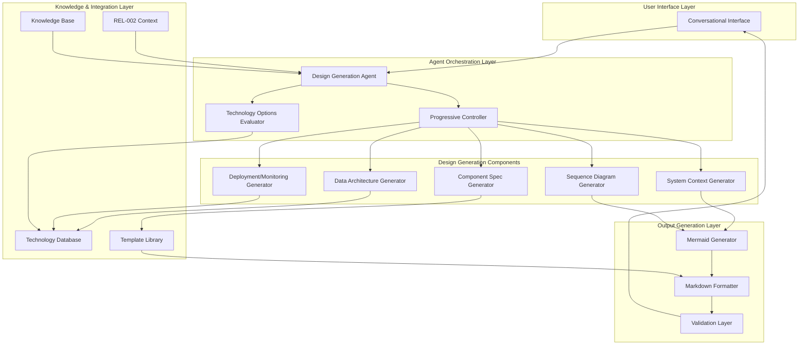
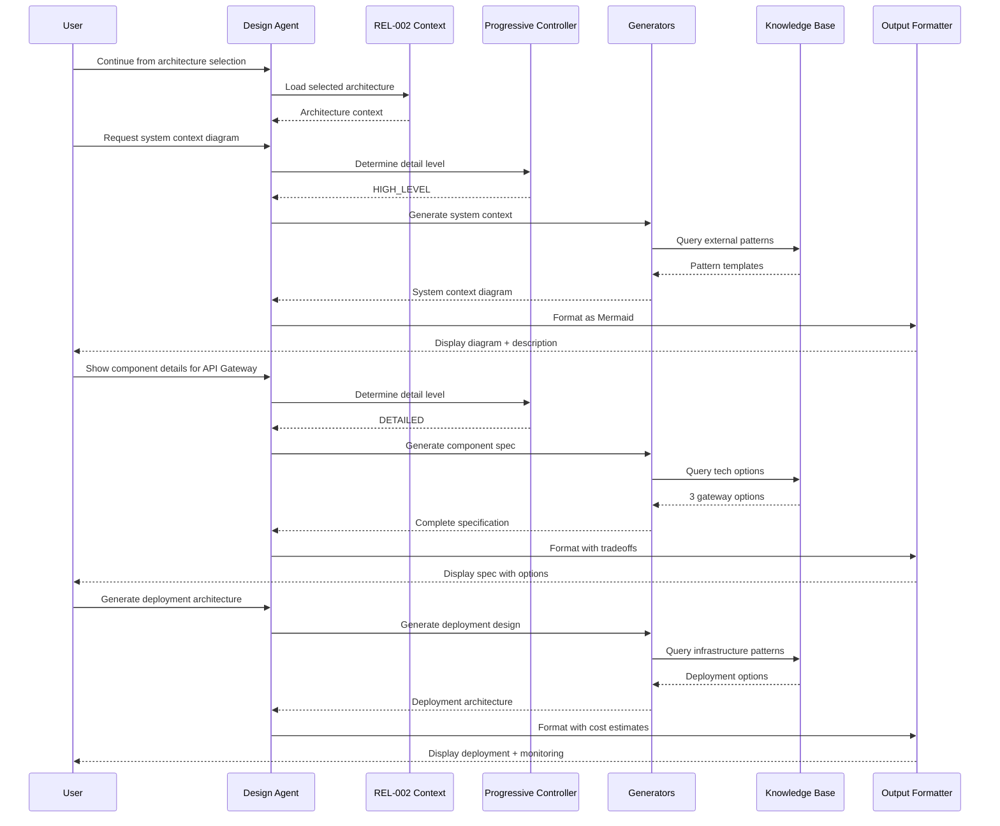
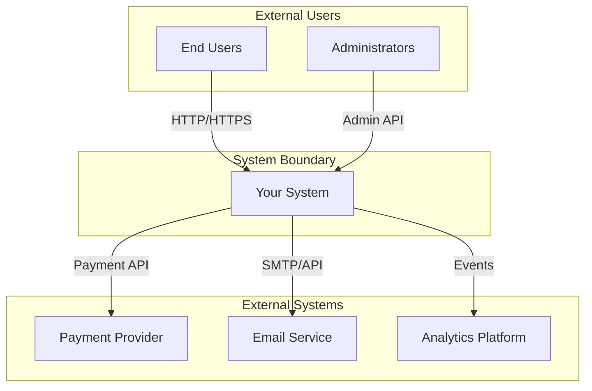

# Design: Detailed Component Design Generation (REL-003)

## Executive Summary

REL-003 extends the REL-002 Architecture Exploration workflow with comprehensive component-level design generation capabilities. This agent-based conversational system produces 6 core design artifacts using progressive disclosure, enabling users to generate actionable specifications without extensive additional research.

## Architecture Overview



## Component Specifications

### 1. Design Generation Agent (Core Orchestrator)

**Purpose**: Central conversation controller that manages the design generation workflow, maintaining context from REL-002 and orchestrating artifact generation.

**Location**: Agent custom instructions extending REL-002 workflow

**Interface**:
```typescript
interface DesignGenerationAgent {
  // Initialization from REL-002
  initializeFromArchitecture(context: REL002Context): void;

  // Conversation management
  handleUserRequest(request: DesignRequest): DesignResponse;
  processProgressive(level: DetailLevel): void;

  // Artifact generation orchestration
  generateArtifact(type: ArtifactType): DesignArtifact;
  validateCompleteness(artifact: DesignArtifact): ValidationResult;
}

interface REL002Context {
  selectedArchitecture: ArchitecturePattern;
  components: Component[];
  constraints: Constraints;
  technologyPreferences?: TechStack;
}

enum ArtifactType {
  SYSTEM_CONTEXT = 'system_context',
  COMPONENT_SPEC = 'component_spec',
  SEQUENCE_DIAGRAM = 'sequence_diagram',
  DATA_ARCHITECTURE = 'data_architecture',
  DEPLOYMENT_ARCH = 'deployment_arch',
  MONITORING_STRATEGY = 'monitoring_strategy'
}
```

**Responsibilities**:
- Maintain conversation continuity from REL-002
- Orchestrate progressive disclosure of design details
- Ensure all 7 required elements in component specs
- Track design session progress and completeness
- Coordinate between specialized generators

### 2. Progressive Controller

**Purpose**: Manages the progressive disclosure pattern, determining appropriate detail levels based on user requests.

**Location**: Embedded logic within agent instructions

**Interface**:
```typescript
interface ProgressiveController {
  determineDetailLevel(request: string): DetailLevel;
  generateSummary(artifact: DesignArtifact): string;
  expandDetails(artifact: DesignArtifact, focus: string): DesignArtifact;
  trackDisclosureDepth(): DisclosureMetrics;
}

enum DetailLevel {
  HIGH_LEVEL = 'high_level',    // Executive summary
  STANDARD = 'standard',         // Implementation ready
  DETAILED = 'detailed',         // Deep dive with examples
  EXPERT = 'expert'             // Include edge cases
}
```

**Responsibilities**:
- Analyze user requests for detail indicators
- Generate appropriate level summaries
- Expand details on specific areas when requested
- Track follow-up questions for quality metrics

### 3. System Context Generator

**Purpose**: Creates system boundary diagrams showing external actors and interactions.

**Location**: Template-based generator within agent workflow

**Interface**:
```typescript
interface SystemContextGenerator {
  identifyExternalActors(architecture: Architecture): Actor[];
  mapInteractions(actors: Actor[], system: System): Interaction[];
  generateDiagram(context: SystemContext): MermaidDiagram;
  describeInteractions(interactions: Interaction[]): Description[];
}

interface SystemContext {
  boundary: SystemBoundary;
  actors: Actor[];
  interactions: Interaction[];
  dataFlows: DataFlow[];
}
```

**Responsibilities**:
- Identify all external actors (users, systems, services)
- Map data flows between system and externals
- Generate Mermaid C4 context diagrams
- Provide textual descriptions of each interaction

### 4. Component Specification Generator

**Purpose**: Produces detailed specifications for each architectural component with all 7 required elements.

**Location**: Structured template processor

**Interface**:
```typescript
interface ComponentSpecGenerator {
  generateSpec(component: Component): ComponentSpecification;
  provideTechOptions(requirement: TechRequirement): TechOption[];
  defineInterfaces(component: Component): InterfaceDefinition[];
  specifyScaling(component: Component): ScalingStrategy;
}

interface ComponentSpecification {
  responsibility: string;              // Single paragraph
  interfaces: InterfaceDefinition[];   // API contracts
  dependencies: Dependency[];          // Internal/external
  technology: TechChoice[];            // With versions where critical
  scaling: ScalingStrategy;           // Horizontal/vertical
  errorHandling: ErrorStrategy;       // Error handling approach
  monitoring: MonitoringApproach;     // Metrics and observability
}
```

**Responsibilities**:
- Generate all 7 required specification elements
- Provide 2-3 technology options with tradeoffs
- Define clear API contracts and message formats
- Specify scaling approaches with limits
- Define error handling and monitoring strategies

### 5. Sequence Diagram Generator

**Purpose**: Creates interaction diagrams for critical workflows.

**Location**: Workflow analyzer and diagram generator

**Interface**:
```typescript
interface SequenceDiagramGenerator {
  identifyCriticalWorkflows(components: Component[]): Workflow[];
  generateSequence(workflow: Workflow): MermaidSequence;
  includeErrorPaths(sequence: MermaidSequence): MermaidSequence;
  addTimingConstraints(sequence: MermaidSequence): MermaidSequence;
}

interface Workflow {
  name: string;
  priority: 'critical' | 'important' | 'standard';
  participants: Component[];
  steps: WorkflowStep[];
  errorScenarios: ErrorScenario[];
}
```

**Responsibilities**:
- Identify 3-5 critical workflows automatically
- Generate Mermaid sequence diagrams
- Include timing constraints and async patterns
- Add error paths and exception handling
- Provide step-by-step textual descriptions

### 6. Data Architecture Generator

**Purpose**: Designs comprehensive data storage and management strategies.

**Location**: Data modeling and storage recommendation engine

**Interface**:
```typescript
interface DataArchitectureGenerator {
  modelData(requirements: DataRequirements): DataModel;
  recommendStorage(model: DataModel): StorageOption[];
  designDataFlow(architecture: Architecture): DataFlowArchitecture;
  defineGovernance(requirements: ComplianceReq): GovernanceStrategy;
  planBackupRecovery(criticality: DataCriticality): BackupStrategy;
}

interface DataArchitecture {
  model: DataModel;              // Entities and relationships
  storage: StorageChoice[];      // 2-3 options with tradeoffs
  dataFlow: DataFlowDiagram;     // Ingestion, processing, serving
  governance: GovernanceRules;   // Retention, privacy, compliance
  backup: BackupStrategy;        // Recovery approach
}
```

**Responsibilities**:
- Generate entity-relationship diagrams
- Recommend 2-3 storage technologies with tradeoffs
- Design data flow architecture (ETL/ELT patterns)
- Define data governance and compliance approach
- Specify backup and recovery strategies

## Data Flow



## Technology Decisions

### 1. Agent Framework
**Selected**: Claude Custom Instructions + Workflow Documentation
**Rationale**:
- Natural conversation continuity from REL-002
- No additional tooling required
- Flexible progressive disclosure
- Rich markdown and Mermaid support

**Alternatives Considered**:
- **LangChain Agent**: Too heavyweight for conversation flow
- **Custom Code**: Unnecessary complexity for template-based generation

### 2. Diagram Generation
**Selected**: Mermaid.js
**Rationale**:
- Native markdown integration
- Supports all required diagram types
- No external dependencies
- Renders in most documentation platforms

**Alternatives Considered**:
- **PlantUML**: Requires external server
- **Draw.io Integration**: Out of scope per requirements

### 3. Knowledge Storage
**Selected**: Structured Markdown Knowledge Base
**Rationale**:
- Integrates with existing REL-002 KB
- Version controlled
- Easy to update and maintain
- Supports technology comparison matrices

**Alternatives Considered**:
- **Database**: Overkill for template storage
- **JSON Config**: Less readable for complex templates

## Test Strategy

### E2E Testing Approach

**Test Environment**:
```yaml
# docker-compose.test.yml
services:
  test-runner:
    image: playwright:latest
    environment:
      - TEST_MODE=e2e
      - FEATURE=release-3
    volumes:
      - ./tests:/tests
      - ./specs:/specs

  mock-rel002:
    image: mock-server:latest
    environment:
      - MOCK_DATA=/data/rel002-contexts.json
    volumes:
      - ./test-data:/data
```

**Test Scenarios**:

1. **Complete Design Generation Flow**
```gherkin
Feature: Complete Design Generation
  Scenario: Generate all design artifacts
    Given a user has selected "microservices" architecture in REL-002
    When they request "system context diagram"
    Then the system generates a Mermaid C4 context diagram
    And includes textual descriptions of interactions

    When they request "component specifications"
    Then each spec includes all 7 required elements
    And provides 2-3 technology options where applicable

    When they request "critical workflows"
    Then the system identifies 3-5 workflows
    And generates sequence diagrams with error paths
```

2. **Progressive Disclosure Validation**
```gherkin
Feature: Progressive Disclosure
  Scenario: Drill down into details
    Given a user requests "high-level component overview"
    When the agent responds with summary
    Then the response is under 500 words

    When the user asks "tell me more about the API Gateway"
    Then the agent provides detailed specifications
    And includes interface definitions and scaling approach
```

### Test Data Management
- Pre-defined REL-002 contexts in `/test-data/contexts/`
- Component specification templates in `/test-data/templates/`
- Technology comparison matrices in `/test-data/tech-options/`
- Expected outputs for validation in `/test-data/expected/`

## Monitoring Approach

### Key Metrics (Golden Signals)

1. **Latency**
   - Design generation time per artifact type
   - Progressive disclosure response time
   - Diagram rendering completion time

2. **Traffic**
   - Requests per design session
   - Artifact types requested frequency
   - Progressive disclosure depth

3. **Errors**
   - Diagram rendering failures
   - Incomplete specification generation
   - Template processing errors

4. **Saturation**
   - Knowledge base query time
   - Token usage per session
   - Conversation context size

### Quality Metrics

```typescript
interface QualityMetrics {
  specCompleteness: number;      // % specs with all 7 elements
  diagramRenderRate: number;      // % diagrams rendering correctly
  followUpQuestions: number;      // Average per session
  sessionSatisfaction: number;    // 1-5 rating
  timeToComplete: number;         // Minutes for full design
}
```

## API Contracts

### Design Request API
```typescript
interface DesignRequest {
  sessionId: string;              // Links to REL-002 session
  artifactType: ArtifactType;
  detailLevel?: DetailLevel;      // Defaults to STANDARD
  focusArea?: string;             // For progressive disclosure
  preferences?: {
    technologyBias?: 'conservative' | 'modern' | 'balanced';
    includeExamples?: boolean;
    diagramStyle?: 'simple' | 'detailed';
  };
}
```

### Design Response API
```typescript
interface DesignResponse {
  artifact: DesignArtifact;
  diagrams: MermaidDiagram[];
  suggestions: string[];         // Next steps or drill-down options
  completeness: {
    score: number;               // 0-100
    missingElements?: string[];
  };
  metadata: {
    generationTime: number;
    tokensUsed: number;
    templateVersion: string;
  };
}
```

## Implementation Priorities

### Phase 1: Core Generation (MVP)
1. Basic component specification generator (7 elements)
2. System context diagram generation
3. Progressive disclosure controller
4. Integration with REL-002 context

### Phase 2: Advanced Artifacts
1. Sequence diagram generator
2. Data architecture designer
3. Technology options evaluator
4. Deployment topology generator

### Phase 3: Quality Enhancement
1. Monitoring strategy generator
2. Validation and completeness checking
3. Quality metrics tracking
4. Template refinement based on feedback

## Security Considerations

### Data Protection
- No storage of sensitive architecture details
- Session-based context only
- Sanitization of user inputs for diagram generation

### Access Control
- Inherits from REL-002 session authentication
- Read-only access to knowledge base
- No external service integrations

## Success Validation

The design will be considered successful when:

1. **Actionability**: ≥70% of designs actionable without additional research
2. **Completeness**: ≥90% of component specs include all 7 elements
3. **Quality**: ≥80% of diagrams render correctly on first generation
4. **Efficiency**: <3 follow-up questions needed per session
5. **Performance**: <15 minutes to generate complete design
6. **Satisfaction**: ≥4.0/5.0 user rating

## Appendix: Template Examples

### Component Specification Template
```markdown
## Component: [Name]

### Responsibility
[Single paragraph describing the component's primary purpose and role]

### Interfaces
- **API Endpoints**:
  - `POST /api/v1/[resource]` - [Description]
  - `GET /api/v1/[resource]/{id}` - [Description]
- **Message Formats**:
  - Events Published: `[EventName]` - [Schema]
  - Events Consumed: `[EventName]` - [Purpose]

### Dependencies
- **Internal**: [Component A], [Component B]
- **External**: [Service/Library] v[Version] - [Purpose]

### Technology Choices
**Option 1: [Technology A]**
- Pros: [List benefits]
- Cons: [List drawbacks]
- When to use: [Context]

**Option 2: [Technology B]**
- Pros: [List benefits]
- Cons: [List drawbacks]
- When to use: [Context]

### Scaling Strategy
- **Approach**: [Horizontal/Vertical]
- **Limits**: [Max instances/resources]
- **Triggers**: [CPU > X%, Memory > Y%]

### Error Handling
- **Strategy**: [Circuit breaker/Retry/Failover]
- **Fallback**: [Degraded service approach]
- **Recovery**: [Self-healing mechanisms]

### Monitoring
- **Key Metrics**:
  - Request rate, Error rate, P99 latency
  - [Component-specific metrics]
- **Alerts**: [Threshold definitions]
- **Dashboards**: [Recommended views]
```

### System Context Diagram Template
