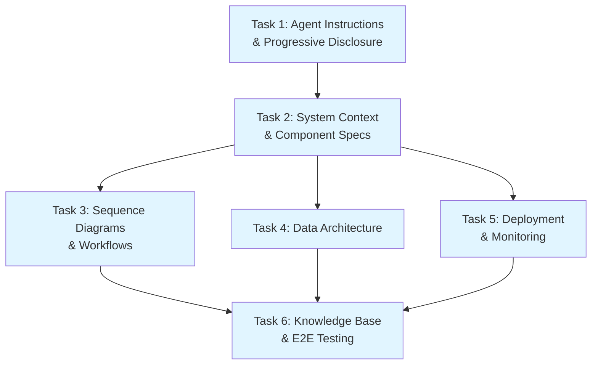

# Tasks: Detailed Component Design Generation (REL-003)

## Overview

Break down the implementation of REL-003 (Detailed Component Design Generation) into 6 sequential tasks that extend the REL-002 Architecture Exploration workflow with comprehensive component-level design generation capabilities.

**Total Estimated Time:** 18-22 hours (2-3 days at 6-7h/day)

**Implementation Approach:** Agent-based conversational workflow with template-driven generation and manual testing validation.

---

## Task 1: Design Generation Agent Instructions & Progressive Disclosure

**Status:** [ ] Not Started

**Estimated Time:** 3-4 hours

**Dependencies:** None (extends existing REL-002)

**Description:**
Create the core Design Generation Agent custom instructions that orchestrate the design artifact generation workflow, implement progressive disclosure logic, and maintain continuity from REL-002 architecture selections.

### Acceptance Criteria:
- [ ] **Tests written and failing (Red)**
  - [ ] Manual test script created in `/specs/release-3/tests/manual/01-agent-continuity.md`
  - [ ] Test scenario: Load REL-002 context and verify agent recognizes architecture
  - [ ] Test scenario: Request high-level overview, verify <500 words response
  - [ ] Test scenario: Request detailed drill-down, verify expanded content
  - [ ] Test scenario: Track follow-up questions needed (<3 target)

- [ ] **Implementation passes tests (Green)**
  - [ ] Agent instructions created in `/.claude/agents/spec-design-generator.md`
  - [ ] Progressive disclosure logic embedded (HIGH_LEVEL, STANDARD, DETAILED, EXPERT)
  - [ ] REL-002 context loading instructions documented
  - [ ] Conversation flow patterns defined for each artifact type
  - [ ] Detail level indicators specified (keywords, phrases)
  - [ ] Session tracking approach documented

- [ ] **Code refactored (Refactor)**
  - [ ] Agent instructions organized into clear sections:
    - Initialization from REL-002
    - Progressive disclosure rules
    - Artifact orchestration
    - Quality validation
  - [ ] Examples provided for each detail level
  - [ ] Edge cases documented (ambiguous requests, context loss)

- [ ] **Design-specific criteria**
  - [ ] Agent successfully loads and references REL-002 architecture context
  - [ ] Progressive disclosure responds appropriately to detail level requests
  - [ ] Conversation maintains continuity across multiple artifact requests
  - [ ] Agent tracks session progress and suggests next steps

### Files to Create:
- [ ] `/.claude/agents/spec-design-generator.md` (Agent custom instructions)
- [ ] `/specs/release-3/docs/progressive-disclosure-patterns.md` (Documentation)
- [ ] `/specs/release-3/tests/manual/01-agent-continuity.md` (Test script)
- [ ] `/specs/release-3/tests/manual/test-data/rel002-sample-contexts.json` (Test data)

### Files to Modify:
- [ ] `/.claude/agents/spec-requirements-generator.md` (Add handoff to design generator)

---

## Task 2: System Context & Component Specification Generators

**Status:** [ ] Not Started

**Estimated Time:** 4 hours

**Dependencies:** Task 1

**Description:**
Implement the System Context Diagram generator and Component Specification generator with structured templates that ensure all 7 required elements are included. Create Mermaid diagram templates and validation logic.

### Acceptance Criteria:
- [ ] **Tests written and failing (Red)**
  - [ ] Manual test script in `/specs/release-3/tests/manual/02-system-context.md`
  - [ ] Test scenario: Generate system context for microservices architecture
  - [ ] Test scenario: Verify Mermaid C4 diagram renders correctly
  - [ ] Test scenario: Validate textual descriptions of interactions present
  - [ ] Test scenario: Generate component spec, verify all 7 elements present
  - [ ] Test scenario: Validate 2-3 technology options provided with tradeoffs

- [ ] **Implementation passes tests (Green)**
  - [ ] System context diagram template created
  - [ ] Component specification template created with 7 required elements:
    1. Component responsibility (single paragraph)
    2. Interface definitions (API contracts, message formats)
    3. Dependencies (internal and external)
    4. Technology choices with versions where critical
    5. Scaling approach (horizontal/vertical, limits)
    6. Error handling strategy
    7. Monitoring approach with specific metrics
  - [ ] Mermaid diagram generation instructions embedded
  - [ ] Actor identification patterns documented
  - [ ] Data flow mapping guidelines defined
  - [ ] Validation checklist for completeness

- [ ] **Code refactored (Refactor)**
  - [ ] Templates organized with clear sections and examples
  - [ ] Reusable patterns extracted for common architectures
  - [ ] Comments explain template placeholders
  - [ ] Validation rules clearly documented

- [ ] **Design-specific criteria**
  - [ ] System context diagrams show boundary, actors, and data flows
  - [ ] Component specs include all 7 mandatory elements
  - [ ] Technology options present tradeoffs clearly
  - [ ] Mermaid diagrams render correctly in markdown viewers
  - [ ] Textual descriptions complement diagrams

### Files to Create:
- [ ] `/specs/release-3/templates/system-context-diagram.md` (Template)
- [ ] `/specs/release-3/templates/component-specification.md` (Template)
- [ ] `/specs/release-3/templates/mermaid-patterns.md` (Diagram patterns)
- [ ] `/specs/release-3/tests/manual/02-system-context.md` (Test script)
- [ ] `/specs/release-3/tests/manual/02-component-spec.md` (Test script)
- [ ] `/specs/release-3/validation/spec-completeness-checklist.md` (Validation)

### Files to Modify:
- [ ] `/.claude/agents/spec-design-generator.md` (Add generator invocation logic)

---

## Task 3: Sequence Diagram & Critical Workflow Generator

**Status:** [ ] Not Started

**Estimated Time:** 3-4 hours

**Dependencies:** Task 2

**Description:**
Create the Sequence Diagram generator that identifies 3-5 critical workflows and produces Mermaid sequence diagrams with error paths, timing constraints, and step-by-step descriptions.

### Acceptance Criteria:
- [ ] **Tests written and failing (Red)**
  - [ ] Manual test script in `/specs/release-3/tests/manual/03-sequence-diagrams.md`
  - [ ] Test scenario: Generate workflows for e-commerce checkout flow
  - [ ] Test scenario: Verify 3-5 critical workflows identified
  - [ ] Test scenario: Validate sequence diagrams include error paths
  - [ ] Test scenario: Check timing constraints are documented
  - [ ] Test scenario: Confirm textual step descriptions present

- [ ] **Implementation passes tests (Green)**
  - [ ] Workflow identification heuristics documented:
    - Core business value flows
    - Complex interaction patterns
    - Error/exception scenarios
  - [ ] Mermaid sequence diagram template created
  - [ ] Error path patterns defined (alt, opt, break)
  - [ ] Timing constraint notation specified
  - [ ] Async/sync pattern handling documented
  - [ ] Step description template created

- [ ] **Code refactored (Refactor)**
  - [ ] Workflow identification criteria organized by priority
  - [ ] Sequence diagram patterns extracted for reuse
  - [ ] Error handling patterns cataloged
  - [ ] Examples provided for common workflow types

- [ ] **Design-specific criteria**
  - [ ] Agent automatically identifies 3-5 critical workflows
  - [ ] Sequence diagrams render correctly in Mermaid
  - [ ] Error paths and exception handling included
  - [ ] Timing constraints clearly marked
  - [ ] Textual descriptions explain each interaction step

### Files to Create:
- [ ] `/specs/release-3/templates/sequence-diagram.md` (Template)
- [ ] `/specs/release-3/templates/workflow-patterns.md` (Common patterns)
- [ ] `/specs/release-3/docs/workflow-identification-heuristics.md` (Documentation)
- [ ] `/specs/release-3/tests/manual/03-sequence-diagrams.md` (Test script)
- [ ] `/specs/release-3/tests/manual/test-data/workflow-scenarios.json` (Test data)

### Files to Modify:
- [ ] `/.claude/agents/spec-design-generator.md` (Add workflow generator logic)

---

## Task 4: Data Architecture Generator

**Status:** [ ] Not Started

**Estimated Time:** 3-4 hours

**Dependencies:** Task 2

**Description:**
Implement the Data Architecture generator that produces entity-relationship models, storage recommendations with tradeoffs, data flow architecture, governance strategy, and backup/recovery plans.

### Acceptance Criteria:
- [ ] **Tests written and failing (Red)**
  - [ ] Manual test script in `/specs/release-3/tests/manual/04-data-architecture.md`
  - [ ] Test scenario: Generate data model for SaaS application
  - [ ] Test scenario: Verify entity-relationship diagram created
  - [ ] Test scenario: Validate 2-3 storage options with tradeoffs
  - [ ] Test scenario: Check data flow includes ingestion, processing, serving
  - [ ] Test scenario: Confirm governance and backup strategies present

- [ ] **Implementation passes tests (Green)**
  - [ ] Data model template created (entities, relationships, attributes)
  - [ ] Storage technology comparison matrix defined:
    - Relational databases (PostgreSQL, MySQL)
    - NoSQL options (MongoDB, DynamoDB, Redis)
    - Data warehouses (Snowflake, BigQuery)
    - Tradeoff criteria (consistency, scalability, cost, complexity)
  - [ ] Data flow architecture patterns documented (ETL/ELT)
  - [ ] Governance strategy template created:
    - Data retention policies
    - Privacy compliance (GDPR, CCPA)
    - Access control patterns
  - [ ] Backup/recovery strategy patterns defined

- [ ] **Code refactored (Refactor)**
  - [ ] Storage options organized by use case
  - [ ] Data flow patterns categorized by architecture type
  - [ ] Governance templates refined for clarity
  - [ ] Examples provided for common data scenarios

- [ ] **Design-specific criteria**
  - [ ] Entity-relationship diagrams render correctly in Mermaid
  - [ ] Storage recommendations align with component requirements
  - [ ] Data flow architecture covers full lifecycle
  - [ ] Governance addresses compliance requirements
  - [ ] Backup strategy matches data criticality levels

### Files to Create:
- [ ] `/specs/release-3/templates/data-model.md` (Template)
- [ ] `/specs/release-3/templates/storage-options.md` (Technology comparisons)
- [ ] `/specs/release-3/templates/data-flow-architecture.md` (Template)
- [ ] `/specs/release-3/templates/data-governance.md` (Template)
- [ ] `/specs/release-3/knowledge-base/storage-technology-matrix.md` (Knowledge base)
- [ ] `/specs/release-3/tests/manual/04-data-architecture.md` (Test script)

### Files to Modify:
- [ ] `/.claude/agents/spec-design-generator.md` (Add data architecture generator logic)

---

## Task 5: Deployment & Monitoring Architecture Generators

**Status:** [ ] Not Started

**Estimated Time:** 3-4 hours

**Dependencies:** Task 2, Task 4

**Description:**
Create Deployment Architecture and Monitoring Strategy generators that produce deployment topology diagrams, infrastructure requirements, CI/CD recommendations, cost estimates, and comprehensive monitoring strategies with golden signals.

### Acceptance Criteria:
- [ ] **Tests written and failing (Red)**
  - [ ] Manual test script in `/specs/release-3/tests/manual/05-deployment-monitoring.md`
  - [ ] Test scenario: Generate deployment architecture for microservices
  - [ ] Test scenario: Verify deployment topology diagram created
  - [ ] Test scenario: Validate infrastructure requirements documented
  - [ ] Test scenario: Check CI/CD pipeline recommendations present
  - [ ] Test scenario: Confirm cost estimates provided (order of magnitude)
  - [ ] Test scenario: Validate monitoring strategy includes golden signals
  - [ ] Test scenario: Check alerting thresholds and dashboards defined

- [ ] **Implementation passes tests (Green)**
  - [ ] Deployment topology template created:
    - Environment strategy (dev, staging, prod)
    - Compute resources (containers, VMs, serverless)
    - Network topology (load balancers, CDN, VPN)
    - Storage and database deployment
  - [ ] Infrastructure requirements template:
    - Compute specifications
    - Storage capacity
    - Network bandwidth
    - Scaling triggers
  - [ ] CI/CD pipeline patterns documented
  - [ ] Cost estimation guidelines defined (order of magnitude)
  - [ ] Monitoring strategy template created:
    - Golden signals per component (latency, traffic, errors, saturation)
    - Logging structure and levels
    - Alerting rules and thresholds
    - Dashboard layouts
    - Observability stack recommendations (Prometheus, Grafana, ELK, etc.)

- [ ] **Code refactored (Refactor)**
  - [ ] Deployment patterns organized by architecture type
  - [ ] Infrastructure templates refined for clarity
  - [ ] Monitoring strategies categorized by component type
  - [ ] Cost estimation formulas documented
  - [ ] Examples provided for common deployment scenarios

- [ ] **Design-specific criteria**
  - [ ] Deployment topology diagrams render correctly
  - [ ] Infrastructure requirements align with component specs
  - [ ] CI/CD recommendations match technology choices
  - [ ] Cost estimates realistic (order of magnitude)
  - [ ] Monitoring includes golden signals for each component
  - [ ] Alerting thresholds are actionable
  - [ ] Observability stack recommendations are complete

### Files to Create:
- [ ] `/specs/release-3/templates/deployment-topology.md` (Template)
- [ ] `/specs/release-3/templates/infrastructure-requirements.md` (Template)
- [ ] `/specs/release-3/templates/cicd-pipeline.md` (Template)
- [ ] `/specs/release-3/templates/monitoring-strategy.md` (Template)
- [ ] `/specs/release-3/knowledge-base/deployment-patterns.md` (Knowledge base)
- [ ] `/specs/release-3/knowledge-base/observability-stack-options.md` (Knowledge base)
- [ ] `/specs/release-3/docs/cost-estimation-guidelines.md` (Documentation)
- [ ] `/specs/release-3/tests/manual/05-deployment-monitoring.md` (Test script)

### Files to Modify:
- [ ] `/.claude/agents/spec-design-generator.md` (Add deployment/monitoring generator logic)

---

## Task 6: Knowledge Base, Validation & End-to-End Testing

**Status:** [ ] Not Started

**Estimated Time:** 3-4 hours

**Dependencies:** Tasks 1-5

**Description:**
Build the technology options knowledge base, implement validation logic for completeness checking, create comprehensive end-to-end test scenarios, and document example sessions demonstrating full workflow from REL-002 continuation through all artifact generation.

### Acceptance Criteria:
- [ ] **Tests written and failing (Red)**
  - [ ] E2E test script in `/specs/release-3/tests/manual/06-e2e-complete-flow.md`
  - [ ] Test scenario: Complete flow from REL-002 selection through all 6 artifacts
  - [ ] Test scenario: Validate progressive disclosure across artifacts
  - [ ] Test scenario: Verify all quality metrics (completeness, rendering, follow-ups)
  - [ ] Test scenario: Test technology option comparison flow
  - [ ] Test scenario: Validate diagram rendering for all types

- [ ] **Implementation passes tests (Green)**
  - [ ] Technology options knowledge base created with:
    - API Gateway options (Kong, AWS API Gateway, Nginx, Traefik)
    - Database options (PostgreSQL, MySQL, MongoDB, DynamoDB)
    - Message queue options (RabbitMQ, Kafka, SQS)
    - Cache options (Redis, Memcached)
    - Each with tradeoffs matrix
  - [ ] Validation checklist implemented:
    - Component spec 7-element checker
    - Diagram rendering validator
    - Progressive disclosure depth tracker
    - Follow-up question counter
  - [ ] Complete E2E example sessions documented:
    - E-commerce platform design
    - SaaS application design
    - Mobile backend design
  - [ ] Quality metrics tracking approach defined
  - [ ] Agent handoff from REL-002 tested and documented

- [ ] **Code refactored (Refactor)**
  - [ ] Knowledge base organized by category
  - [ ] Tradeoff matrices formatted consistently
  - [ ] Validation checklist integrated into agent instructions
  - [ ] Example sessions annotated with quality metrics
  - [ ] Documentation polished and complete

- [ ] **Design-specific criteria**
  - [ ] Technology knowledge base covers common choices
  - [ ] Tradeoffs are clear, balanced, and actionable
  - [ ] Validation catches missing required elements
  - [ ] E2E examples demonstrate full workflow
  - [ ] Quality metrics measurable from session logs
  - [ ] All 6 artifact types tested end-to-end
  - [ ] Progressive disclosure working naturally
  - [ ] <3 follow-up questions demonstrated in examples

### Files to Create:
- [ ] `/specs/release-3/knowledge-base/technology-options/api-gateways.md`
- [ ] `/specs/release-3/knowledge-base/technology-options/databases.md`
- [ ] `/specs/release-3/knowledge-base/technology-options/message-queues.md`
- [ ] `/specs/release-3/knowledge-base/technology-options/caches.md`
- [ ] `/specs/release-3/knowledge-base/technology-options/tradeoff-matrices.md`
- [ ] `/specs/release-3/validation/quality-metrics-tracker.md`
- [ ] `/specs/release-3/validation/completeness-validator.md`
- [ ] `/specs/release-3/tests/manual/06-e2e-complete-flow.md`
- [ ] `/specs/release-3/tests/examples/e-commerce-design-session.md`
- [ ] `/specs/release-3/tests/examples/saas-platform-design-session.md`
- [ ] `/specs/release-3/tests/examples/mobile-backend-design-session.md`
- [ ] `/specs/release-3/docs/testing-approach.md`

### Files to Modify:
- [ ] `/.claude/agents/spec-design-generator.md` (Add validation and quality tracking)
- [ ] `/specs/release-3/.spec-meta.json` (Update phase to "complete")

---

## Implementation Notes

### TDD Approach for Agent-Based Workflow
Since this is an agent-based conversational system (not traditional code), the TDD approach is adapted:

1. **Red Phase**: Write manual test scripts with expected behaviors and example conversations
2. **Green Phase**: Implement agent instructions, templates, and workflows to pass test scenarios
3. **Refactor Phase**: Organize templates, clarify instructions, improve structure

### Testing Strategy
- **Manual Testing**: Primary approach using documented test scenarios
- **Example Sessions**: Complete walkthroughs demonstrating all features
- **Validation Checklists**: Automated checking where possible (element presence, diagram syntax)
- **Quality Metrics**: Track from session logs (follow-up questions, completeness scores)

### Technology Knowledge Base Maintenance
- Templates and technology options should be reviewed quarterly
- Version numbers only included when architecturally significant
- Tradeoff matrices based on common evaluation criteria

### Progressive Disclosure Implementation
- Agent instructions include explicit detail level indicators
- Each template has HIGH_LEVEL, STANDARD, and DETAILED variants
- Context tracking ensures consistent detail level within session

### Integration with REL-002
- Agent instructions reference REL-002 session handoff
- Architecture context loaded at initialization
- Component identification flows from REL-002 selections

---

## Success Criteria

The implementation will be considered complete when:

1. **Functionality**: All 6 artifact generators produce correct output
2. **Quality**: ≥90% of component specs include all 7 elements
3. **Rendering**: ≥80% of diagrams render correctly on first generation
4. **Efficiency**: Example sessions demonstrate <3 follow-up questions
5. **Continuity**: Smooth handoff from REL-002 demonstrated
6. **Documentation**: Complete example sessions for 3 architecture types

---

## Risk Mitigation

| Risk | Mitigation Strategy |
|------|-------------------|
| Agent instructions too complex | Iterative refinement with test sessions |
| Template inflexibility | Progressive disclosure allows customization |
| Technology options outdated | Quarterly review process documented |
| Diagram rendering failures | Validation layer catches syntax errors |
| Progressive disclosure unclear | Explicit keywords and examples provided |
| Quality metrics hard to measure | Manual tracking in example sessions |

---

## Task Dependencies Visualization

---

## Estimated Timeline

- **Day 1 (6-7 hours)**: Tasks 1-2
- **Day 2 (6-7 hours)**: Tasks 3-4
- **Day 3 (6-7 hours)**: Tasks 5-6

**Total: 18-22 hours over 2-3 days**
