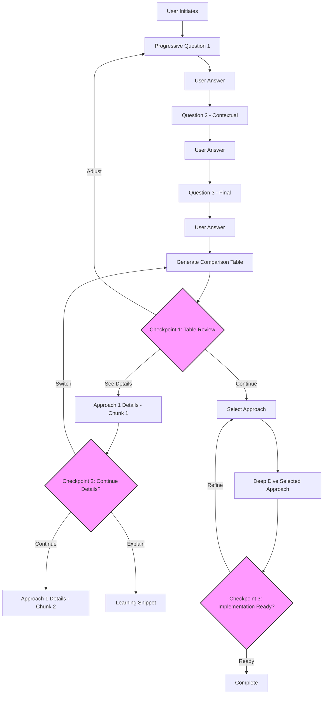
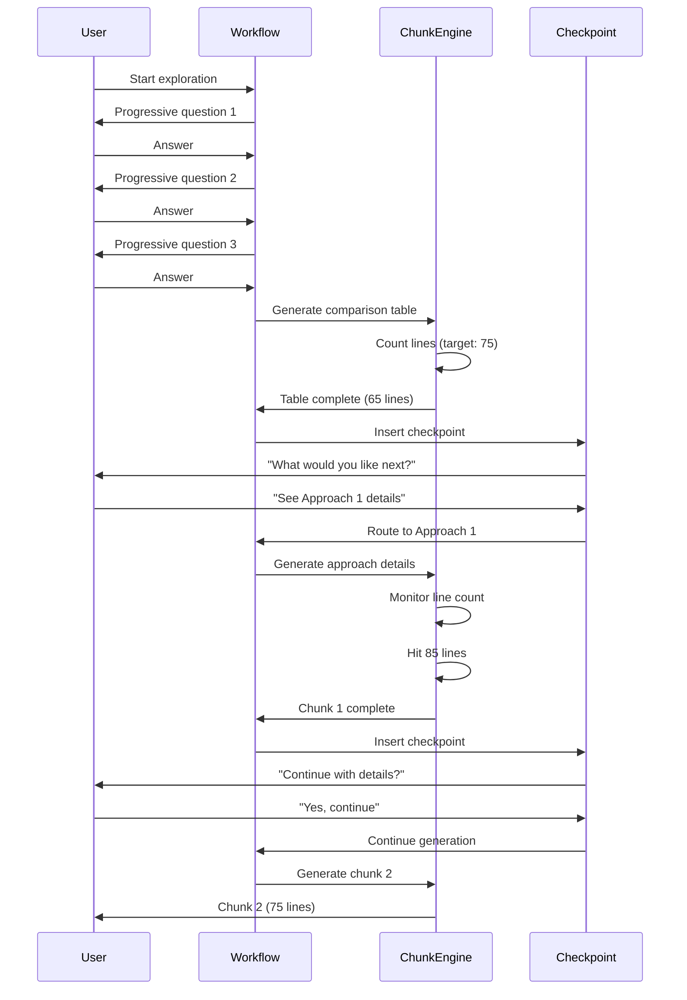

# Architecture Design Document

## Overview
**Feature:** Workflow UX Improvements
**Purpose:** Refactor Architecture Exploration Workflow v1.7 → v1.8 to reduce cognitive load through progressive disclosure, conversational checkpoints, and scannable formats
**Type:** Conversational workflow enhancement (behavioral instructions for agent)

## Design Approach

### Core Pattern: Progressive Disclosure Engine

The workflow implements a **Chunking & Checkpoint Pattern** that:
- Breaks 500-1000 line outputs into 50-100 line digestible chunks
- Inserts conversational checkpoints after each information segment
- Uses tables and visual formats for quick scanning
- Provides inline learning support with analogies

### Implementation Strategy

This follows Claude Desktop's **conversational paradigm**:
- No code components - pure instructional workflow
- State managed through conversation context
- Agent reads enhanced workflow file and follows new patterns
- Templates guide consistent formatting

### Key Design Decisions

| Decision | Choice | Rationale | Alternatives Considered |
|----------|---------|-----------|------------------------|
| **Chunking Size** | 50-100 lines per segment | Optimal for cognitive processing without scrolling | 25-50 (too fragmented), 150-200 (still overwhelming) |
| **Checkpoint Frequency** | Every segment completion | Maintains user control and engagement | Every 2-3 segments (less control), Time-based (unpredictable) |
| **Table Format** | Markdown tables with fixed columns | Universal compatibility, scannable | HTML tables (not CLI-friendly), ASCII art (hard to maintain) |
| **Question Flow** | One question per exchange | Reduces decision fatigue | Batched questions (overwhelming), Wizard-style (too rigid) |
| **Learning Format** | Inline callout boxes with analogies | Contextual without disruption | Separate glossary (breaks flow), Footnotes (easy to miss) |

## Architecture Components

### 1. Output Chunking Engine

**Purpose:** Break large outputs into manageable segments
**Location:** Embedded in workflow instructions (Phase 3)
**Responsibilities:**
- Monitor output line count during generation
- Insert natural break points at 50-100 lines
- Preserve context across chunks
- Maintain markdown formatting integrity

**Implementation Pattern:**
```markdown
## Chunking Rules
- Count lines as content is generated
- At 75 lines (±25 for natural break):
  - Find next section boundary or paragraph end
  - Insert checkpoint prompt
  - Store continuation context
- Never break:
  - Tables mid-row
  - Code blocks mid-function
  - Bullet lists mid-item
```

### 2. Checkpoint Controller

**Purpose:** Manage user interaction points between chunks
**Location:** Workflow Phase transitions and mid-phase breaks
**Responsibilities:**
- Present contextual options based on current phase
- Parse user selection
- Route to appropriate next action
- Track decision tree navigation

**Checkpoint Format:**
```markdown
---
📍 **Checkpoint: Requirements Gathered**

What would you like to explore next?
1. **See comparison table** → Quick overview of 3-5 approaches
2. **Adjust requirements** → Refine what we've discussed
3. **Explain a concept** → Learn more about [last mentioned term]

Please enter your choice (1-3) or describe what you need:
---
```

### 3. Comparison Table Generator

**Purpose:** Create scannable overview tables
**Location:** Phase 2.5 - Initial approach presentation
**Responsibilities:**
- Generate consistent table structures
- Limit content to essential comparisons
- Ensure mobile-friendly formatting
- Maintain 50-75 line constraint

**Table Templates:**

#### Architecture Comparison Table
```markdown
| Approach | Key Pattern | Best For | Main Tradeoff |
|----------|------------|----------|---------------|
| **Monolithic MVC** | All-in-one application | Simple CRUD, small teams | Scaling challenges at high load |
| **Service-Oriented** | Domain services | Complex business logic | More moving parts |
| **Event-Driven** | Async messaging | High throughput, decoupling | Eventual consistency complexity |
```

#### Technology Decision Table
```markdown
| Category | Chosen | Why | Alternative | Trade-off |
|----------|--------|-----|-------------|-----------|
| **Database** | PostgreSQL | ACID, JSON support | MongoDB | Requires schema design |
| **API** | REST | Universal, simple | GraphQL | More endpoints needed |
| **Cache** | Redis | Versatile, fast | Memcached | Slightly more complex |
```

### 4. Progressive Question Engine

**Purpose:** Guide requirements gathering one step at a time
**Location:** Phase 1 - Requirements Intake
**Responsibilities:**
- Ask single, contextual questions
- Provide rationale for each question
- Skip inferrable questions
- Offer example answers

**Question Flow Pattern:**
```markdown
🤔 **Question 1 of ~5**
**What's your expected user scale?**

*Why this matters:* Scale influences whether we need distributed architecture or can use simpler patterns.

Examples:
- Startup/POC: < 100 users
- Small business: 100-1,000 users
- Enterprise: 10,000+ users

Your answer:
```

### 5. Learning Snippet Formatter

**Purpose:** Provide inline education without disruption
**Location:** Throughout all phases when introducing concepts
**Responsibilities:**
- Detect first use of technical terms
- Insert brief explanations with analogies
- Format as callout boxes
- Maintain reading flow

**Snippet Format:**
```markdown
> 📚 **Microservices Pattern**
> Think of it like a restaurant kitchen - instead of one chef doing everything,
> you have specialized stations (grill, salads, desserts) that work independently
> but coordinate to deliver complete meals.
```

## Data Models

### Conversation State Model

```typescript
interface ConversationState {
  currentPhase: Phase;
  completedSegments: string[];
  userChoices: Decision[];
  pendingContent: ContentChunk[];
  requirementsGathered: RequirementSet;
  selectedApproach?: ArchitectureApproach;
}

interface ContentChunk {
  content: string;
  lineCount: number;
  type: 'prose' | 'table' | 'diagram' | 'code';
  continuationContext?: string;
}

interface Decision {
  checkpoint: string;
  userChoice: string;
  timestamp: Date;
  resultingAction: string;
}
```

### Checkpoint Model

```typescript
interface Checkpoint {
  id: string;
  phase: Phase;
  triggerCondition: 'lines_exceeded' | 'phase_complete' | 'user_request';
  options: CheckpointOption[];
  defaultNext: string;
}

interface CheckpointOption {
  label: string;
  description: string;
  action: 'continue' | 'adjust' | 'explain' | 'detail' | 'skip';
  targetContent: string;
}
```

## Workflow Integration

### Modified Phase Structure



### Chunking Sequence Diagram



## API Contracts

### Checkpoint Interaction Format

```yaml
checkpoint:
  input:
    type: user_selection
    format: "number | text"
    examples:
      - "1"  # Select option 1
      - "continue"  # Default action
      - "explain microservices"  # Custom request

  output:
    type: contextual_response
    format: markdown
    constraints:
      - max_lines: 100
      - includes_next_checkpoint: true
      - preserves_context: true
```

### Table Generation Contract

```yaml
comparison_table:
  input:
    approaches: Array<Approach>
    max_approaches: 5

  output:
    format: markdown_table
    columns:
      - name: string (20 char max)
      - key_pattern: string (30 char max)
      - best_for: string (50 char max)
      - main_tradeoff: string (50 char max)
    constraints:
      total_lines: 50-75
      mobile_width: 80_characters
```

## Knowledge Base Templates

### 1. Comparison Table Template (`kb/templates/comparison-table.md`)

```markdown
## Architecture Approaches Overview

Based on your requirements for **[project type]**, here are **[N]** approaches optimized for **[key constraint]**:

| Approach | Key Pattern | Best For | Main Tradeoff |
|----------|------------|----------|---------------|
| **[Name 1]** | [Pattern] | [Use case] | [Tradeoff] |
| **[Name 2]** | [Pattern] | [Use case] | [Tradeoff] |
| **[Name 3]** | [Pattern] | [Use case] | [Tradeoff] |

---
📍 **Checkpoint: Initial Overview Complete**

What would you like to explore?
1. **See detailed breakdown** of Approach 1
2. **Compare technologies** across approaches
3. **Adjust requirements** we discussed

Your choice:
```

### 2. Progressive Question Template (`kb/templates/progressive-questions.md`)

```markdown
## Question [N] of ~[Total]

**[Question text in plain language]**

*Why this matters:* [1-2 sentence explanation of impact on architecture]

[Optional: Example answers or ranges]
- Option A: [description]
- Option B: [description]
- Custom: [describe your specific need]

Your answer:
```

### 3. Learning Snippet Template (`kb/templates/learning-snippet.md`)

```markdown
> 📚 **[Technical Term]**
> [2-3 sentence plain English explanation]
>
> *Think of it like:* [Real-world analogy]
```

## File Modifications

### Primary File Update

**File:** `output/workflow-architecture-exploration.md`
**Version:** v1.7 → v1.8
**Sections Modified:**

1. **Phase 1: Requirements Intake** (Lines 21-66)
   - Add progressive question flow
   - One question per exchange pattern
   - Context for each question

2. **Phase 2.5: NEW - Comparison Table** (Insert after line 96)
   - Generate comparison table first
   - Checkpoint before detailed approaches
   - User selection drives detail generation

3. **Phase 3: Architecture Exploration** (Lines 98-150)
   - Add chunking instructions
   - Insert checkpoint patterns
   - Include learning snippets

4. **Throughout: Checkpoint Insertions**
   - After every 50-100 line segment
   - At phase transitions
   - Before major context switches

## Testing Strategy

### E2E Test Scenarios

1. **Happy Path Flow**
   ```gherkin
   Given user starts architecture exploration
   When they answer 3 progressive questions
   Then comparison table appears within 75 lines
   And checkpoint offers 3 clear options
   When user selects "see details"
   Then first chunk appears (50-100 lines)
   And next checkpoint is presented
   ```

2. **Early Value Extraction**
   ```gherkin
   Given user sees comparison table
   When they select an approach immediately
   Then they skip to selected approach details
   And save 5-10 minutes of reading time
   ```

3. **Learning Mode Navigation**
   ```gherkin
   Given user encounters technical term
   When they request explanation at checkpoint
   Then learning snippet appears (2-3 sentences)
   And includes real-world analogy
   And returns to previous context
   ```

### Validation Metrics

| Metric | Target | Measurement Method |
|--------|--------|-------------------|
| **Lines per segment** | 50-100 | Line counter in test harness |
| **Time to comparison table** | < 2 minutes | Timer from start to table display |
| **Checkpoints per session** | 8-10 | Counter in conversation flow |
| **Question exchanges** | 3-5 before value | Exchange counter |
| **Table formatting** | Consistent width | Character count validation |

## Technology Decisions

| Component | Technology | Rationale |
|-----------|-----------|-----------|
| **Formatting** | Markdown | Universal, readable, no dependencies |
| **Tables** | Pipe tables | Simple, mobile-friendly |
| **State Management** | Conversation context | No external state needed |
| **Templating** | Static templates | Consistency, maintainability |
| **Learning Format** | Inline blockquotes | Clear visual separation |

## Implementation Plan

### Phase 1: Template Creation
1. Create comparison table template
2. Create progressive question template
3. Create learning snippet template
4. Create checkpoint format template

### Phase 2: Workflow Refactoring
1. Update Phase 1 with progressive questions
2. Insert Phase 2.5 for comparison table
3. Add chunking logic to Phase 3
4. Insert checkpoints throughout

### Phase 3: Testing & Refinement
1. Test with simple CRUD scenario
2. Test with complex microservices scenario
3. Measure metrics and adjust chunk sizes
4. Refine checkpoint options based on usage

## Success Criteria

- ✅ Average output segment: 50-100 lines (vs current 500-1000)
- ✅ First value delivery: < 2 minutes (comparison table)
- ✅ User control points: 8-10 per session minimum
- ✅ Completion rate to comparison table: > 80%
- ✅ Reading level: 8th grade or below for explanations
- ✅ Mobile-friendly table rendering
- ✅ Consistent checkpoint experience

## Risks and Mitigations

| Risk | Impact | Mitigation |
|------|--------|------------|
| **Over-fragmentation** | Too many interruptions | Adjust chunk size dynamically based on content type |
| **Context loss** | User loses thread between chunks | Provide brief recap at each checkpoint |
| **Choice paralysis** | Too many checkpoint options | Limit to 3 options + custom |
| **Format inconsistency** | Confusing experience | Strict template enforcement |

## Summary

This design transforms the Architecture Exploration Workflow from a monolithic 500-1000 line output into a conversational, progressive disclosure system with 50-100 line chunks and frequent checkpoints. The approach prioritizes cognitive load reduction, user control, and fast time-to-value through comparison tables and scannable formats. Implementation requires only workflow instruction updates and template creation - no code or infrastructure changes needed.